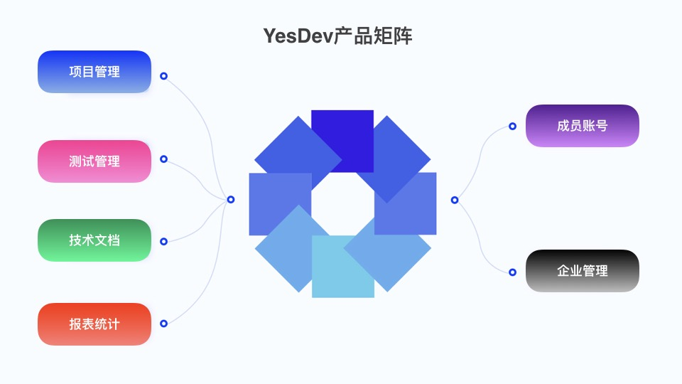
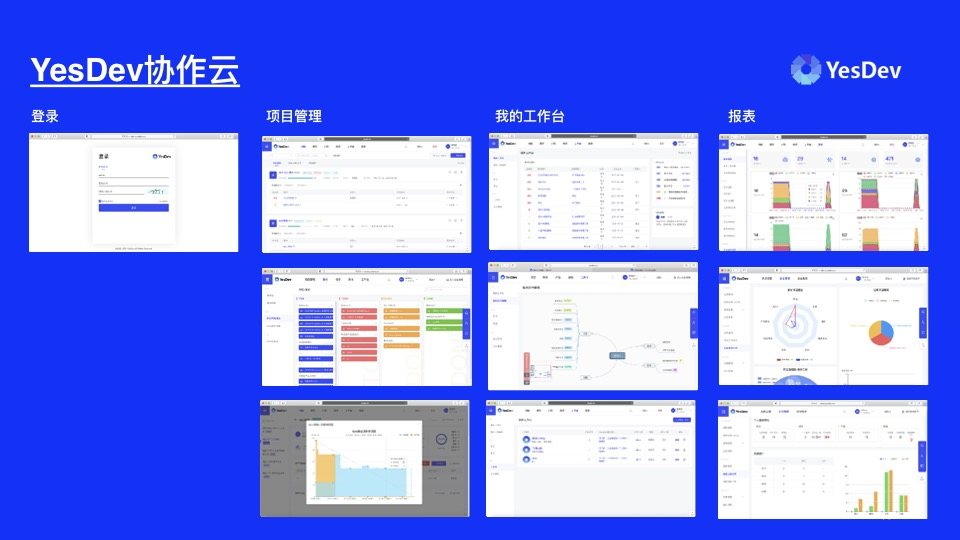
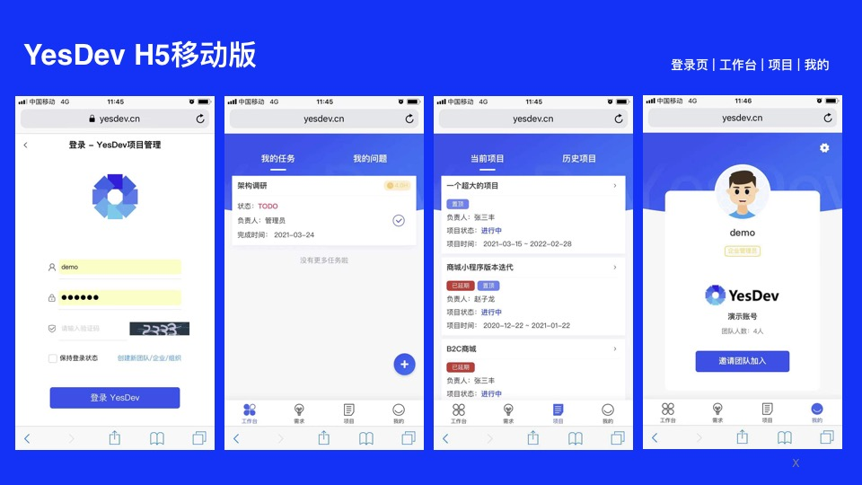

# YesDev 使用手册

欢迎您的到来！🎉  

## YesDev是什么？

YesDev是一站式企业研发管理、项目管理与协同办公平台，支持敏捷开发、DevOps、Scrum、硬件项目等多种迭代方式，能为企业管理者智能生成项目投入产出的数据模型，真正实现项目研发全流程数字化管理。

## 产品矩阵

> 🤔提问： YesDev使用场景有哪些，给谁使用？  

YesDev为研发团队提供一个协同工作平台，通过YesDev可以准确掌握项目研发过程的每一个环节，覆盖从需求设计、研发进度、到上线和缺陷反馈的整个过程。

- 如果您是企业管理者，通过YesDev，您可以极大地提高团队的协作、研发效率，大幅降低团队人员的管理成本，研发风险也将变得更加可控。

- 如果您是研发团队成员，YesDev会为您提供一系列简单易用的协作工具，使一切繁杂的工作变得更有条理。

当前，YesDev主要的产品矩阵：  

  

 + **项目管理**：企业级项目的即时协作，从需求分析到发布的全流协作与管理，包括：项目管理、项目集、需求管理、缺陷跟踪、任务协作等。 

 + **测试管理**： 测试用例、测试计划和测试报告，完整的功能测试体系、结合思维脑图构建质量闭环。  

 + **知识管理**： 知识库和文档文件管理，各类核心技术文档的写作和协同，支持markdown格式。 
 
 + **效能度量**：  数据报表统计及分析，项目集，统计分析，更专业更细致的项目统筹、分析和汇报能力，闭环管理。
 
 + **高级工作台**：提供敏捷看板、工作脑图、我的个性化工作台、日报/周报/月报、团队动态等。

 + **企业管理后台**： 企业管理后台，可进行全局偏好配置，以及成员账号的分配和管理。  

可以满足企业各部门的项目管理需求，以及满足各类办工的需要：  

  

## 核心功能

> 🤔提问： YesDev的核心功能有哪些？  

YesDev核心功能主要有以下几大应用，分别是：项目管理、测试管理、跟踪汇报、自动化工作流、文档、通知推送、集成Git代码仓库、集成企业微信/钉钉/飞书等办公能力等。  

  

 + **项目管理**  
 以敏捷开发为主，即时协作和管理单个项目。包括但不限于：需求管理、任务进度、工时登记、问题/缺陷跟踪、项目协作。  

 + **测试管理**  
 面向测试部门和质量品控团队，包括但不限于：测试用例、测试计划、API自动化测试。  

 + **跟踪汇报**  
 为项目成员和不同的角色提供跟踪汇报的能力，包括但不限于：个人日报、个人周报、项目汇报、测试报告、各类周报、项目集统计。  

 + **自动化工作流**  
 通过自动化集成，减少人工操作，提升开发效率。包括：GitOps、DevOps、OpenAPI。  

 + **文档**  
 提供知识库、项目资料、API接口技术文档等重要资料的管理，支持Markdown格式。  
 
 + **通知推送**   
 为个人、团队和企业内部的沟通提供必要的消息推送例如：邮件通知、站内消息、支持企业微信、钉钉等IM群通知。 

## 支持全平台

YesDev对PC端和移动端都做了很好的适配，您可以随时随地处理工作事务。

- Mac、Windows平台上只需要打开浏览器，就能快速进入YesDev开始您的工作。

  

- 在Android、IOS等移动设备上，您可以通过微信或手机浏览器进行登录，查看团队工作的最新数据、更新项目状态。

  

随着时间的推移，我们将结合实际用户的需求以及现实项目流转的情况，不断升级完善YesDev，具体最新功能请以官网为准。

> 🎓小结：支持全平台，随时随地展开工作。  

## 马上体验

第一次接触YesDev时，  
 + 如果你是个人用户，可以通过 手机号/微信/或其他第三方方式 [快速登录](https://www.yesdev.cn/platform/login)；  
 + 如果你是企业管理员，可以联系我们 [免费开通企业账号](https://www.yesdev.cn/platform/register) 。  
 
如果已经拥有YesDev账号，可以直接通过[登录](https://www.yesdev.cn/platform/login) 后进入[我的项目](https://www.yesdev.cn/platform/project/projectList) 。  

> 🎓小结：首次使用，立即免费 [注册我的团队](https://www.yesdev.cn/platform/register)。  

## 联系我们
使用过程中，如果遇到任何问题或需求，欢迎随时与我们沟通！  

  

> 🎓小结：期待与您取得联系！    

## 演示视频

[演示视频](https://yesdev.oss-cn-shenzhen.aliyuncs.com/yesdev_www/yesdev-demo-20240725-v2.mp4 ':include :type=video controls width=100%')

