# 5.3 系统配置

# 5.3.1 全局偏好配置

YesDev 支持高度自定义的系统配置，根据企业管理风格，定制更加贴近企业实际需求的模式，打造您的团队专属的管理系统。  

## 1) 模板显示配置    

功能组件默认配置分为三个部分:分别是项目功能组件、需求功能组件、工作台显示组件；可以指定开启哪些功能组件，以及组件的优先级  

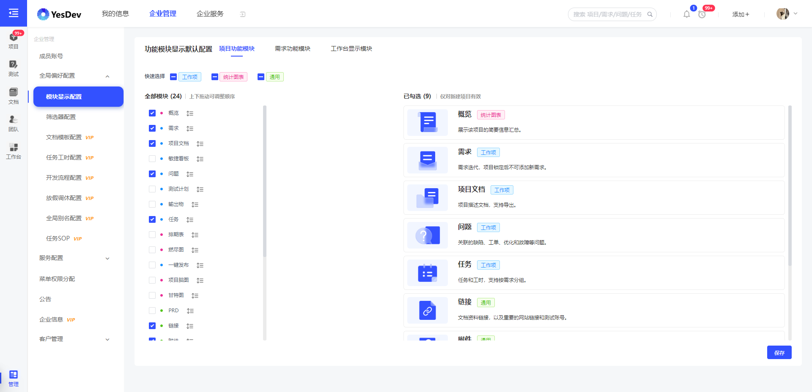   

企业管理人员可通过勾选组件，上下拖动调整顺序，进行模板配置；在【项目详情页】-【设置】可配置，前台可显示具体的功能组件内容；企业员工也可根据使用习惯，对组件内容进行调整  

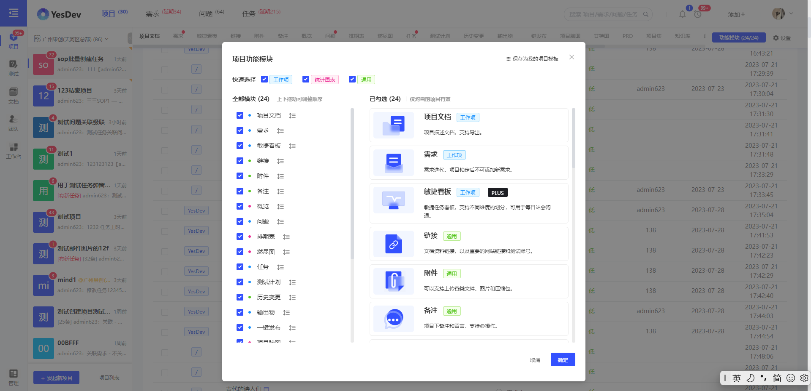  

需求功能组件可在【需求详情页】-【设置】进行配置  

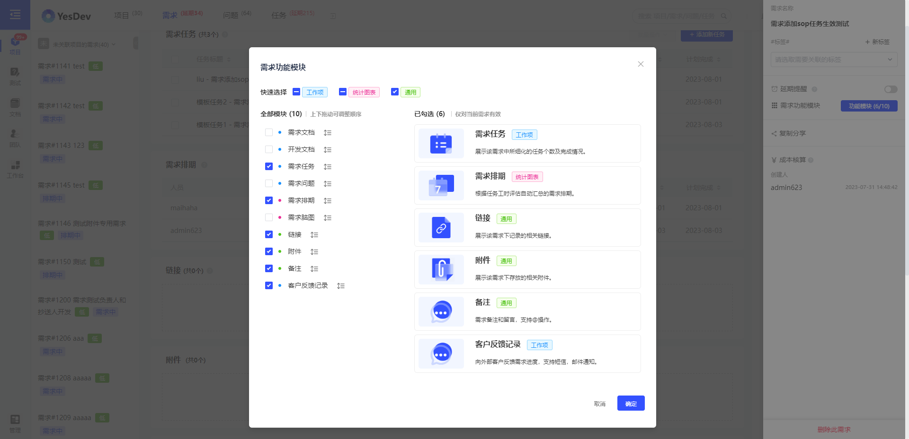  

工作台显示组件可在【工作台】-【自定义】进行配置  

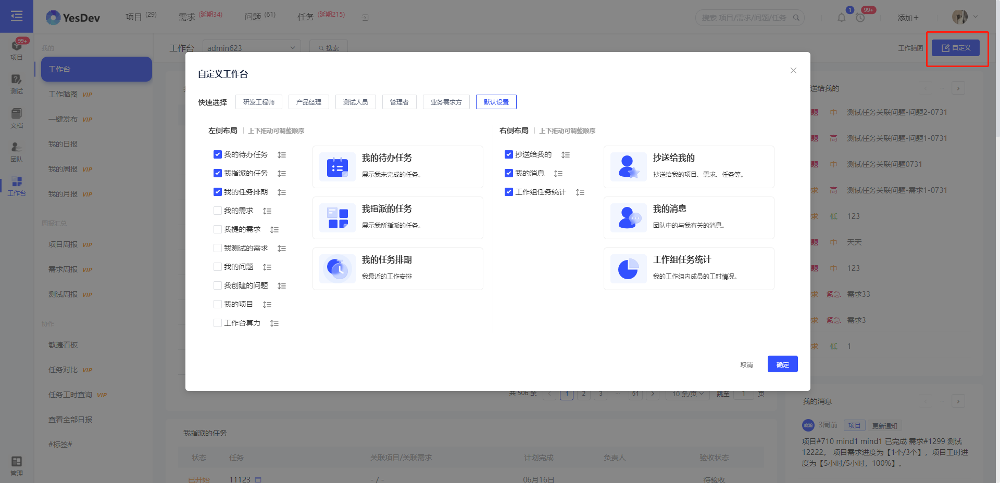  

## 2) 筛选器配置   

筛选器默认配置分为需求池列表页、问题管理列表页。企业管理人员可以自定义筛选器的配置，设置搜索维度和筛选条件；通过勾选显示字段，也可进行左右拖动  

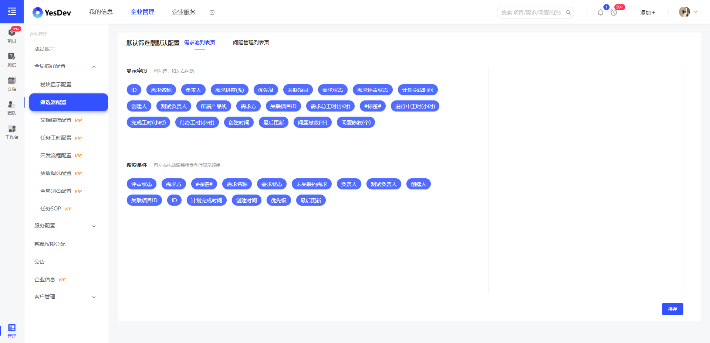   

在【需求池列表页】-【筛选器】，可进行自定义配置  

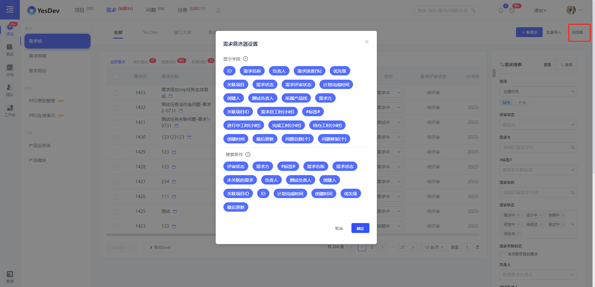   

在【问题管理列表页】-【筛选器】，可进行自定义配置  

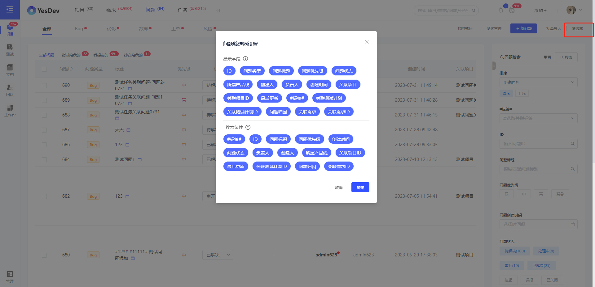  

## 3) 文档模板配置  
   
默认文档模板配置，可对项目、需求、问题进行自定义配置。该功能有助于指导团队成员编写统一规范的文档资料  

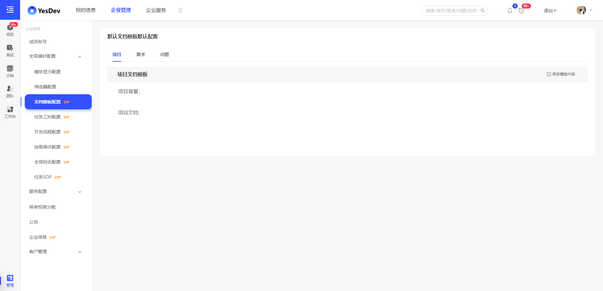   

可修改项目文档模板配置，对文本内容进行统一调配，更切合团队办公需求  

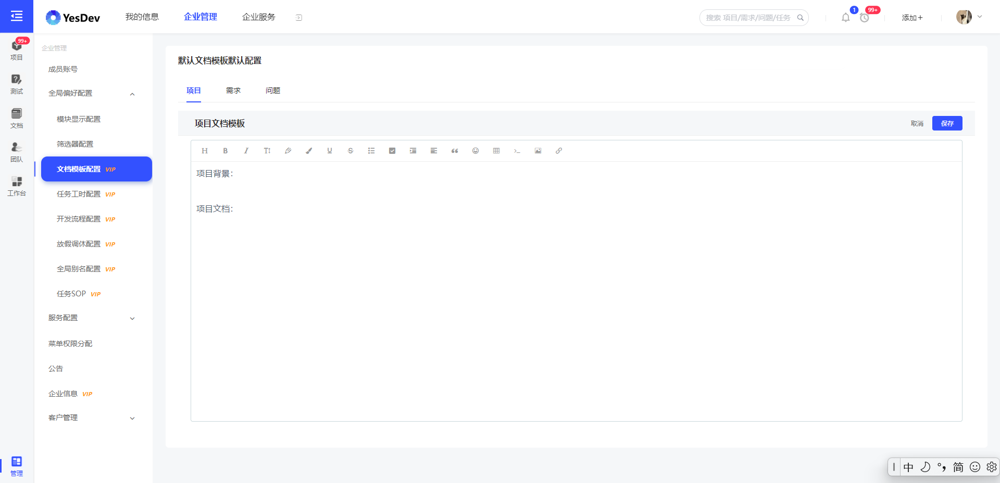   

需求文档模板配置如下所示  

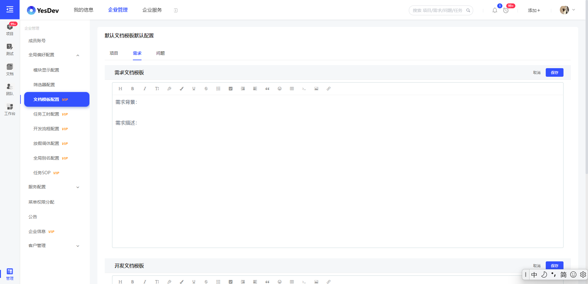  

问题文档模板配置如下所示  

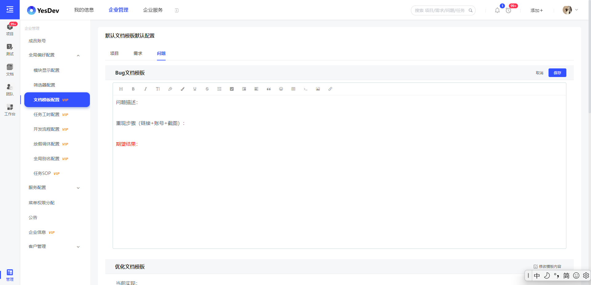  

## 4) 任务工时配置    
   
任务权限配置，可以指定指派任务权限、修改任务权限、删除任务权限。通过预设的工时项目，可以辅助细化任务的粒度，提高团队效率

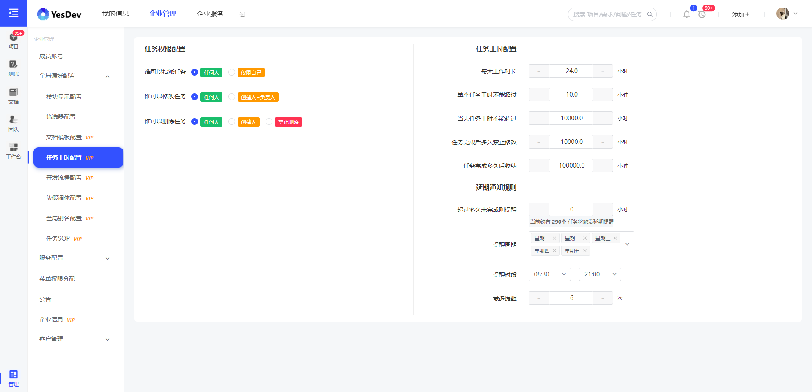 

设置每日工作时长，不得超过多少小时。员工在增加任务时候，可选择每天工作时长，不能超过8小时。还可以对单个任务工时、当天任务工时、任务完成后多久禁止修改、任务完成多久后收纳进行配置；

以及对任务延期通知的规则进行配置，可设置任务超过多久未完成则提醒、提醒的周期、提醒时段、最多提醒次数。任务延期后，会在相应的周期，通过邮件的方式提醒负责人还有未完成的任务，告知延期的时间。

同时,在项目详情页顶部菜单栏可以查看延期的任务，点击【任务延期】，打开【我的工作助手】，查看延期任务，提高工作效率。

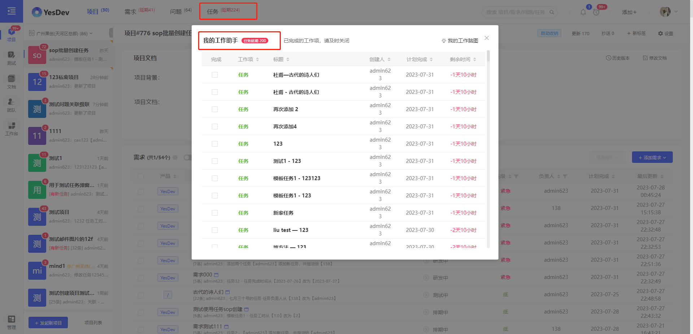  

## 5) 开发流程配置    

可以对需求、问题的流转状态进行自定义配置。针对项目，处于不同需求、问题状态的流转进行限制，重新定义项目管理的流程    

默认配置的需求、问题流转过程，处在某一状态下的需求、问题，下一个流转状态只能往下面的状态进行流转或者往上一个状态进行流转。另外，企业管理人员可自定义配置需求、问题的流转状态，对流转的变更进行限制以及流转层级进行修改  

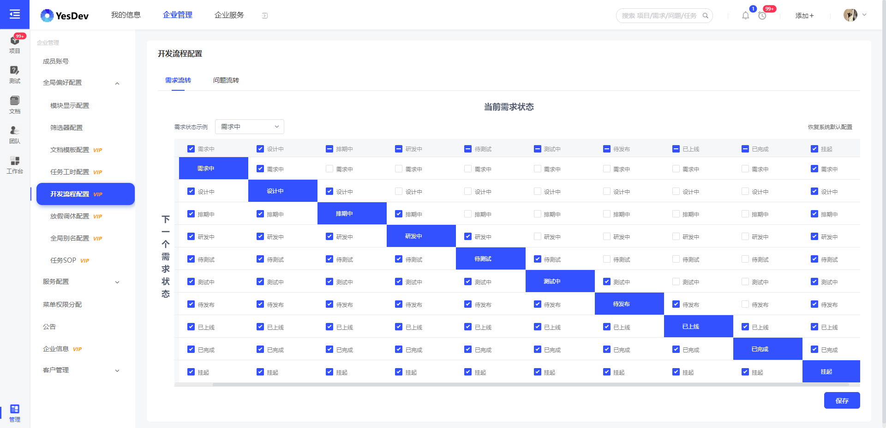  

例如：管理员在开发流程配置管理后台调整【研发中】需求状态，可流转步骤为，只能是往【排期中】-【待测试】-【测试中】-【待发布】-【已上线】-【已完成】-【挂起】的状态进行流转  

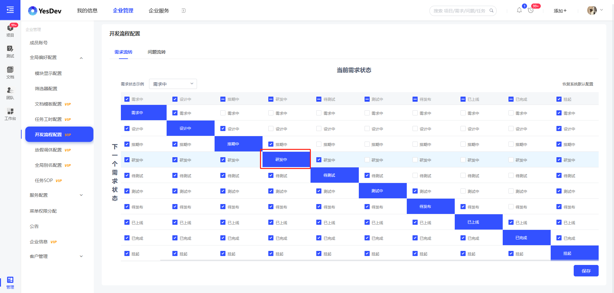  

在需求池中可以看到需求的流转状态，如果是处于【研发中】状态，可选择流转部分只能是【排期中】-【待测试】-【测试中】-【待发布】-【已上线】-【已完成】-【挂起】的状态；【设计中】【需求中】状态不可选择  

有关问题流转状态，同理  

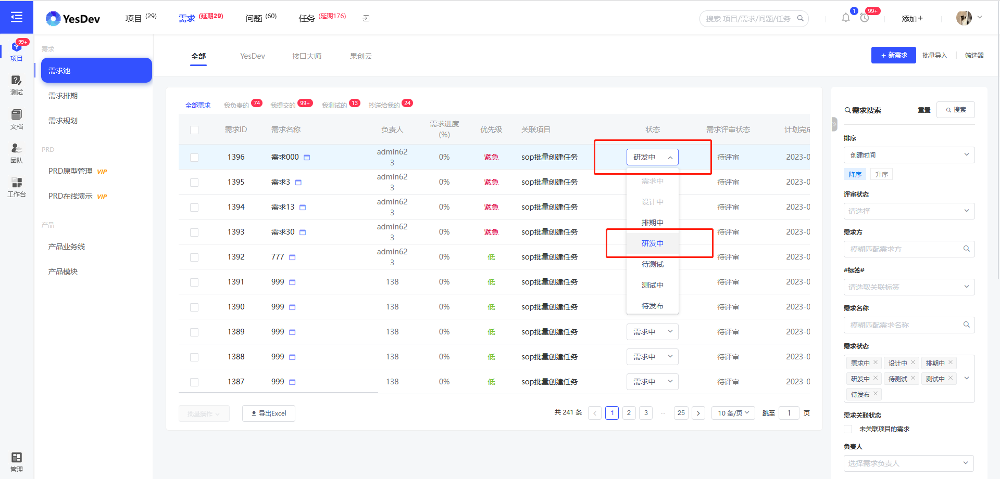  

## 6) 放假调休配置  

企业管理人员可以通过添加日期调整，调整企业放假上班时间；同步在任务工时登记页面，可以查看有关任务顺延的时间，也会根据放假时间进行调整顺延；点击【导入日期配置】，可批量化导入日期进行配置  

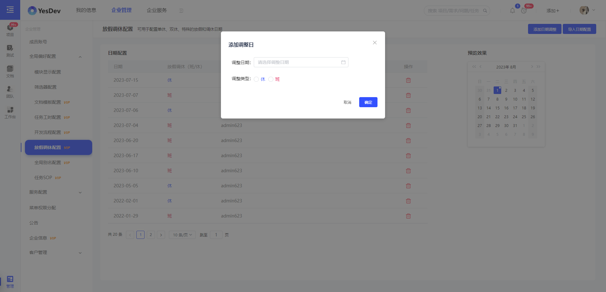  

同步在任务工时登记页面，有关任务顺延的时间，也会根据放假时间进行调整顺延  

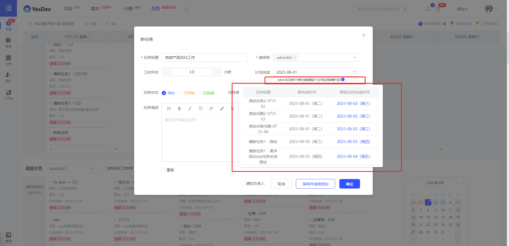  

## 7) 全局别名配置  

重新定义项目管理流程的每一个环节  

企业管理员，可以对项目、需求、问题、任务、测试用例的别名进行自定义配置，前台同步进行显示  

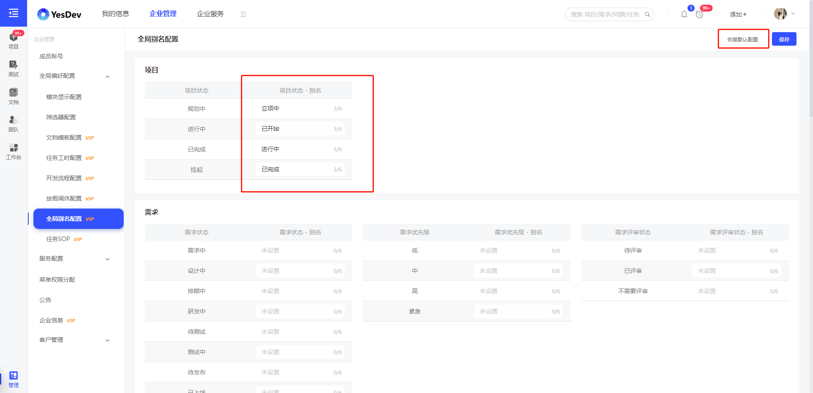  

重新设置项目、需求、问题、任务、测试用例的别名，不能超过6个字；想要撤销配置，可以点击【恢复默认配置】，恢复系统默认配置；配置部分内容，显示如下，其他的类同  

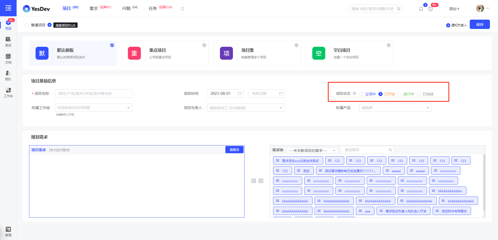  

## 8) 任务SOP模板配置  

通过YesDev的任务SOP模板配置，可以让员工提高工作效率、让管理者统一标准交付过程、每月考核复盘记录指标；更方便快捷给团队提升工作指标，明确工作的操作实施步骤  

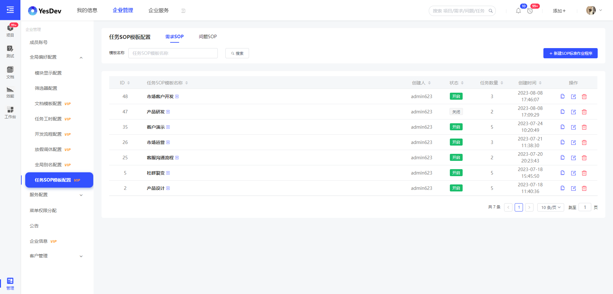  

企业管理人员可在-【企业管理后台】-【全局偏好配置】-【任务SOP模板配置】进行需求、问题SOP模板添加；新建一个任务SOP模板，对里面的标准执行步骤进行配置  

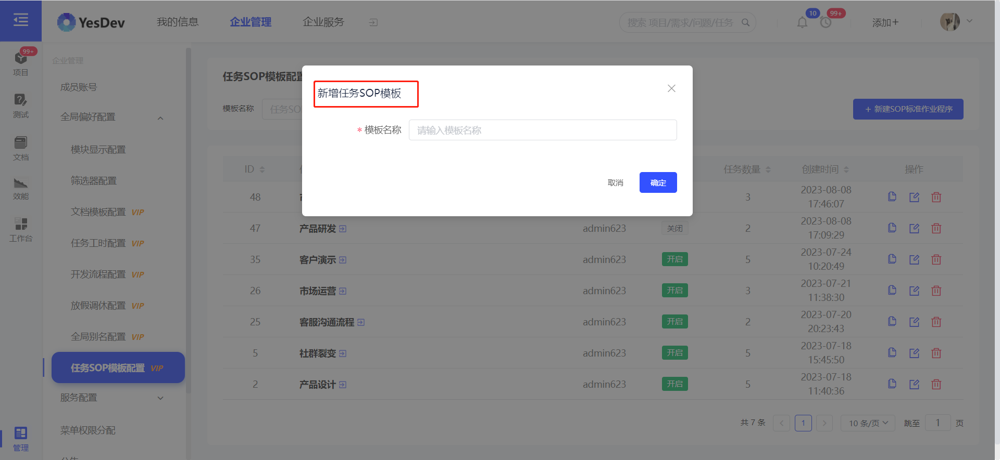  

进入【+新建任务SOP标准作业程序】，填写【步骤】【任务标题】，选择【任务负责人】【任务工时】【任务计划完成时间】【任务描述】；也可复制相同的任务，重复添加，以及删除，成功添加后进行保存 

同时支持批量导入任务SOP模板的方式，也可Excel导出任务SOP模板内容 

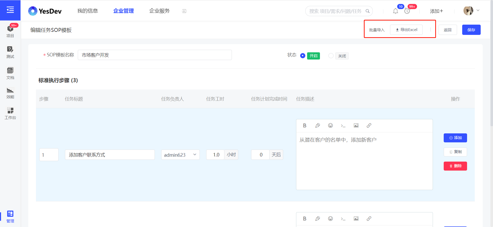  

员工可以在添加新需求、添加新问题的弹窗/页面，选择任务SOP模板功能，用户可快速批量配置多个任务；添加的任务SOP，同步关联新需求、新问题  

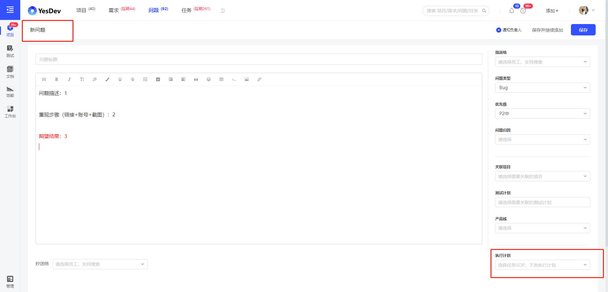  

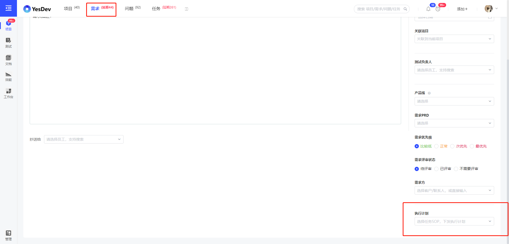  

## 9) 自定义字段配置 

为契合不同公司的不同业务场景，YesDev配备了系统配置自定义字段的方式，来帮助不同团队定制专属自己的字段类型，可应用到项目/需求/问题/任务里，实现高效协作。

企业管理人员可在【企业管理后台】-【自定义字段配置】，进行项目/需求/问题/任务字段添加；

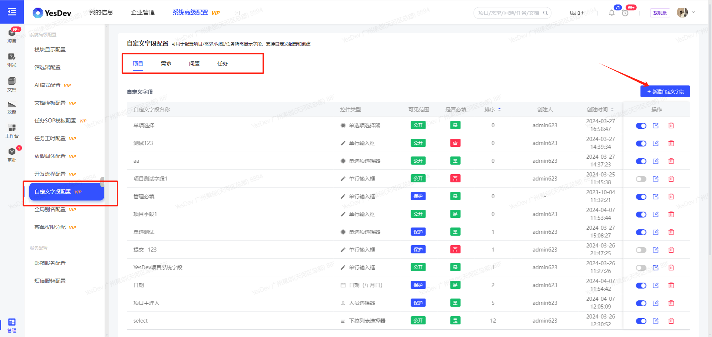  

点击【+新建自定义字段】按钮，弹出弹窗；可按照【规则配置】字段内容，选择控件类型，填写字段名称，设置选择可见范围、是否必填、默认值等信息；
在【空间预览】处，可大致查看添加字段的形式；点击保存，添加字段全局生效。

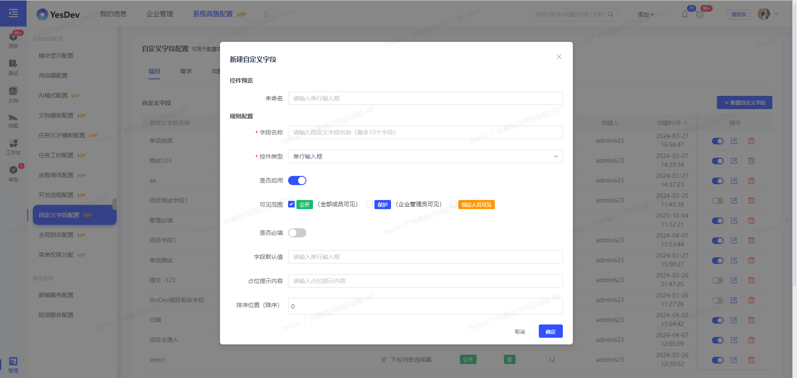  

已添加的字段，可在列表处查看，点击操作栏，进行快速禁用/编辑/删除操作；

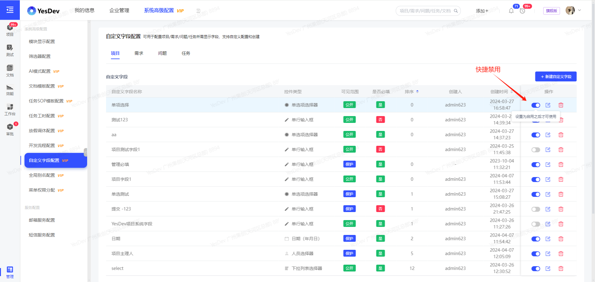  

例如：添加进去项目的自定义字段显示，在【新建项目】时，显示在当前页面；需求/问题/任务同上；

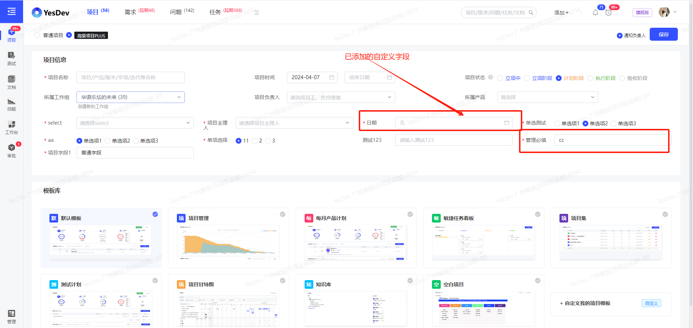   

项目列表页，可在列表字段显示已添加【自定义字段】信息，并可通过筛选器进行隐藏，导出Excel表格，可选中对应字段导出；

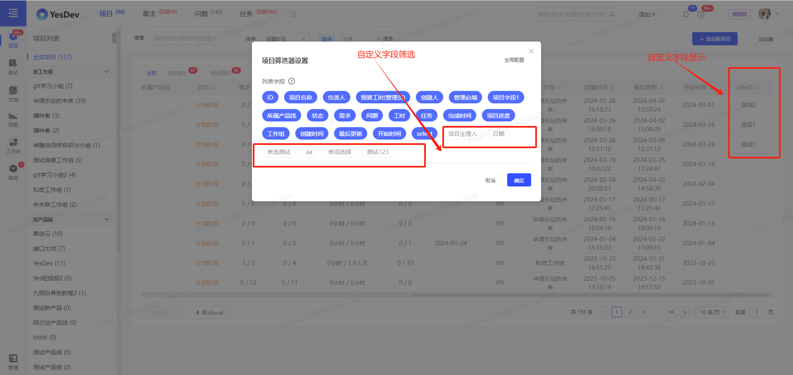  

# 5.3.2 菜单权限分配  

YesDev权限分配可以细化到每个菜单项    

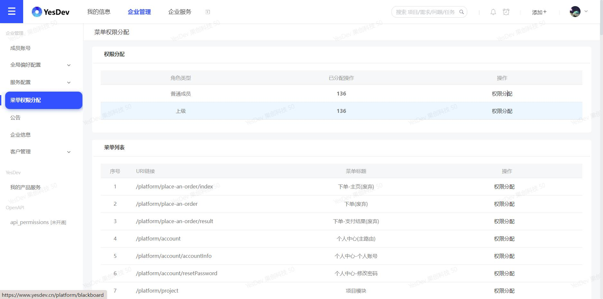   

# 5.3.3 公告发布  

企业重要通知，可以通过发布公告通知到每一个成员  

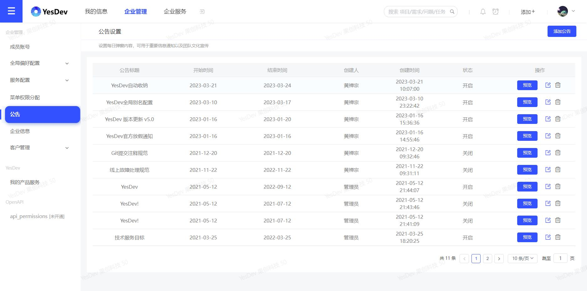  

## 公告发布编辑步骤  

企业管理人员可在后台进行添加、编辑、预览、删除公告，同时配置公告状态是否开启、关闭；企业管理人员点击【添加公告】，在弹窗选择添加【公告标题】、【公告内容】、【选择有限时间】【开启/关闭状态】，还可【指定人员】可见；完成公告添加后，保存可查看预览效果   

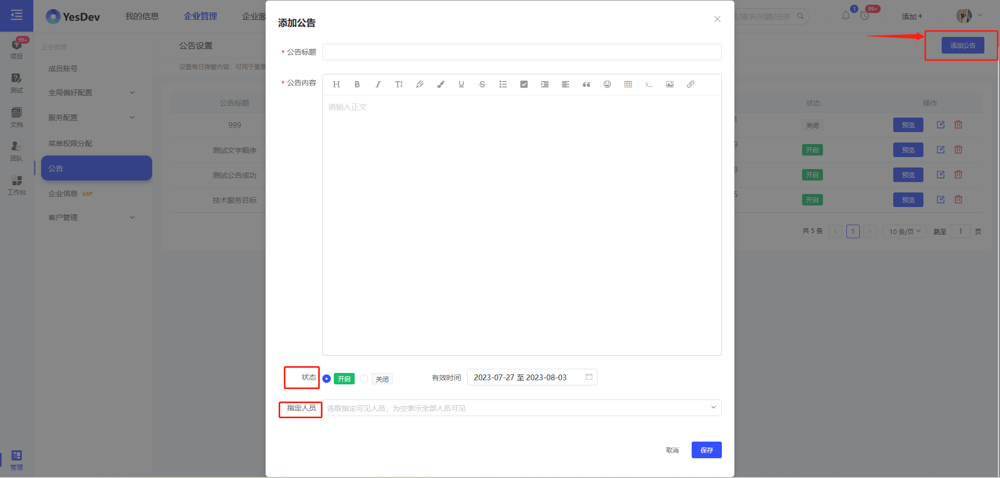  

点击“预览”，可看到公告编辑完成后，发布后显示的预览效果；根据预览效果情况，对公告内容进行修改。已关闭状态的公告，在发布后，是不会在前台显示出来   

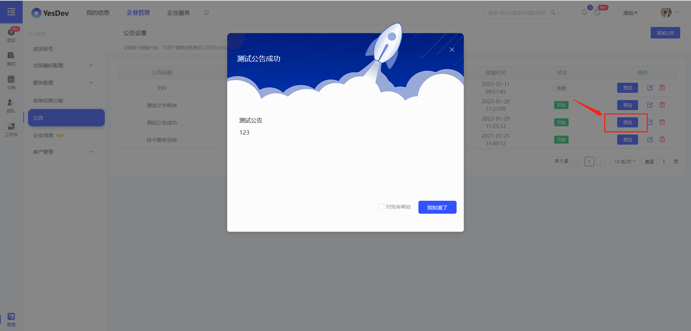  

