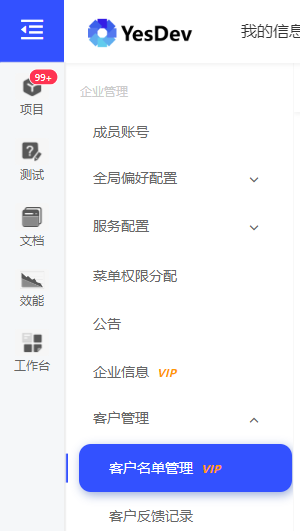
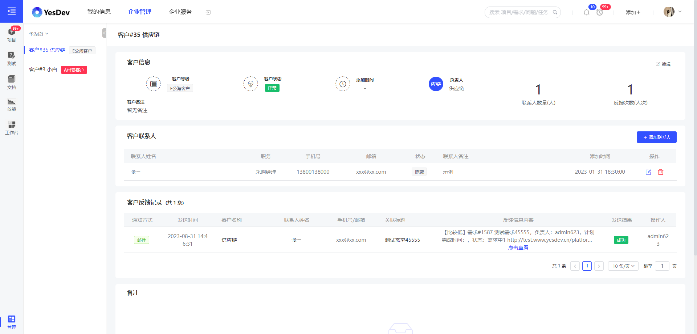
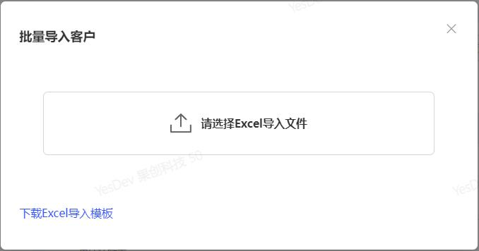
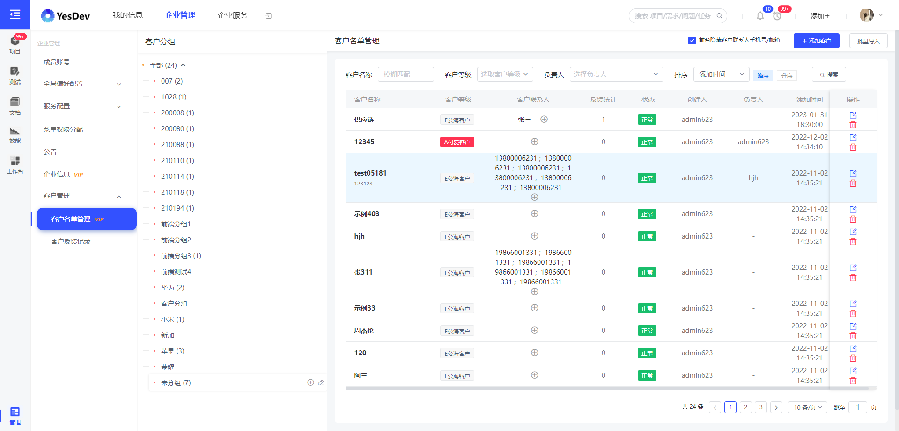
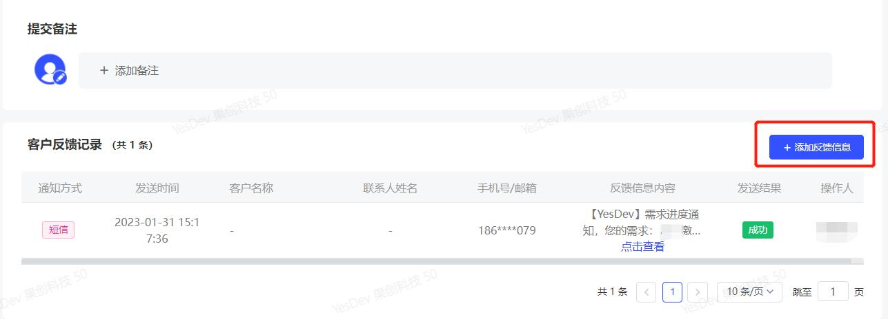
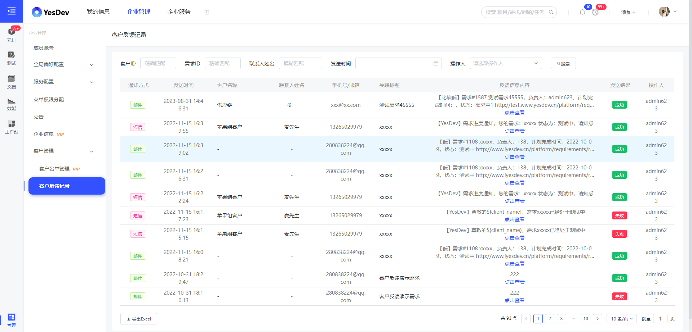

# 客户管理

YesDev不仅能够对内管理，同时也支持对外管理，即对企业合作的客户进行管理。

## 客户名单管理

1. 通过左侧菜单，点击客户名单管理进入

 

2. 在客户列表点击客户名称，就可以查看到当前客户的详细信息
    

3. 点击右上角添加菜单添加您的客户吧，YesDev还支持Excel表批量导入，如果您的客户数量较多，建议使用该功能进行录入

 

4. 这里可以看到客户列表，您可以点击客户为其客户联系人，或者更新客户状态、等级等。
 

## 客户反馈记录

1. 在需求管理中，您可以在具体某个需求下方，添加反馈信息记录
   
 

2. YesDev会自动生成客户反馈信息列表，在后台管理点击“客户反馈信息”菜单项，查看反馈记录，不遗漏任何一个对客户的反馈
   
 

