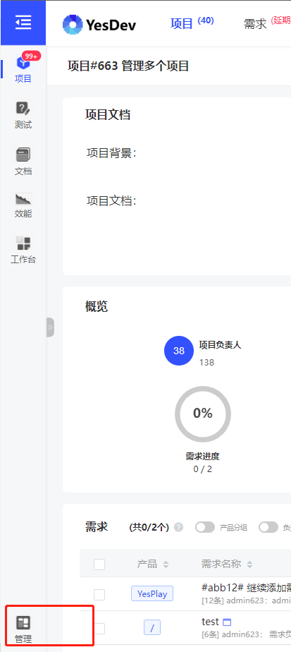
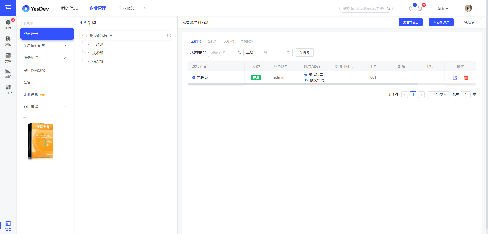
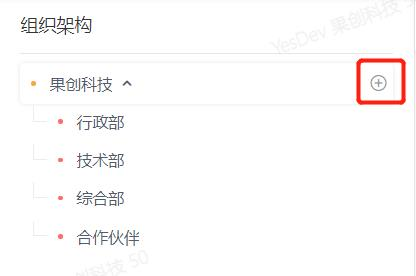
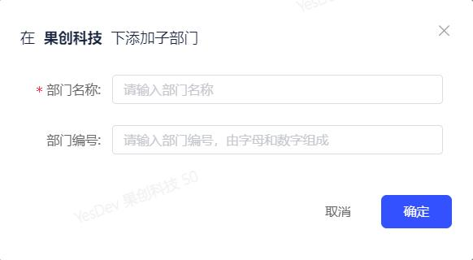
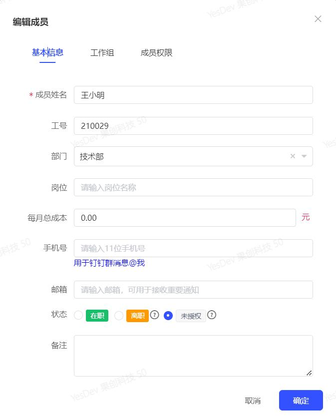

# YesDev 后台管理

企业管理员账号拥有系统的最高管理权限，可以通过后台管理执行更多系统操作。

## 进入管理后台

1. 登录管理员账号后，点击YesDev左上角下拉菜单，即可看到企业管理后台选项
   

2. 进入管理后台后，您可以看到企业的组织架构，以及所有成员的账号信息，并且可以添加或删除成员

 

## 添加组织部门
1. 在组织架构栏，点击添加按钮

 

2. 在弹出窗口中为您的企业添加一个组织部门吧

 

## 管理成员
1. 点击成员列表，某个员工的编辑按钮
 

2. 打开编辑栏，为员工指定部门、工作组和权限等
 

