# 5.4 角色权限管理 - 如何管理多角色、分配菜单权限？

在YesDev，可以通过三个层级维度，对员工账号的菜单权限进行分配和管理。分别是：  

 + 第一层：通过 产品应用管理，控制 产品应用的图标访问入口 显示或隐藏；  
 + 第二层：通过 角色权限，批量设置员工 菜单权限； 
 + 第三层：通过 员工权限调整，指定菜单的员工白名单或黑名单。  

# 5.4.1 产品应用管理

如果需要控制左侧 产品应用图标 的显示和隐藏，可以进入【企业管理】-【产品应用管理】-【应用管理】。  

> 温馨提示：显示/隐藏 只是控制产品应用图标是否显示；而 菜单权限 则用于控制员工访问权限。  

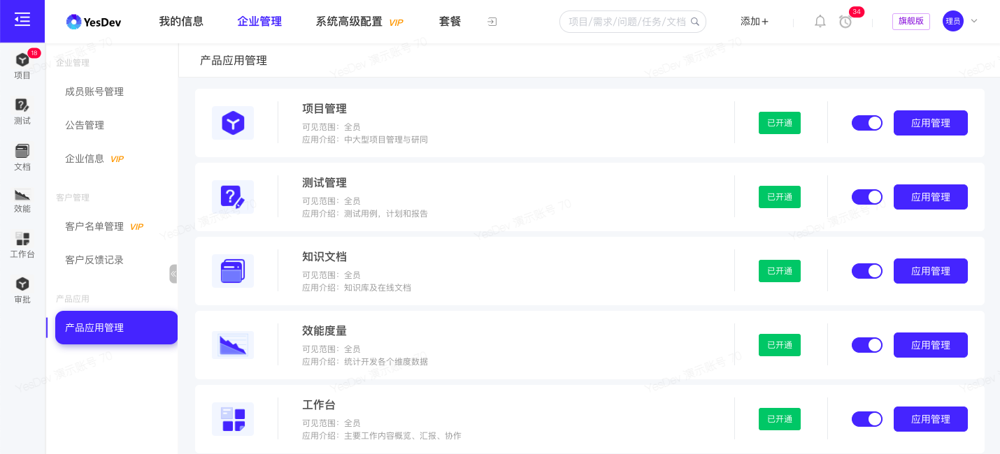   

## 1）设置可见范围

针对具体的产品应用，可以设置可见范围。有三种策略方式：  

 + 公开（公司内可见）；
 + 按角色（指定角色可见，支持多选）；
 + 按员工（指定员工可见，支持多选）；

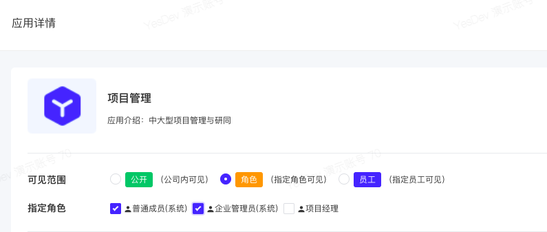  

## 2）设置菜单权限

在【菜单权限分配】组件，可针对当前产品应用的菜单权限，给各个角色进行快速的权限分配。  

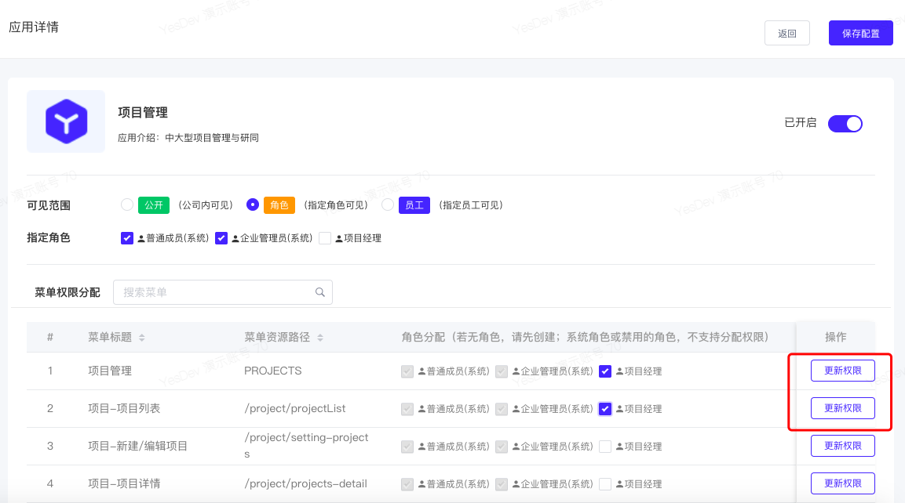  

# 5.4.2 角色管理

创建新角色后，可以继续为新角色分配菜单权限，以及分配员工，进而控制和管理员工账号的菜单权限。  

## 1）管理角色

使用 企业管理员 账号，依次进入【企业管理】-【角色权限管理】，可以进入到 角色权限管理 页面。

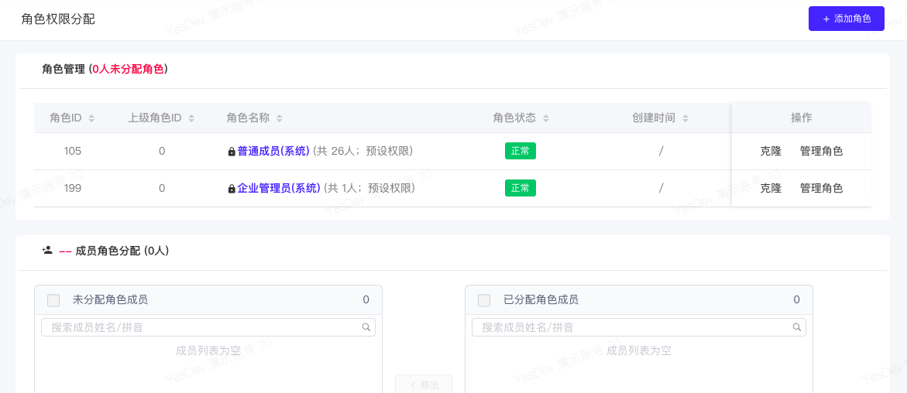  

> 温馨提示：【普通成员】和【企业管理员】是属于YesDev系统预设的系统角色，不可删除、编辑。  

## 2）添加新角色

点击【+ 添加角色】，在 添加角色 弹窗，选择或输入：上级角色、角色名称、角色状态。其中：   

 + 上级角色：用于进行角色分级管理，权限不继续上级角色；  
 + 角色名称：自定义的角色名称，最长12个汉字，如：项目经理；  
 + 角色状态：正常/禁用（禁用后，该角色下的员工无任何访问权限）；  

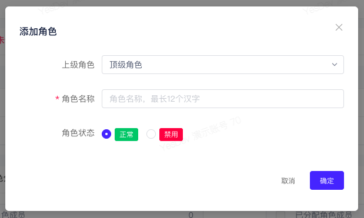  

添加角色后，可以对自己的角色进行：编辑、删除、克隆、管理角色等操作。  

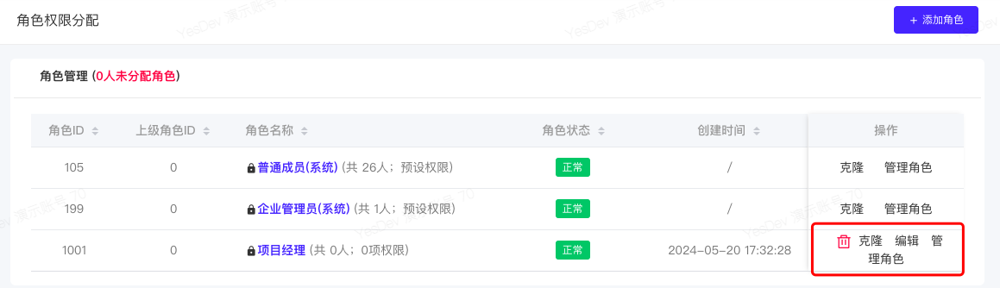  

## 3）为新角色分配员工

选择 角色 后，点击【管理角色】，在【成员角色分配】组件，可以将此角色权限分配给多个员工。  

> 温馨提示：一个员工，最多拥有一个角色。如果员工已经分配其他角色，将不会重复再分配。可以先取消移出，再重新分配新角色。  

移出员工角色：  

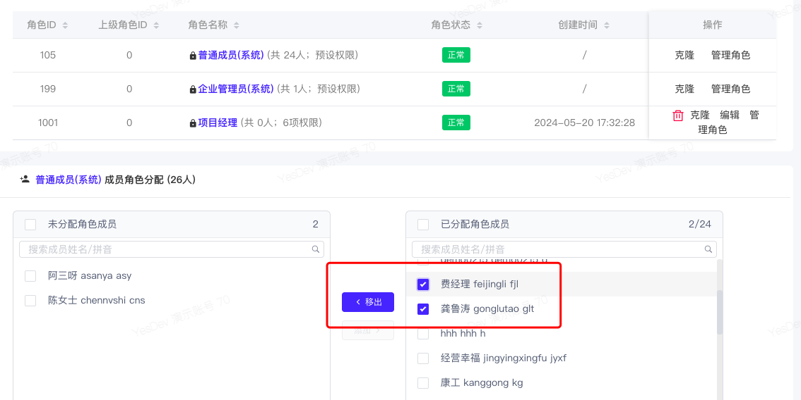  

重新分配新角色：  

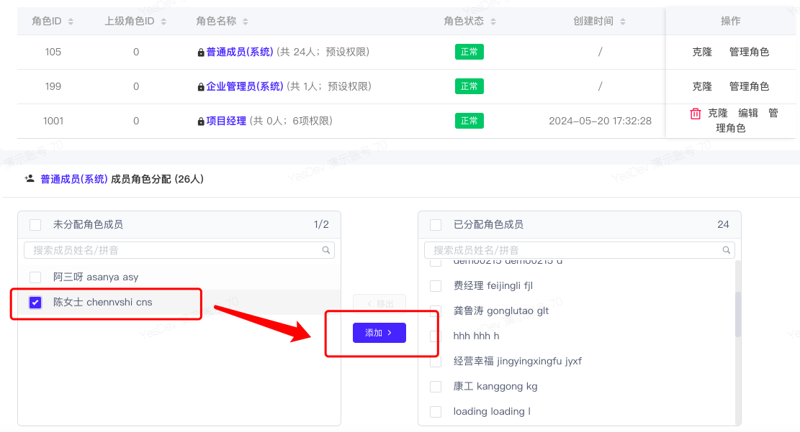  

## 4）为新角色分配菜单权限

选择 角色 后，点击【管理角色】，在【角色权限分配】组件，可以对该角色的菜单权限进行分配和管理。  

菜单权限，按 产品应用、功能模块、左侧菜单 等层级进行树状查看和管理。  

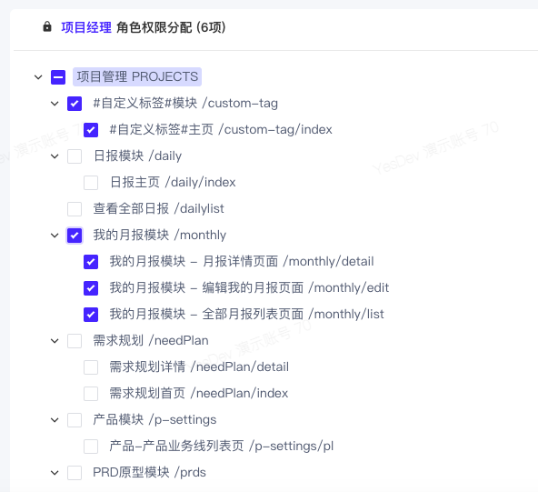  

例如，根据企业开通的产品和定制的产品，企业管理员可以进行如下的产品菜单权限分配。  

 + 项目管理 PROJECTS
 + 测试管理 TEST
 + 知识库文档 DOCUMENTS
 + 效能度量 STATISTICS
 + 工作台 WORKBENCH
 + OA审批 EXAMINEAPPLY
 + 企业管理后台 ADMIN

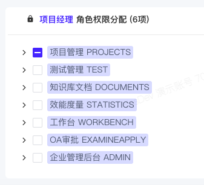  

其中，【测试管理 TEST】展开后，有类似以下的层级菜单 可分配：  

> + 测试管理 TEST
>   +  缺陷统计模块 /bug-stats
>     +  缺陷统计主页 /bug-stats/index
>   +  测试计划模块 /test-plan
>     +  测试计划-测试计划详情 /test-plan/detail
>     +  测试计划-测试计划汇总邮件 /test-plan/email
>     +  测试计划-测试计划列表 /test-plan/index
>     +  测试计划-测试计划脑图 /test-plan/mind
>     +  测试计划-创建新计划 /test-plan/setting
>   +  测试用例模块 /testCase
>     +  测试用例-测试用例详情 /testCase/detail
>     +  测试用例-测试用例列表 /testCase/index
>     +  测试用例-测试用例脑图 /testCase/mind
>     +  测试用例-创建新用例 /testCase/setting
>     +  测试用例库列表 /testCase/storelist

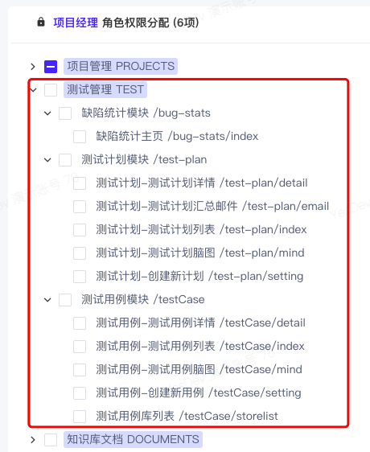   

## 5）更多菜单权限类型

菜单权限分配，除了有 功能模块、常规的左侧菜单外，还支持全局搜索、全局添加按钮、以及 更多组件功能、按钮操作、API接口、甚至外部URL链接 等权限分配。即，包括但不限于以下权限分配：  

 + 功能模块
 + 左侧页面菜单
 + 全局搜索、全局添加按钮
 + 按钮操作
 + 组件功能
 + API接口
 + 外部URL链接

目前YesDev权限体系正在不断完善升级中，敬请期待！如果需要更细致的权限分配和管理，可和我们联系。   

# 5.4.3 员工菜单权限

## 1）为员工指定角色权限

如果需要修改某个员工的角色权限，也可以在添加员工后继续分配员工角色。   

> 温馨提示：默认创建的新员工，默认角色为【普通成员】。 

在 【企业管理】-【成员账号管理】-【成员列表】-【编辑成员】，可以修改【成员权限】 -【成员角色】 -【选择角色】，然后【确定】。  

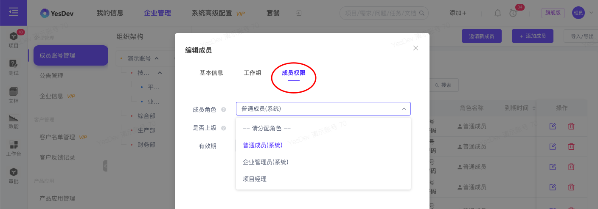  

## 2）无菜单权限时的页面提示

若员工没有页面菜单权限，访问时，将会提示：404 页面无权限。例如：  

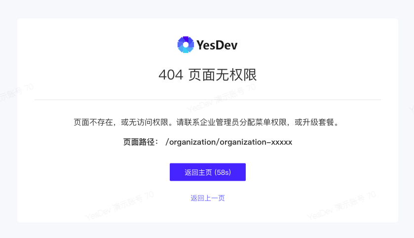  

提示：“页面不存在，或无访问权限。请联系企业管理员分配菜单权限。”     

## 3）单独设置菜单白名单

如果需要针对单个菜单权限，单独调整和设置员工的白名单、或黑名单，可以使用：【员工权限调整】。  

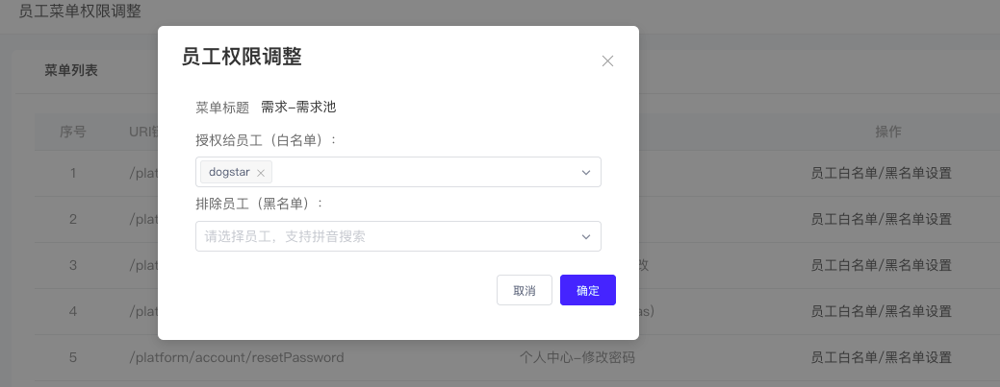  

> 温馨提示：员工菜单权限的黑名单、优先 白名单；而员工菜单权限调整的规则，整体又高于角色权限的分配。      

    

