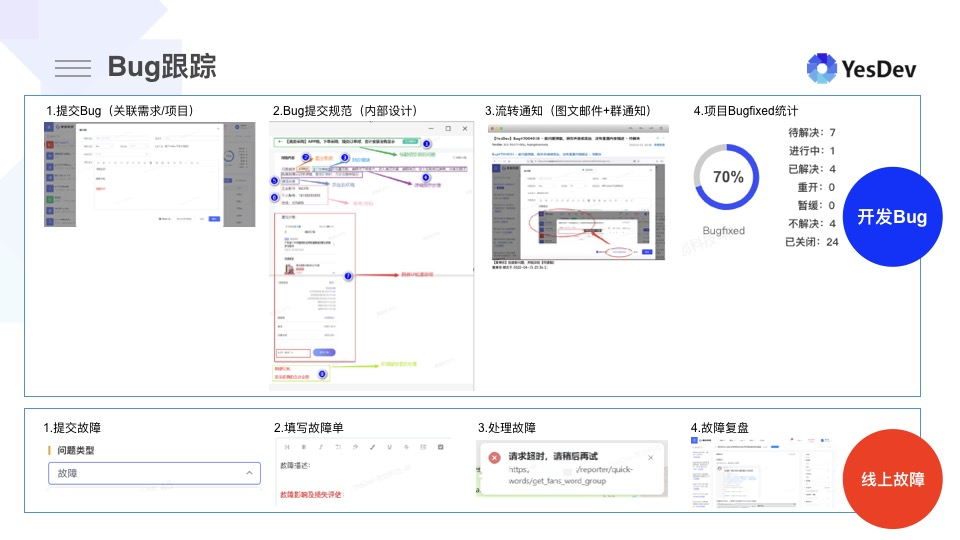
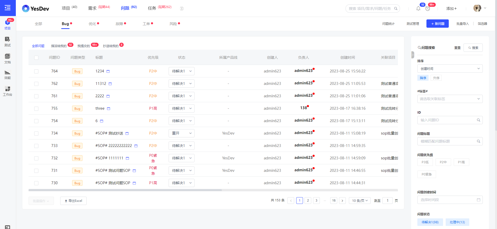
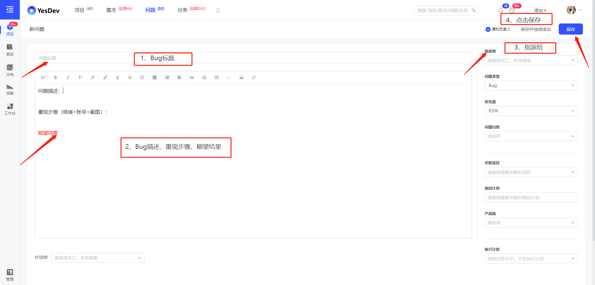
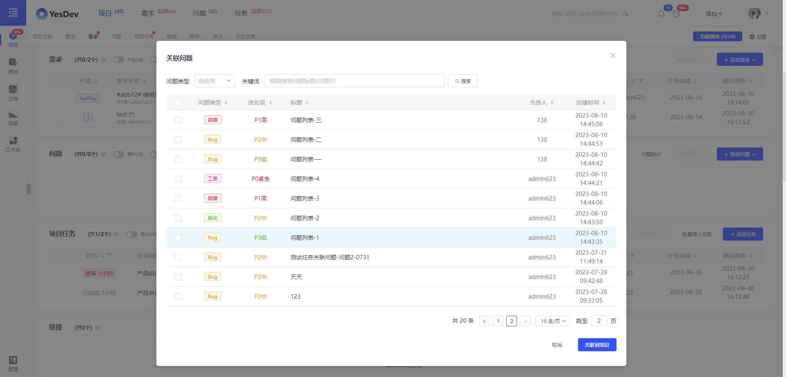
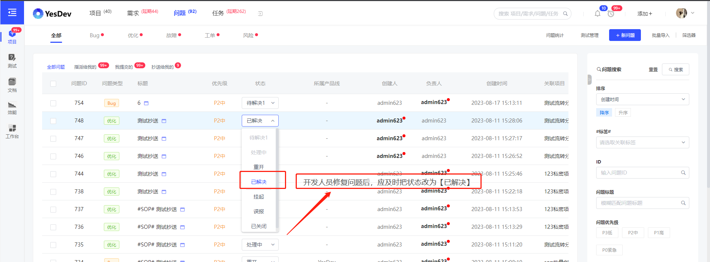
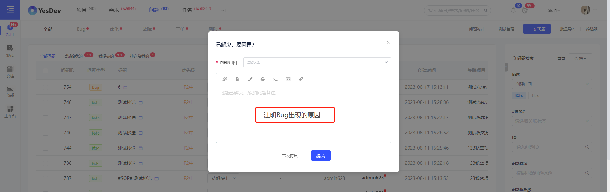
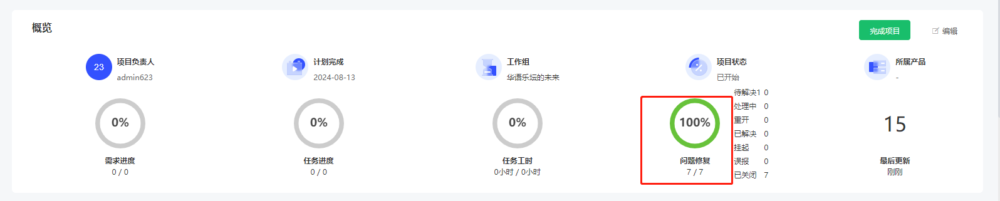
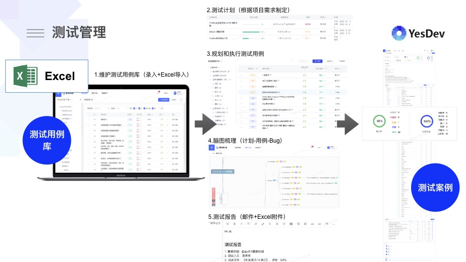
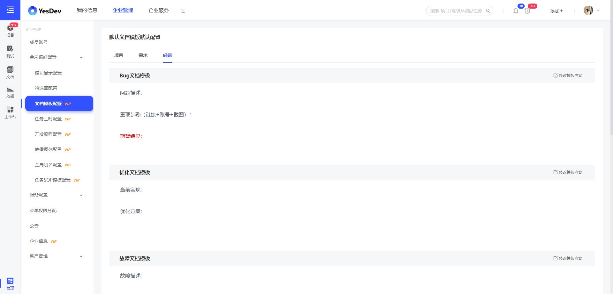
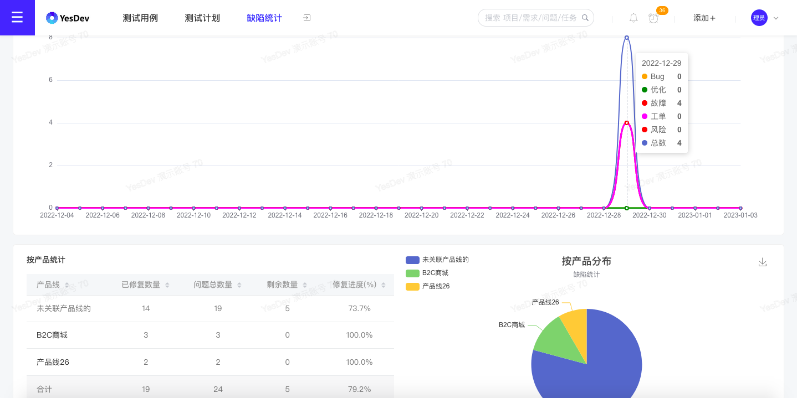

# 2.5 Bug缺陷跟踪与问题管理

在YesDev，对于缺陷跟踪，主要分为两个大类，开发Bug和线上故障。  

# 2.5.1 问题分类 

YesDev问题的分类，细分为以下五类。  

## Bug
 + **Bug缺陷**  
 功能未上线前所发现的问题、缺陷或漏洞等。  

## 优化 
 + **产品优化**  
 产品细节优化和小功能改进，非技术问题。  

## 故障 
 + **线上故障**  
 在正式环境、生产环境、客户环境等产生并影响用户和客户正常使用的问题、缺陷或漏洞等。  

## 工单 
 + **售后工单**  
 由付费客户反馈，需要跟进处理和问题、事项和工单等。  

## 咨询
 + ** 售前咨询 **  
 对于潜在的客户、线索的记录跟踪，例如客户留咨、客户留言、预约演示等。  

因此，在项目迭代的测试阶段，所发现的问题，都应归到Bug分类，并且和对应的项目进行关联。  

  

## 演示视频

操作演示：问题管理  

包括五大类：Bug缺陷、优化、故障、工单、咨询；分为：全部问题，指派给我的，我提交的，和抄送给我的。支持问题的批量操作，批量复制标题和链接，以及问题列表的筛选器显示、Excel导出、搜索习惯设置。

[演示视频](https://yesdev.oss-cn-shenzhen.aliyuncs.com/video/yesdev-2024-07-31-153507.mp4 ':include :type=video controls width=100%')  

# 2.5.2 添加新问题

## 单独添加新问题

在【新问题】页面，填写表单后，可以添加一个新的缺陷或问题。  
  

在问题描述中，可以扼要记录问题的描述、重现步骤和期望结果。  

## 把问题关联项目  

把问题关联项目，可以有两种方式。你可以直接在项目详情页，提交新问题到当前项目。  

你也可以先创建问题后，再批量关联到某个项目。  
  

## 把问题关联到需求

你也可以进入到需求详情页，直接添加问题到此需求；或者在创建问题后关联到指定的需求。      

## 演示视频

操作演示：快速创建新问题的6种方式  

直接通过Excel批量导入问题，直接添加单个新问题，在项目中关联多个问题，在项目中直接添加新问题，在需求直接添加新问题，（测试人员）通过测试计划和测试用例一键提Bug。

[演示视频](https://yesdev.oss-cn-shenzhen.aliyuncs.com/video/yesdev-2024-07-31-160145.mp4 ':include :type=video controls width=100%')  

# 2.5.3 缺陷跟踪

## 问题指派与流转

测试人员提交Bug给开发人员后，开发人员在修复处理后，应及时把问题的状态改为【已解决】并注明原因。  
  

推荐同时注明Bug出现的原因，方便回顾和解答疑虑。  
  

随后，测试人员应当对Bug进行重新测试，如果测试通过则把问题状态改为【已关闭】；若不通过则改为【重开】并注明重开原因。  

> 温馨提示：Bug已解决或重开，都会进行邮件/群通知。  

## 测试通过

当迭代项目的全部Bug都修复并且测试通过后，就可以开始准备上线发布。  

  

项目达到发布上线的推荐条件是：  
 + 全部项目问题已经100%修复并且测试通过  
 + 全部项目任务已经100%完成   
 + 全部项目需求已经达到【待发布】状态  

## 演示视频

操作演示：问题的流转    

问题的流转、解决和关闭，以及全部问题100%的完美解决。

[演示视频](https://yesdev.oss-cn-shenzhen.aliyuncs.com/video/yesdev-2024-07-31-161951.mp4 ':include :type=video controls width=100%')  

# 2.5.4 测试管理
如果你需要进行更加详细的用例维护、测试计划，可以进入【测试管理】功能模块。  

  

# 2.5.5 问题模板配置  

考虑到每个团队所需要的问题缺陷模板不一样，可以在企业管理后台，对不同类型的问题，设置自己团队所需要的模板格式和表单内容。  

  

# 2.5.6 缺陷统计

如需查看和统计不同维度的缺陷，可以进入项目详情页，或缺陷统计页面，或统计分析页面进行查看。  

  

## 演示视频

操作演示：缺陷管理的高级使用    

问题类型配置（根据业务需要开启所需要的问题类型）、问题模板的配置（规范团队内部提交问题的格式和规范）、自定义问题字段（丰富的控件组件）、缺陷统计（各种有助于提升项目质量的统计指标）。

[演示视频](https://yesdev.oss-cn-shenzhen.aliyuncs.com/video/yesdev-2024-07-31-163229.mp4 ':include :type=video controls width=100%')  

