# YesDev客户案例

## 深圳秋涛医学美肤 - 专研美肤三十年

> 副标题：信息中心的增速提效与技术革新 

## 一、企业简介
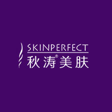  

深圳市秋涛医疗投资有限公司成立于2009年，秋涛医学美肤秉承“已所不欲，勿施于人”的服务理念，以开放的心态，与国内外同业展开深入学习和交流，并引进国际科技前沿的医疗美肤设备和产品。

## 二、项目背景
2018年公司成立10周年之际，为了应对第二个十年的挑战，为了扩大公司规模做准备，正式立项成立信息中心开发部门开始进行数字化转型战略。战略共分三部，其中轻医美连锁数字化管理平台的研发为最核心的第二部，目标以“五化”方针建设（轻量化、移动化、自动化、数据化、云端化），从集团层面规划新一代业务管理系统。为第二个十年打下更坚实的基础。  

## 三、YesDev&深圳秋涛美肤的研发闭环管理

在2022年，信息中心确定了“增速提效、技术革新、组织升级”的工作重心，并全面引入YesDev进行企业研发管理与协同，并逐步向业务部门开放，以形成需求→分析→规划→开发→发布自动通知的研发业务流。

**需求管理**：  

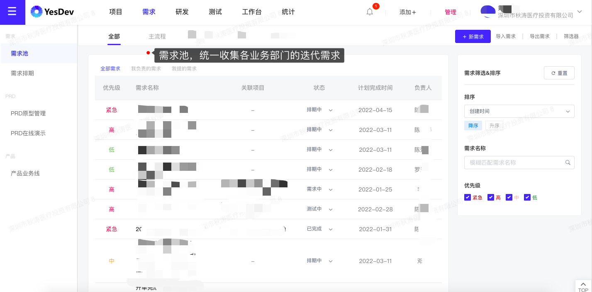 

**项目管理**： 

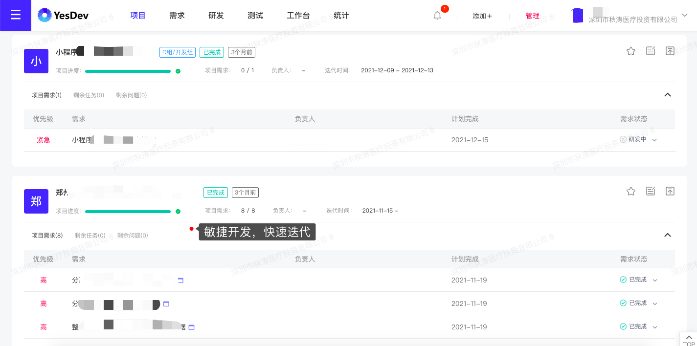  

**可视化项目进度管理**：  
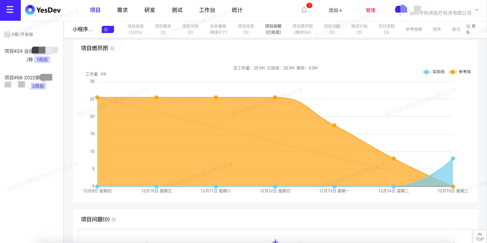  

**工时登记与产能分析**：  
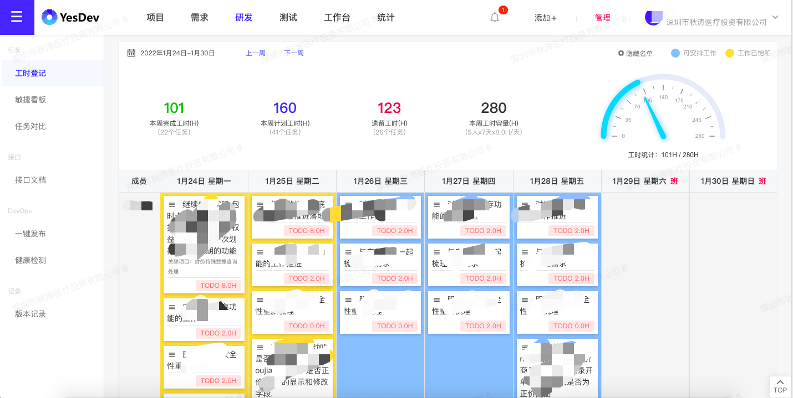  

**Git代码提交自动关联到需求、任务和问题**：  
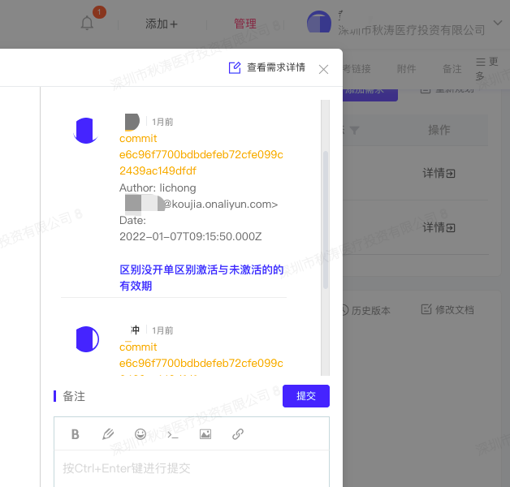  

**一键发布**：  

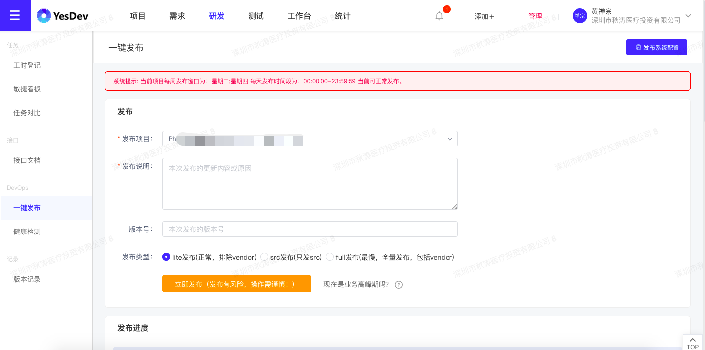  

发布的实时群通知：  
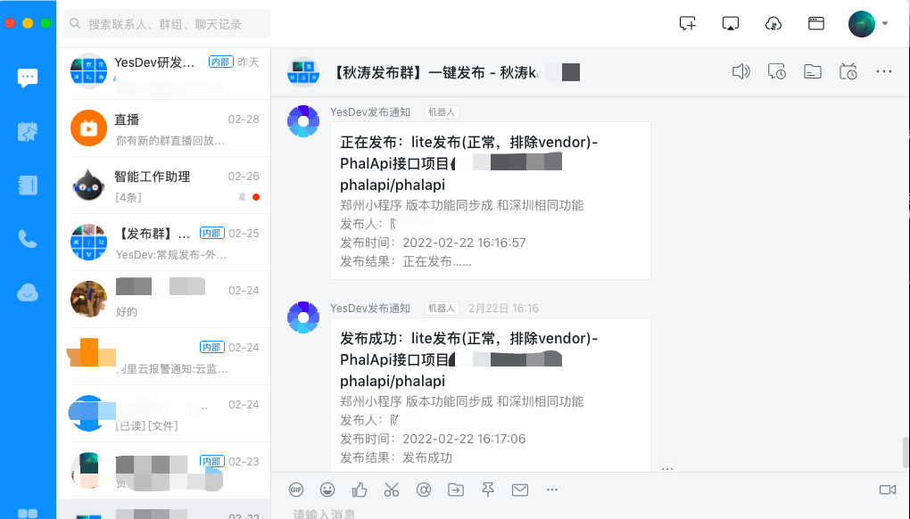  

**测试用例、测试计划与测试报告**：  
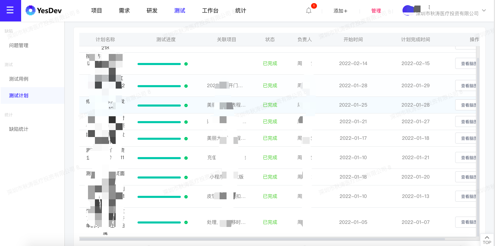  

结合企业邮箱的产研测协作流程：  
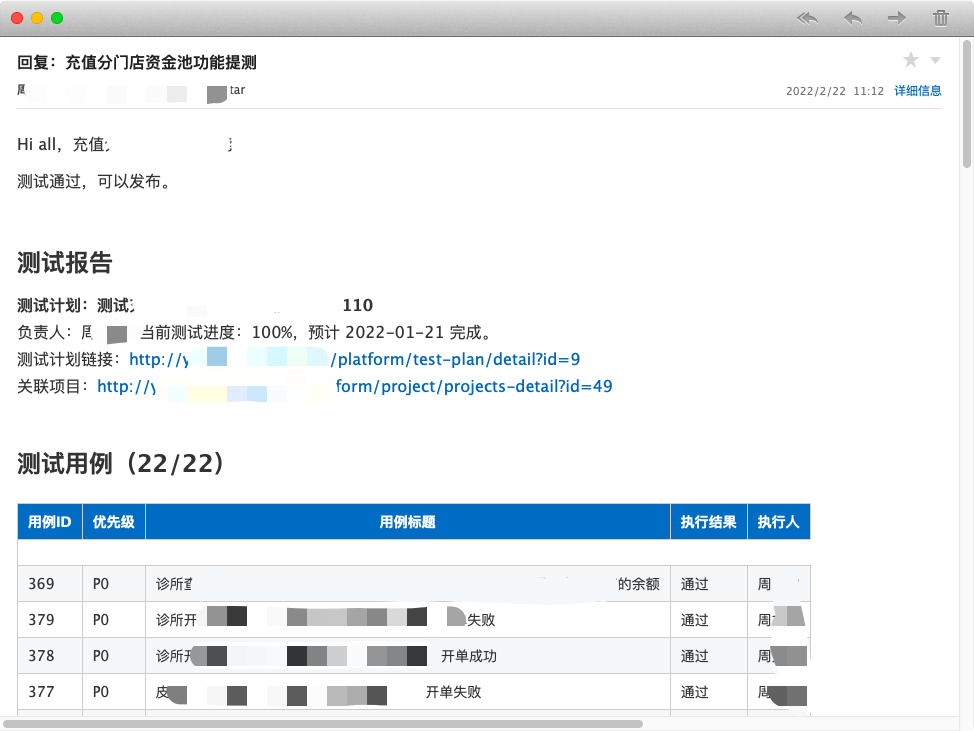  

**研发团队的实时统计**：  
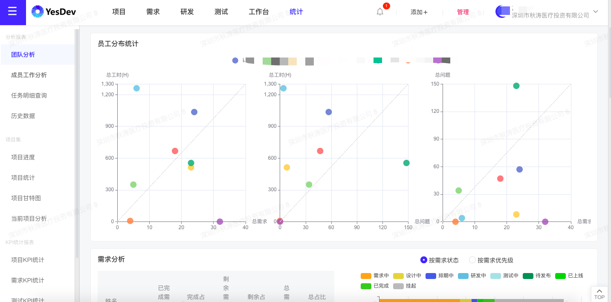  

## 四、量化考核指标KPI

按每月进行考核指标统计，考核Excel模板：      
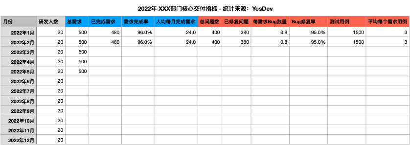      

## 五、品牌故事

秋涛美肤以矢志不渝的态度，专注于美肤领域，为缔造更高水平的专业医疗美肤服务而锐意进取。

秋涛医学美肤，是从业30余年的皮肤美容医生李秋涛于2008年5月25日在深圳创建的一家专业从事非手术非整形的轻医美连锁机构，机构秉承将皮肤医学及美容完美结合的创业初心，将皮肤医学理论、技术、经验等科学的应用于皮肤美容领域，致力于与顾客一起创造实现肌肤健康、安全、美丽、年轻态的理想。机构通过非手术非整形的技术手段，满足顾客在实现肌肤年轻化、色素改善、痤疮治疗、敏感肌治养、肤质调理、身材轮廓优化、妊娠纹治理等领域的需求。

YesDev也将为秋涛美肤持续提高软件项目管理能力，切实做好提效增速助发展！  

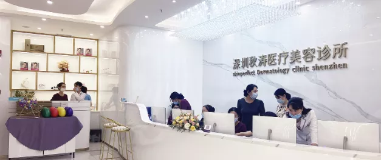      

