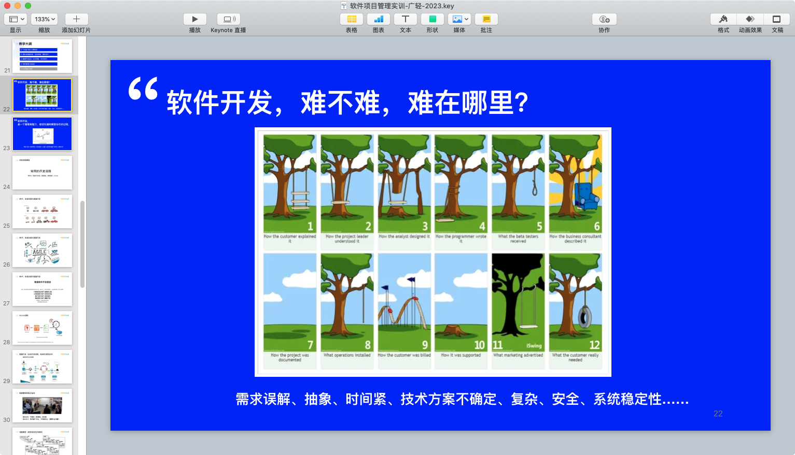
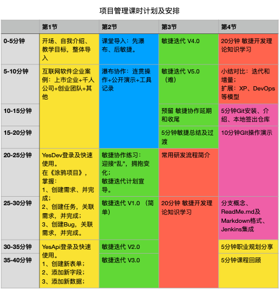
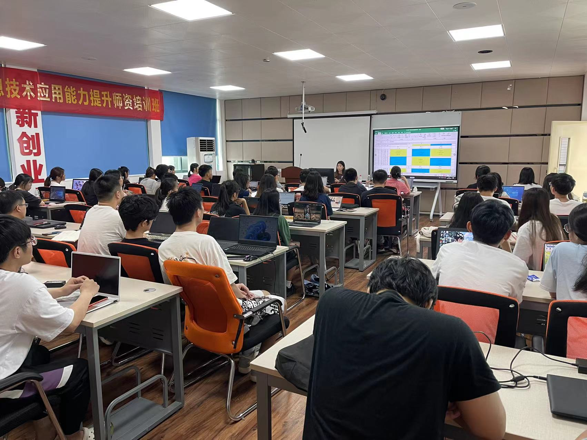

# 广东轻工职业技术学院 - 德能兼备、学以成之

## 一、学校简介

  

广东轻工职业技术学院创建于1933年，是省属唯一国家示范性高等职业院校，中国特色高水平职业学校和高水平专业群（“双高计划”）建设单位，现有全日制高职在校生18326人。学校前身是“广东省立第一职业学校”，至今已有90年职业教育历史，1959-1963年和1978-1983年两段时期，曾开办本科职业教育。

学校坚持以习近平新时代中国特色社会主义思想为指导，贯彻党的教育方针，立足粤港澳大湾区，面向全国，服务轻工业转型升级，秉承“德能兼备，学以成之”的校训和“自强、敬业、求实、创新”的广轻精神，落实立德树人根本任务，为党育人、为国育才，为社会培养了24万余名高素质高技能应用型人才，毕业生遍布五洲30多个国家。  

## 二、项目背景

YesDev已经连接三年为广东轻工职业技术学院大三毕业生提供项目管理实践培训。  

## 三、YesDev项目管理综合实训课程

课程教学大纲：  

 +  01 “X企业”新人入职培训  
 +  02 瀑布流模型实训 （按步就班、顺序进行）
 +  03 敏捷开发实训（小步快跑、并行迭代）
 +  04 项目管理行业知识
 +  05 Git代码工作流

  

  

  

## 四、品牌故事

1933年广东省省立第一职业学校（广东轻工职业技术学院前身）成立，时任广东省长的胡汉民先生题词“本其职志，学以成之”，以此表达了对职业教育理想与使命的期许，而当前我校提出的“德能兼备，学以成之”正是对我校传统的继承和发扬。 

“德能兼备，学以成之”意为：我校人才培养和师生成长的目标是德能兼备的高素质人才，而只有通过学校精心治学、教师严谨治教、学生一心向学方能成就。  

  

