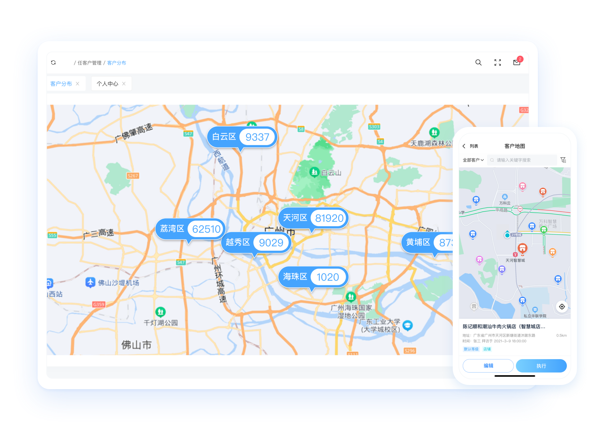

# 贸宝云 — 帮助商家链接用户

## 一、平台简介

  

贸宝云新零售数字化新商业服务平台，基于S2B2C模式助力供应商、品牌商、渠道商、终端商家进行数字化转型，赋能提升运营效率。实现消费者、实体店、线上云店、供应链四位为一体的新零售供应链生态闭环，提供智能化运营、聚合供应链、数据商业决策能力，助力线上线下融合动销。帮助企业实现新零售数字化转型，帮助商家连接用户，让生意经营更简单有效。     
    

## 二、项目背景

贸宝云拥有七大核心产品能力，助力企业快速数字化转型。  

分别有：

业务行为系统(CAS)

 + 贸宝云商(B2B)

 + 贸宝云货(B2C)

 + 支付分账系统(SAS)

 + 费用管控系统(ECS)

 + 供应链服务(SCSS)

 + 物码运营系统(QROS)

YesDev为以上产品研发提供了一站式项目协作解决方案，助力提升贸宝云研发效率和系统质量。  

  

## 三、YesDev项目管理

YesDev是一站式企业研发管理、项目管理与协同办公平台，支持敏捷开发、DevOps、Scrum、硬件项目等多种迭代方式，能为企业管理者智能生成项目投入产出的数据模型，真正实现项目研发全流程数字化管理。

## 四、品牌故事

贸宝云助力供应商、品牌商、渠道商、终端商家成功数字化转型，赋能提升运营效率。  

