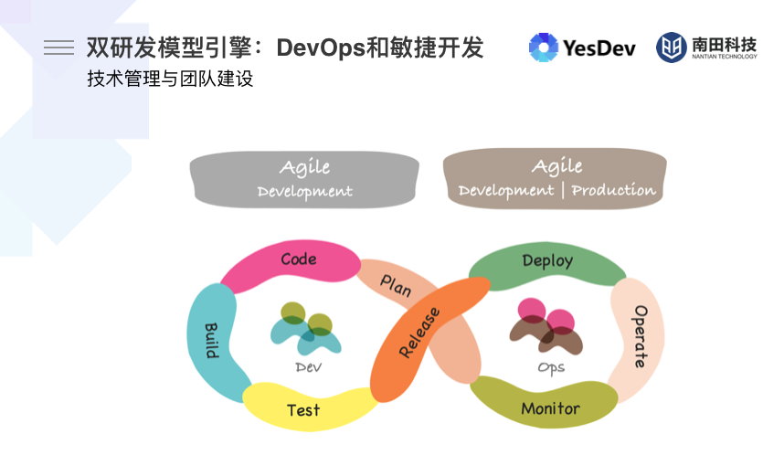
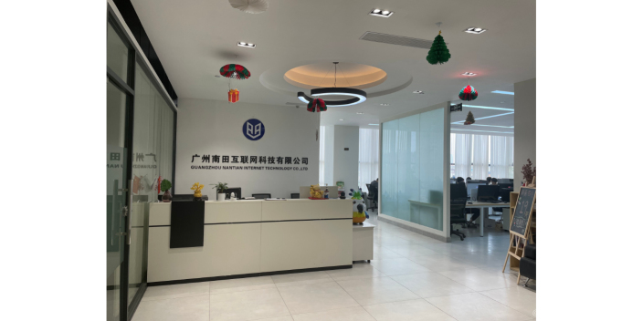

# 广州南田互联网科技 - 高新技术企业 

## 一、企业简介

  

广州南田互联网科技有限公司是一家业务范围广泛，涉及多个领域的互联网科技公司，在区块链技术相关软件和服务领域具有一定的实力和影响力。在知识产权方面，广州南田互联网科技有限公司拥有9项软件著作权和16项注册商标。

## 二、项目背景

2021年开始，南田科技全面采用YesDev进行敏捷开发，助力出海服务。  

## 三、YesDev敏捷开发及DevOps实践

DevOps（英文 Development 和 Operations 的组合）是一组过程、方法与系统的统称，用于促进开发（应用程序/软件工程）、技术运营和质量保障（QA）部门之间的沟通、协作与整合。  

DevOps 使以前孤立的角色（开发、IT 运营、质量工程和安全）能够进行协调和协作，以生产更好、更可靠的产品。通过采用 DevOps 文化以及 DevOps 实践和工具，团队能够更好地响应客户需求，增强对他们构建的应用程序的信心，并更快地实现业务目标。   

采用 DevOps 文化、实践和工具的团队将变得高绩效，更快地构建更好的产品，从而提高客户满意度。

  

## 四、品牌故事

广州南田互联网科技有限公司成立于2015年，是一家专业提供跨境出海技术与流量服务的ToB型企业。

  

    
