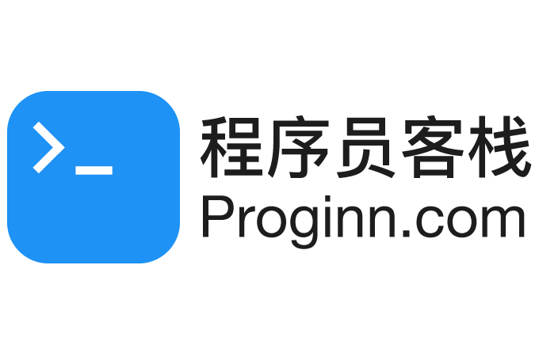

# 程序员客栈 - 近94万中高端开发者

## 一、平台简介

程序员客栈，领先的程序员自由远程工作平台，属于 杭州势然网络科技有限公司。

程序员客栈拥有全球最大的中文技术人才库。在做好用户隐私保护的基础上，持续数据治理打磨技术信用，对程序员的了解理解数据化。不断推出自由远程工作、线上开发、驻场外包、招聘猎头、技术咨询培训等产品，为科技企业提供技术新人力解决方案，打造中国领先的技术新人力平台，为程序员提供各式工作成长机会，当好程序员的经纪人。

## 二、项目背景

在2022年，YesDev和程序员客栈达成了战略性合作。

## 三、YesDev云端协作开发

YesDev已经支持自动集成和对接程序员客栈的整包项目、雇佣项目、云端工作以及1980需求梳理，方便程序员客栈的客户、项目经理、产品经理和协作开发者快速协同项目。 

### 授权登录
在程序员客栈平台上，通过对应的入口跳转访问。例如顶部的【更多】下拉菜单访问，也可以通过工作台的左侧菜单【研发协作】访问。

  

进入授权页后，登录你的程序员客栈账号，或者在已登录程序员客栈PC版的情况下直接授权登录。登录绑定后，即可对新项目进行确认接单。  

  

## 四、数据同步

可以同步：程序员客栈账号授权登录、整包项目/云端工作、任务 等数据。

## 五、品牌故事

程序员客栈使命：为程序员服务，当好程序员的经纪人。

  

