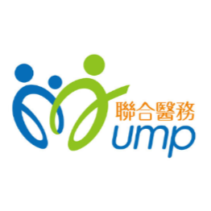
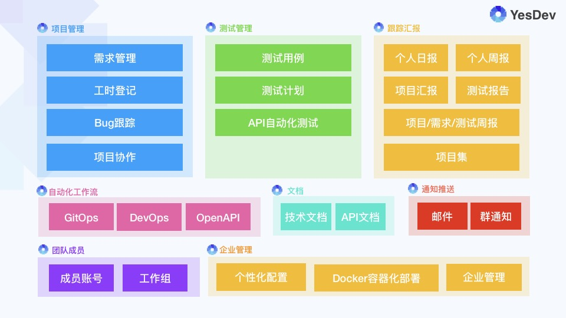

# 联合医务

## 一、企业简介

  

联合医务集团有限公司（UMP）成立于1990年，现为港交所所主板上市公司 （股票代码722:HK）。

联合医务除了为个人提供多元化的医疗保健服务，亦与企业及保险公司保持紧密合作，为会员设计及管理企业医疗保健福利计划。近年来，联合医务更紧贴国家政策，于国内各主要城市开展家庭医生培训服务，并与当地小区卫生服务机构携手打造合营的联合医务工作室。

联合医务旗下自设及联营的600多家医疗服务机构覆盖香港、澳门、北京、天津、上海，以及粤港澳大湾区包括广州、深圳、珠海、中山、东莞、佛山、肇庆在内的中国主要城市。  

## 二、项目背景

联合（深圳）医疗咨询有限公司成立于2018年09月10日，注册地位于深圳市福田区。为新成立的研发团队，采用了YesDev进行敏捷研发项目管理。  

## 三、YesDev&深圳联合医务的敏捷研发项目管理

YesDev核心功能主要有以下几大模块，分别是：项目管理、测试管理、跟踪汇报、自动化工作流、文档、通知推送等。  

  

 + **项目管理**  
 以敏捷开发为主，即时协作和管理单个项目。包括但不限于：需求管理、任务进度、工时登记、问题/缺陷跟踪、项目协作。  

 + **测试管理**  
 面向测试部门和质量品控团队，包括但不限于：测试用例、测试计划、API自动化测试。  

 + **跟踪汇报**  
 为项目成员和不同的角色提供跟踪汇报的能力，包括但不限于：个人日报、个人周报、项目汇报、测试报告、各类周报、项目集统计。  

 + **自动化工作流**  
 通过自动化集成，减少人工操作，提升开发效率。包括：GitOps、DevOps、OpenAPI。  

 + **文档**  
 提供知识库、项目资料、API接口技术文档等重要资料的管理，支持Markdown格式。  
 
 + **通知推送**   
 为个人、团队和企业内部的沟通提供必要的消息推送例如：邮件通知、站内消息、支持企业微信、钉钉等IM群通知。 

## 四、品牌故事

GOLD™金牌社区医疗培训课程由联合医务中国首席培训官龚敬乐医生和联合医务中国总裁李家聪先生于2017年创立。率先引进香港家庭医生培训模式，与内地社区实践相结合，创办GOLD™金牌培训课程，通过线上线下相结合的授课模式为全国逾百家社区卫生服务机构培训全科医生。

  

