# 2.2 需求管理

需求的闭环管理主要有：需求录入、需求池维护、项目迭代、需求排期和需求周报汇总。  

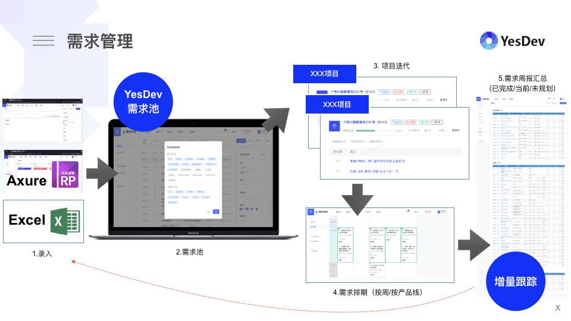

# 2.2.1 创建新需求

进入到【需求池】，在这里你可以查看到所有的需求，包括未处理的需求，以及在进行中的需求。  

我们通过“新需求”或顶部的【添加+】全局菜单入口，可以创建一个新的需求。

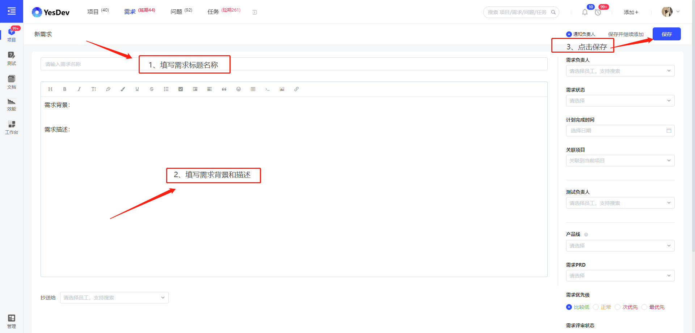  

# 2.2.2 维护你的需求

在YesDev添加需求后，你可以通过多种方式来维护、管理和流转你的需求。  

## 方式一：直接在YesDev维护需求

通过需求文档，你可以直接通过富文本进行需求文档的编写和维护，修改后可以通知负责人、保存历史版本修改，简单、方便、直接。  

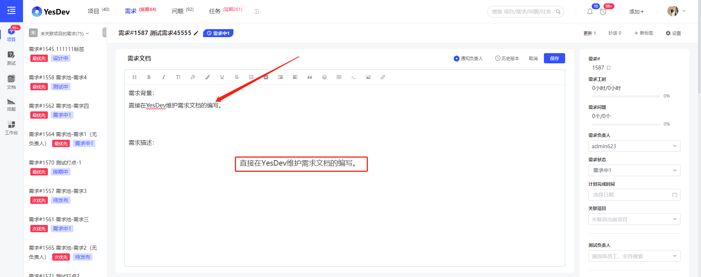  

如果需要批量迁移或导入需求，可以进入需求池，通过Excel的方式批量导入你的需求。  

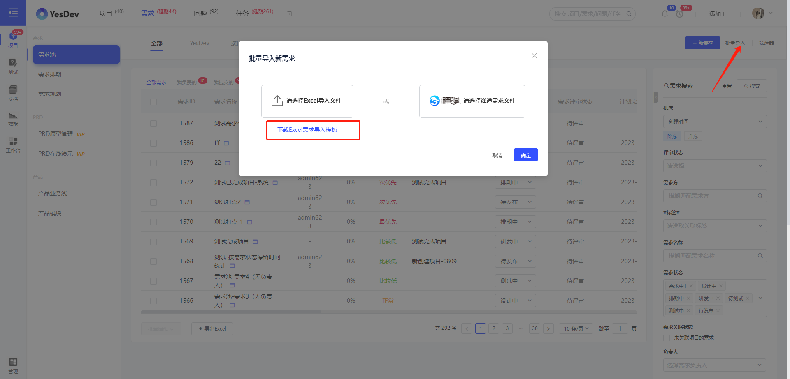  

## 方式二：通过Axure专业工具维护产品原型  

如果你使用Axure或其他专业的产品工具来维护产品原型，那么在制作产品原型后，可以导出并打包上传到YesDev。  

比如常用的Axure软件，完成设计后发布，输出包含html文件的文件夹。把文件夹进行压缩打包后，就可以上传到YesDev进行共享。

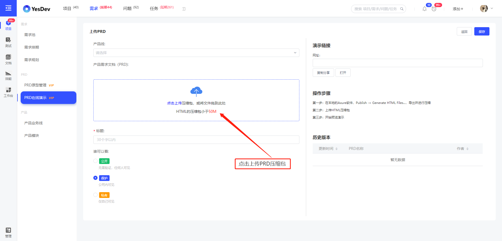  

上传压缩包文件后，就可以在线查看和共享原型设计文件了。

切换到【PRD在线演示】菜单，你可以拖动PRD文件到不同的状态栏，可以很方便的管理原型设计的实施状态。

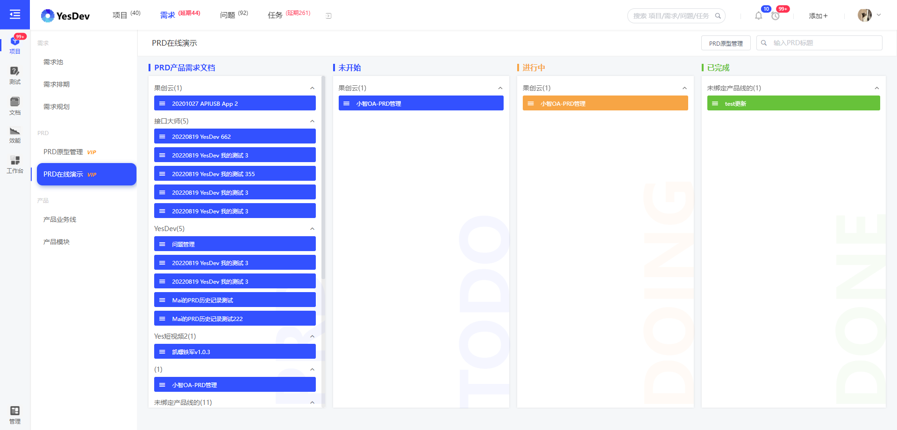  

同时点击卡片可以直接跳转到PRD文件的在线演示。

## 方式三：通过第三方平台维护产品文档  

你也可以继续使用第三方平台进行产品文档的维护，例如：墨刀、产品大牛等。  

维护好后，只需要把相关的需求链接附在YesDev的链接中即可，开发人员和研发团队就可以进行共享查看。  

## 方式四：通过本地Office文件维护需求文档  

如果原来是通过本地的Office文件维护需求文档，例如使用：Word文档、PPT文件、Excel文件或其他本地文件，可以在编写完成后，上传到YesDev的需求附件进行关联和共享。  

需求链接和需求附件，如下： 

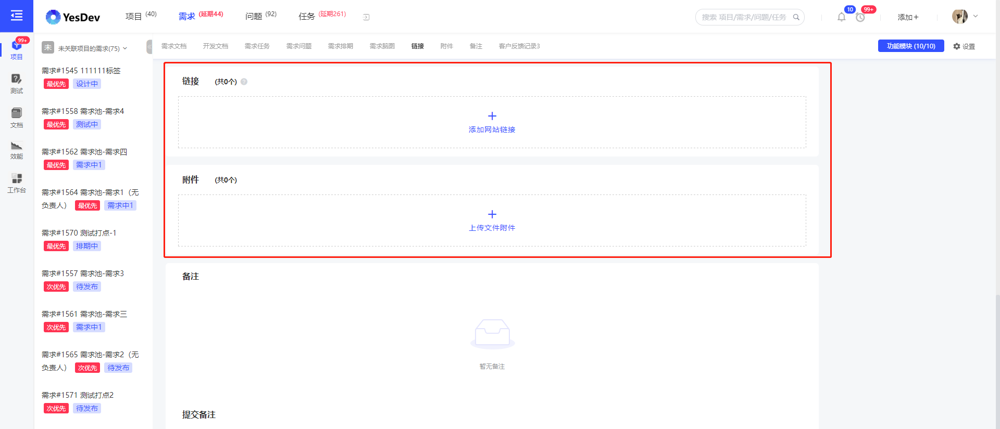  

# 2.2.3 需求规划  

对于产品经理或项目经理，在需求未正式立项前，即项目未启动前，可以通过需求规划来提前梳理和规划将来的需求迭代计划。  

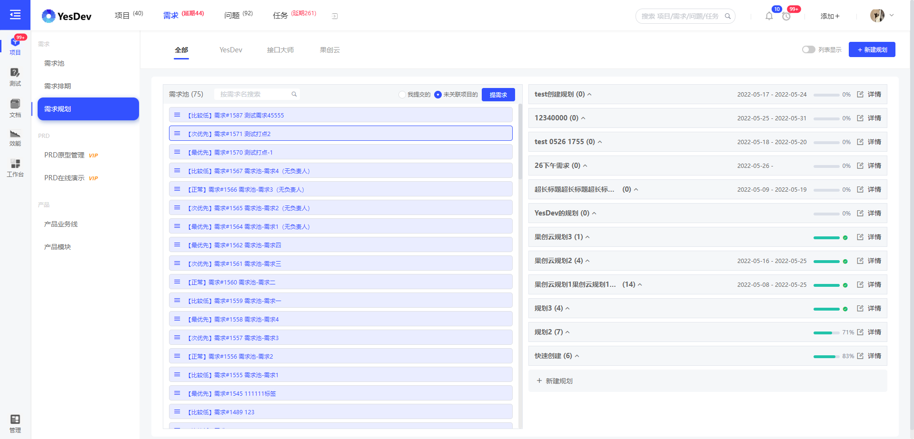  

# 2.2.4 需求排期

对于已经评审和开发排期的需求，即对于已经有明确上线时间或交付时间的需求，则可以查看和使用需求排期。需求排期支持Excel导出和快速拖动等便捷操作。  

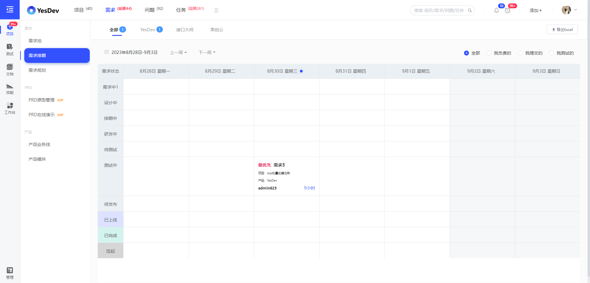  

# 2.2.5 需求开发和流转
针对需求的开发，你可以：  

 + 拆解任务，评估工时
 + 编写开发文档
 + Git代码关联
 + Bug记录
 + 提供接口文档地址及其他备注
 + 邮件通知+群通知
 + 查看历史变更
 + 其他操作

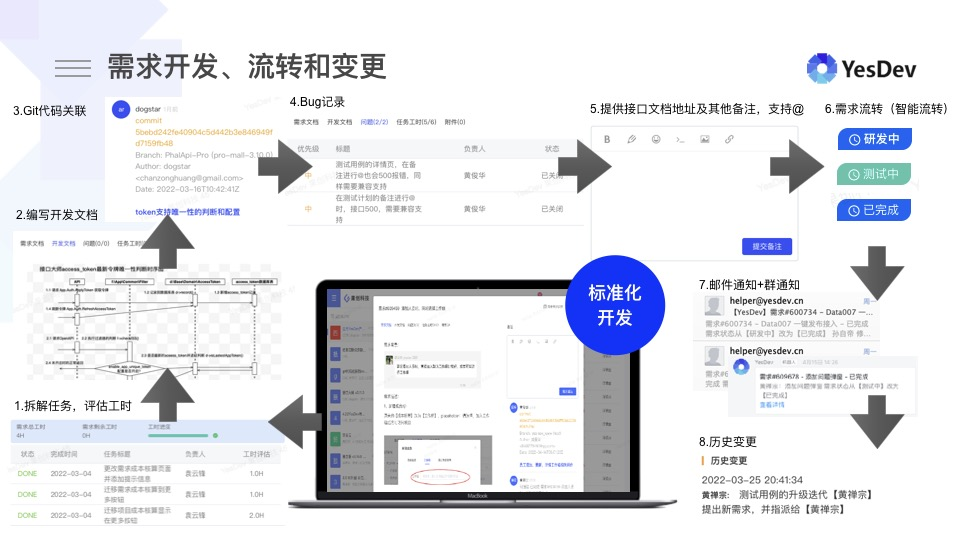

# 2.2.6 需求常用操作

以下，对需求的常用操作进行了概要说明，更多更新更全面更实用的功能，请直接进入YesDev体验使用。  

## 子需求

通过设置需求的父需求，可以支持展示多层级的子需求。

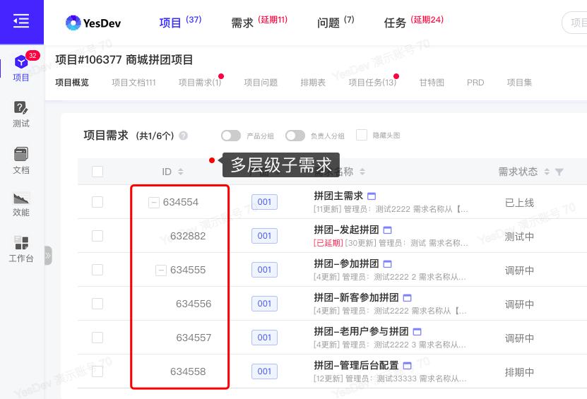

## 批量操作需求

在项目需求列表，或在需求池列表，勾选多个需求后，可以进行批量操作。主要分为三大类批量操作：  
 + 第一类：批量快速复制
    + 仅复制标题
    + 复制标题 + 需求链接
 + 第二类：批量更新
    + 需求负责人
    + 测试负责人
    + 需求评审状态
    + 需求状态
    + 计划完成时间
    + 需求优先级
    + 关联项目
    + 产品线
    + 需求PRD
    + 需求方
    + 父需求ID
    + ……
 + 第三类：批量删除
    + 批量移除关联
    + 批量彻底删除 

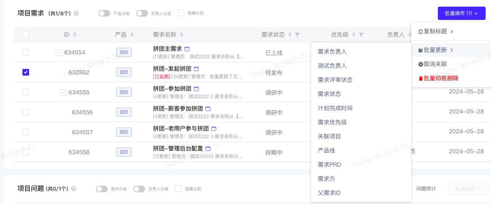  

进行批量操作，批量修改弹窗：  

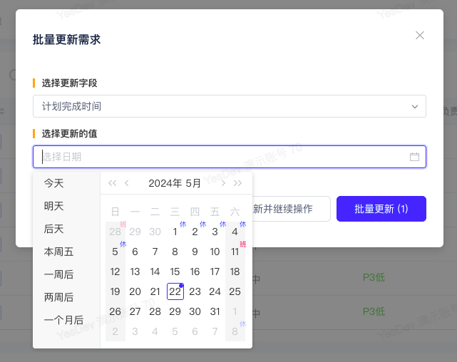

## 延期提醒设置
除了项目的需求延期自动提醒外，也可以针对单个重要、核心的需求设置单个需求的延期提醒。  

在需求详情页-【设置】-【开启 延期提醒】-【设置 延期 X 天提醒】，其中，X天为负数是表示距离计划完成日期提前X天提醒；反之是在计划完成日期过去后X天提醒。 

  

## 需求导出
针对需求池列表需求导出，可以选择【列表字段】或【全部字段】导出的形式。项目列表/问题列表/任务工时查询列表，同理。
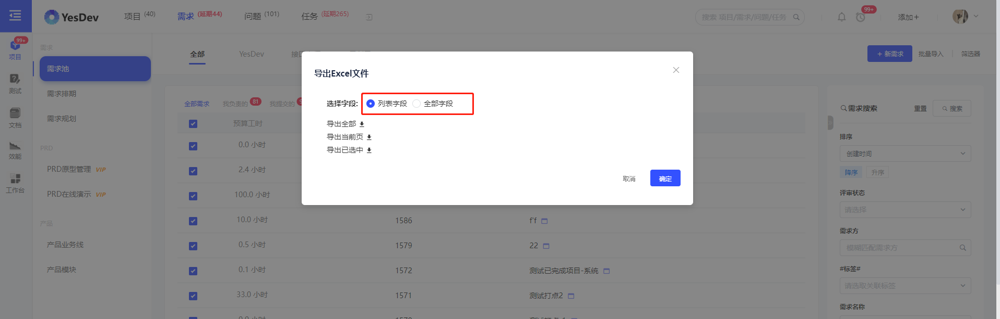

此外，对于需求的管理、协同和流转，更好的方式是推荐使用项目的方式，统一进行管理和推进。  

请继续阅读下一章———— 

# 演示视频

## 项目需求管理
操作演示：在项目中快速添加新需求、指派需求给负责人，以及在项目协作中流转需求、完成需求，以需求的批量操作，和按负责人分组查看各自负责的需求。  

[演示视频](https://yesdev.oss-cn-shenzhen.aliyuncs.com/video/yesdev-2024-07-31-093625.mp4 ':include :type=video controls width=100%')

## 需求池管理

操作演示：如何管理你的需求池？  

添加我的新需求，查看需求详情。回到需求池查看全部需求，快速切换各个产品线的需求池，查看：我负责的需求、我创建的需求、我测试的需求、抄送给我的需求。个性化自己需要查看的需求列表字段和搜索习惯。导出需求Excel，以及对需求的批量操作。

[演示视频](https://yesdev.oss-cn-shenzhen.aliyuncs.com/video/yesdev-2024-07-31-095701.mp4 ':include :type=video controls width=100%')

## 需求流程配置

操作演示：如何配置自己需要的需求开发流程？

自定义添加或删减需求流转状态，设定需求状态名称、颜色偏好，指定需求状态流转顺序和前进节点、后退节点，指定需求状态修改权限。  

[演示视频](https://yesdev.oss-cn-shenzhen.aliyuncs.com/video/yesdev-2024-07-31-100839.mp4 ':include :type=video controls width=100%')

