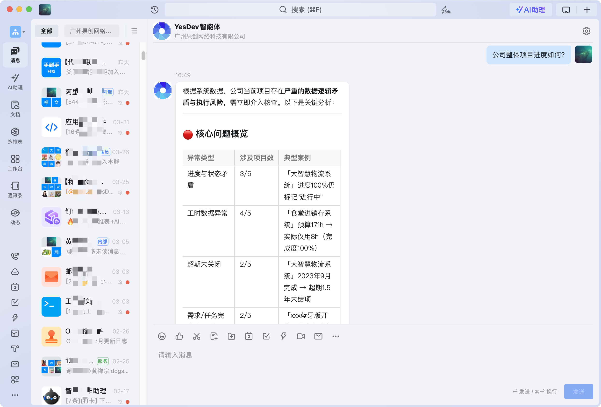
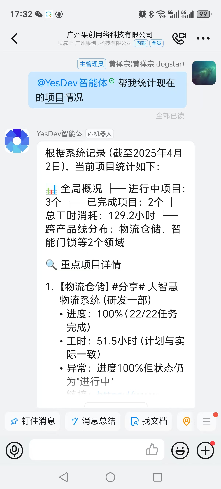

# 钉钉AI项目管理智能体（仅限私服定制）

您可以在YesDev项目管理平台，拥有属于自已企业的智能体应用，并将YesDev项目数据和项目资料集成到应用中，解决您的项目管理难题。由YesDev，基于DeepSeek提供的钉钉AI项目管理智能体，有以下好处和优势：

 + 1、私有领域知识问答

YesDev将为您的公司，准备好项目资料、需求列表、任务工时、问题缺陷、文件文档以及项目变更等知识库文件，通过结构化的数据进行训练，以便你能拥有企业专属的私有项目资料库。可以回答内部项目管理的相关问题。

 + 2、个性化钉钉聊天机器人

在钉钉机器人聊天中，拥有长期记忆功能，可以保存关键的历史对话信息，为您提供个性化的聊天体验，并且使用方便、办公顺畅、体验感强！

 + 3、老板专用或权限控制

钉钉AI机器人，可以灵活分配权限给老板、员工或其他负责人，让你的项目数据权限高度可控。

## AI单聊：钉钉电脑端体验效果

例如，提问：“公司整体项目进度如何？”，或者“张三在负责哪些项目？”。

  

## 内部群聊：手机钉钉提问AI效果

你也可以在内部钉钉群，对 AI智能体机器人 进行随时提问。

  

## 如何搭建：企业自己的钉钉AI项目管理智能体？

请联系我们，进行专属的搭建。
