# 如何在钉钉添加YesDev

在企业办公过程中，为了方便在钉钉中访问已经的系统或应用，可以通过在钉钉中添加自己的企业应用，方便快速找到，进行高效办公。

## 用电脑操作：在钉钉中添加自己的应用

1、在PC版的钉钉中，左侧菜单下方，找到【应用】，并点击打开。  

2、添加精品应用  
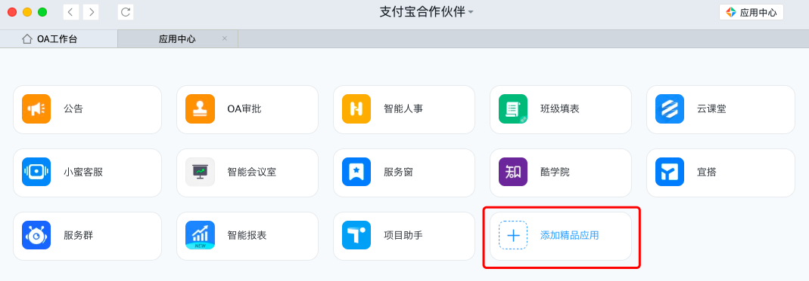  

3、菜单底部，管理应用 - 进入管理后台

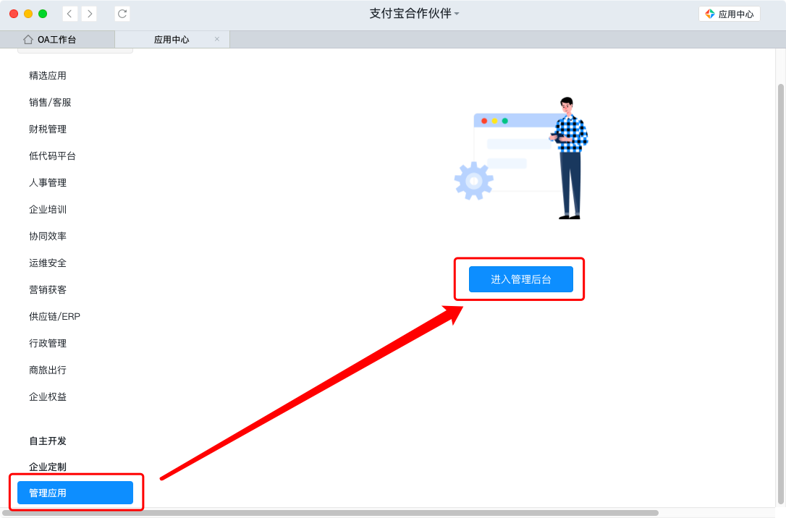  

如果企业还没认证，请先按指引认证。认证通过，会收到短信通知。

4、切换到工作台

  

然后，找到自建应用，添加 自建应用。
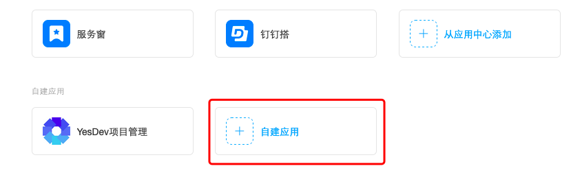  

5、应用开发 - 企业内部开发 - 创建应用 - H5微应用

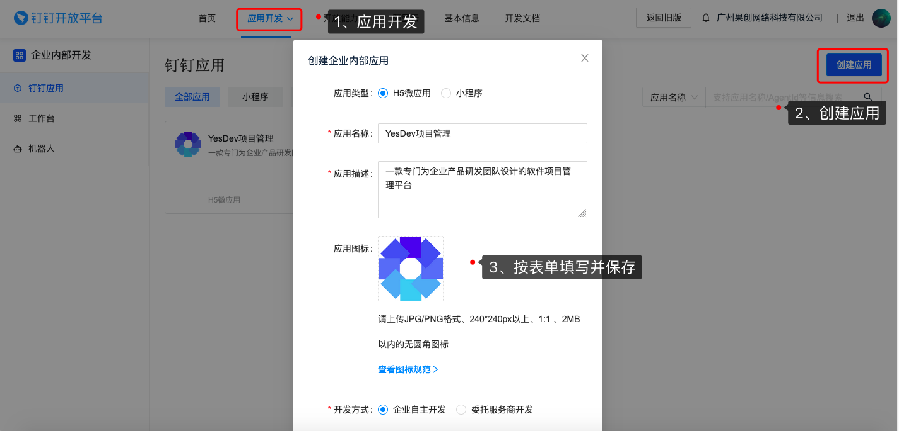  

6、创建企业内部应用

可以按以下表单填写（保存后依然可以继续修改）：  
 + 应用类型：H5微应用
 + 应用名称：YesDev项目管理
 + 应用描述：一款专门为企业产品研发团队设计的软件项目管理平台
 + 应用图标：[点击下载Logo图片](./img/yesyesapi_20211221150211_e54f22d2fa1569d327ee94a7781c6087.jpg)  
 + 开发方式：企业自主研发

成功创建后，将会获得类似以下的应用：  
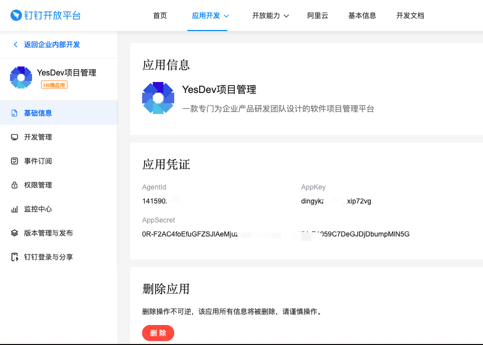  

7、开发管理 - 切换到 快捷链接 - 填写自己的系统网址，保存。

例如，YesDev项目管理的网址是：https://www.yesdev.cn/

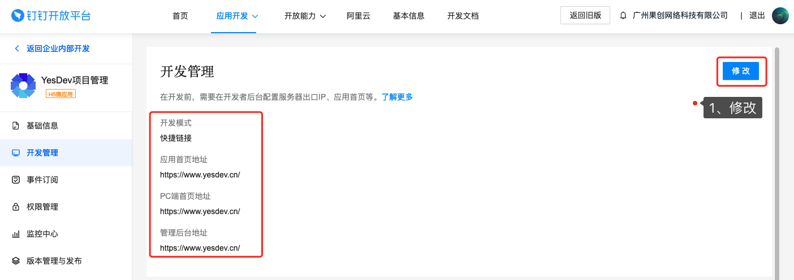  

按以下表单，填写并保存。  

 + 开发模式：快捷链接
 + 应用首页地址：https://www.yesdev.cn/
 + PC端首页地址：https://www.yesdev.cn/
 + 管理后台地址：https://www.yesdev.cn/

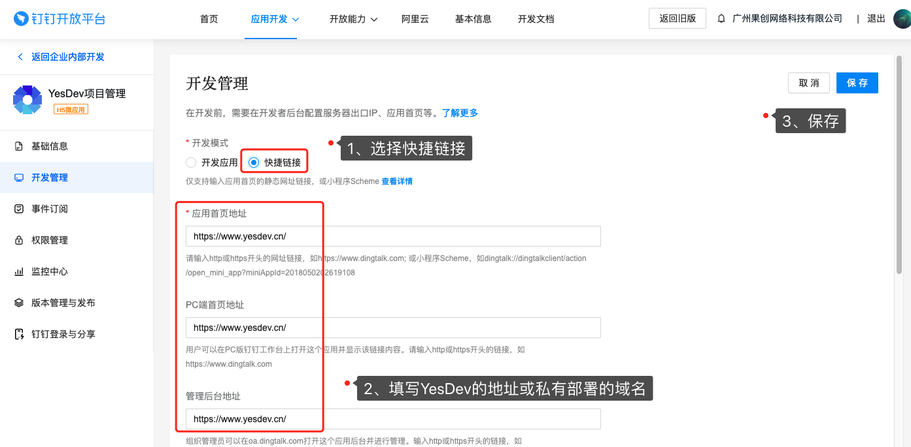  

8、版本管理与发布，进行发布，并配置权限为：全部员工

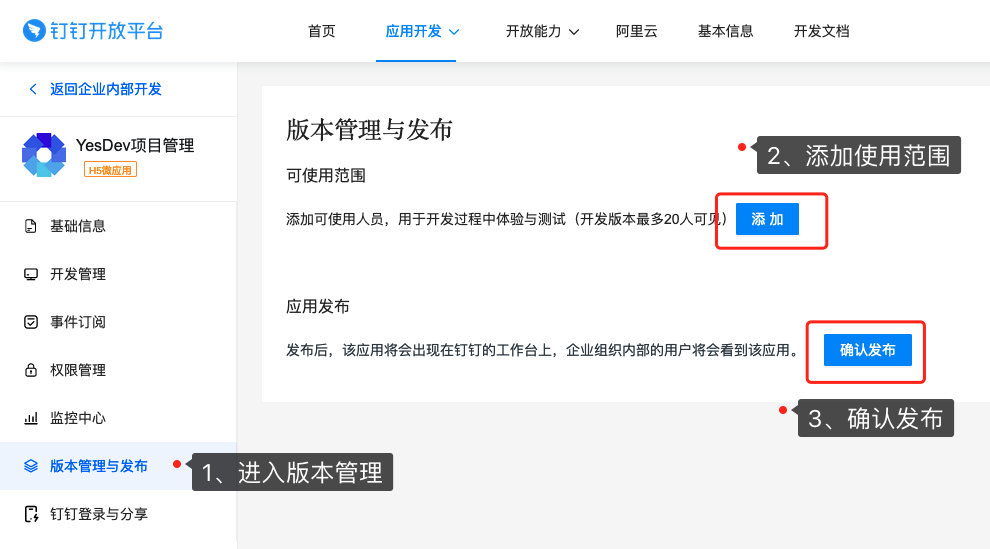  

发布时，选择：全部员工。  
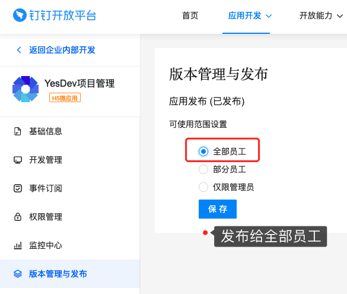  

到这里，自己的系统网站就配置好了，但需要在手机钉钉上展示，还需要进行以下步骤。

## 使用手机操作：在钉钉上管理应用

通过前面的配置，在手机钉钉上已经是可以找到刚才自己添加的应用，但隐藏很深，不好找。例如：

你可能会在【未分组】里面找到YesDev应用。  

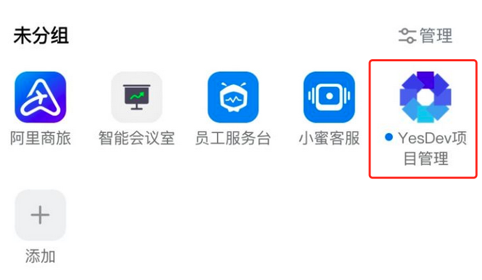  

为了让YesDev应用，显示在工作台的首页，可以点击相应分类右边的【管理】。进去后，点击里面的【+号】。

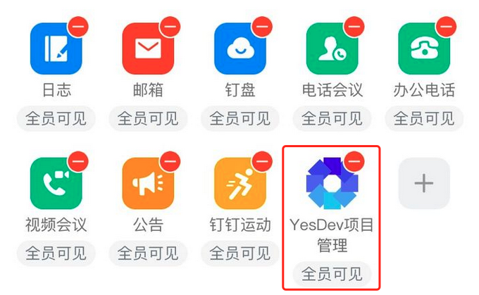  

在里面，找到自己刚才添加的应用，点击【添加】。

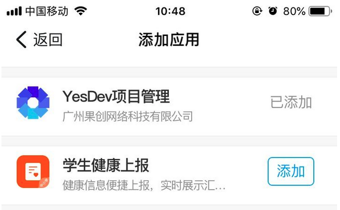  

例如，在【协助效率】里面，添加【YesDev项目管理】。

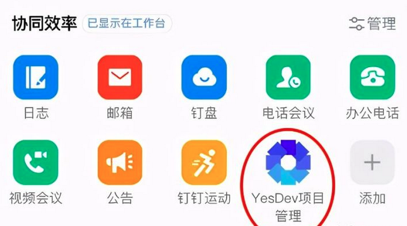  

如果你想在最前面的位置 ，可以在【全员】中进行管理，添加。  
配置好后，就可以开始访问和使用啦！

