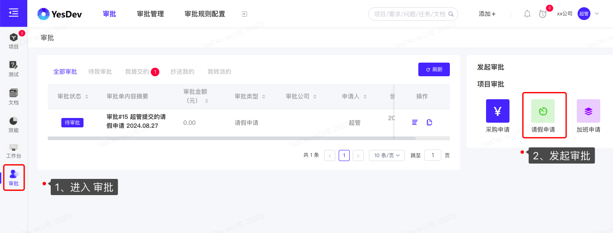
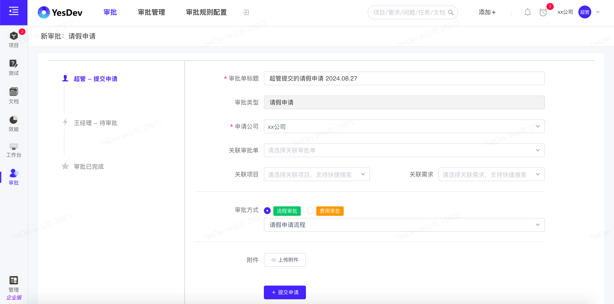
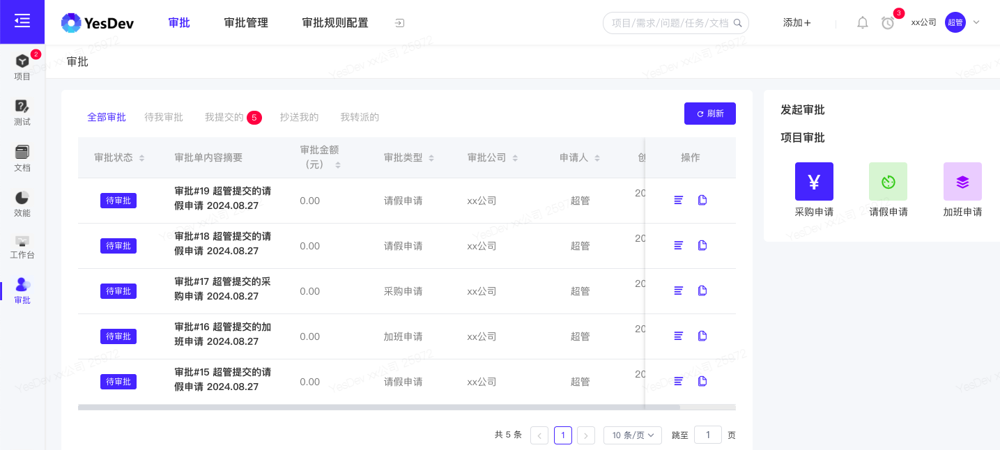
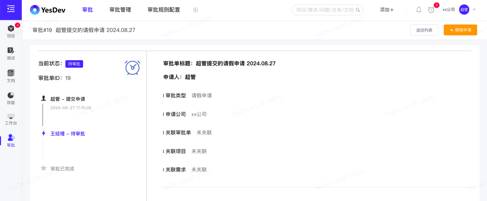
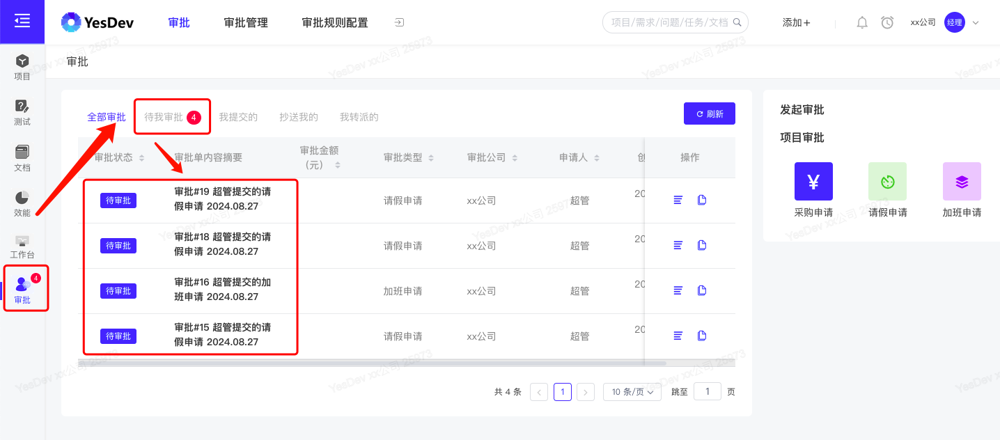
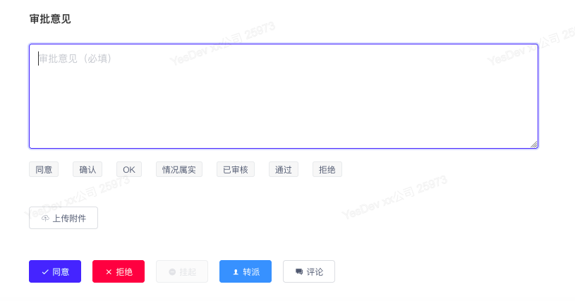
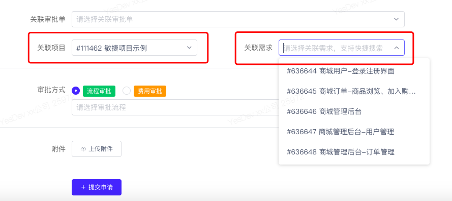
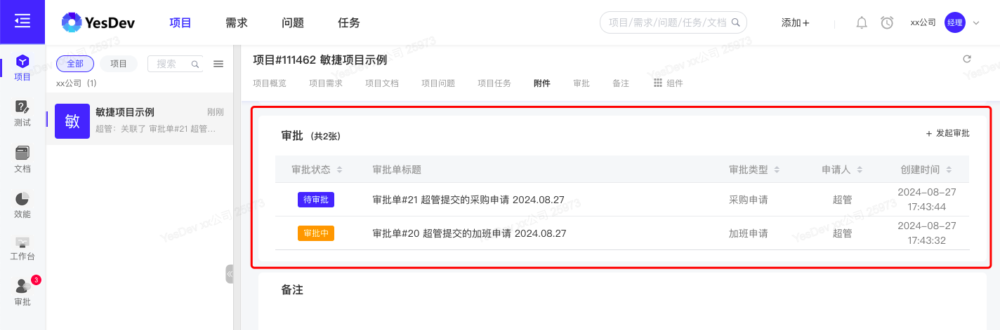
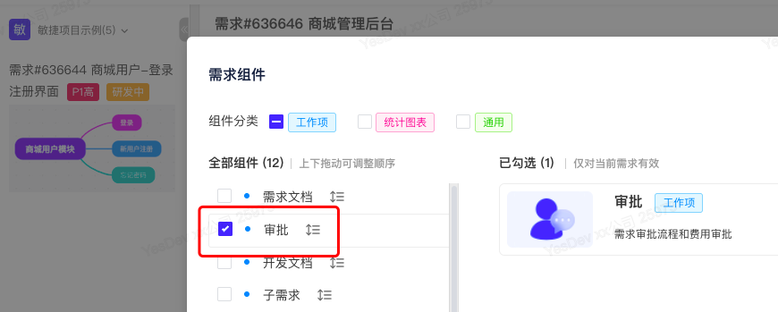
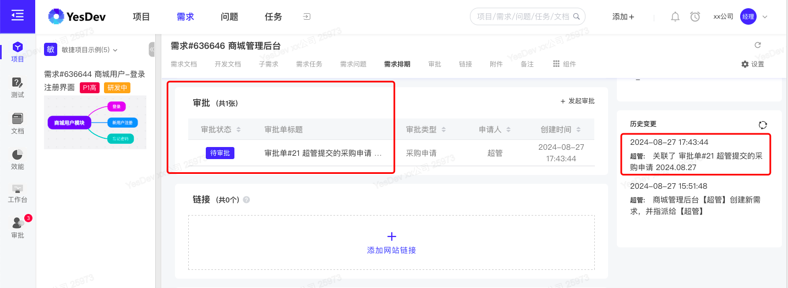

# 7.1 审批流程

> 温馨提示：需要先开通【企业版】，才能使用【审批】应用。  

# 审批适用场景

YesDev提供了流程审批，适用场景：针对流程类的审批，以及针对费用的审批。

 + **流程审批**  

流程类审批，主要针对指定预设好的审批流程进行发起、审批和抄送。  

 + **费用审批**  

费用审批，可用于项目费用、采购费用、研发费用、奖金提成、付款单等与费用相关的流程审批。  

 + **审批特点**

YesDev审批，有以下特点：  

 + 支持自定义审批流程    
 + 支持自定义审批表单、和自定义字段控件  
 + 支持审批人员设置，以及审批抄送人员设置  
 + 支持审批单关联到项目、和关联到需求  
 + 支持审批通知推送  
 + 支持审批单Excel导出  
 + 支持审批发起权限分配  

# 发起审批

员工账号，进入【审批】，在【发起审批】，选择需要发起的审批流程。  

  

进入【发起审批】界面后，根据审批表单提示，填写审批表单，然后【提交申请】。  

  

## 查看我的审批

重新进入【审批】，可以看到我的审批，包括：我发起的审批、抄送给我的审批。 

  

## 查看审批单进度、撤回

点击审批单，可以查看审批单的详情、审批进度，以及进行撤回操作。  

  

# 审批流转（同意/拒绝/转派）

作为上级或相关领导，进入YesDev 审批，可以查看自己待审批的审批单数，点击查看审批单，即可进行在线快速审批。  

  

除了 同意审批，也可以：拒绝、转派、评论。  

      

# 审批通知

审批通过后，系统将会邮件自动通知下一位审批人员，全部审批通过后，将会自动通知发起人。  

# 项目审批和需求审批

在发起审批单时，可以选择关联到项目，和关联需求，以便进行项目审批和需求审批。  

如下图：  

  

## 项目审批

在项目开启【审批】组件，且审批单关联后项目的效果：     

  

对应的项目历史记录：   
  

## 需求审批

在需求开启【审批】组件，  

  

审批单关联到需求后的效果，以及对应的需求历史记录。  

   

# 演示视频

操作演示：员工发起审批流程/费用审批，以及如何流转审批单，支持关联项目和关联需求。    

[演示视频](https://yesdev.oss-cn-shenzhen.aliyuncs.com/video/yesdev-2024-08-27-183041.mp4 ':include :type=video controls width=100%')

