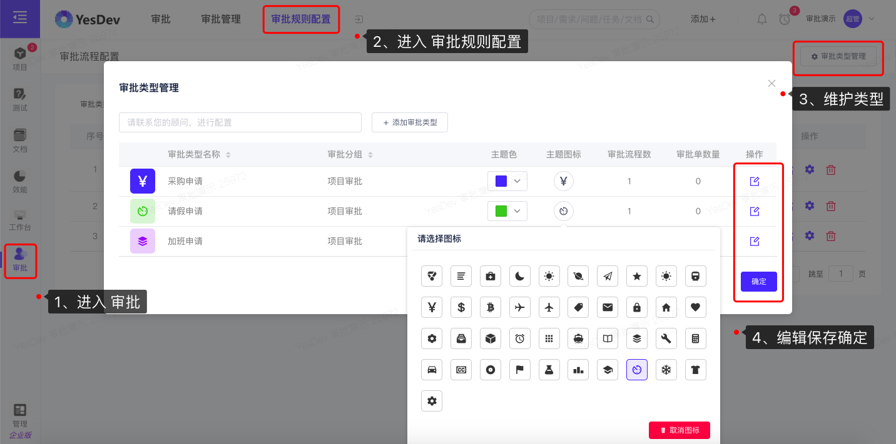
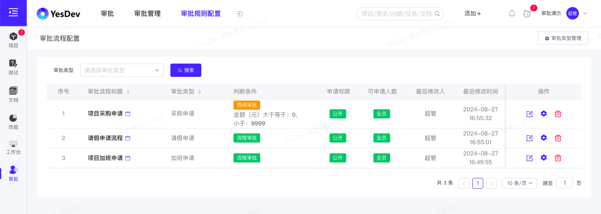
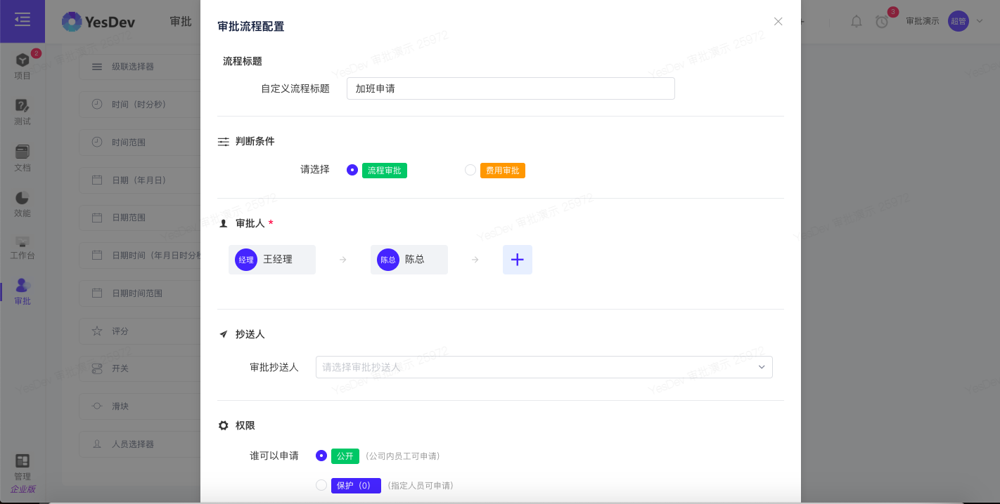
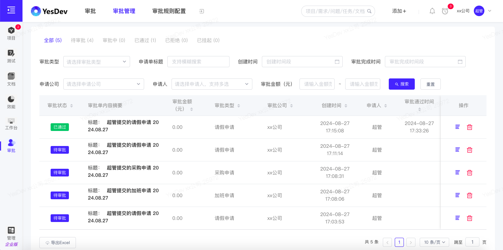
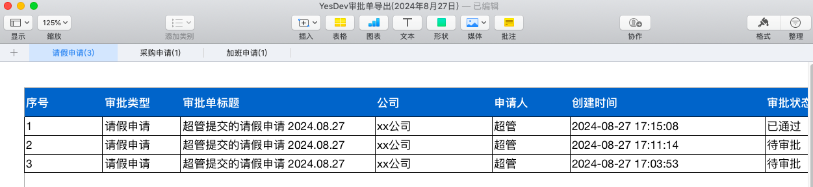

# 7.2 审批管理

> 温馨提示：需要先开通【企业版】，才能使用【审批】应用。

本章节适合企业管理员阅读。  

# 审批规则配置

> 温馨提示：在开始使用审批前，请先进行审批规则的后台配置。  

## 审批类型管理

使用企业管理员账号，依次进入【审批】-【审批规则配置】-【审批类型管理】。  

新增审批类型后，可继续维护编辑：审批分组、审批图标和颜色。  

  

创建审批类型后，请继续进行进行具体审批流程的配置。  

维护和设置好的审批流程、规则，类似如下：  

  

员工前台看到的审批入口，类似如下：  

  

## 审批流程管理

使用企业管理员账号，依次进入【审批】-【审批规则配置】- 修改，可以进入到审批流程管理界面，进行以下设置：  

 + 审批表单自定义字段配置  
 + 审批流程配置  

其中，在自定义字段配置，支持以下控件：  

 + 单行输入框
 + 多行输入框
 + 数字输入框
 + 单选项选择器
 + 多选项选择器
 + 下拉列表选择器
 + 级联选择器
 + 时间（时分秒）
 + 时间范围
 + 日期（年月日）
 + 日期范围（起始日期）
 + 日期时间
 + 日期时间范围
 + 评分
 + 开关
 + 滑块
 + 人员选择器

通过上述控件，可以灵活在线定制企业需要的审批表单。  

  

其次，在审批流程配置，支持两种审批方式：  
 + 支持：员工手动选择的 流程审批  
 + 支持：自动根据金额判断的 费用审批  

   

对于审批流程配置，可以设置：  
 + 流程标题（用于前台展示）  
 + 判断条件（流程审批、费用审批，二选一）
 + 审批人（必须，多选）
 + 抄送人
 + 发起权限（公开，或保护，即指定员工可以发起）  

# 审批管理

员工发起审批后，企业管理员可以通过【审批管理】进行全部审批单的查看、管理和导出Excel。   

## 审批列表管理

使用企业管理员账号，在【审批管理】列表，可以查看全部的审批单。审批单状态主要分为：  

 + 待审批
 + 审批中
 + 审批通过 
 + 已通过
 + 已拒绝
 + 已挂起

  

## 导出审批单Excel

导出的审批单Excel，将会按审批分组汇总导出，效果类似如下：  

  

方便行政人员，快速对审批单进行分类检索和管理。  

# 演示视频

操作演示：企业管理员如何进行审批规则和流程的配置，以及行政人员如何导出审批单Excel表格数据。     

[演示视频](https://yesdev.oss-cn-shenzhen.aliyuncs.com/video/yesdev-2024-08-27-183536.mp4 ':include :type=video controls width=100%')

