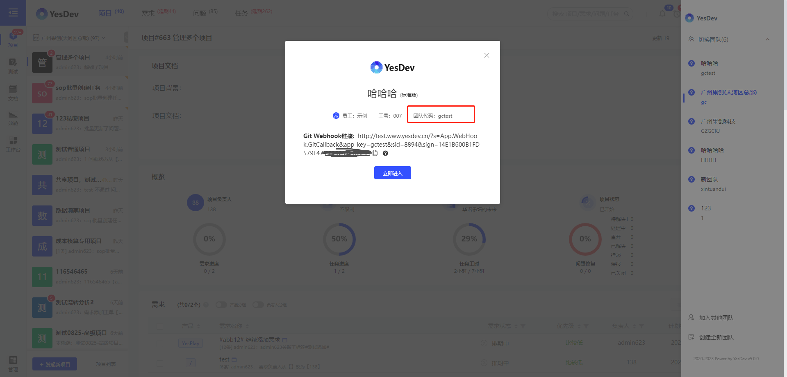
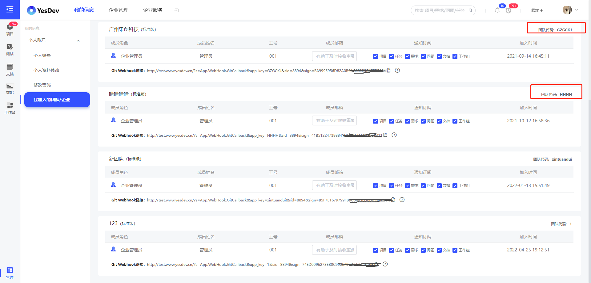

# FAQ 常见问题/联系我们

## Q1：有免费版吗？  
YesDev支持免费使用，个人开发者或个人用户可以免费使用YesDev，长期有效。此外，10人及以内的团队，可以限时免费注册使用YesDev，不限项目数量。 

## Q2：付款方式有哪些，有发票吗？  
YesDev支持支付宝在线支付和对公转账，支持开发票，可以在下单时或下单后联系客服开具。  

## Q3：付费升级后会影响原来的项目数据吗？
不会，付费升级，只是开放更多功能权限，以及增加使用人数和延长使用时间。  

## Q4：SaaS版的数据可以迁移到私有部署版本吗？
支持，但需要根据迁移的数据量收取一定的人工迁移费用。

## Q5：如何查看我的团队代码？  
团队代码是每个团队/企业/单位在YesDev协作云的唯一代码，登录YesDev后，可以查看自己团队的团队代码。  

例如，可以通过点击左上解的图标，查看和切换团队时，查看团队代码。  
  

也可以，通过点击右上角的名字 - 【我的团队】，查看我加入的团队代码。  
  

## 找不到答案？请联系我们！  

欢迎联系我们，反馈您的问题！

  

