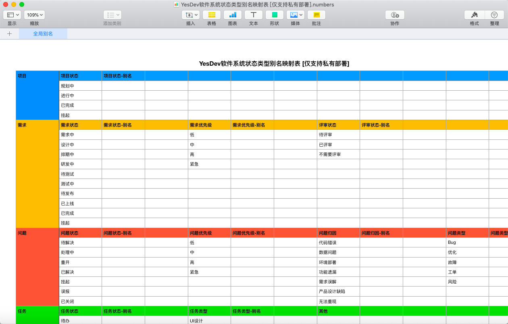
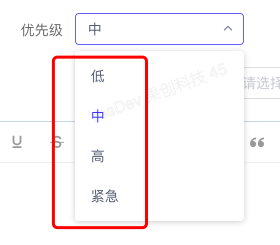

# 全局别名配置

为满足和适应企业项目管理和协同更加个性化和符合业务场景的称呼和术语，YesDev支持状态类型等别名映射。  

联系我们可获取Excel配置模板，仅支持私有部署的调整。 

# Excel配置模板预览

您只需要提供对应的别名即可，YesDev技术人员会在私有部署环境为您进行安装和更新。  

  

# 别名展示效果

配置生效后，即可在YesDev界面上查看最新的别名配置。  

   

