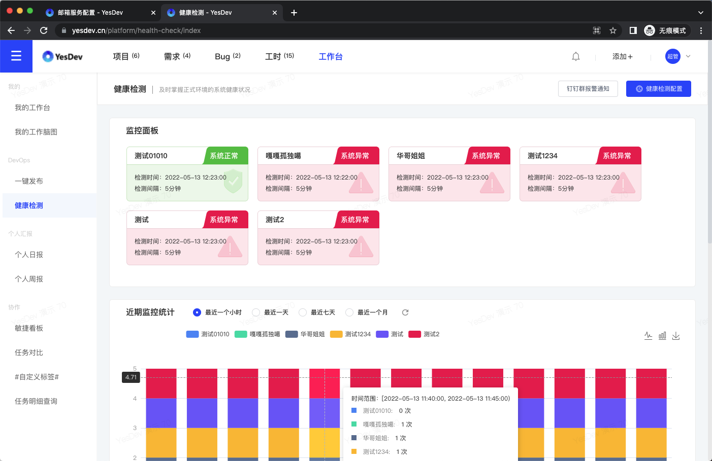

# YesDev健康检测

健康检测可用于对你的正式环境的系统，进行健康检测，以便及时掌握系统服务是否正常运行，统一检测、监控和报警。  

## 健康检测API接口 返回格式示例

健康检测API接口，可用于检测你的系统。每个后端系统可以提供一个进行健康检测的接口。对依赖的必须服务进行检测，例如数据库是否能正常连接、Redis是否正常连接等。  

模拟监控正常的接口示例：  
https://www.yesdev.cn/_health_check/  

成功时，返回格式示例：  
```
OK!
```
> 格式：最后一行以大写的```OK!```（注意最后有英文叹号）结束，前面可选添加提示信息。
> 温馨提示：请允许YesDev的IP进行访问：```120.76.246.183``` 。

失败时，返回格式示例：  
失败返回格式示例：
```
XXX数据库无法正常连接
ERROR!
```
> 格式：最后一行以大写的```ERROR!```（注意最后有英文叹号）结束，前面可选添加错误提示信息。

## 健康接入配置

接入时，只需要填写：  
 + 你的系统名称
 + 你的健康检测链接
 + 定时检测频率，可以是：每5分钟、每10分钟、每15分钟、每30分钟、或每60分钟  

## 健康监控实时统计

  

## 健康异常通知推送

通过配置，可以使用钉钉群来接收异常监控的实时通知推送。  


