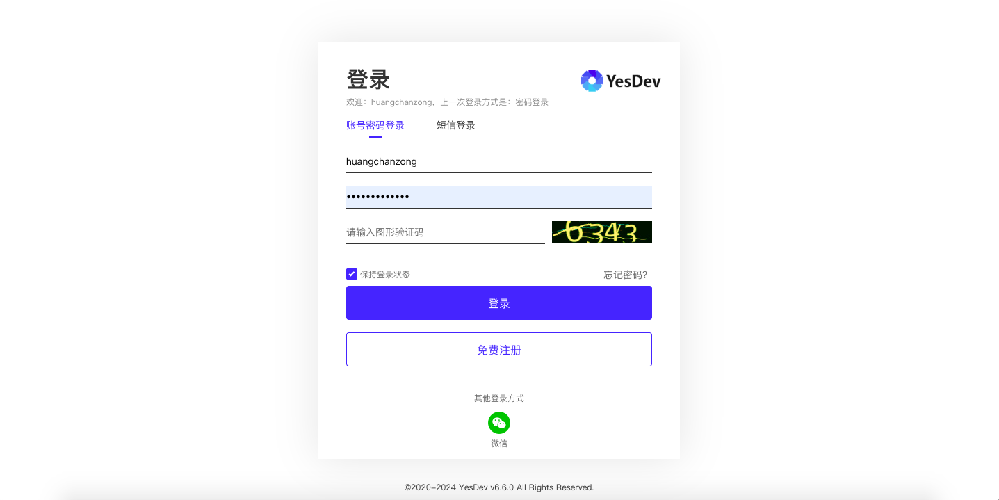
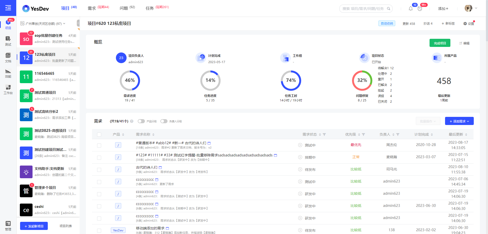

# 1.1 创建新企业、团队或组织

## 1.1.1 创建企业、团队或组织

对于企业私有部署版本，我们将会在完成安装和私有部署后，为您提供初始的企业管理员账号和密码。  

对于SaaS在线版，

 + 如果你是个人用户，可以通过 手机号/微信/或其他第三方方式 [快速登录](https://www.yesdev.cn/platform/login)；  
 + 如果你是企业管理员，可以联系我们 [免费开通企业账号](https://www.yesdev.cn/platform/register) 。  
 

如需免费开通企业账号，你需要提供以下信息：

 - 1、团队/企业名称：企业、团队或组织名称；  

 - 2、企业管理员账号：创建企业的同时会开通一个企业管理员账号，拥有最高权限，用于管理整个企业；  

 - 3、手机号：可选，用于找回密码或快速登录；  

 - 4、邮箱：可选，，推荐使用企业邮箱，可以用于找回密码和接收重要通知。  

> 免费开通YesDev企业账号：[https://www.yesdev.cn/platform/register](https://www.yesdev.cn/platform/register)  

## 1.1.2 SaaS版临时体验账号

临时体验账号：demo / 123456  

## 1.1.3 登录

完成企业创建，你就可以用管理员账号进行登录。

  

[【点击马上去登录】](https://www.yesdev.cn/platform/login)  
 

## 1.1.4 开始项目管理与协作

成功登录后，即可进入项目管理，开始团队协作。

  

此时，你可以通过新建一个示例项目来熟悉YesDev的初步使用，以及浏览项目、需求和问题等。并且开始邀请你的第一位团队成员加入，一起协作项目。  

## 演示视频

操作演示：YesDev注册、登录，选择企业团队，进入项目管理后，查看和快速切换项目，最后退出登录。

[演示视频](https://yesdev.oss-cn-shenzhen.aliyuncs.com/video/yesdev-2024-07-31-090539.mp4 ':include :type=video controls width=100%')

