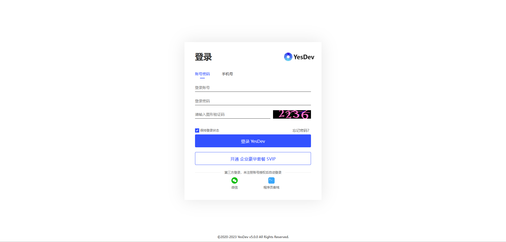
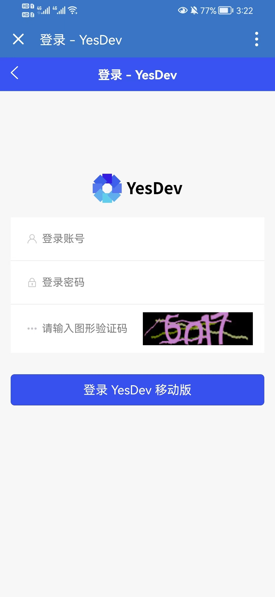

# 2.1 统一登录

> 温馨提示：请使用前，请联系您的企业管理员分配成员账号，或先创建新的团队账号。  

## 2.1.1 登录PC版

YesDev登录入口：https://www.yesdev.cn/platform/login  

  

使用自己的账号密码，进行登录。  

如果已经绑定手机号，或通过手机号注册，可以使用手机号进行登录。  

[【点击马上去登录】](https://www.yesdev.cn/platform/login)  

## 2.1.2 登录H5版

如果使用移动端，也可以通过H5进行登录从而进入H5移动版。  

  

[【点击马上去登录】](https://www.yesdev.cn/m/)  

## 2.1.3 登录微信小程序

扫码登录，YesDev微信小程序，同时查看项目。  

  

## 2.1.4 使用PC桌面客户端

目前，已提供 Windows和Mac两个版本的客户端，可下载安装后，打开使用YesDev。  

下载地址：https://www.yesdev.cn/price.html  

