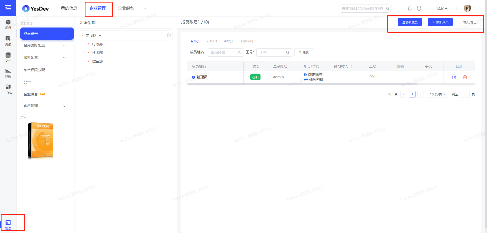
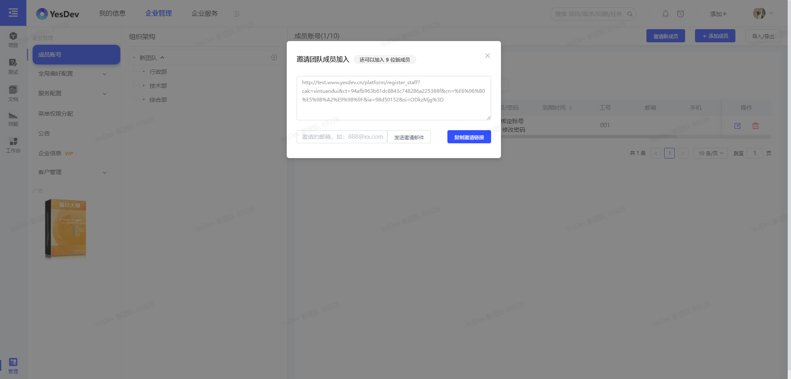
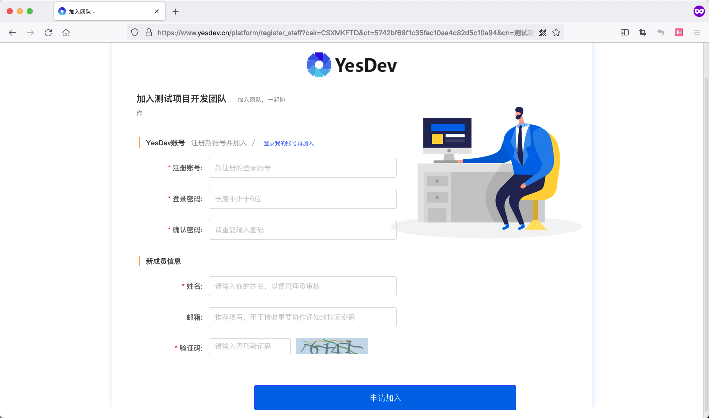
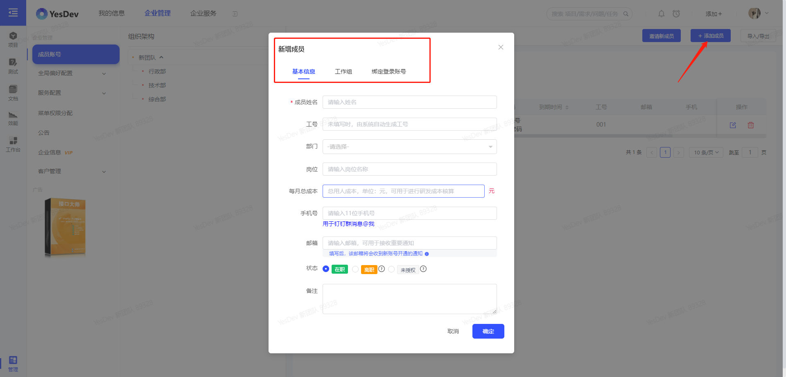
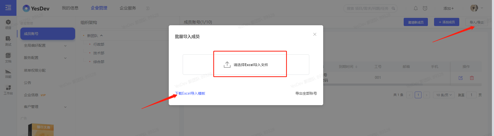
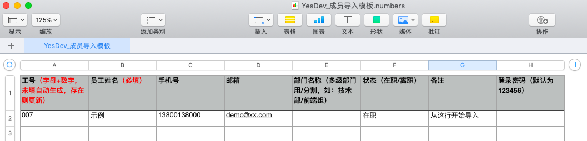
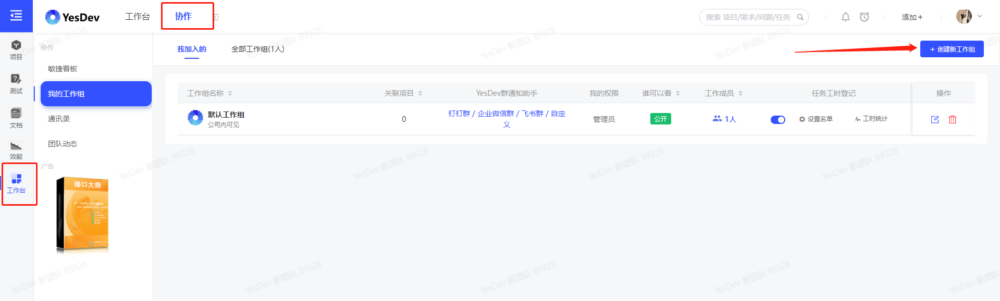
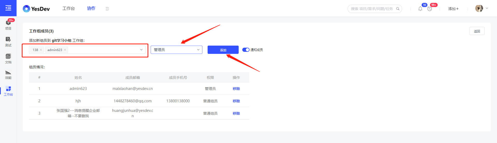

# 1.2 企业管理

当需要管理企业时，请先进入到：企业管理后台。  

    

> 💎温馨提示：只有企业管理员才能进行企业管理。  


# 1.2.1 添加团队成员账号

在YesDev成功注册新团队后，接下来就是需要把团队成员添加进来。添加成员的方式有：  

 + 方式1：邀请注册  
 适合新员工入职或新人加入。管理员和普通成员均可操作。    

 + 方式2：后台录入  
 后台手动单个添加，适合新员工入职，或添加内部账号。仅限管理员操作。

 + 方式3：批量导入  
 后台用Excel批量导入，适合首次使用和账号迁移或导入。仅限管理员操作。

## 方式1：邀请成员注册

登录YesDev之后，不管是企业管理员还是团队成员，都可以通过【邀请成员】，邀请新成员加入项目管理。  

  

复制邀请内容类似如下：  

> 【YesDev邀请注册】用电脑打开以下链接，可加入团队一起协作项目  
> https://www.yesdev.cn/platform/register_staff?cak=CSXMKFTD&ct=5742bf68f1c35fec10ae4c82d5c10a94&cn=%E6%B5%8B%E8%AF%95%E9%A1%B9%E7%9B%AE%E5%BC%80%E5%8F%91%E5%9B%A2%E9%98%9F&ia=c68b4d1c&si=NjkwMQ%3D%3D  


复制链接给成员注册，成员注册页如下：  
  

成员注册成功后，即可立即登录使用。  


> 如何撤销成员加入？  
> 企业管理员，如需撤销成员加入，可以进入成员账号，编辑成员，将成员状态从【在职】改为【未授权】。  


## 方式2：后台添加新成员

如果你是企业管理员，可以通过【进入企业管理】-【企业管理】-【组织架构】-【添加成员】，进行新成员的手动添加。  

在添加新成员的弹窗，根据表单提示，填写即可。添加后，仍然可以修改。可放心添加。

  

添加后，新账号即可生效使用。  

## 方式3：批量导入成员

在上述【添加成员】页面，可以通过【导入】进行批量的账号导入。导入前，推荐先设置组织架构，并且根据Excel导入模板录好数据。  

  

Excel导入模板类似如下：  

  

## 演示视频

操作演示：添加内部员工账号、设置登录账号和随机密码，创建成功后员工即可登录使用。    

员工账号创建成功后，可快速复制账号信息给员工。类似：  

```
YesDev-演示账号 ：https://www.yesdev.cn
姓名：黄工
登录账号：黄工
登录密码：QQbN4V（登录后可以自己修改）
```

[演示视频](https://yesdev.oss-cn-shenzhen.aliyuncs.com/video/yesdev-2024-07-31-091523.mp4 ':include :type=video controls width=100%')

# 1.2.3 创建工作组

为了方便团队成员进行项目协作和管理，推荐根据自己团队和项目的需要，创建工作组。  

进入【工作台】-【协作】-【工作组】-【创建新工作组】。  

  

你可以为工作组设置不同的访问权限以控制哪些成员可以看到哪些项目，以及添加工作组的成员和角色。  

  


至此，企业管理员需要的基本操作已完成。 

## 演示视频

操作演示：创建新的工作组，添加工作组成员，以及设置工作组群通知机器人，可以绑定到：企业微信、钉钉或飞书等工作聊天群。  

[演示视频](https://yesdev.oss-cn-shenzhen.aliyuncs.com/video/yesdev-2024-07-31-092114.mp4 ':include :type=video controls width=100%')

