# 客户通知反馈

# 场景介绍
在项目推进和实施过程中，当有需求完成或需要给甲方客户定期或不定时的进度反馈时，可以就单个具体的需求，通过邮件、短信或其他方式向YesDev系统外部的用户进行反馈。  

同时在YesDev上可以维护和项目有关的企业客户、外部联系人，以及此前和需求关联的反馈记录，可以随时翻查、调取和查阅、导出。  

# 前台使用效果

进入到指定需要向客户反馈的需求详情页，先在【更多 - 需求模块】添加显示【客户反馈记录】。随后，通过【+ 添加反馈信息】，可以给外部客户的联系人进行快速反馈。  

在【反馈信息 - 邮件】表单弹窗，在【选择联系人】下拉列表可以快速选择已经在后台录入好的联系人，支持多选。如果是临时的联系人，或未在后台录入的，则可以在【更多收件人】手动填入需要追加发送的邮箱地址。  

考虑到，同时发送给多个不同企业的客户时，为避免信息的保密起见，发送邮件时可以选择【分开发送】，此时，YesDev系统会针对每个邮箱收件人分开独立进行发送。  

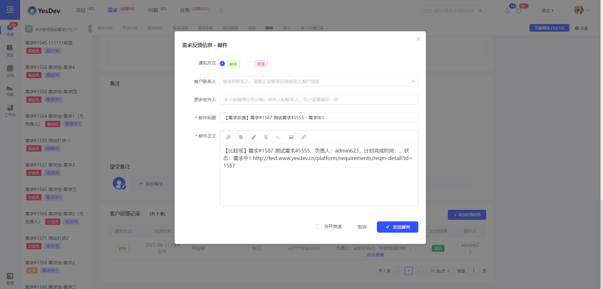  

短信通知发送，和邮件操作类似。发送完毕后，可以在需求详情页查看过往和当前需求有关的反馈记录和发送结果。  

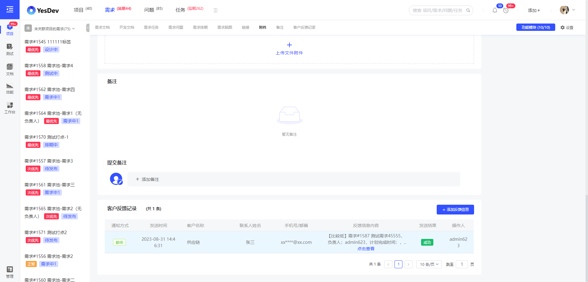  

# 客户接收效果  

例如，短信通知的效果类似：  

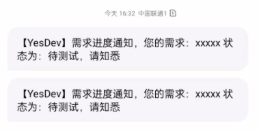

邮件通知效果，类似：  

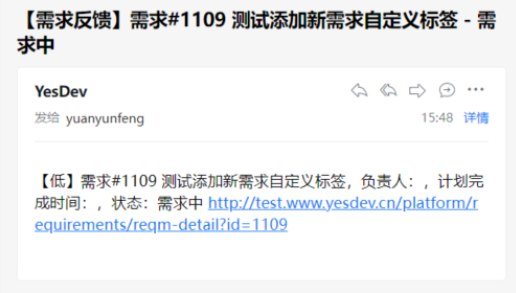  

# 企业管理后台

## 客户名单管理

在进行客户反馈前，需要企业管理员，提前在企业管理后台录入客户信息和客户联系人。一家企业客户，允许有多个客户联系人。    

### 录入客户
使用企业管理员账号，进入【企业管理后台 - 客户管理 - 客户名单管理】，可以查看和管理已有的客户名单。  

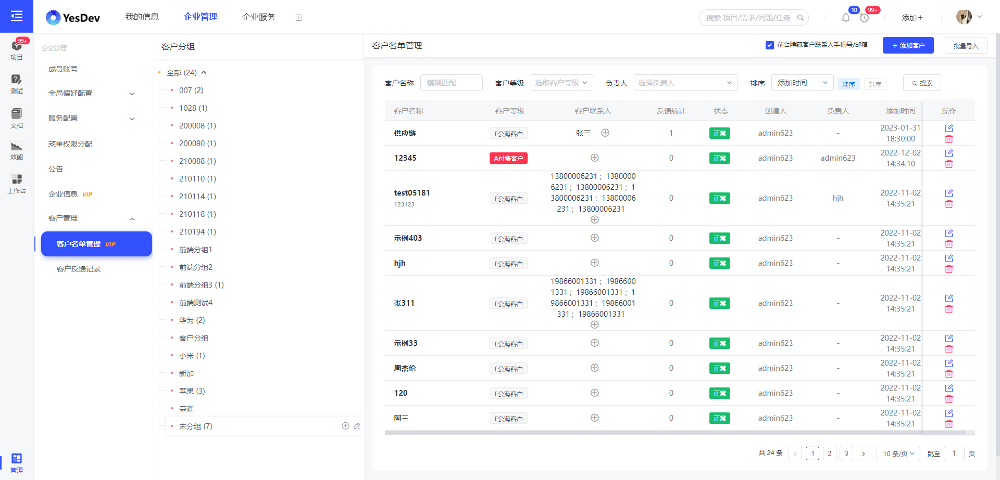  

点击【+ 添加客户】，可以快速添加新客户，支持客户分组、客户等级设置、进行客户备注等。其中，当状态为【隐藏】时，前台将不会显示。  

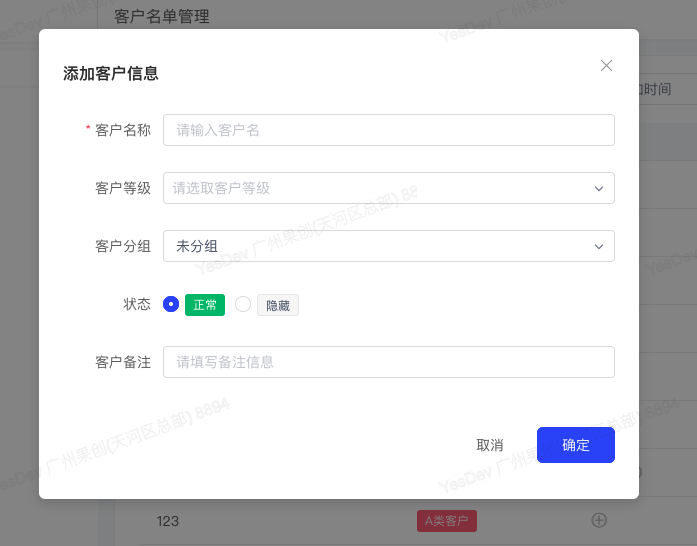  

### 添加客户联系人

添加客户后，可以继续添加客户联系人。  

一家客户，可以有多个联系人，联系人可以填写职务、邮箱、手机号等。同样，【隐藏】的客户联系人，将不会在前台展示。  

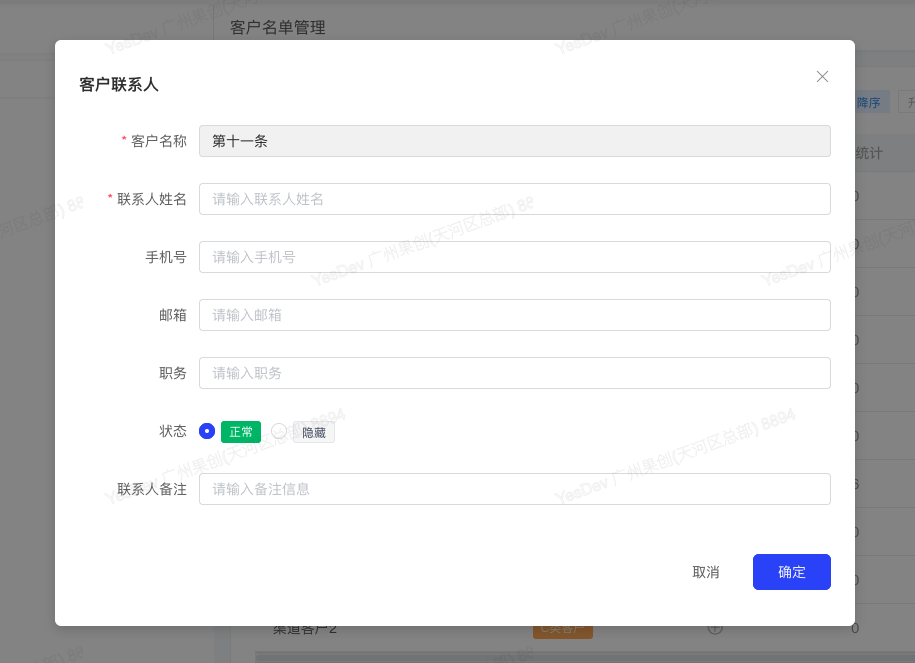  

点击客户名称，可以进入客户详情页，进行更多信息的查看和统计显示。  

> 温馨提示：勾选【前台隐藏客户联系人手机号/邮箱】后，前台将会对手机号或邮箱进行星号省略展示。  

## 客户反馈记录

为方便回查给客户发送和反馈的记录信息，可以使用企业管理员账号，进入【客户反馈记录】进行列表的查看、搜索、过滤、导出等操作。  

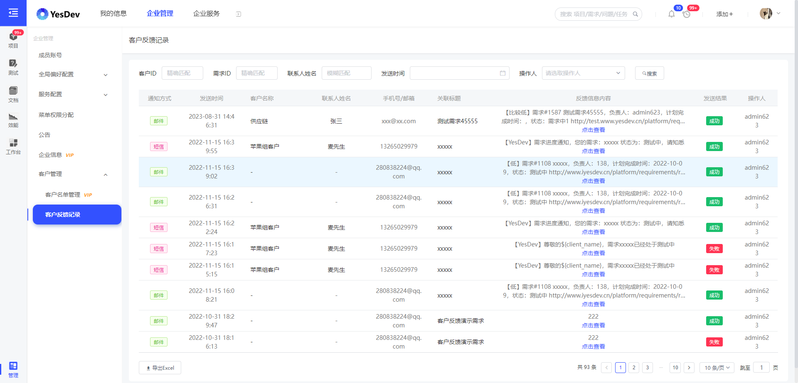  

Excel导出效果，类似：  
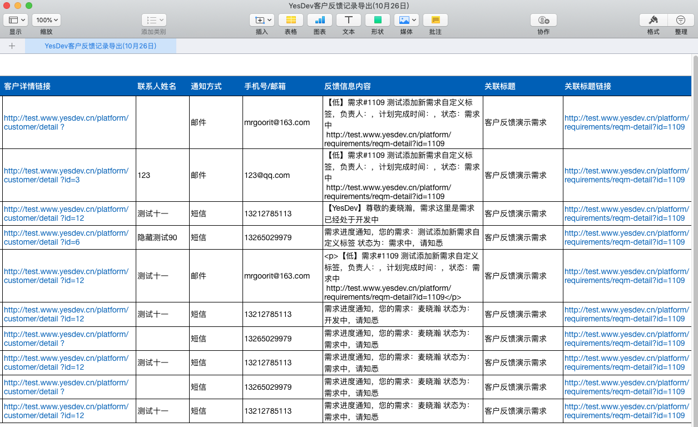  

# 通知方式

目前，YesDev支持两种常用的通知方式，通过手机号发送简短的文本短信、以及通过邮箱发送详细的图文邮件。  

## 短信通知

通过短信通知，只需要有客户的手机号，就能进行发送和反馈。使用前，需要企业管理员进入【YesDev管理后台 - 服务配置 - 短信服务配置】，配置阿里云短信服务，以及录入需要用到的短信模板和签名。  

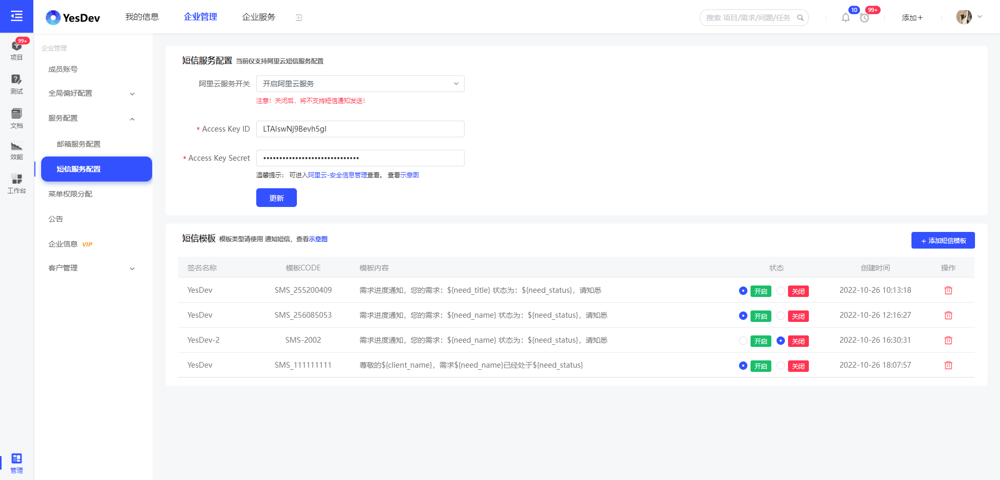  

在添加短信模板时，需要先在阿里云提交创建，审核通过后再同步录入到YesDev。为方便使用，YesDev会提供一些系统推荐的变量，例如：客户名称client_name、需求标题need_name。  

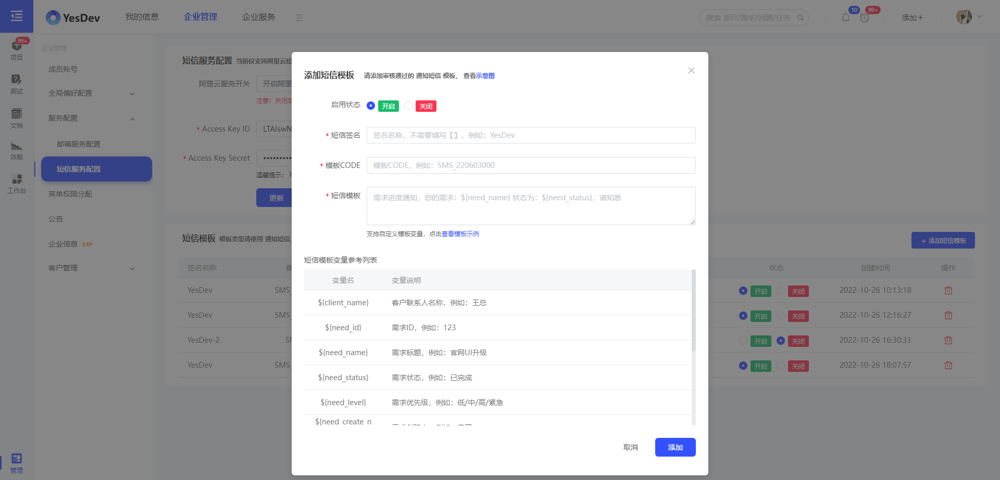 

更进一步，为了减少烧脑想通知文案的痛苦，我们也准备了一些短信模板。例如：  

 + 尊敬的${client_name}，您的需求#${need_id}：${need_name} 已记录，计划完成时间：${need_finish_date}，创建人：${need_create_name}  
 + 需求进度通知，您的需求：${need_name} 状态为：${need_status}，请知悉  
 + 需求进度通知，您的需求：${need_name} 当前进度为：${need_percent}，请知悉  
 + 需求验收通知，您的需求#${need_id}：${need_name} 已完成，请及时验收  
 + 抱歉，您的需求#${need_id}：${need_name} 没有通过审核，处理人：${need_charge_name}，有问题可随时联系我们  
 + ${client_name}您好！您的需求 ${need_name} 即将进入开发阶段，请及时支付费用，以免影响开发进度  

可以根据需要，复制使用，或加以修改，或作为灵感模板参考。   

## 邮件通知

使用邮件通知，则可以在【YesDev管理后台 - 服务配置 - 邮箱服务配置】进行设置。  

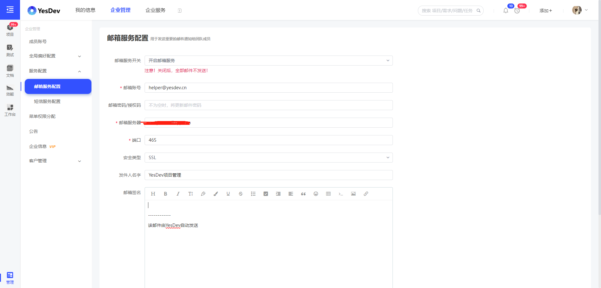  

到此，客户通知反馈的主要使用介绍完毕。  

