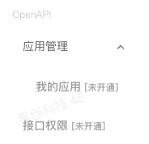
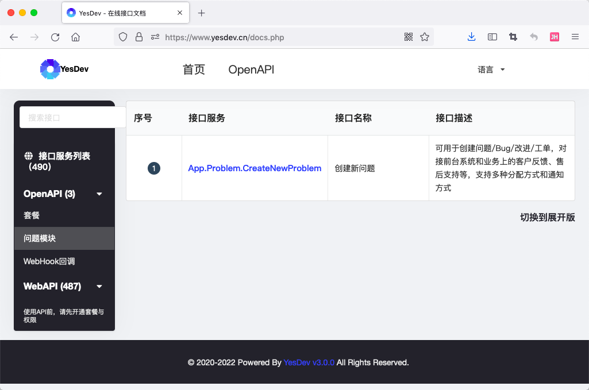
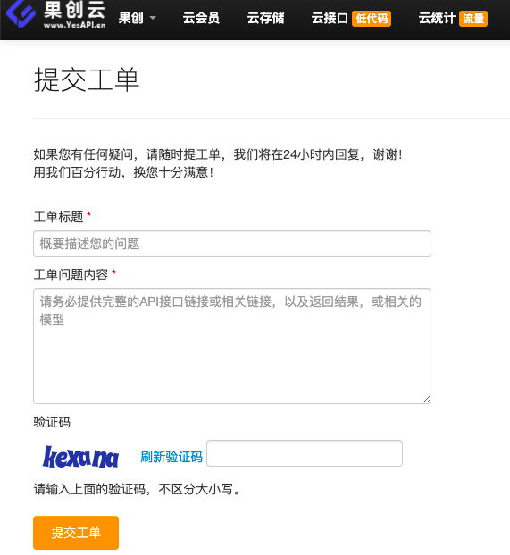
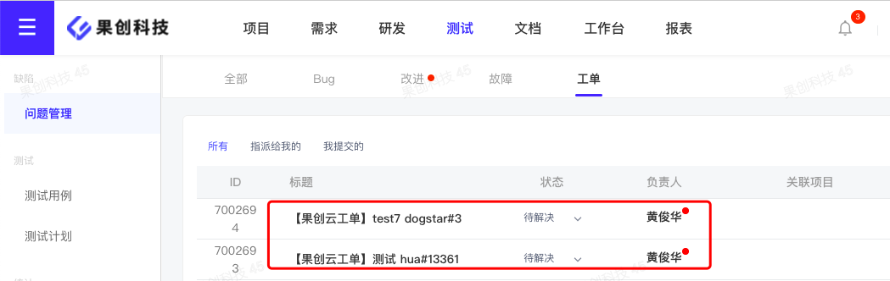

# YesDev开放接口的接入


## 开通OpenAPI接入权限
默认情况下，OpenAPI接口权限是未开通的，如需要使用，请先联系我们开通OpenAPI使用权限。  
  

## OpenAPI在线接口文档
请访问：[https://www.yesdev.cn/docs.php](https://www.yesdev.cn/docs.php)  

  


## 接入方式
使用HTTP协议接入，GET或POST方式，开放接口的域名及路径是：  
```
https://www.yesdev.cn/api/app.php
```

公共参数是：  
 + **s**：需要调用的接口服务名称，如：```s=App.Problem.CreateNewProblem```  
 + **app_key**：团队代码，如：```app_key=YesDev```  
 + **sign**：签名，请联系我们获取加密算法，如：```sign=02358FF5577E8DFBC155034974AD0D45```  

请求示例：  
```
https://www.yesdev.cn/?s=App.Problem.CreateNewProblem&app_key=XXXX&sign=02358FF5577E8DFBC155034974AD0D32&problem_title=题标题&problem_content=问题内容
```

返回示例及结构：  
```
{
    "ret": 200, // 200表示请求成功
    "data": { // 业务数据，不同接口字段不同
        "problem_id" => 33,
        "problem_url" => "https://www.yesdev.cn/platform/problem/problemDetail?id=33"
    },
    "msg": "" // 错误提示信息
}
```

## 接入场景及示例

下面以把业务系统的工单和YesDev的工单进行关联，以构建自己的技术工单业务处理流程。   

## 所用到的OpenAPI接口  

 + [创建新问题接口](https://www.yesdev.cn/docs.php?service=App.Problem.CreateNewProblem&detail=1&type=fold)  

## 业务系统的工单界面

例如，在业务系统，用户可以通过业务系统提交工单。其提交界面如下：  
  

用户在业务系统通过界面提交工单后，可以在服务器后端调用OpenAPI接口，例如：  
```
https://www.yesdev.cn/?s=App.Problem.CreateNewProblem&app_key=XXXX&sign=02358FF5577E8DFBC155034974AD0D32&problem_title=题标题&problem_content=问题内容
```

## 在YesDev的浏览效果

接下来，研发团队就可以在YesDev进行问题的跟踪和流转了。  

  


