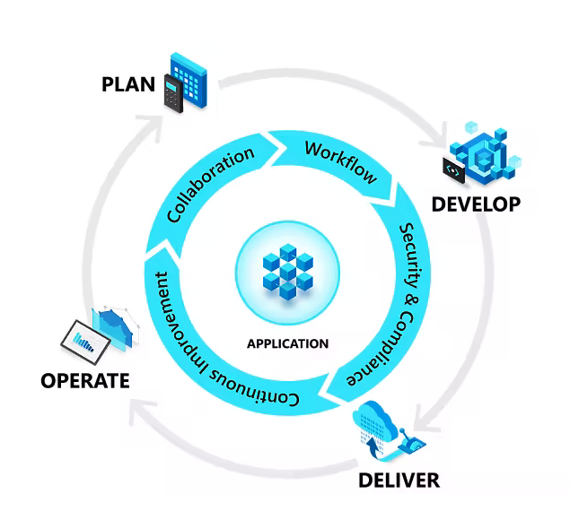

# 什么是DevOps？

> 声明：我们不是知识的创造者，我们只是知识的搬运工。—— YesDev  

了解 DevOps 如何统一人员、流程和技术，以更快地为客户提供更好的产品。  

# DevOps定义

DevOps定义：  

> DevOps（英文 Development 和 Operations 的组合）是一组过程、方法与系统的统称，用于促进开发（应用程序/软件工程）、技术运营和质量保障（QA）部门之间的沟通、协作与整合。
  
DevOps definition： 

> A compound of development (Dev) and operations (Ops), DevOps is the union of people, process, and technology to continually provide value to customers.  

## DevOps对团队意味着什么？ 

DevOps 使以前孤立的角色（开发、IT 运营、质量工程和安全）能够进行协调和协作，以生产更好、更可靠的产品。通过采用 DevOps 文化以及 DevOps 实践和工具，团队能够更好地响应客户需求，增强对他们构建的应用程序的信心，并更快地实现业务目标。  

## DevOps的好处

采用 DevOps 文化、实践和工具的团队将变得高绩效，更快地构建更好的产品，从而提高客户满意度。这种改进的协作和生产力对于实现以下业务目标也是不可或缺的：  

 - 加快产品发布上线的时间  
 - 更好地适应市场和竞争  
 - 保持系统稳定性和可靠性  
 - 缩短平均恢复时间  

## DevOps流程  

DevOps 在整个计划、研发、交付和运营阶段都影响着整体的流程。每个阶段都依赖于其他阶段，并且这些阶段不是特定于角色的。在真正的DevOps文化中，每个角色都在某种程度上参与每个阶段。  

  

计划|开发|交付|运营  
---|---|---|---
在计划阶段，DevOps团队一起构思、定义和描述他们正在构建的应用程序和系统的特性和功能。它们以低粒度和高粒度级别跟踪进度 —— 从单个产品任务到跨多个产品组合的任务。创建backlogs、跟踪缺陷、使用Scrum 进行敏捷开发、使用看板和仪表板把进度可视化。|在开发阶段，包括编码的所有方面（编写、测试、代码审查和集成团队成员的代码），以及将该代码构建到可部署到各种环境中的构建工件中。DevOps团队寻求在不牺牲质量、稳定性和生产力的情况下快速创新。为此，他们使用高效的工具，自动执行日常和手动步骤，并通过自动化测试和持续集成的方式进行增量迭代。|交付是以一致且可靠的方式将应用程序部署到生产环境中的过程。交付阶段还包括部署和配置构成这些环境的完全的且受管控的基础架构。|运营阶段涉及在生产环境中维护、监视和排查应用程序故障。在采用 DevOps 实践时，团队致力于确保系统可靠性、高可用性，并在加强安全性和治理的同时实现零停机时间。DevOps 团队力求在问题影响客户体验之前识别问题，并在问题发生时快速缓解问题。保持这种警惕需要丰富的预测、监控报警以及对应用程序和底层系统的完全洞察。  

## DevOps团队文化  
虽然采用DevOps实践可以通过技术自动化和优化流程，但这一切都始于组织内部的文化以及参与其中的人员。培养 DevOps 文化的挑战需要深刻改变人们的工作和协作方式。但是，当组织致力于DevOps文化时，他们可以为高绩效团队创造发展环境。  

 - **协作、可见性和一致性**  

健康的DevOps文化的一个标志是团队之间的协作，这始于可见性。开发和IT运营等不同的团队必须相互共享其DevOps 流程、优先级和关注点。这些团队还必须共同计划工作，并就与业务相关的目标和成功衡量标准始终保持一致。  

 - **职责的转变**  

随着团队的协调，他们获得所有权并参与其他生命周期阶段，而不仅仅是那些对其角色至关重要的阶段。例如，开发人员不仅要对开发阶段建立的创新和质量负责，还要对他们在运营阶段的变化带来的性能和稳定性负责。同时，IT 运营肯定会在规划和开发阶段包括治理、安全性和合规性。   

 - **缩短发布周期**  

DevOps团队通过在短周期内发布软件来保持敏捷性。更短的发布周期使规划和风险管理更容易，因为进度是渐进的，这也减少了对系统稳定性的影响。缩短发布周期还使组织能够适应不断变化的客户需求和竞争压力并做出反应。  

 - **持续学习**  

高绩效DevOps团队建立成长型思维模式。他们快速失败，并将学习融入到他们的流程中，不断改进，提高客户满意度，并加速创新和市场适应性。DevOps是一个旅程，因此充满成长的空间。  

# GitOps
什么是GitOps？  

> GitOps是一种正在流行的DevOps最佳实践。它结合了基础设施即代码(IaC)，版本控制系统(通常是Git，例如[YesDev Git集成与注释规范](https://www.yesdev.cn/help/#/webhook) )，持续集成/持续交付(CI/CD)，将Git仓库作为声明基础设施和应用代码的唯一事实来源，并通过Pull Request(PR)来自动化地管理基础设施的开发和部署，并对整个过程的状态变化进行持续监控，审计等。  

# ChatOps

> ChatOps 是指由对话驱动的开发。 将工具植入到对话当中，使用被关键插件和脚本改良过的聊天机器人（例[YesDev钉钉群机器人](https://www.yesdev.cn/help/#/platform_chatops?id=%e9%92%89%e9%92%89%e7%be%a4%e6%9c%ba%e5%99%a8%e4%ba%ba%e9%85%8d%e7%bd%ae)），团队能够自动执行任务和协作，效果更好、成本更低、速度更快。  

# DevOps成熟度模型

GitHub 解释版：  

 - 临时（Ad-hoc） —— 新的或未记录的过程是不受控制、反应性的和不可预测的，通常是由个人驱动而没有协调或沟通。成功取决于个人英雄主义。  
 - 管理（Managed）—— 流程已部分记录在案，有可能导致一致的结果。成功取决于纪律。  
 - 已定义（Defined）—— 记录，标准化流程并将其集成到其他流程中。成功取决于自动化。  
 - 度量（Measured）—— 对过程进行定量管理。成功取决于根据业务目标衡量指标。  
 - 已优化（Optimized）—— 通过增量和创新更改，该过程正在持续可靠地得到改善。 成功取决于减少变革的风险。  

 
# 参考资料

参考资料：  
 - [What is DevOps? DevOps Explained | Microsoft Azure](https://azure.microsoft.com/en-us/resources/cloud-computing-dictionary/what-is-devops/)  
 - [GitOps: Next Big Thing in DevOps? | Atlassian Git Tutorial](https://www.atlassian.com/git/tutorials/gitops)   
 - [DevOps 原则与模式 - Ledge DevOps 知识平台](https://devops.phodal.com/pattern) 
