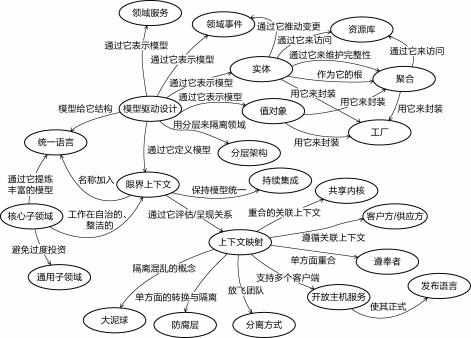
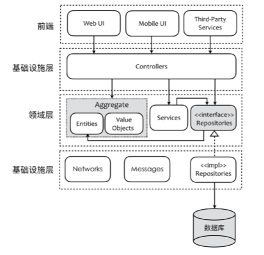
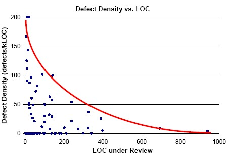
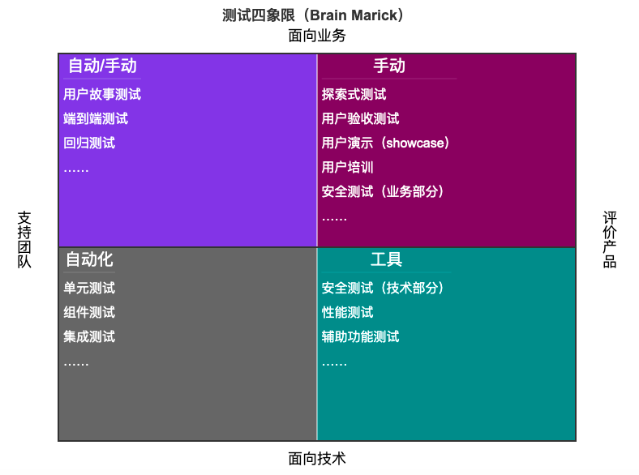

# 浅谈最佳实践

> 声明：我们不是知识的创造者，我们只是知识的搬运工。—— YesDev  

# DevOps 生命周期

需求|开发|构建|测试|部署|运维
---|---|---|---|---|---
把运维人员作为首要干系人|小团队|构建工具|自动化测试|部署工具|监控  
在开发需求时寻找他们的意见|有限的合作、单元测试|支持持续集成|用户验收测试|支持持续部署|对错误情况做出响应  

# DDD领域驱动设计  

> Domain Driven Design（简称 DDD），又称为领域驱动设计，起源于Eric Evans的书籍《领域驱动设计—软件核心复杂性应对之道》。  

领域驱动设计元模型：  

  

DDD的战术建模包括如下内容：

 + 实体-Entity
 + 值对象-Value Objects
 + 领域服务-Domain Services
 + 领域事件-Domain Events
 + 模块-Modules
 + 聚合-Aggregate
 + 资源库-Repository

DDD分层架构，例如：前后端的解耦。  
  


# 需求故事原则  

Bill Wake 提出了一个好用户故事的验收标准——INVEST 模型，它由六个单词的首字母组成，分别是

 + Independent：每个用户故事应该是独立的，不会和其他用户故事产生耦合
 + Negotiable：并不会非常明确的阐述功能，细节应带到开发阶段跟程序员、客户来共同商议
 + Valuable：每一个用户故事的交付都要能够给用户带来用户价值
 + Estimable：不需要能够准确的估计，但需要能辅助客户排定优先级
 + Small：要小一点，但不是越小越好，要大小合适，可以更容易的圈定故事范围
 + Testable：需要能够进行验收测试，最好能把 Test Case 提前加进去

# 测试驱动开发

> TDD 是测试驱动开发（Test-Driven Development）的英文简称，是敏捷开发中的一项核心实践和技术，也是一种设计方法论。TDD 的原理是在开发功能代码之前，先编写测试用例代码，通过测试代码确定编写什么产品代码。  

编写单元测试的 FIRST原则：  

如 Robert C. Martin 在《代码整洁之道》所说的那样，好的测试应该是：  

 + 快速（Fast），测试应该够快。
 + 独立（Indendent），测试应该相互独立。
 + 可重复（Repeatable），测试应当可在任何环境中通过。
 + 自足验证（Self-Validating），测试应该有布尔值输出。
 + 及时（Timely），测试应该及时编写。

## XUnit  

 - [PHPUnit 中文网](http://www.phpunit.cn/)，PHPUnit是一个面向PHP程序员的测试框架    
 - [JUnit 5](https://junit.org/junit5/)，一个Java语言的单元测试框架  


# Git Hooks

Git 钩子列表：  

```bash
applypatch-msg     post-merge         pre-auto-gc        prepare-commit-msg
commit-msg         post-receive       pre-commit         push-to-checkout
post-applypatch    post-rewrite       pre-push           update
post-checkout      post-update        pre-rebase
post-commit        pre-applypatch     pre-receive
```

注释提交规范：  

 + build: 影响构建系统或外部依赖关系的更改（示例范围：gulp，broccoli，npm）
 + ci: 更改我们的持续集成文件和脚本（示例范围：Travis，Circle，BrowserStack，SauceLabs）
 + docs: 仅文档更改
 + feat: 一个新功能
 + fix: 修复错误
 + perf: 改进性能的代码更改
 + refactor: 代码更改，既不修复错误也不添加功能
 + style: 不影响代码含义的变化（空白，格式化，缺少分号等）
 + test: 添加缺失测试或更正现有测试

# 持续集成

如《Jenkins 权威指南》一书指出，持续集成需要几个不同的阶段

 + 阶段一：无构建服务器
 + 阶段二：夜间构建
 + 阶段三：夜间构建 + 自动化测试
 + 阶段四：加入度量指标
 + 阶段五：更认真地对待测试
 + 阶段六：自动化验收测试和自动化部署
 + 阶段七：持续部署

## 持续集成基本纪律

 + 构建失败后，不要提交新的功能代码（仅限于修复）
 + 提交前，在本地运行所有的提交测试
 + 等持续集成测试通过后，再继续工作
 + 回家之前，构建必须处于成功状态（CI 红不过夜）
 + 时刻准备着回滚到前一个版本（CI Master）
 + 在回滚之前，要规定一个修复时间
 + 为自己导致的问题负责

## 自动化部署策略

来自《Java 持续交付》中对不同策略的特点及代码总结：  

|单目标部署|    一次性全部部署| 最小服务部署|   滚动部署|   蓝/绿部署|  金丝雀部署  
---|---|---|---|---|---|---  
整体复杂度| 低| 低| 中| 中| 中| 高  
服务中断|   是| 是| 否| 否| 否| 否
新旧版本混合|   否| 否| 是| 是| 否| 是  
回滚过程|   重新部署之前的版本| 重新部署之前的版本| 停止更新，重新部署之前的版本|   停止更新，重新部署之前的版本|   将流量切回原来的版本|    停止金丝雀实例  
部署中的基础设施支持|   健康检查|   健康检查|   路由变更、健康检查| 路由变更、健康检查| 路由变更、健康检查| 路由变更、加权路由、健康检查  
监控要求|   基础|   基础|   简单|   简单|   简单|   高级  

# code review
> 代码评审是对计算机源代码的系统检查（有时称为同行评审）。  


来源：《深入核心的敏捷开发》  

 - 代码回顾（code review）  
  - 目的：学习 vs 挑错  
  - 重点：  
    - 代码 vs 作者  
    - 习惯 vs bug  
    - 模式 vs 反模式  
  - 注意：  
    - 整洁代码 vs 我的写法  
    - 整洁代码 vs 重新设计  
  - 形式：  
    - 随机摄取代码（当天编写的）  
    - 每日一次，每次半小时以内，每次回顾 200~300 行代码 

注意事项：

 1. 60 ~ 90 分钟后，发现错误的能力急降。
 2. 在每小时审查 400~500 行代码的时候，发现缺陷的效率下降

  

# 测试管理

由 Biran Marick基于当时流行的思想提出的测试四象图：  

  

## 用例设计方法

 + 等价类：某个输入域的子集合，集合内各值对于程序来说是等价的
 + 边界值：等价类的边界值和边界附近值
 + 因果图：各输入间有约束关系，列出输入和输出，得出因果图
 + 判定表：有因果图得出判定表，精简判定表
 + 正交表：将不同因素的水平组合列成表格
 + 错误推测：根据经验进行错误推断来设计测试
 + 场景分析：根据实际用户使用场景来设计测试    

## 用例设计原则

 + 基于需求：用例设计是为了验证需求
 + 场景化：基于场景设计测试用例
 + 原子化：一个测试用例只验证一个测试点
 + 可判定：应有预期结果，可判断通过或不通过
 + 正交：用例验证部分需正交，不重叠验证
 + 独立：用例之间相互独立
 + 可回归：用例可回归，且多次回归应有稳定一致的结果

## 缺陷分类

 + 遗留。前一个版本未解决而遗留下的问题
 + 需求。在需求分析环节出现的问题
 + 设计。在构建和设计环节出现的问题
 + 代码编写。在代码编写环节出现的问题
 + 测试环境。在搭建或准备测试环境时出现的问题
 + 测试。测试中发生的问题（如运行故障等）
 + 重复。已经报告过的问题
 + 非问题。由于用户误触界面或者功能所产生的问题
 + 其他。其他无法分类的问题，例如硬件问题等。 

# 技术债务  

技术债务类似于金融债务，软件开发就像是“贷款”，技术债务是它的“利息”，“利息”是需要未来额外的时间偿还的。  

技术债治理的四条原则（[《技术债治理的四条原则》](https://insights.thoughtworks.cn/managing-technical-debt/)）：  

 + 核心领域优于其他子域
 + 可演进性优于可维护性
 + 明确清晰的责任定义优于松散无序的任务分配
 + 主动预防优于被动响应

# 重构

> 重构（名词）： 对软件内部结构的一种调整，目的是在不改变软件可观察行为的前提下，提高其可理解性，降低其修改成本。

哪些代码需要进行重构？  

 + 神秘命名
 + 重复代码
 + 过长函数
 + 过长参数列表
 + 全局数据
 + 可变数据
 + 发散式变化
 + 散弹式修改
 + 依恋情结
 + 数据泥团
 + 基本类型偏执
 + 重复的 switch
 + 循环语句
 + 冗余的元素
 + 夸夸其谈通用性
 + 临时字段
 + 过长的消息链
 + 中间人
 + 内幕交易
 + 过大的类
 + 异曲同工的类
 + 纯数据类
 + 被拒绝的遗赠
 + 过多注释

何时重构？  

 + 添加功能时重构
 + 修补错误时重构
 + 复审代码时重构

常用重构方法请参考 Refactoring（重构）列表：  

 1. Add parameter(添加参数)
 2. Change bidirectional association to unidirectional(将双向关联改为单项)
 3. Change reference to value (将引用对象改为实值对象)
 4. Change unidirectional assocation to bidirectional(将单项关联改为双向)
 5. Change value to reference (将实值对象改为引用对象)
 6. Collapse hierachy(折叠继承体系)
 7. Consolidate conditional expression(合并条件式)
 8. Consolidate duplicate conditional fragments(合并重复的条件判断)
 9. Convert procedural design to objects(将过程化设计转化为对象设计)
 10. Decompose conditional (分解条件式)
 11. Duplicate observed data(复制“被监视数据”)
 12. Encapsulate collection (封装群集)
 Encapsulate downcast(封装“向下转型”动作)
 14. Encapsulate field（封装值域）
 15. Extract class（提炼类）
 16. Extract hierarchy （提炼继承体系）
 17. Extract interface（提炼接口）
 18. Extract method（提炼函数）
 19. Extract subclass（提炼子类）
 20. Extract superclass（提炼超类）
 21. Form template method（塑造模板函数）
 22. Hide delegate（隐藏委托关系）
 23. Hide method（隐藏函数）
 24. Inline class （将类内联化）
 25. Inline method（将函数内联化）
 26. Inline Temp（将临时变量内联化）
 27. Introduce assertion（引入断言）
 28. Introduce explaining ariable（引入解释性变量）
 29. Introduce foreign method（引入外加函数）
 30. Introduce local extension（引入本地扩展）
 31. Introduce null object（引入Null对象）
 32. Introduce prrameter object（引入参数对象）
 33. Move field （搬移值域）
 Move method(搬移函数)
 35. Parameterize method（令函数携带参数）
 36. Preserve whole object（保持对象完整）
 37. Pull up constructor body（构造函数本体上移）
 38. Pull up field（值域上拉）
 39. Pull up method（函数上拉）
 40. Pull down field（值域下降）
 41. Pull down method（函数下移）
 42. Remove assignments to parameters（移除函数的赋值动作）
 43. Remove control flag（移除控制标记）
 44. Remove middleman（移除中间人）
 45. Remove parameter（移除参数）
 46. Remove setting method（移除设置函数）
 47. Rename method（重新命名函数）
 48. Replace array with object（以对象取代数组）
 49. Replace conditionalwith polymorphism（以多态取代条件式）
 50. Replace constructor with factory method（以工厂方法取代构造函数）
 Replace data value with object(以对象取代数据值)
 52. Replace delegation with inheritance（以继承取代委托）
 53. Replace error code with exception（以异常取代错误码）
 54. Replace exception with test（以测试取代异常）
 55. Replace inheritance with delegation（以委托取代继承）
 56. Replace magic number with symbolic constant（以字面常量代替魔法数字）
 57. Replace method with method object（以函数对象取代函数）
 58. Replace nested conditional with guard clauses（以卫语句取代条件式）
 59. Replace parameter with method（以函数取代参数）
 60. Replace parameter with explicit methods（以明确函数取代参数）
 61. Replace record with data class（以数据类取代记录）
 62. Replace subclass with field（以值域取代子类）
 63. Replace temp with query（以查询取代临时变量）
 64. Replace type code with class（以类取代型别码）
 65. Replace type code with state/strategy（以state/strategy取代性别码）
 66. Replace type code with subclass（以子类取代型别码）
 67. Self encapsulate field（自封装值域）
 68. Separate domain from presentation (将领域和表述/显示分开)
 69. Separate query with modifier (将查询函数和修改函数分离)
 70. Split tempory variable(剖解临时变量)
 71. Substitue algorithm(替换你的算法)
 72. Tease appart inheritance(梳理并分解继承体系)

> 更多内容请参考由 Martin FowLer 编写的《重构，改善既有代码的设计》一书。  


# 消除浪费

软件开发的 7 种消费：  

 - 部分完成的工作。  
 - 多余的特性。『没有比生产过剩更大的浪费』—— 大野耐一  
 - 重复学习。  
 - 工作交接。  
 - 延期。  
 - 任务切换。上下文切换  
 - 缺陷。  

# 监控分层模型  

出自《DevOps 最佳实践》一书：  

 - 临近分层模型  
    - 系统监控  
        - 服务监控
            - 基础设施服务
            - 应用程序服务
        - 资源监控
            - CPU
            - 内存
            - 带宽
            - 硬盘
            - ……
        - 内建监控
            - 应用中的监控机制
        - 事件监控
            - 基础设施组件事件
            - 基础设施服务事件
            - 应用程序事件
    - 应用程序监控
        - 应用程序接口监控
            - 健康度
        - 基础设施服务监控
    - 信息系统监控
        - 信息系统 E2E 监控
        - 基础设施 E2E 监控
        - 基础设施 域监控
    - 链路监控
        - 信息流 E2E 监控
        - 业务流程 E2E 监控
        - 终端用户 E2E 监控

## APM 

APM 即应用性能管理，主要指对企业的关键业务应用进行监测、优化，提高企业应用的可靠性和质量，保证用户得到良好的服务，降低 IT 总拥有成本(TCO)。


### Apdex

> Apdex 全称是 Application Performance Index，是由 Apdex 联盟开放的用于评估应用性能的工业标准。Apdex 联盟起源于 2004 年，由 Peter Sevcik 发起。Apdex 标准从用户的角度出发，将对应用响应时间的表现，转为用户对于应用性能的可量化为范围为 0-1 的满意度评价。

Apdex 定义了应用响应时间的最优门槛为 T，另外根据应用响应时间结合 T 定义了三种不同的性能表现：

 + Satisfied（满意）：应用响应时间低于或等于 T（T 由性能评估人员根据预期性能要求确定），比如 T 为 1.5s，则一个耗时 1s 的响应结果则可以认为是 satisfied 的。
 + Tolerating（可容忍）：应用响应时间大于 T，但同时小于或等于 4T。假设应用设定的 T 值为 1s，则 4 * 1 = 4 秒极为应用响应时间的容忍上限。
 + Frustrated（烦躁期）：应用响应时间大于 4T。


Apdex 值|    颜色 |   说明
---|---|---
0.75 ≤ Apdex ≤ 1|    绿色|    表示应用、实例或事务被调用时响应很快，用户体验较满意。
0.3 ≤ Apdex < 0.75|  黄色|    表示应用、实例或事务被调用时响应较慢，用户体验一般。
0 ≤ Apdex < 0.3| 红色|    表示应用、实例或事务被调用时响应极慢，用户体验较差。

### 开源 APM

 + [PinPoint](https://github.com/naver/pinpoint) 韩国开源的一个功能完备的 APM 系统，支持 JVM 性能数据采集、服务 Trace、告警等功能。它具有应用程序无侵入的应用特性。
 + [ZipKin](https://zipkin.io/) 是 Twitter 开源的 Trace 工具，通过 Java 程序中引入客户端，可隐式拦截 Http、Thrift 等形式服务调用。
 + [SkyWalking](https://skywalking.apache.org/zh/) 是一个开源 APM 系统，为微服务架构和云原生架构系统设计。它通过探针自动收集所需的指标，并进行分布式追踪。
 + [Prometheus](https://prometheus.io/) 是一个开源的系统监控和报警工具。
 + [CAT](https://github.com/dianping/cat) 是基于 Java 开发的实时应用监控平台，为美团点评提供了全面的实时监控告警服务。
 + [Hawkular](https://www.hawkular.org/) 一个功能完备的 APM 系统，应用程序中嵌入 Hawkular 客户端，主动将采集数据通过 Http 或者 Kafka 传递给 Hawkular。

## 告警系统

各类告警架构对比（来源：https://www.ituring.com.cn/article/497377）

方案|  简述|  实时流式计划（单条）|  分布式 |状态管理（中间数据等）| 延迟 | 语言支持 |   Hadoop 整合 |  执行方式
---|---|---|---|---|---|---|---|---
现有方案（Akka + Cassandra）|  状态依赖于外部存储（Cassandra 不一定抗得住）| 支持|  不支持| 不支持，依赖外部存储 | 不好说 |Java |   没有整合  |  
现有方案改造（Akka + Redis) |状态依赖于外部存储（Redis）衍生出其它不可能的单点故障，而且开发工作量和难度大 |  支持 | 支持|  不支持，依赖外部存储|  不好说| Java  |  没有整合|    
Spark Streaming| Spark Streaming 哪里都好，就是不支持真正意义上的流式计划（单条）|    不支持（小批量）|    支持 | 有状态（RDD）  |  秒级 | Java, Scala, Python |整合得比较好 | Stage
Storm |  Storm 为流式计算而生，但是无法满足我们需要状态管理的场景，需要引入 外部存储。另外？ |  支持 | 支持|  无状态 |毫秒级| Ruby, Python, Perl, JavaScript | 整合一级|    
Flink |  流计算方面综合了上面两者的优点，且基于 pipeline 模式要优于 Spark 的 Stage 模式 |支持  |支持|  有状态，自己管理内容 | 毫秒级| Java, Scala, Python |整合非常好  | Pipelined


# 参考资料

 + [『DevOps 最佳实践』 — DevOps 实践 - Ledge DevOps 知识平台](https://devops.phodal.com/practise/devops-practise)  
 + 《领域驱动架构透析与架构解耦》-- 张逸  
 + [Thoughtworks洞见](https://insights.thoughtworks.cn/)  

