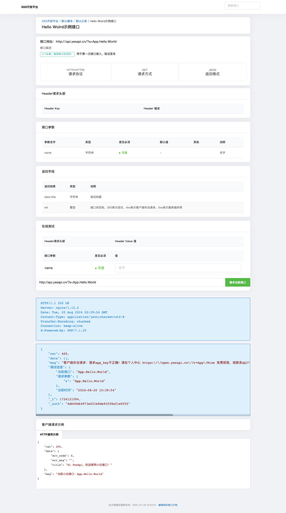

# 4.3 接口文档管理

接口文档，可用于接口项目的接口文档维护、协作和在线接口测试。  

支持：  

 + 1.维护接口文档；
 + 2.多层级目录；
 + 3.生成API接口源代码（需要配套YesApi产品使用）；  
 + 4.查看权限及高级设置;  
 5.在线接口测试和调用;  

  

# 添加新接口项目  

添加接口项目时，需要设置：  

 + 接口项目名称  
 + 接口域名（用于接口在线测试）  
 + 查看权限
   - 团队内部可见
   - 公开
   - 需要查看密码

 + 更多高级设置  
   - 接口项目介绍  
   - 公共接口参数  
   - 公共Headers  
   - 公共接口返回字段  
   - 公共异常错误码  

  

# 接口文档管理

点击【文档】-【接口文档】，可以进入到接口文档管理。  

功能支持：  
 + 接口文档库的添加、维护和切换；  
 + 添加新接口文档；  
 + 接口文档的搜索；  
 + 接口文档列表，查看、编辑和复制；  

  

# 接口文档编辑  

在接口编辑页面，可以对接口文档进行各种信息的维护。  

  

# 查看接口文档  

查看接口文档列表的效果，类似如下：  
  
   
查看具体的接口文档，以及在线接口测试。类似如下：  

  

