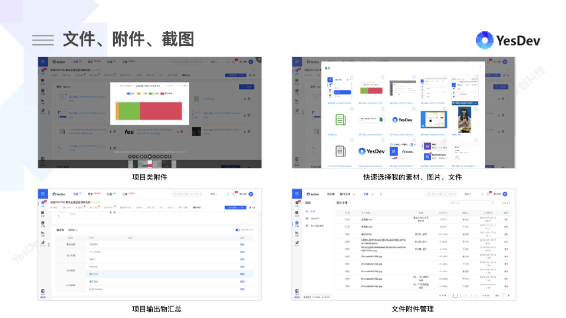
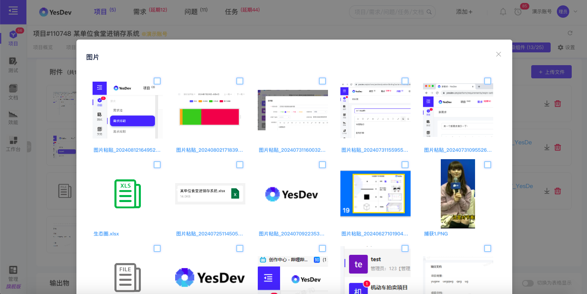
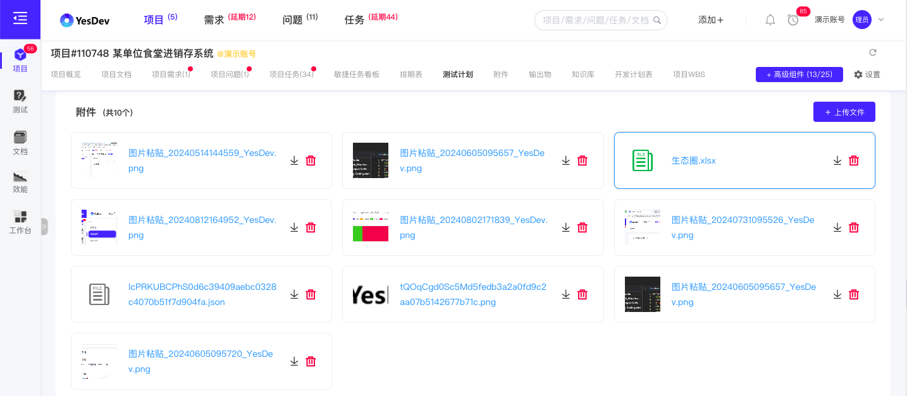
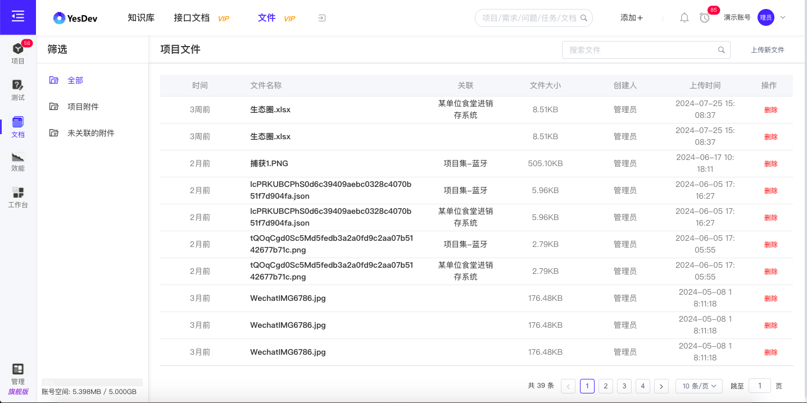

# 4.4 文件附件管理

文件附件管理，主要分为三类：  
 + 个人的图片素材附件管理；  
 + 项目类的附件上传；  
 + 企业管理员的全部文件管理；  

  

# 个人的图片素材附件管理

成员个人在上传文件，或插入图片时，可以快速选择和查看自己的图片素材。  
  

# 项目类的附件上传

项目类的附件，主要支持：  
 + 项目附件
 + 需求附件
 + 任务附件
 + 问题附件
 + 文档附件

类似如下：  

  

可以进行：上传文件、在线预览图片文件、下载文件、删除文件等。  

# 企业管理员的全部文件管理

进入【文档】-【文件】，企业管理员可以针对全部文件、附件进行管理，包括彻底删除文件。  

  

