# IM群机器人实时通知推送

# ChatOps介绍
通过ChatOps，你可以和你的团队，通过聊天群来快速协作项目，可以和YesDev的工作组进行绑定。目前支持：  
 + **钉钉**  
 + **企业微信**  
 + **飞书**  
 + **喧喧**  
 + **自定义群机器人**  

# 钉钉群机器人配置

第一步，在你需要接收项目通知和进行协作的钉钉群，创建一个机器人。  
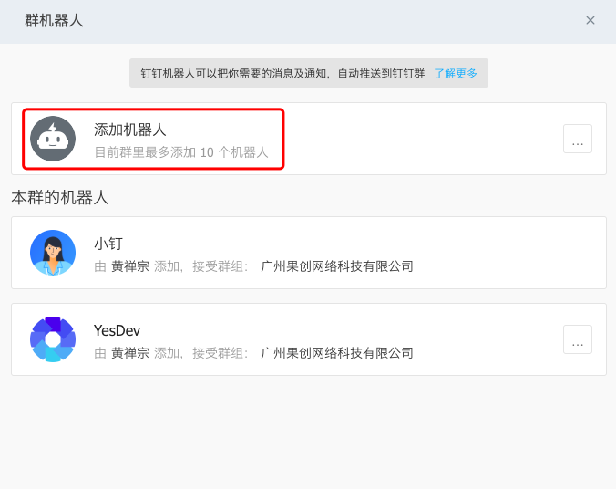  

选择自定义。 
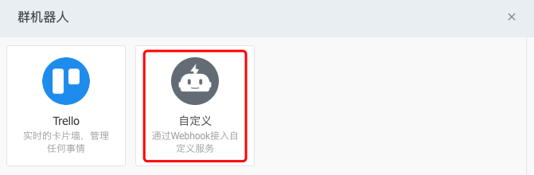  

机器人头像用YesDev的Logo图片，机器人名称用：YesDev，勾选：加签，勾选：我已阅读并同意，最后完成。  

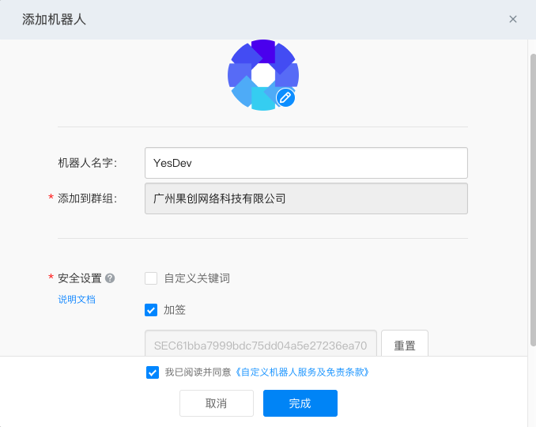  

> 具体的创建，可参考文档[《钉钉开放平台 - 自定义机器人接入》](https://developers.dingtalk.com/document/robots/custom-robot-access)。  

第二步，进入YesDev - 群组 - 工作组 - ChatOps群机器人 - 钉钉群。  
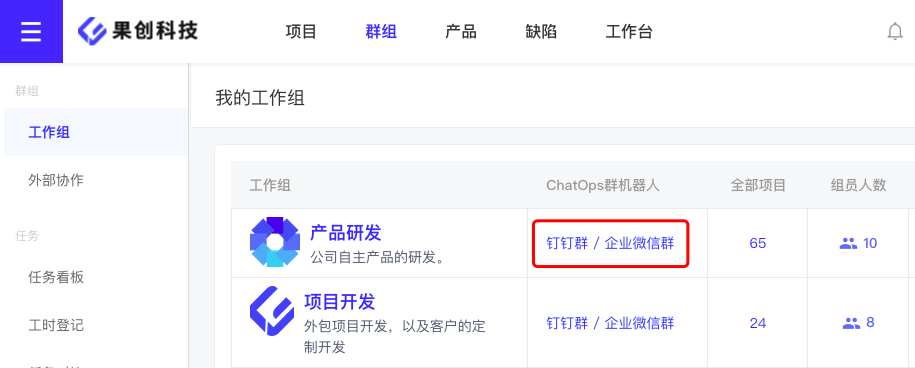  

把刚刚创建成功的群机器人Webhook地址、和加签的密钥，填入到YesDev的弹窗配置。

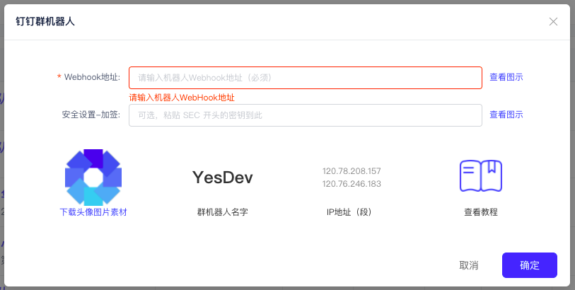  

确定保存，成功配置后，在钉钉群会收到一条测试消息。例如：  
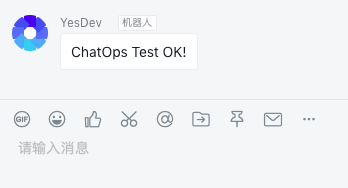  

最后，就可以开始在群里进行项目管理和协作了。类似：  
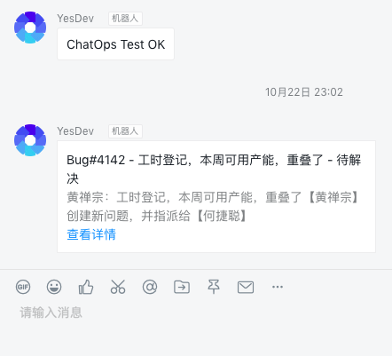  

# 企业微信群机器人配置

企业微信群机器人配置，类似钉钉群机器人配置。  

第一步，在你需要接收项目通知和进行协作的企业微信群，添加一个机器人。  
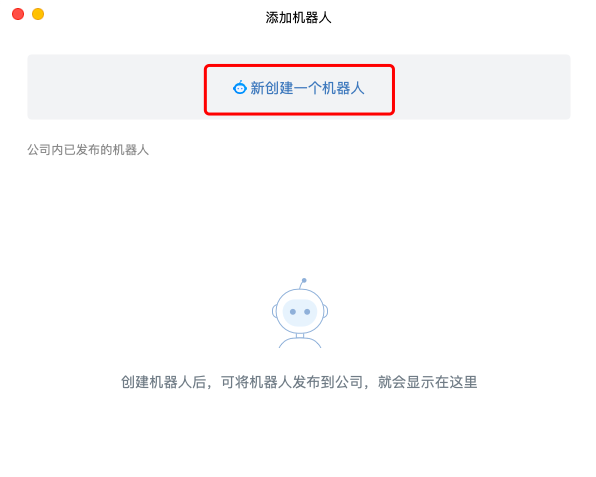  

机器人头像可以使用YesDev的Logo或自己的图片，机器人名称填入：YesDev，点击【添加机器人】。  
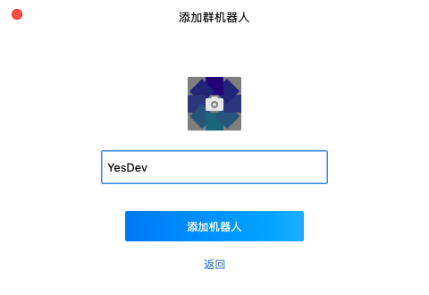  

机器人创建成功后，复制Webhook地址。 
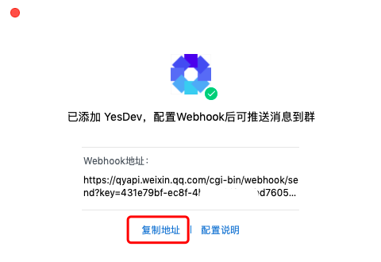  

第二步，进入YesDev - 群组 - 工作组 - ChatOps群机器人 - 企业微信群。  
  

把刚刚创建成功的群机器人Webhook地址，填入到YesDev的弹窗配置。
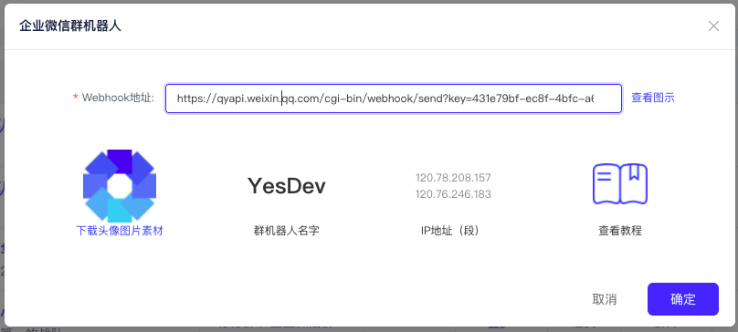  

确实保存，成本配置后，会收到一条测试消息。  
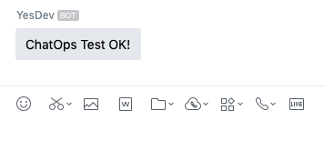  

随后，就可以开始在群里进行项目管理和协作了。 


# 飞书群机器人配置

首先，在你需要接收YesDev通知的飞书群，创建一个新的机器人。添加机器人，自定义机器人。    
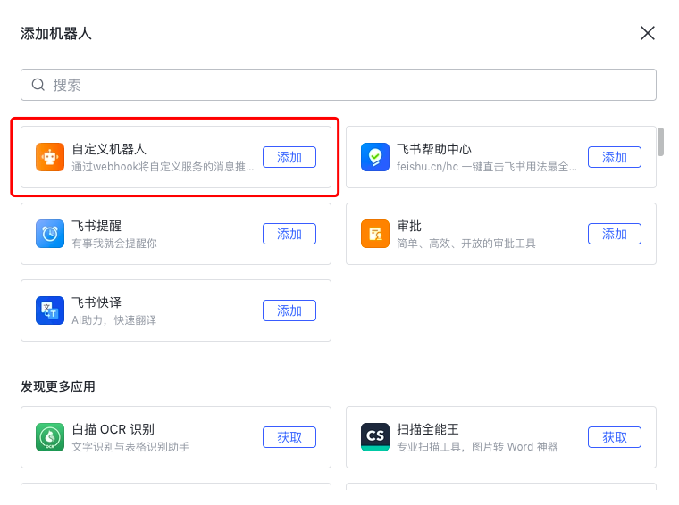   

然后，填写机器人的名称：YesDev，和描述：YesDev企业研发管理。  
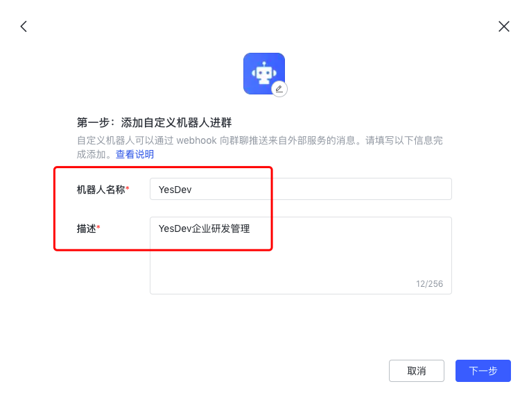  

最后，添加成功并开启签名校验。  
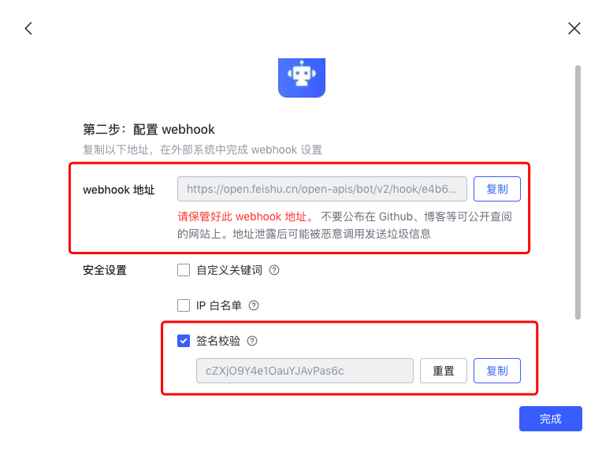  

把成功创建后的群机器人的webhook和密钥，复制到YesDev即可。  

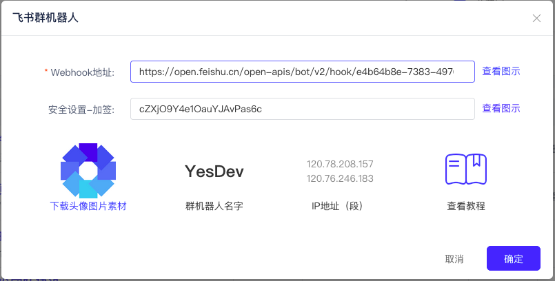  

> 更多关于机器人的创建，请参考：[飞书开放平台-自定义机器人指南](https://open.feishu.cn/document/ukTMukTMukTM/ucTM5YjL3ETO24yNxkjN#f62e72d5)  

# 喧喧群机器人接入

第一步，在你的喧喧管理后台的【应用】，创建一个新应用，应用代号必须是：**YesDev** 。  

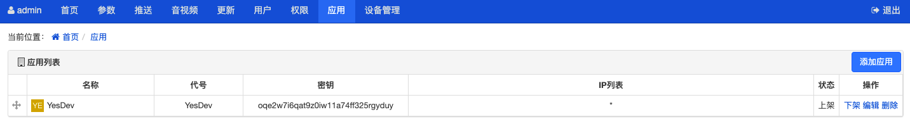  

> 特别注意！应用代号必须是：**YesDev** 。  

在添加应用时，可以按以下表单填写。  

 + 名称：YesDev  
 + 代号：YesDev  
 + 应用地址：https://www.yesdev.cn/ （私有部署请填写私有部署的域名，例如：https://yesdev.xxx.cn/）  
 + 扩展包：不需要  
 + 集成：启用  
 + 退出地址：不需要  
 + 密钥：系统分配，不需要填写  
 + IP列表：* （也可以填写YesDev的所在IP）  

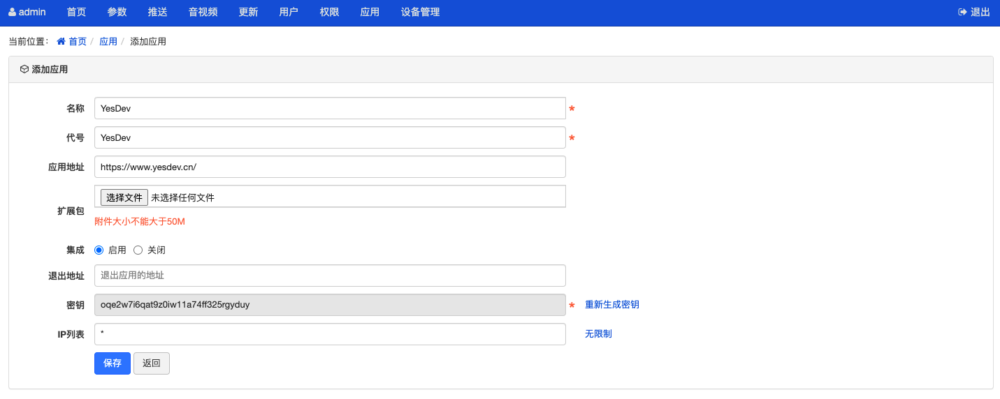  

第二步，随后在需要接入YesDev推送通知的内部喧喧群，通过查看喧喧群的【复制群链接】，可以从中提取获取群ID。  

例如：  
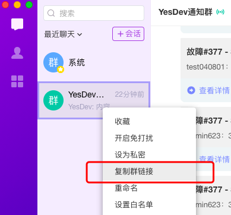  

复制出来的群链接是：  
```
[YesDev通知群](xxc://confirmJoinPublicChat/ca5a00ee-4cb8-4ef8-bc02-77e6b68ff296)
```
则对应的群ID是：ca5a00ee-4cb8-4ef8-bc02-77e6b68ff296，注意不需要最后的小括号。  

第三步，进入YesDev的工作台 - 工作组，找到对应的工作组，进行喧喧群的配置。把上面的获得的喧喧应用密钥、喧喧群ID，以及喧喧服务器API接口地址填入到YesDev。  

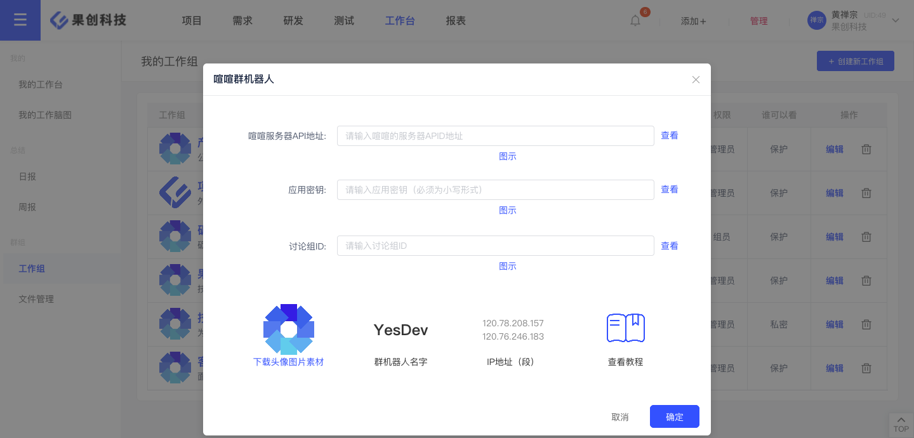  

**喧喧服务器API接口地址是什么？**   

可以按以下路径分别调试：  
 + http://xxbserver.com/xxb/x.php  
 + http://xxbserver.com/x.php
 + http://xxbserver.com/api.php


> 注：自喧喧2.5.5版本后， 变更了应用集成 API 接口xxbserver.com/api.php，将应用集成 API 接口并入x.php，之前的api.php已弃用  
> 摘自[API 格式和签名机制](https://xuanim.com/book/dev/140.html#first)  

例如：  
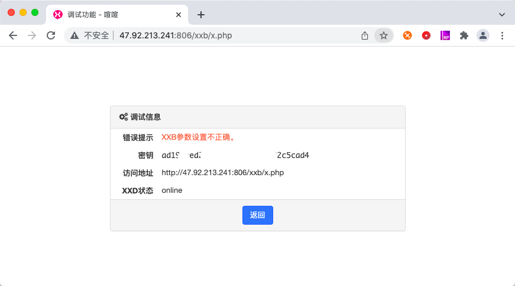  

最后，接收到YesDev的推送消息类似如下：  
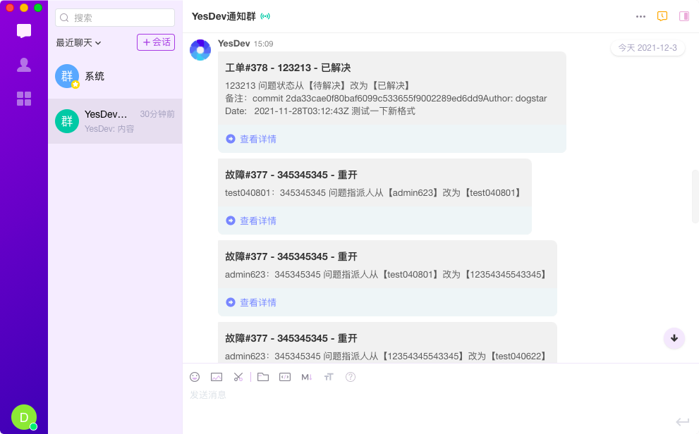  

补充，喧喧API接口可能会出现以下错误。  
```
Notice: Undefined variable: _COOKIE in /opt/zbox/app/xxb/framework/base/router.class.php on line 591
{"errcode":401,"errmsg":"\u65e0\u6548\u7684token\u53c2\u6570"}
```

# 自定义群机器人

如果需要通过自定义群机器人，同步接收有必要的消息通知推送。可以在工作组继续配置自定义群机器人的回调地址。  

YesDev将会以POST请求的方式，将以下格式的JSON报文推送到你的回调地址。  

## 请求方式
```
POST
```

## 请求头

```
Content-Type: application/json;
```

## 请求的参数格式

参数名|类型|说明|备注
---|---|---|---
message|结构体|本次推送消息结构体|
meta_data|结构体|消息更多元数据|没有时为null

message结构体格式：  

参数名|类型|说明|备注
---|---|---|---
title|字符串|消息标题|示例：项目xxx - 已完成
content|字符串|消息内容，markdown格式|
content_html|字符串|消息内容，HTML格式|可直接使用，根据content解析转换所得 
at|结构体|atMobiles表示@的手机号，没有时为null；isAtAll表示是否@全部人，布尔值|

meta_data结构体格式，可用于同步获取更多和项目相关的原始元数据（没有时为null，例如测试回调地址时）：

参数名|类型|说明|备注
---|---|---|---
msg_type|整数|消息推送类型|推送类型列表待补充
msg|字符串|推送的消息内容|
module_type|整数|模块类型|1项目、2任务、3需求、4问题、100周报、101PRD、200文档、300测试用例、310测试计划、400工作组
module_type_id|整数|对应模块的ID|例如：项目ID、需求ID、问题ID等
push_staff_id|整数|YesDev员工ID|
push_staff_name|字符串|员工姓名|如：张三
extraEmailSendextraMessageInfo|字符串|手动填写的备注内容|
app_key|字符串|YesDev企业key|

## 请求参数示例

推送的数据示例：  
```
{
    "message":{
        "title":"项目#25 project - 已完成",
        "content":"#### 项目#25 project - 已完成
                单元测试的文本

                手动填写的备注内容……

                [查看详情](http://www.yesdev.cn/m/pages/project/detail?id=25)",
        "content_html":"<h4>项目#25 project - 已完成</h4>
            <p>单元测试的文本</p>
            <p>手动填写的备注内容……</p>
            <p><a href="http://www.yesdev.cn/m/pages/project/detail?id=25">查看详情</a></p>",
        "at":{
            "atMobiles":null,
            "isAtAll":false
        }
    },
    "meta_data":{
        "msg_type":2,
        "msg":"单元测试的文本",
        "push_staff_id":1,
        "module_type":1,
        "module_type_id":25,
        "app_key":"gc",
        "extraEmailSendextraMessageInfo":"手动填写的备注内容……",
        "push_staff_name":"示例"
    }
}
```

## 响应要求

对响应返回的结果和HTTP状态码无要求，但需要在5秒内响应，超时失败不重试。  


