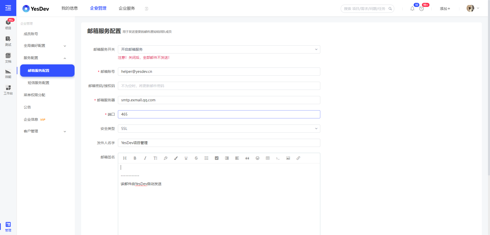
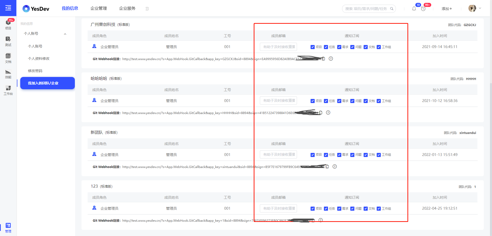
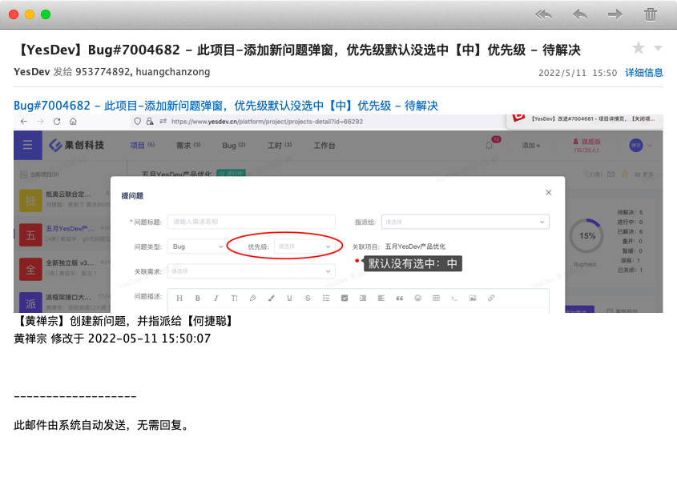

# 企业邮箱与邮件通知

## 企业邮箱配置

作为企业管理员，你可以为YesDev单独分配一个企业邮箱账号，用于发送各类系统通知和邮件。  

进入【企业管理后台】-【服务配置】 - 【邮箱服务配置】，可以进行配置。  

  

作为普通成员，需要在员工信息设置成员的邮箱，才可以接收到邮件通知，并且可以勾选感兴趣的通知类型。

  

## 图文邮件通知

随后，就可以接收到精准的图文邮件通知。类似：  

  

YesDev支持项目、需求、任务、问题等的邮件通知。  

