# 4.1 项目类文档管理

项目类文档是指在产品研发过程中所需用到的各类文档，包括但不限于：项目文档、需求文档、开发文档、缺陷描述……。

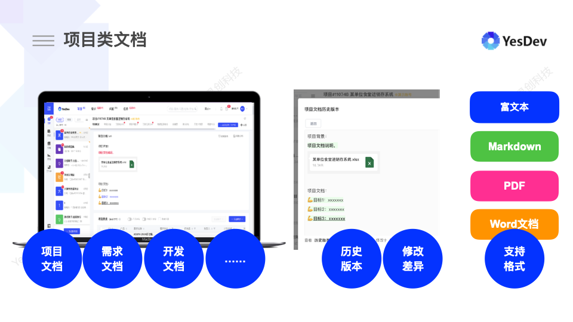  

# 项目类文档

为方便理解，YesDev汇总提供了以下项目类文档。  

分类|文档|备注  
---|---|---  
项目|提供：项目文档|  
需求|提供：需求文档、开发文档|其中开发文档支持markdown格式  
问题|提供：缺陷描述文档、工单描述文档、故障文档、以及优化和咨询文档的编写|  

类似下图，为项目文档的编辑效果截图。  

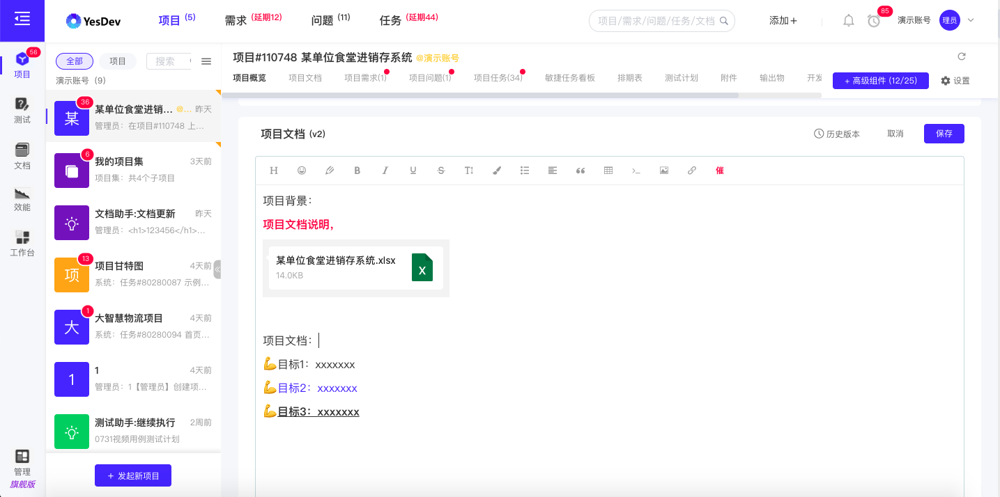  

# 文档功能支持

项目类文档，统一支持以下功能：  

 + 在线编辑（冲突提示）；   
 + 历史修改版本，以及版本差异对比；  
 + 历史文档还原与恢复；  
 + 导出文档（导出格式支持：PDF、Markdown、Word）；  
 + 支持emoji表情、代码块、图片快速选择、截图粘贴等；  
 + 文档变更通知（需求文档和问题文档变更时，通知相关负责人员和开发人员）；

## 历史版本差异对比

历史修改版本对比，即可以对比相邻的两次提交修改，也可以直接和最新的文档进行对比。差异对比效果会显示新增、删除和修改的高亮，类似如下：  

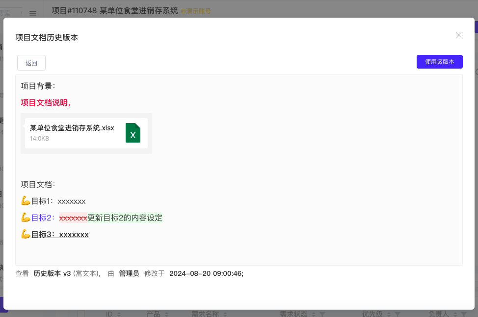  

## emoji表情    
emoji表情，支持常用的、表情类的、以及手势、办公、交通和国旗等emoji。  

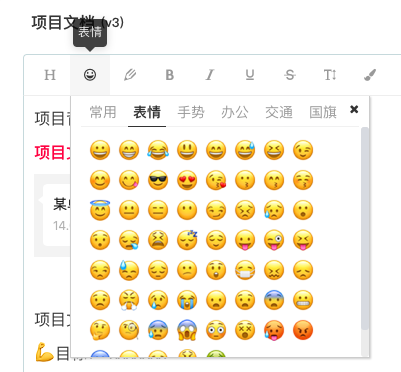  

+ 常用emoji  
😀 🤔 🧐 😳 😵 😕 😘 😋 😎 😂 😱 🥵 😡 🥶 💪 👌 👍 👏 ❗ ❓ 💣 🚀 💯 🎉 🌹  

+ 表情emoji  
😀 😁 😂 😃 😄 😅 😆 😉 😊 😋 😎 😍 😘 😗 😙 😚 😇 😐 😑 😶 😏 😣 😥 😮 😯 😪 😫 😴 😌 😛 😜 😝 😒 😓 😔 😕 😲 😷 😖 😞 😟 😤 😢 😭 😦 😧 😨 😬 🤔 🧐 😰 😱 😳 😵 🥵 😡 🥶 😠 🤒 🤮 🤢  

+ 手势emoji  
💪 👈 👉 ☝ 👆 👇 ✌ ✋ 👌 👍 👎 ✊ 👊 👋 👏 👐  

+ 办公emoji  
📱 📲 ☎ 📞 📟 📠 🔋 🔌 💻 💽 💾 💿 📀 🎥 📺 📷 📹 📼 🔍 🔎 🔬 🔭 📡 📔 📕 📖 📗 📘 📙 📚 📓 📃 📜 📄 📰 📑 🔖 💳 📧 📨 📩 📤 📥 📦 📫 📪 📬 📭 📮 📝 📁 📂 📅 📆 📇 📈 📉 📊 📋 📌 📍 📎 📏 📐 🔒 🔓 🔏 🔐 🔑

+ 交通emoji  
🚂 🚃 🚄 🚅 🚆 🚇 🚈 🚉 🚊 🚝 🚞 🚋 🚌 🚍 🚎 🚏 🚐 🚑 🚒 🚓 🚔 🚕 🚖 🚗 🚘 🚚 🚛 🚜 🚲 ⛽ 🚨 🚥 🚦 🚧 ⚓ ⛵ 🚤 🚢 💺 🚁 🚟  🚠 🚡 🚀  

+ 国旗emoji  
🇨🇳 🇭🇰 🇲🇴 🇹🇼 🇦🇫 🇦🇪 🇦🇱 🇦🇶 🇦🇷 🇦🇹 🇦🇺 🇧🇦 🇧🇩 🇧🇪 🇧🇫 🇧🇷 🇧🇾 🇨🇦 🇨🇩 🇨🇫 🇨🇬 🇨🇭 🇨🇴 🇨🇺 🇩🇪 🇩🇰 🇩🇴 🇪🇸 🇪🇺 🇫🇷 🇬🇧 🇬🇷 🇭🇺 🇮🇩 🇮🇱 🇮🇳 🇮🇴 🇮🇶 🇮🇷 🇮🇸 🇮🇹 🇯🇵 🇰🇭 🇰🇵 🇰🇷 🇰🇾 🇱🇦 🇲🇲 🇲🇳 🇲🇽 🇲🇾 🇳🇱 🇳🇴 🇳🇵 🇳🇿 🇵🇪 🇵🇭 🇵🇰 🇵🇱 🇵🇹 🇷🇺 🇸🇩 🇸🇪 🇸🇬 🇸🇴 🇸🇸 🇸🇾 🇹🇭 🇹🇷 🇺🇦 🇺🇲 🇺🇳 🇻🇦 🇻🇳 🇿🇦 🏴󠁧󠁢󠁥󠁮󠁧󠁿 🏴󠁧󠁢󠁳󠁣󠁴󠁿  

## 粘贴截图    

在编辑文档时，可以直接粘贴截图，也可以从【图片】中快速选择自己的图片素材。  

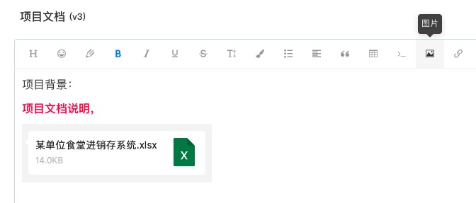  

## 文档变更通知

在修改文档时，可以选择是否【通知负责人】。若选中，当文档发生变更时，会自动邮件通知对应的需求负责人、以及相关人员（例如：需求抄送人员等）。  

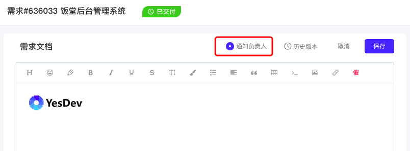      

## 导出文档

导出文档时，支持多种格式，你可以：  

 + 导出为PDF文件 
 + 导出为Word文件 
 + 导出为Markdown 

# 支持的文档格式  

YesDev提供了两种文档编辑器，一种是针对富文本的编辑器；另一种是面向程序员、针对Markdown格式的“可见即所得”编辑器。 

## 富文本编辑器  

针对富文本的编辑器：  

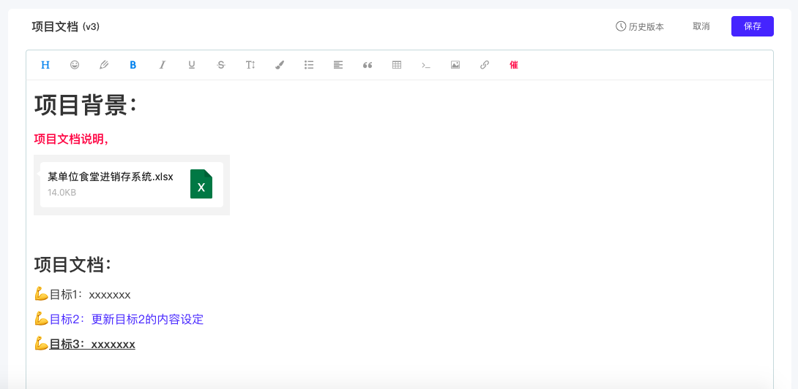  

## Markdown在线编辑器

Markdown在线编辑器，方便用于编写和代码、SQL相关的文档：  

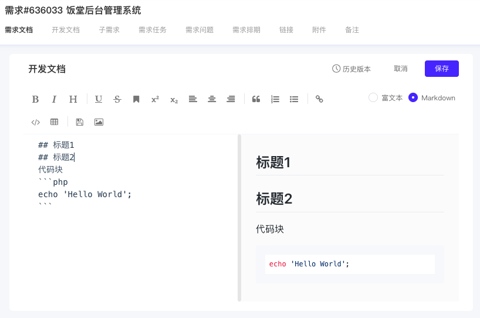  

富文本编辑器和Markdown在线编辑器，可以互相切换。     

# 文档模板配置

在管理后台，企业管理员可以设置项目类文档的默认文档模板。  

进入【管理后台】后，依次进入：【系统高级设置】-【文档模板配置】-【切换：项目/需求/问题/邮件模板】- 点击：【修改模板内容】。  

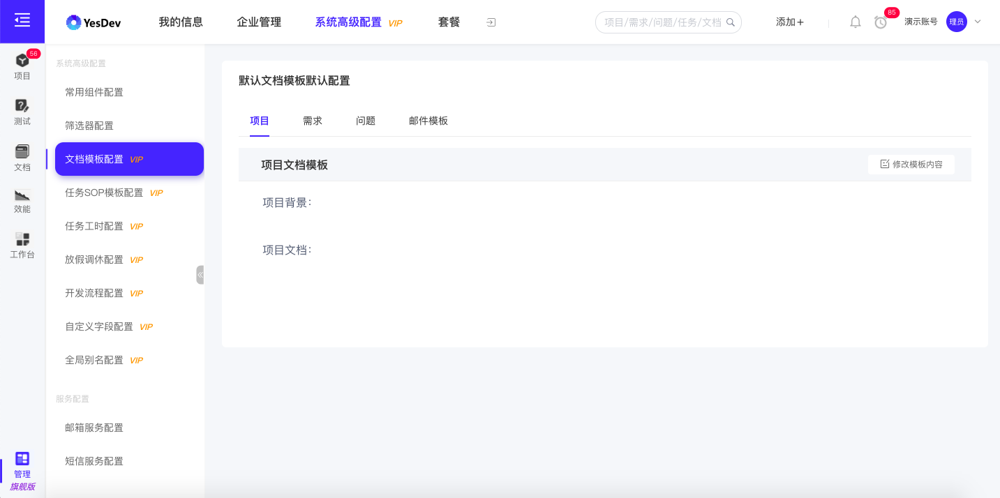  

以修改默认的需求文档模板为例，补充了“需求收益评估”、“期望交付日期” ，然后【保存】。  
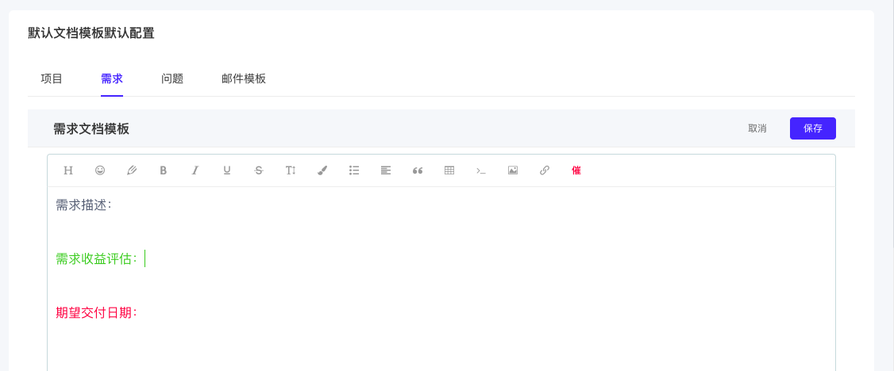  

后续，产品经理或其他成员在添加新需求、编辑需求文档时，就会看到新的需求文档模板。   
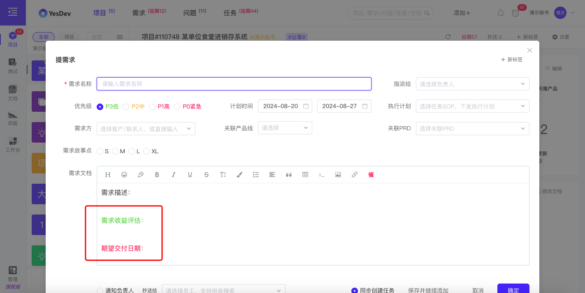  

