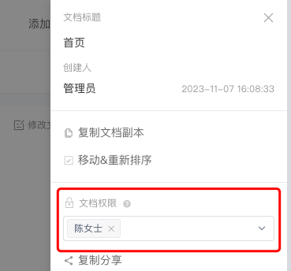
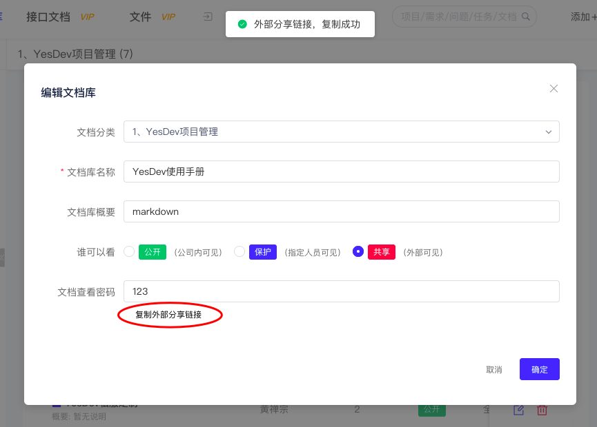
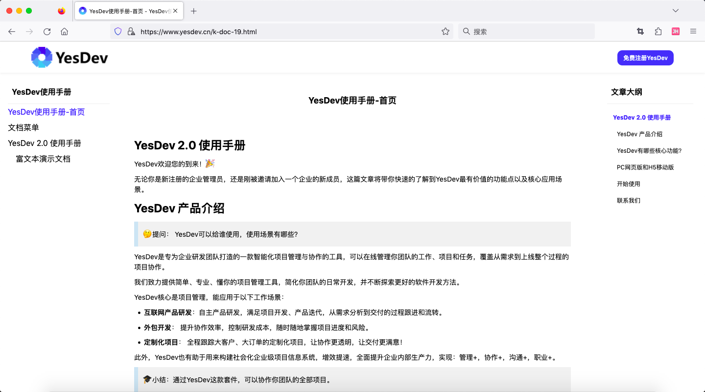

# 4.2 知识库文档管理

知识库文档，是专门用于进行知识文档管理的协作空间，支持：文档协作空间、文档库（或 项目文档库）、多层级目录（无限级）、文档权限控制（公开/保护/私有）、文档外部分享（游客查看）等。  

  

通过左侧的产品菜单【文档】，点击后可进入到知识库文档管理主界面。  
  

# 文档协作空间 

文档协作空间，可以在最高的层次划分知识库文档，你可以根据团队的需求、以及组织管理、部门权限等需要，创建和管理你的文档协作空间。  

创建一个新的文档协作空间非常简单，点击【+ 新建文档空间】，填写文档空间名称，保存。  

  

对于不再使用的文档协作空间，可以进行删除。      

# 文档库

添加文档空间后，下一步需要添加自己的文档库。文档库，用于维护和管理同一类的文档集合。  

## 添加文档库

点击【+ 添加文档库】，输入文档库名称，文档库概要，以及谁可以看。  

  

## 项目文档

在具体的项目的知识，进行【+ 新建知识库】后，对应的知识库文档会自动归到【项目文档】文档协作空间，并且和指定的项目关联。  

      

## 文档库操作

成功添加文档库后，更多功能和操作说明如下：  

 + 切换文档协作空间  
 + 文档协作空间重命名和删除；  
 + 文档库的添加、设置、删除；  
 + 文档库权限设置；  
 + 文档库最近更新记录；  
 + 文档库搜索；  

  

## 知识文档维护编写  

进入到具体的文档库后，你可以对当前文档库进行快速查看、维护、管理和编辑。  

 + 查看  
   - 查看文档库全部文档（支持无限多层级）  
   - 查看文档位置；  
   - 查看历史变更版本；  
   - 查看单篇文档的目录；  
   - 收纳左侧文档库目录、收纳右侧单篇文单的目录；  

 + 编辑
   - 文档标题重命名；  
   - 修改文档；  
   - 复制文档副本；  
   - 移动和重新排序文档；  

 + 添加新文档  
   - 在前面添加；  
   - 在后面添加；  
   - 添加子文档；  

 + 管理
   - 设置单篇文档的权限（指定成员）；  
   - 复制外部访问链接；
   - 导出文档；
   - 删除文档；

  

# 文档编辑  

## 富文本编辑器  

知识库文档，同时支持：富文本编辑器、和Markdown编辑器，并且可以随时自由切换。    

  

## Markdown编辑器  

      

# 文档权限控制  

知识库文档权限，可以针对文档库整体的权限进行设置，也可以针对文档库内的单篇文档的权限进行设置。  

单篇文档的权限设置，优先文档库的整体权限设置。  

## 文档库权限设置  

在新建文档库，或在创建后，可以修改设定文档的权限。  

文档库权限分为三类：  

 + **公开**：公司内可见；  
 + **保护**：指定人员可见；  
 + **共享**：外部只读可见；  

  

## 单篇文档的权限设置      

在单篇文档，点击【设置】，在文档权限，可以指定该文档的成员权限。  

      

> 温馨提示：单篇文档未指定时权限时，跟随文档库权限。  

# 文档外部分享  

在文档库权限设置，选择【共享】，可以把文档库分享给外部游客查看，同时可以设置文档查看密码。  

设置好共享后，可以复制外部分享链接。  

  

复制到的分享信息，类似如下：  

```
https://www.yesdev.cn/k-doc-19.html
文档共享：YesDev使用手册
查看密码：123
```

游客访问后，输入必要的查看密码。  

  

PC电脑版的文档查看效果：  

  

手机移动端的文档查看效果：  

  

