# 程序员客栈项目协作

当前，YesDev已经支持自动集成和对接程序员客栈的整包项目、雇佣项目、云端工作以及1980需求梳理，方便程序员客栈的客户、项目经理、产品经理和协作开发者快速协同项目。  

> 程序员客栈官网：https://www.proginn.com/  

## 访问YesDev

你可以直接通过YesDev的官网进行访问。  
> YesDev官网：https://www.yesdev.cn/  

也可以在程序员客栈平台上，通过对应的入口跳转访问。例如顶部的【更多】下拉菜单访问，也可以通过工作台的左侧菜单【研发协作】访问。    
  

## 授权登录

如果还没登录YesDev，可以进入登录页面，然后选择第三方登录方式：程序员客栈。  
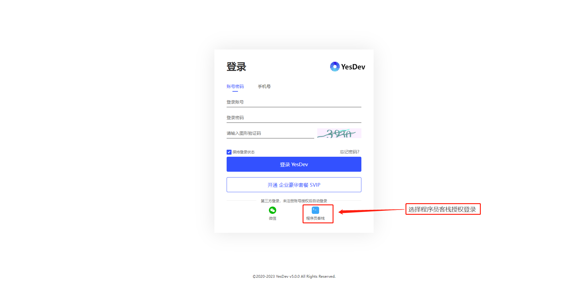

进入授权页后，登录你的程序员客栈账号，或者在已登录程序员客栈PC版的情况下直接授权登录。  
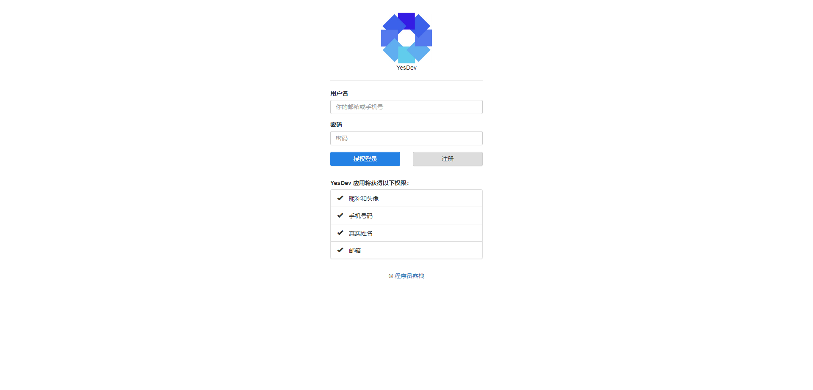  

首次使用，请输入你的专业方向/项目角色，以及你的姓名，方便后续进行项目协作时区分不同的团队。  
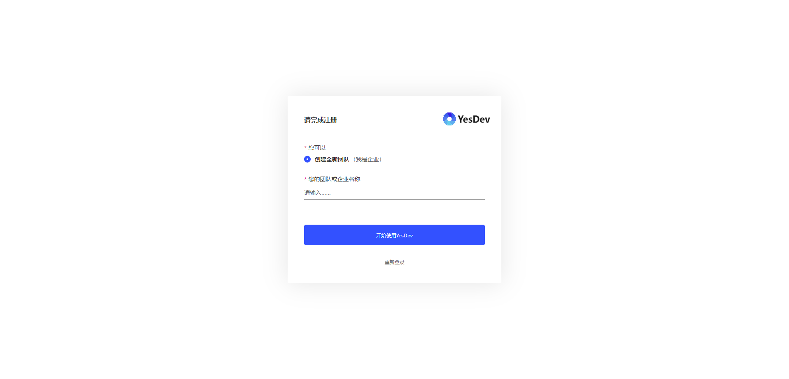  

## 查看我的绑定  

使用程序员客栈账号授权登录后，可以在我的个人账号页面，查看已经绑定的程序员客栈的账号。  
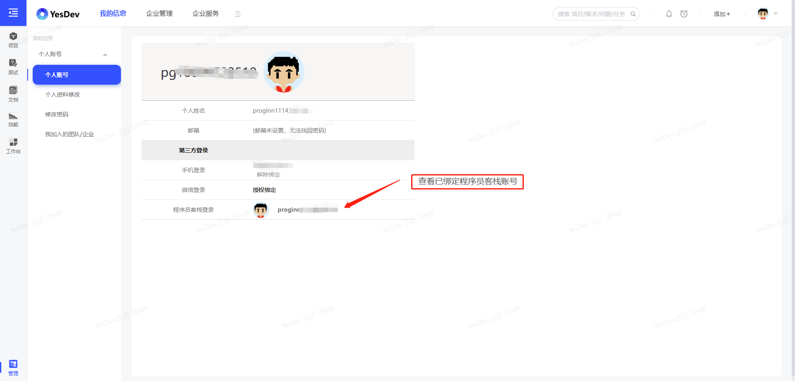  

> 温馨提示：如果需要协作程序员客栈对接的项目，需要使用程序员客栈相应的账号授权登录，否则无法进行匹配和关联。  

## 邀请我的团队

默认注册后是个人版，可以免费升级到团队协作版。  

如果需要添加自己团队的加入协作，请参考[企业管理-人员管理](http://www.yesdev.cn/help/#/member?id=_121-%e4%ba%ba%e5%91%98%e7%ae%a1%e7%90%86)进行操作。  

## 企业客户发布的项目

作为客户，通过【项目协作】-【项目管理】，可以查看你在程序员客栈发布的整包项目、雇佣项目。  

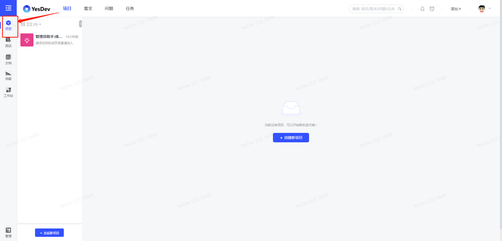  

## 程序员接受的项目  

作为程序员或开发者，通过【项目协作】-【外部协作】，可以查看你在程序员客栈接受和参与的整包项目、雇佣项目。  

  

# 程序员客栈平台项目协作  

程序员客栈的整包项目，提供了一站式软件开发服务，智能匹配优质开发者，让客户拥有五星级的过程体验和交付质量。   

当程序员客栈的整包项目进入项目实施阶段时，YesDev将会自动同步此项目，并开始项目协作。  

> 温馨提示：使用前，请使用你的程序员客栈账号授权登录。  

## 我是企业

如果你是客户，可以在程序员客栈上免费发布需求，发布你的项目。  
  

发布后，请等待程序员客栈平台审核和匹配优质开发者。  

### 进入YesDev项目协作  

当平台审核通过并有开发者接单后，可以在项目详情页访问YesDev，进行此项目的在线协作。  
  

进入YesDev项目详情页后，你可以看到关于这个项目的全部相关信息，包括但不限于：项目概况、项目需求、项目任务、项目问题、文件资料等。可自由添加、编辑和进行多人在线协作。  
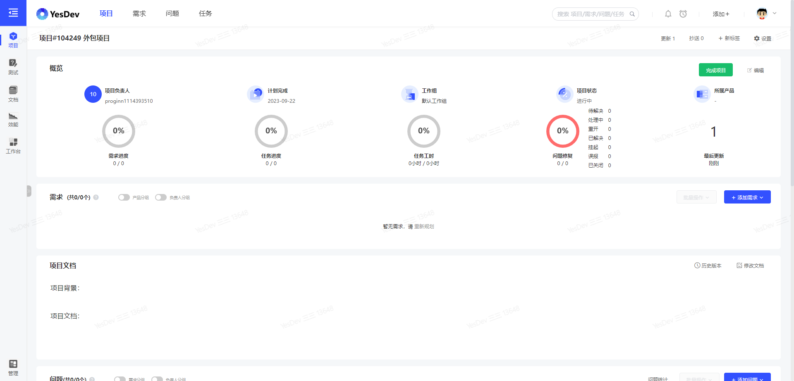  

除了从程序员客栈平台跳转访问，你也可以直接在YesDev的顶部菜单【项目协作】-【项目管理】查看，对于来自程序员客栈的项目或已开放外部协作的项目，会有【外部协作】标签。  
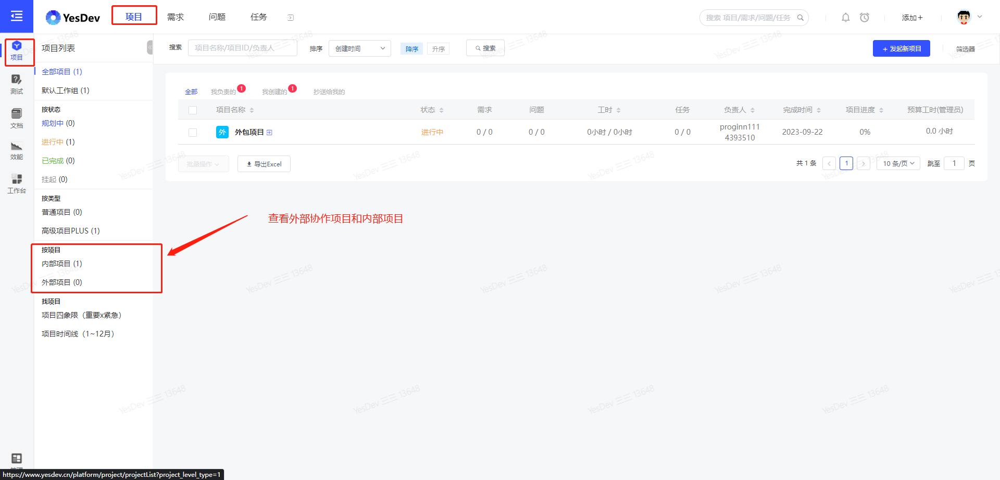  

> 温馨提示：在【项目管理】查看从程序员客栈自动同步的整包项目。  

### 提交新问题  

在验收过程中，对于发现的问题，可以提交并关联到此协作项目，然后交由开发团队处理。  
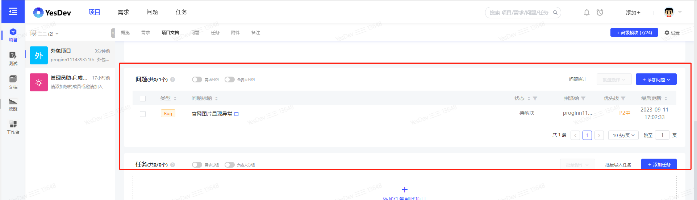  

在YesDev项目详情页，可以实时查看问题的处理进度。  
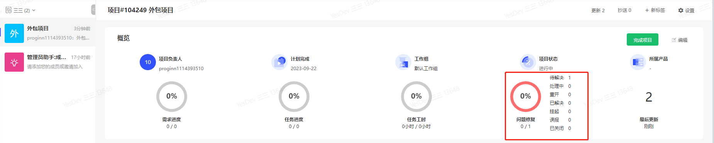  

### 邀请更多外部团队加入协作

如果需要查看当前外部团队有哪些已加入项目协作，或者需要添加更多的团队加入项目协作，可以点击【外部协作】。  
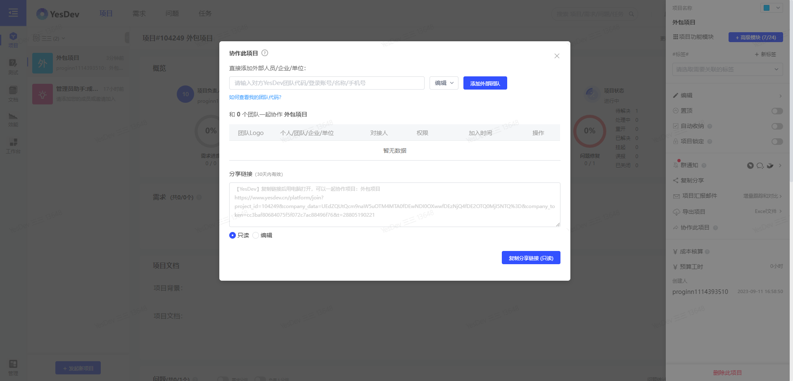  

此时加入的团队，不一定局限于程序员客栈的团队，可以是任意已注册的YesDev的团队。  

### 完成项目

最后，当项目全部完成后，可以把项目的状态改为【已完成】。至此，项目协作完毕，并归档到历史项目。  

## 我是项目经理

### 确认接单  

登录程序员客栈，在工作台查看待操作任务。  
  

并对新项目进行确认接单。  
  

确认接单后，就可以在项目页面访问YesDev进行当前项目的协作。  
  

### 进入YesDev项目协作

通过上面的跳转链接，可以进入YesDev具体的项目详情页。在YesDev项目详情页，你可以看到关于这个项目的全部相关信息，包括但不限于：项目概况、项目需求、项目任务、项目问题、文件资料等。可自由添加、编辑和进行多人在线协作。数据会和程序员客栈平台实时保存双向同步。  
 

你也可以，通过在YesDev的【项目协作】-【外部协作】，看到从程序员客栈自动同步过来的平台项目。  
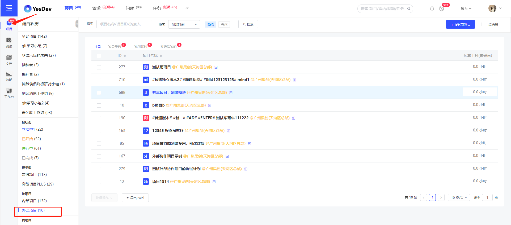  

> 温馨提示：在【外部协作】左侧菜单，查看程序员客栈的协作项目。   

### 关联新需求

在YesDev项目详情页，可以编辑并关联新需求。例如，在接到新项目后，根据客户的需求，分别创建三个新需求：    

 + 官网UI设计  
 + 官网前端开发  
 + 官网功能测试  

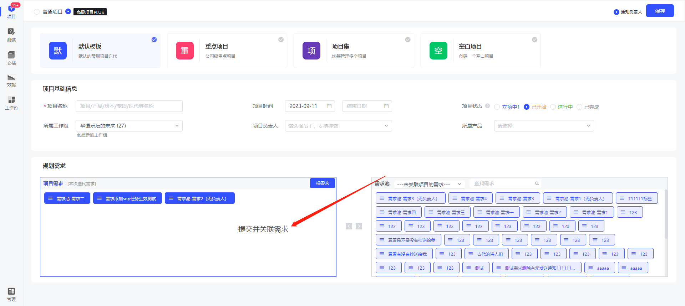  

保存后，可以看到刚添加的新需求。还可以根据团队的人员，分配需求负责人，以及按客户的要求制定需求完成上线时间。  
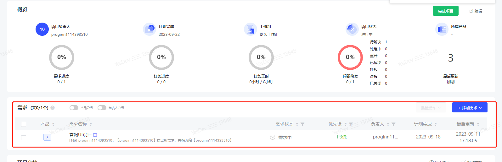  

需求完成后，可及时把需求状态改为【已完成】或【已上线】。  

### 评估任务工时

程序员客栈的整包项目在创建时，默认会有20个新任务。你可以在此基础上进行修改、调整。  

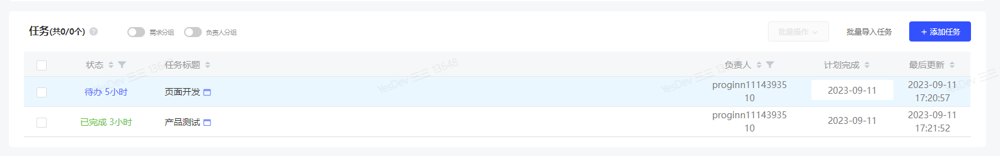  

你可以根据项目的需要，添加新的任务。如果任务已完成，请及时把任务状态更改为【DONE】状态。方便内部团队和外部客户同步看到最新的项目进度以及项目总工时。  
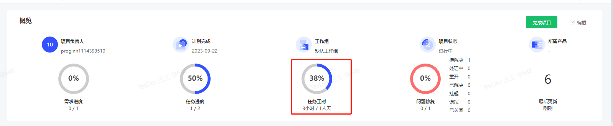    

> 温馨提示：如果不需要由程序员客栈创建的任务，请联系客户进行删除。      

### 进行Bugfixed

对于项目测试发现的问题（内部团队发现的或客户提出的），可以在项目所关联的问题进行查看和处理。  
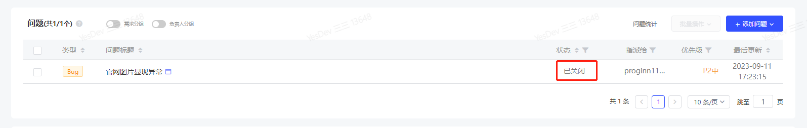  

问题修复或已处理后，请及时把状态改为【已关闭】。  

### 发布子项目

在程序员客栈上，客户或项目经理，可以发布子项目。  

   

子项目发布后，在通过审核并匹配到开发者后，将会自动同步到YesDev。  

> 温馨提示：程序员客栈的子项目，对应到YesDev的项目需求。  

### 完成任务、需求和项目  

当项目里面的任务、需求、项目或问题，已完成时，可以修改相应的状态。  

## 我是协作开发者

程序员客栈上的开发者，加入整包项目的子项目后，也可以一起参与YesDev的项目协作。  

### 接单

在程序员客栈平台上，确认接单。   

  

### 访问YesDev项目协作  

在子项目接单后，在程序员客栈的项目页面，点击【YesDev项目协作】，即可进入YesDev一起参与项目协作。  
   

在YesDev，可以看到自己所负责的需求，以及整个项目的信息。可以一起协作项目、需求和任务。  
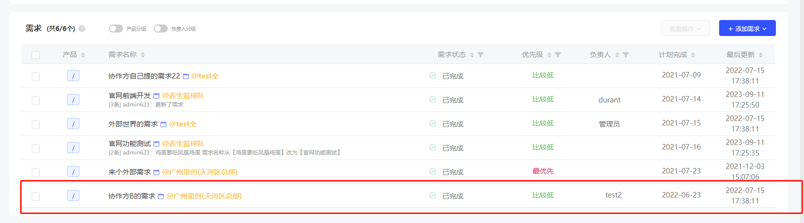  

你也可以通过【项目协作】-【外部协作】来访问更多外部协作的项目。  

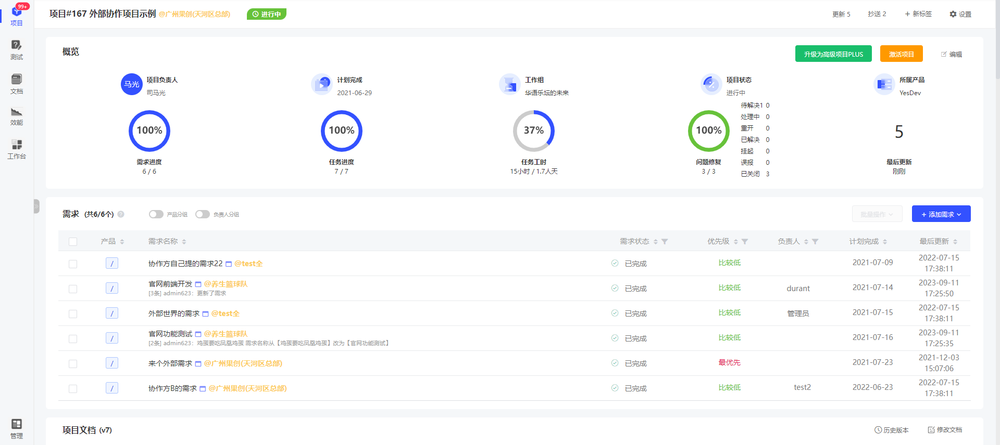  

### 添加新任务

在项目协作详情页，可以添加你的新任务。在添加新任务的弹窗，可以填入任务标题、任务时间等信息，并关联到你所负责的需求。  
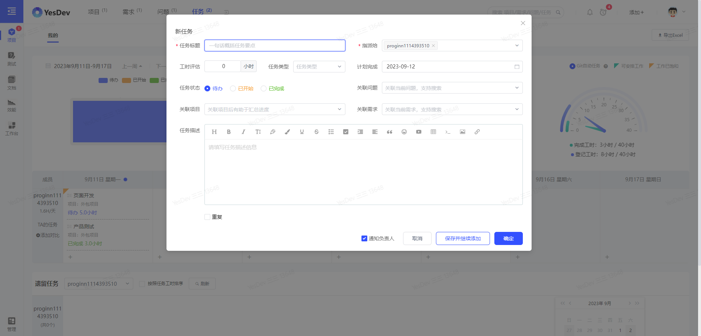  

### 完成你的任务和需求

当你所负责的任务完成后，可以把任务状态改为【DONE】。当你所负责的需求完成后，可以把需求状态改为【已完成】或【已上线】。  

# 程序员客栈雇佣项目协作  

> 温馨提示：使用前，请使用你的程序员客栈账号授权登录。  

## 我是企业
首先，需要在程序员客栈上，向有意向的程序员提交预约。  
  

提交预约后，待程序员接受后，即可开始在线协作。  

### 访问YesDev项目协作

在程序员客栈的雇佣详情页面，可以点击【YesDev项目协作】访问。
  

进入YesDev后，可以和程序员一起在线协作任务、需求和问题等。  
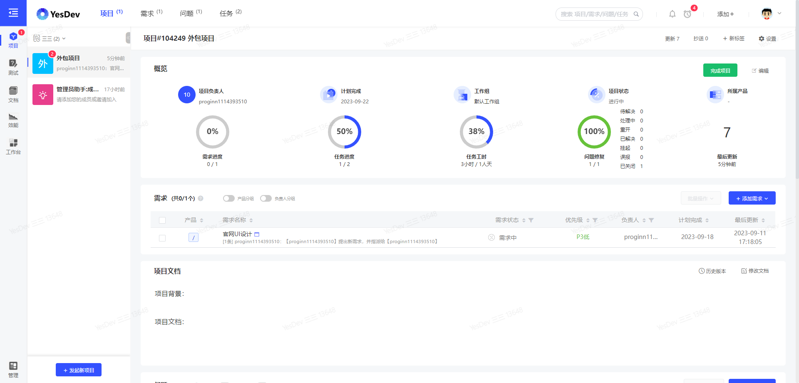  

在YesDev，你也可以通过【项目协作】-【项目管理】，查看更多的协作项目。  
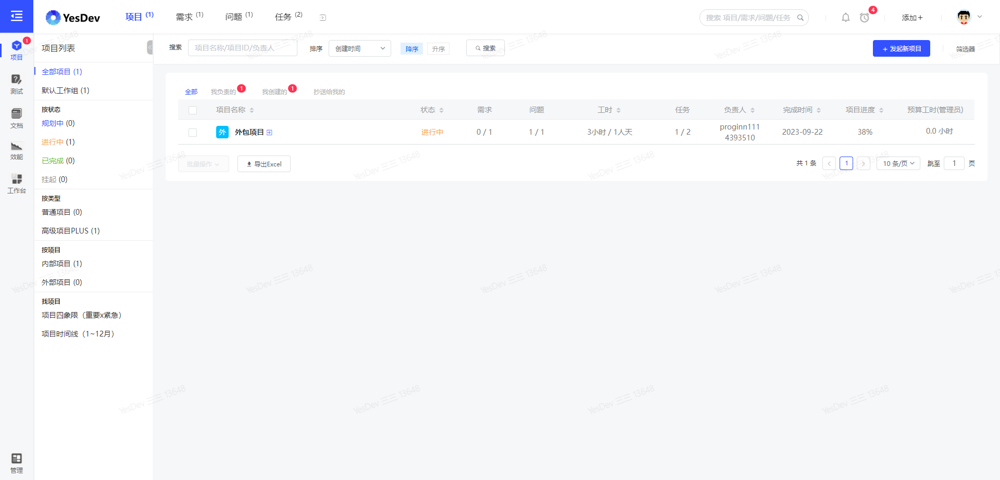  

## 我是程序员

登录程序员客栈，进入【工作台】-【我的工作】-【雇佣项目】，对【待接单】的雇佣，进行确认。  
   

确认没问题后，点击【接受】。  
  

### 访问YesDev项目协作

在程序员客栈的项目页面，可以点击【YesDev项目协作】访问。  
  

进入YesDev后，可以进行此雇佣项目的在线协作。  
  

在YesDev，你也可以通过【项目协作】-【外部项目】，访问和查看其他外部协作项目。  
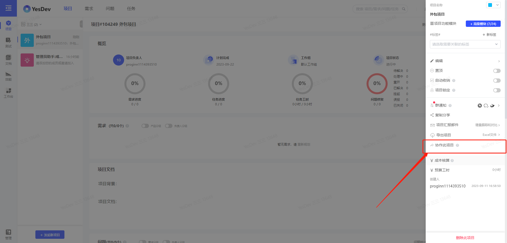 

### 添加任务

在YesDev的项目详情协作页面，可以根据工作需要，添加新任务，评估工时，填写计划完成的时间。  

   

### 完成任务

当完成自己添加的任务或者由客户指派的任务后，可以及时把任务状态修改为【DONE】。  

# 程序员客栈云端工和协作  

> 温馨提示：使用前，请使用你的程序员客栈账号授权登录。  

## 我是企业

### 发布远程工作
首先，企业客户需要在程序员客栈平台上，发起远程工作。  
  

发布后，等待平台审核和对接开发者。

### 开始协作

开发者接单后，登录进入YesDev即可和开发者、程序员一起远程协作。在【项目协作】-【项目管理】，可以查看最新创建的远程工作。
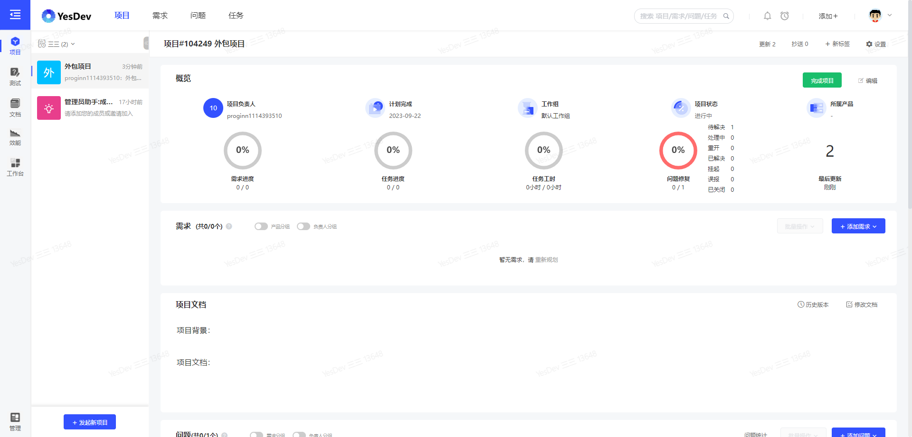  

进入项目详情页，可以对远程工作过程中的需求、任务和问题进行登记、共享和协作。
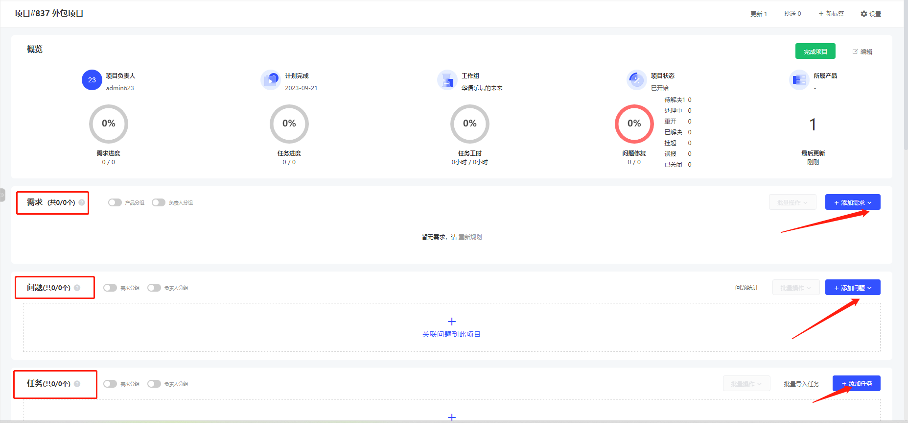  

## 我是程序员

### 确认接单
登录程序员客栈，可以看到新的云端工作。  
  

对于平台匹配的云端工作，确认后可接单。  
  

### 开始协作

成功接单后，登录进入YesDev即可和客户在线一起远程协作。在【项目协作】-【外部协作】，可以查看最新接单的远程工作。  
  

进入项目详情页，可以对远程工作过程中的需求、任务和问题进行登记、共享和协作。  
  

