# 2.3 项目管理 All In One

值得注意的是，YesDev中所定义和提倡的项目，是指在一定时间周期内完成的有限需求、任务和问题的集合，对应敏捷开发中的一次迭代或Scrumn的一个Sprint。除此之外，其他事务或技术专项也可以通过项目来进行统一管理和流转。简而言之，项目可以是：  

 + 某个版本迭代的需求  
 + 最近一周或两周的迭代需求  
 + 特定客户的定制化或服务项目  
 + 某个外包项目  
 + 创建项目  
 + 技术专项  
 + 重构项目  
 + 技术管理规范  
 + 前端组件库/后端框架项目  
 + 其他需要管理、流转和推进的事项……

项目有几个明显的特点：  
 + 特点1：有指定的唯一项目负责人，对结果负责  
 + 特点2：有指定的时间周期约束  
 + 特点3：需要完成特定的目标需求  
 + 特点4：有特定的场景以及最终需要输出或交付的内容  
 
# 2.3.1 发起新项目

进入左侧【项目】应用页面，可以通过【+ 发起新项目】，或通过点击顶部【项目】功能模块的【添加+】功能按钮，可以快速创建新项目。  

在创建新项目页面，首先填写相关项目信息，例如：项目名称、项目时间、项目负责人，最为重要的是，通过选择 **工作组** 可以限制当前项目的可见范围。  

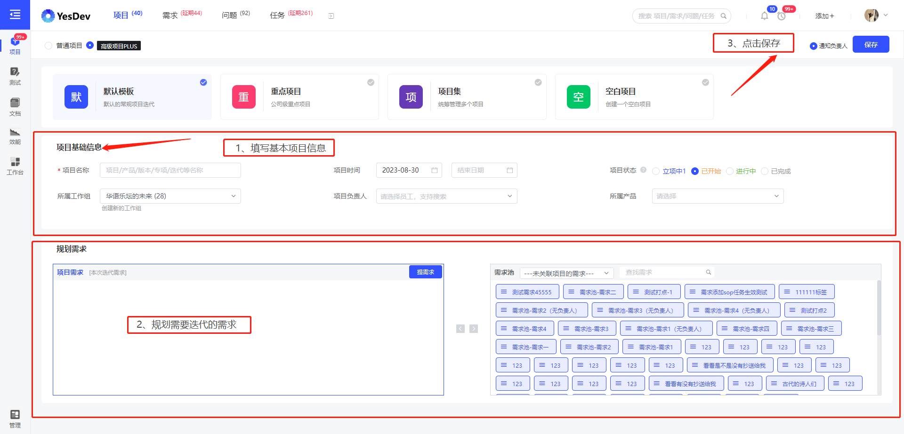  

## 演示视频

操作演示：如何发起新项目？  

创建空白项目，或敏捷项目，或选择其他常用的项目模板。创建项目后，可以继续勾选自己需要的协作工具组件；切换当前的其他项目，完成项目和重新激活项目。在项目列表可以查看全部的项目列表。  

[演示视频](https://yesdev.oss-cn-shenzhen.aliyuncs.com/video/yesdev-2024-07-31-103128.mp4 ':include :type=video controls width=100%')    

# 2.3.2 项目协作 
 
发起新项目后，即可在你的团队内部进行项目协作。协作的内容包括但不限于：  

 + 工作项：需求、任务、问题、项目文档、测试计划、敏捷看板、输出物……  
 + 统计类：概览、新手引导、排期表、燃尽图、甘特图、项目脑图……  
 + 通用类：链接、附件、备注、历史变更、知识库……  

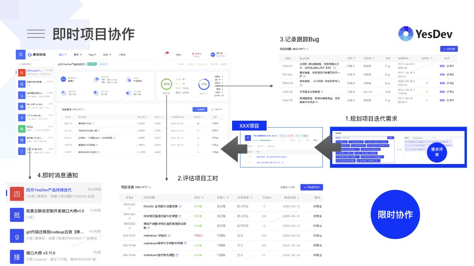  

其中，常用的工作项主要有：项目需求、项目任务和工时、项目问题。      

## 项目需求

项目需求，是指在本次项目中需要迭代完成和需求。项目需求可以来源于需求池中已评审的需求，也可以在创建项目后添加补充新需求，或者在项目过程中重新规则需求。  

  

## 项目任务

项目任务，是指为了完成以上项目需求或其他项目目标而需要执行的工作，例如：技术开发、测试、产品设计、会议沟通等。  
在分配任务的同时，可以评估对应的工时。  

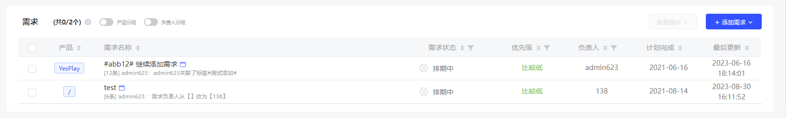

## 项目问题

项目问题，是指在软件提测后，在功能验收过程发现的Bug缺陷，以及项目发布上线后的线上故障、工单、后续产品优化等。  

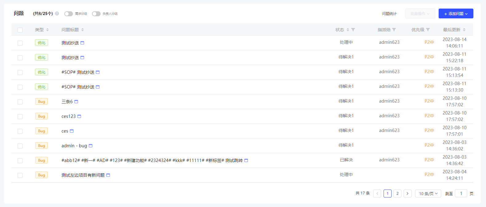  

## 演示视频

操作演示：项目负责人与普通成员两个人之间的项目管理和协作。

修改项目名称，项目负责人设定好项目需求、项目问题、项目任务后，由项目成员进行需求、问题和任务的录入和协作，最后100%完成全部的工作项。期间，有项目动态的实时通知和推送提醒。  

[演示视频](https://yesdev.oss-cn-shenzhen.aliyuncs.com/video/yesdev-2024-07-31-104646.mp4 ':include :type=video controls width=100%')

# 2.3.3 项目管理

项目协作是团队成员之间扁平化的协作，例如产品经理提交一个新需求给开发工程师，又如测试工程师创建了一个Bug并指派给开发工程师。  
另一方面，项目管理则更多是作为项目经理、技术负责人或老板，对整个项目的统筹、计划和对风险进度的控制。  

YesDev提供了以下几种对项目管理的方式。  

## 项目权限

通过工作组控制项目访问权限，支持：私有/保护/公开。 

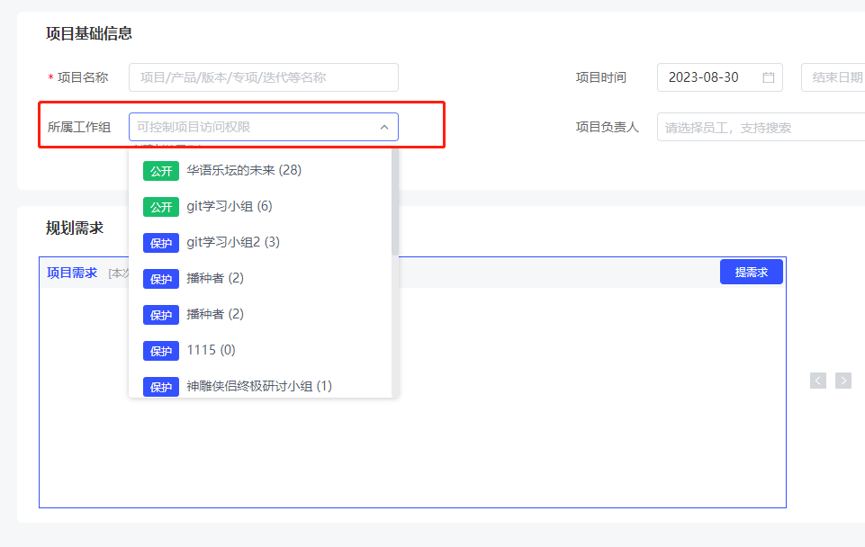 

对于单个项目内的 需求、任务、问题 权限，可以继续在项目【设置】-【项目内权限】- 选择：项目内公开、仅限负责人、相关干系人。  

 + 项目内公开：默认，跟随工作组权限；
 + 仅限负责人：创建人+负责人+企业管理员；
 + 相关干系人：延伸抄送人员；

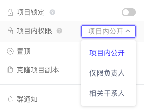  

> 温馨提示：只有项目负责人或创建人，才有权限修改项目信息。通常而言，企业管理员拥有全部权限。      

## 项目锁定

锁定后不可插入新需求、新任务。只有项目创建人或负责人，才有项目锁定和解锁的权限。  

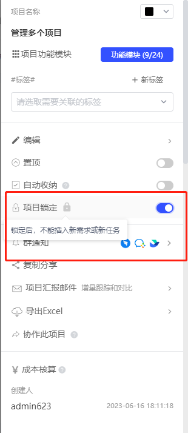  

## 自动收纳

自动收纳项目里已经完成的需求、任务和问题，简化工作。  

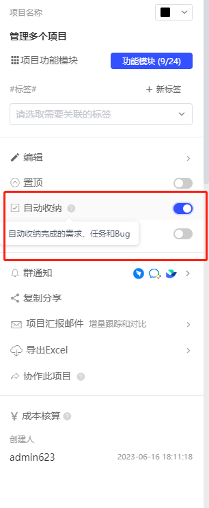  

## 项目置顶

可以顶置你重要的项目。  

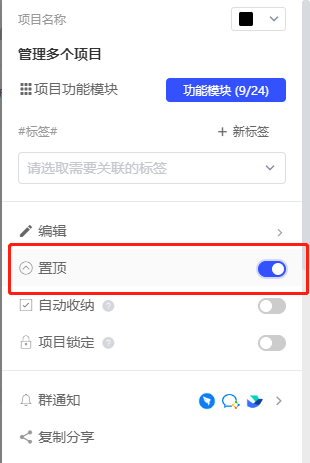  

## 项目导出

需求报价单中，增加需求成本费用栏，可对项目成本更精准核算。

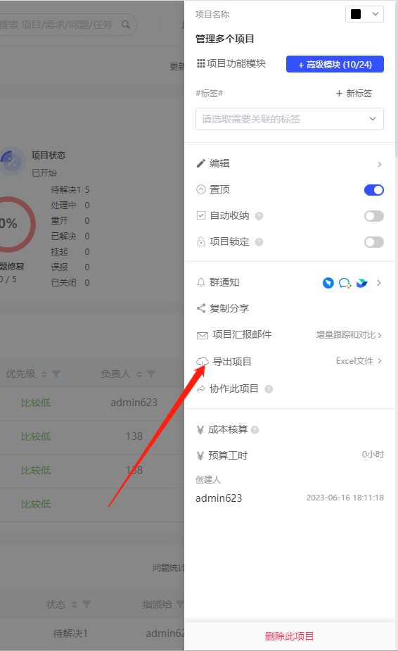 

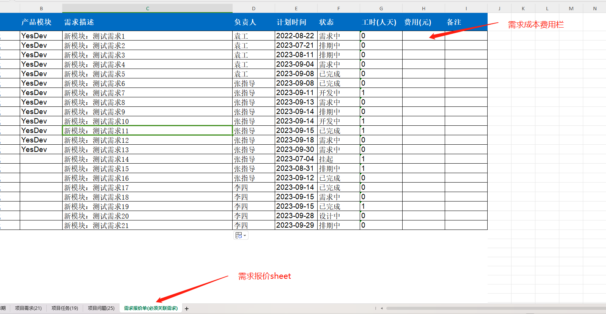 

## 项目颜色

自定义项目颜色，区分紧急和重要项目。  

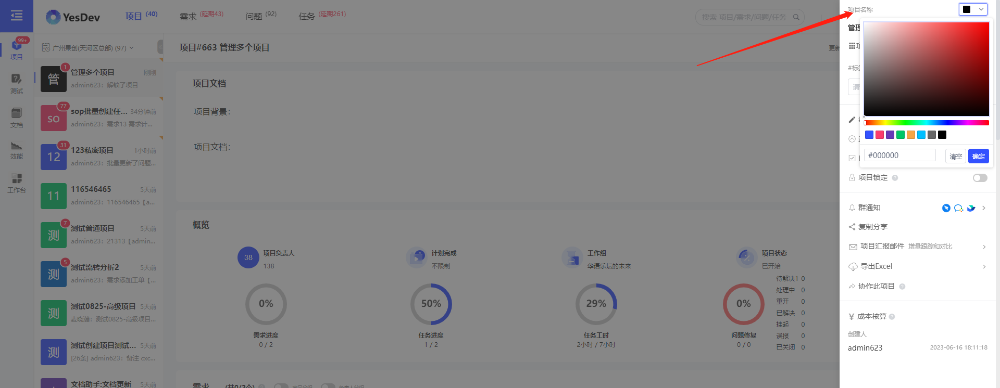  

## 研发成本核算

按单个项目或多个项目，对投入的研发成本和收益进行核算。  

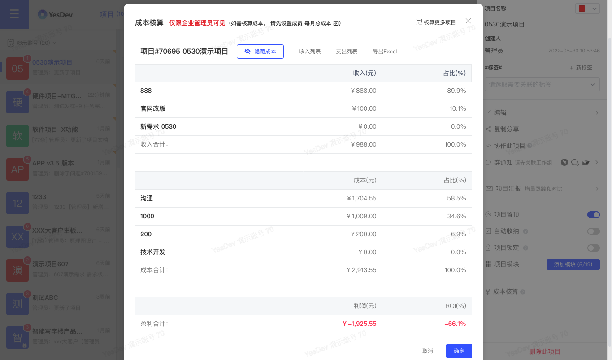  

还可以查看某个时间段内，多个项目的研发成本统计。  

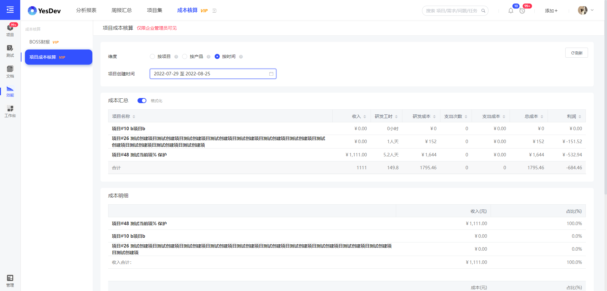  

如果需要查看整个团队的研发成本，即全部项目的汇总成本，可以在BOSS财报中查看利润燃尽图。  

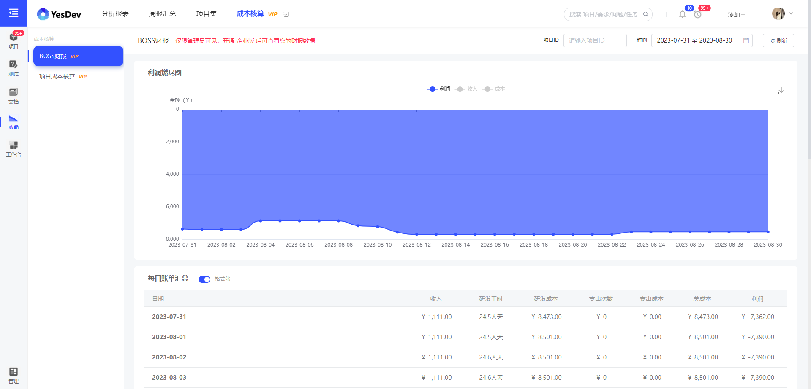  

> 温馨提示：研发成本的录入、查看，仅限企业管理员操作和查看。  

## 项目/需求/测试周报

定时汇总项目/需求/测试周报，支持增量对比和Excel附件发送。  

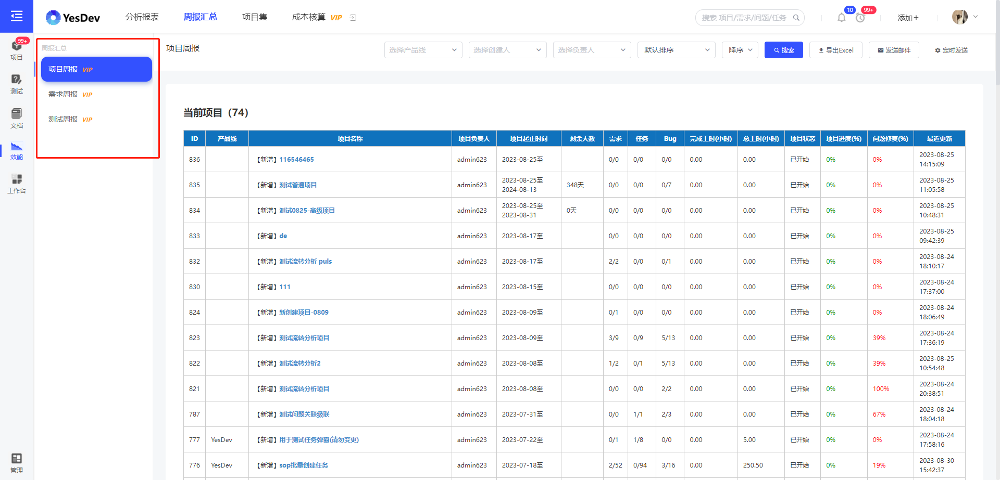  

##  项目/需求/开发/知识库文档

项目的文档、需求文档、开发文档、问题描述、知识库文档等历史修改版本，支持可视化差异对比。

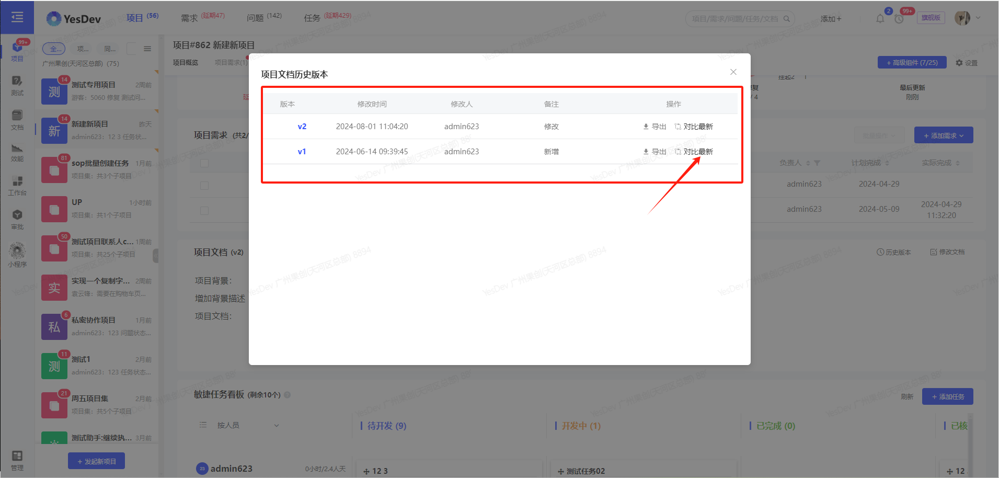  

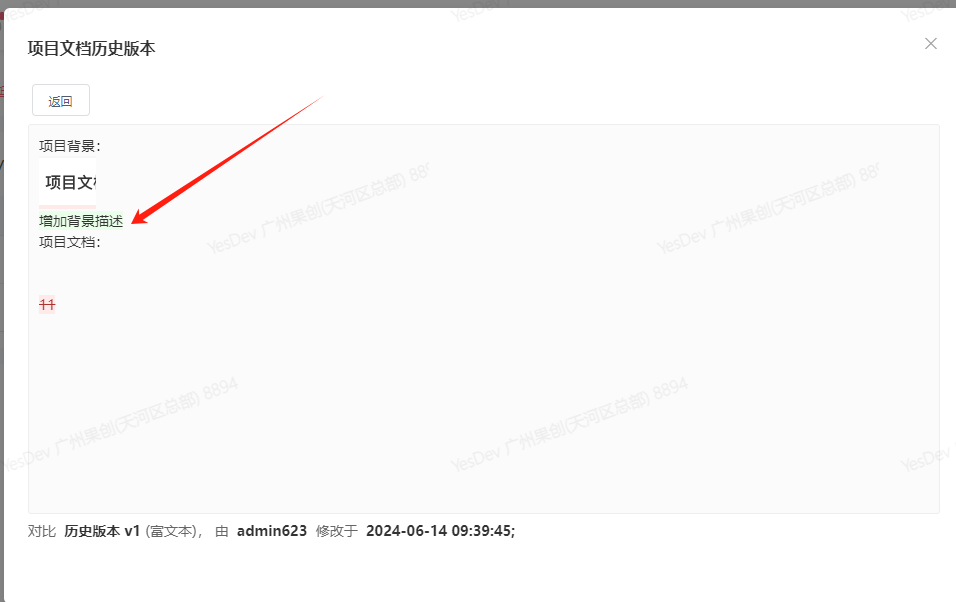  

## 演示视频

操作演示：项目管理的妙用有哪些？  

设置项目颜色（突出重点项目），项目置顶（帮你时刻固定你最关心的项目在最前面），项目锁定、项目导出Excel、一键生成项目报告（邮件+Excel）、灵活勾选搭配需要的项目工具和25个项目组件：项目概览、项目文档、项目需求、项目问题、项目任务、链接、附件、备注、历史变更、敏捷任务看板、测试计划、输出物、排期表、燃尽图、一键发布、项目脑图、甘特图、PRD、项目集、知识库、邮件、周报、客户反馈记录、开发计划表 、项目WBS（你所需要的，这里都有）。

[演示视频](https://yesdev.oss-cn-shenzhen.aliyuncs.com/video/yesdev-2024-07-31-105818.mp4 ':include :type=video controls width=100%')

# 2.3.4 项目集  

当需要维护、查看和关联多个项目的项目集时，在YesDev，你可以有多种途径。

## 项目集组件

你可以把项目集也当作一个特殊的项目。例如，发起一个新项目，并且项目组件选择【项目集】。  

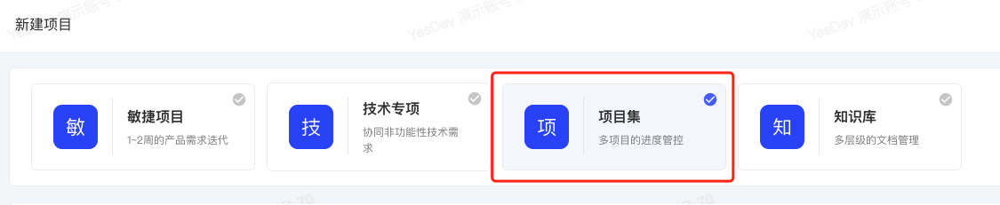  

随后，可以在项目集这个组件中关联任意多个项目，即可形成你需要的项目集和汇总信息。  

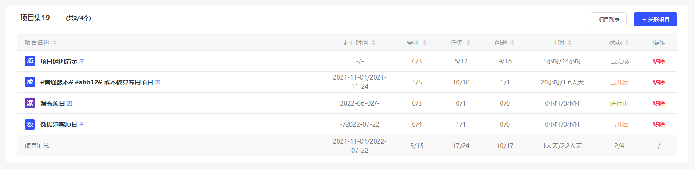  

## 工作组下的项目集

第二种方式，你可以通过项目的工作组来管理和维护你的项目集，除了可以控制项目访问权限，还可以进行项目列表的搜索、项目的快速过滤、分类和统计等。  

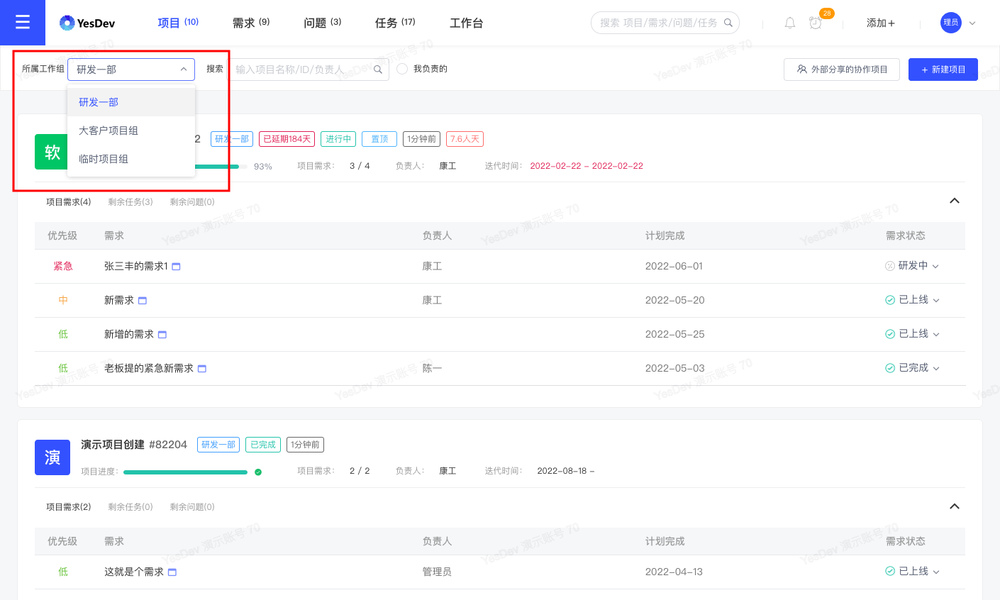  

## 通过标签管理项目集

最后，你也可以通过自定义标签来管理和关联某一类分散的信息。例如针对某位大客户下的项目、需求、任务等。  

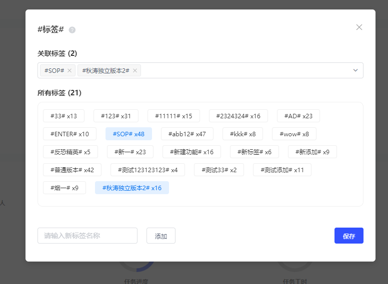  

添加标签后，可以在标签列表页进行搜索。  

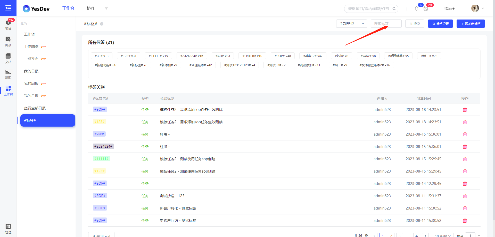  
    
## 多项目管理

更多关于项目集的管理，延伸阅读：[《2.6 多项目管理》](./project_set.md)。    

## 演示视频

操作演示：如何创建一个项目集？  

创建一个项目集，关联子项目，查看主项目，以及查看、管理多个子项目。  

[演示视频](https://yesdev.oss-cn-shenzhen.aliyuncs.com/video/yesdev-2024-07-31-112906.mp4 ':include :type=video controls width=100%')  

# 2.3.5 项目组件

项目组件是指可以为团队常用的协作习惯而设定的项目协作组件。    

## 单个项目的组件设置

支持手动调整单个项目的组件展示，任意组合，自由排序，可以勾选你所需要的项目插件组件。  

在项目详情页-【更多】-【项目组件】中，可以添加、删除和排序。  

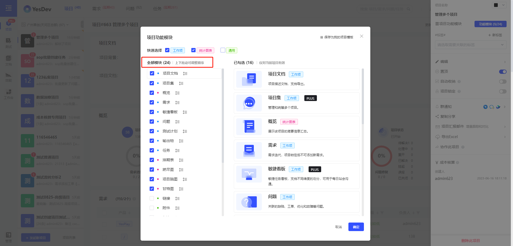  

## 全局默认项目组件设置

使用企业管理员账号，进入【企业管理后台】-【模块显示配置】-【项目组件显示配置】-【项目详情页】，可以设置团队默认的项目组件。  

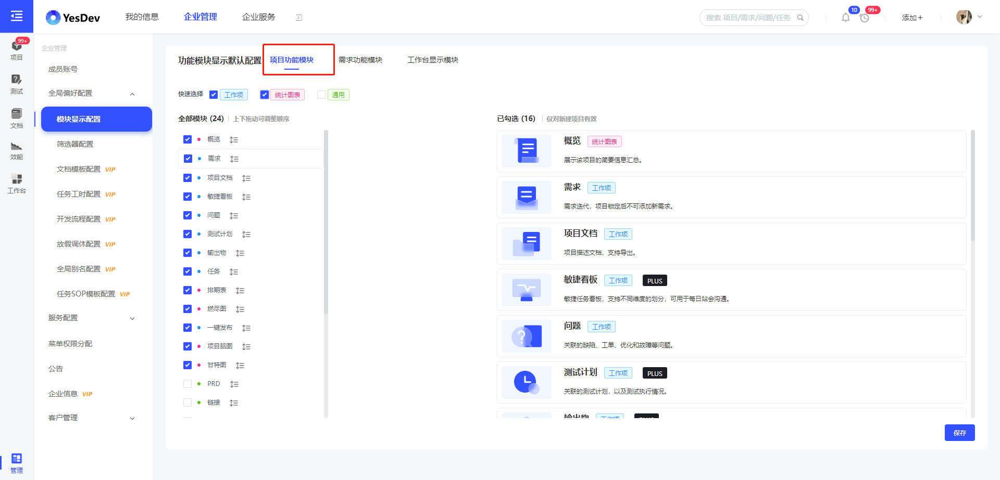  

## 自定义项目组件设置

你也可以创建和自定义你自己偏好的项目组件，创建后可用于自己新创建的项目。  

  

## 常用项目组件

YesDev根据敏捷开发、Scrum和互联网行业经验，预设了一些常用的项目模板，可以直接选择和使用。  

例如：  
 + 敏捷项目：1~2周的产品需求迭代
 + 技术专项：协同非功能性需求的技术专项
 + 项目集：多个项目的进度管控
 + 知识库：支持多目录层级的文档管理

  

# 2.3.6 项目插件组件

项目插件组件，是项目的功能和页面组成部分，可以自由组合使用。  

根据协作和工作的需要，主要分为三类插件组件。  
 + 工作项：和软件开发有关的工作内容，例如：需求、任务、问题、项目文档、测试计划、敏捷看板、输出物等。  
 + 统计图表：根据工作项信息，由系统自动汇总、计算和分析的统计数据，包括图表展示、表格数据等。这一类的插件最大特点都是只读。  
 + 通用插件：数字化办公和通用类项目协作中所需要用到的功能，例如：链接、附件、备注、历史变更、知识库……  

## 工作项

当前工作项，包括但不限于：  

 + 项目集：管理和统筹多个项目。  
 + 需求：需求迭代，项目锁定后不可添加新需求。  
 + 敏捷看板：敏捷任务看板，支持不同维度的划分，可用于每日站会沟通。 
 + 问题：关联的缺陷、工单、优化和故障等问题。  
 + 测试计划：关联的测试计划，以及测试执行情况。  
 + 输出物：不同阶段的制品输出物提交和汇总，支持流程配置。  
 + 任务：任务和工时，支持按需求分组。  
 + 项目文档：项目描述文档，支持导出。  

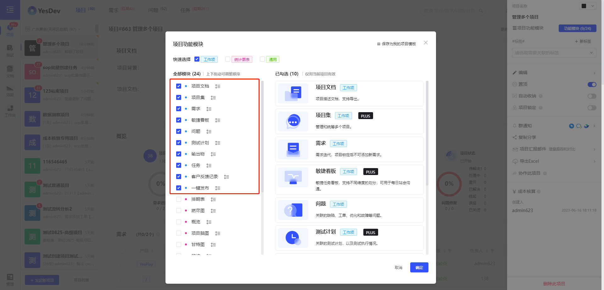  

## 统计图表

统计图表，主要有：  

 + 概览：展示该项目的简要信息汇总。  
 + 排期表：自动排期，根据任务评估和进度，实时汇总各人员的工时排期。  
 + 燃尽图：每日燃尽图，有利于及时把控项目延期风险。  
 + 新手引导：第一次接触敏捷开发和项目协作的新手引导。
 + 项目脑图：以脑图方式，宏观汇总和自动梳理项目的各类工作项。
 + 甘特图：七彩甘特图，有利于项目的提前规划和排期。 

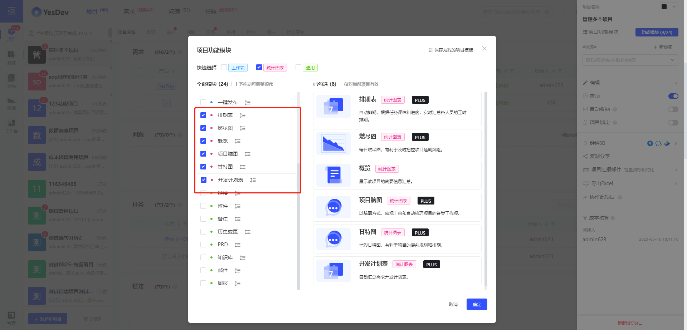  

## 超级甘特图

全新甘特图形式，新增任务分级展示，可自动按照项目/需求/任务的三级层次展示项目量化细节，快速掌握项目总体进度；

多项目全新展示，更清晰明了。

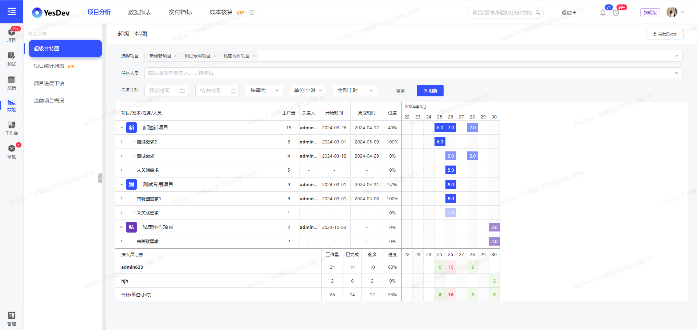

## 通用组件

最后一类是项目的通用功能。例如：  
 + 链接：重要的网站链接和测试账号。  
 + 附件：可以支持上传各类文件、图片和压缩包。  
 + 备注：项目下备注和留言，支持@操作。  
 + 历史变更： 项目的历史变更和操作记录。
 + 知识库：支持多层级的在线文档，帮助团队整理知识库。  

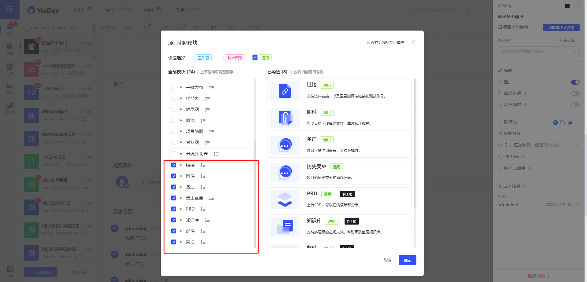  

## 演示视频

操作演示：25个项目小工具的功能介绍。  

[演示视频](https://yesdev.oss-cn-shenzhen.aliyuncs.com/video/yesdev-2024-07-31-114256.mp4 ':include :type=video controls width=100%')

# 2.3.7 外部协作和分享的项目

在YesDev，除了可以管理协作自己团队内部的项目，也可以和外部的团队一起协作分享的项目。   

## 协作邀请
在指定项目，你可以邀请外部的指定团队加入该项目协作，权限可以设置为【编辑】或【只读】。例如邀请甲方客户一起见证项目的推进和成果。  

## 外部协作
邀请外部团队加入项目协作后，即可一起共享项目信息。  

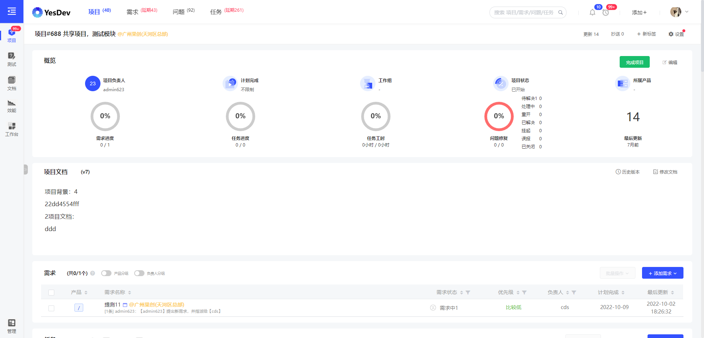   

基于YesDev结构化的项目信息，你和你的团队，可以更快速进行密切的协作。例如有：自动生成项目汇总邮件、一键复制项目信息、自动生成项目燃尽图，更多实用功能，等你来发现！

## 演示视频

操作演示：邀请外部团队一起在线协作你的项目。  

[演示视频](https://yesdev.oss-cn-shenzhen.aliyuncs.com/video/yesdev-2024-07-31-115356.mp4 ':include :type=video controls width=100%')

# 2.3.8 分享项目给你的客户

YesDev上线【分享给客户】功能，可帮助客户领导快速查阅和掌握项目、需求、问题的进展，从而实现高效协作。

打开项目/需求/问题的详情页，点击右上方“设置”功能按钮，打开右侧功能栏，找到分享给客户设置；即可设置访问密码、水印内容、有效期限等信息，进行分享内容预览；

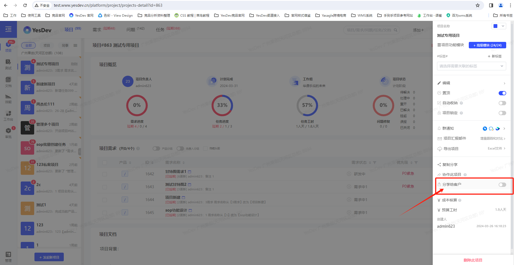  

在【分享设置】处，可设置访问密码、水印内容、有效期限、内容模块等信息，保存设置后，可进行分享内容预览以及复制分享链接；

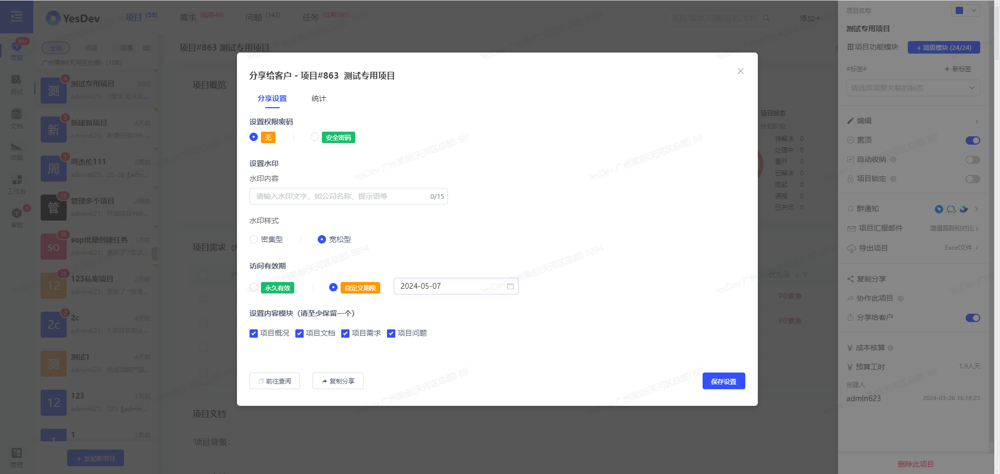  

在【分享给客户】弹窗，可查看分享统计，统计查看分享链接的IP地址、访问时间、客户端类型、访客类型信息，可按照时间范围进行筛选；

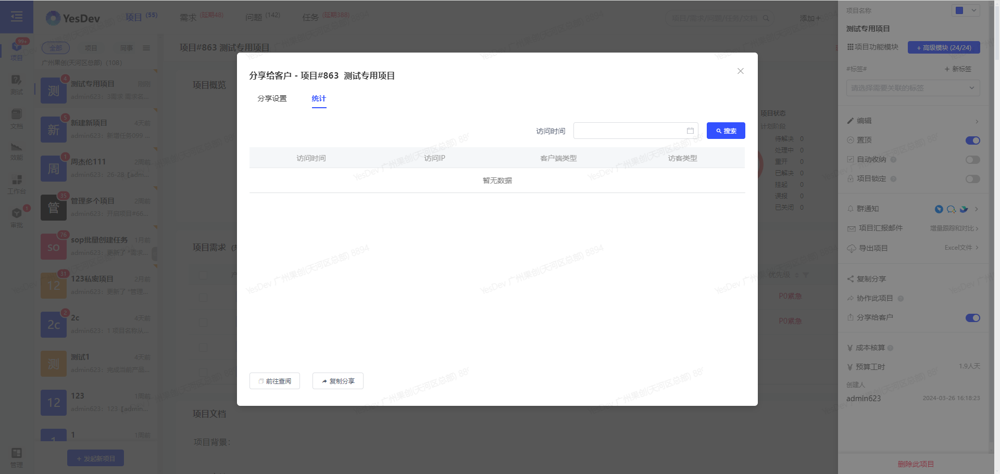  

分享给客户内容展示版面如下，可直接打印和下载成PDF格式，方便客户留档保存，也可通过手机扫码查看。

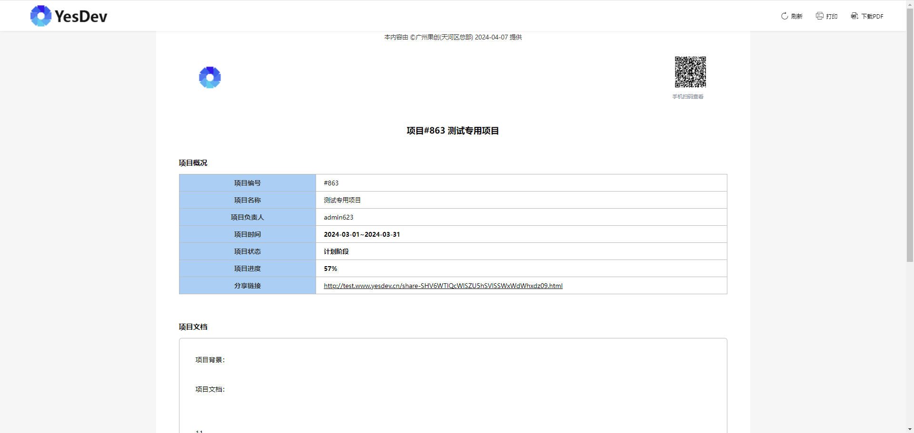  

## 演示视频

操作演示：分享项目给你的客户。  

[演示视频](https://yesdev.oss-cn-shenzhen.aliyuncs.com/video/yesdev-2024-07-31-120540.mp4 ':include :type=video controls width=100%')

# 2.3.9 同事项目

为了方便产品经理，项目经理以及领导办公，YesDev内部研发“同事项目”，可自动汇总查看我指派给其他同事的需求/问题/任务；

查看其他同事的需求/问题/任务进度更便捷，更高效，并且可自动统计进度，提取相关事项。【同事项目】项目名称，显示当前指派的同事项目名称，可自定义编辑修改；

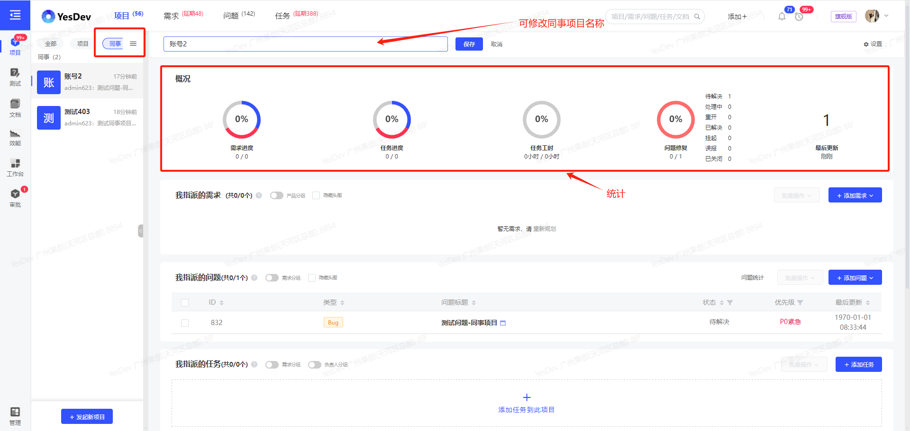  

点击【设置】功能，可在右侧功能栏，进行修改项目名称/颜色操作，以及关联标签，置顶、自动收纳、清空项目，底部还可以进行移除项目操作。

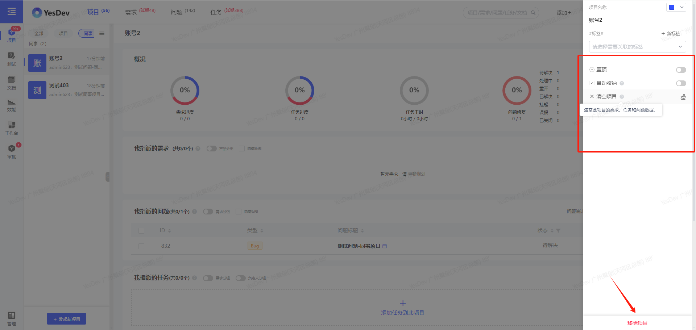  

## 演示视频

操作演示：同事项目，汇总上级或同事指派的工作。

[演示视频](https://yesdev.oss-cn-shenzhen.aliyuncs.com/video/yesdev-2024-07-31-121349.mp4 ':include :type=video controls width=100%')

