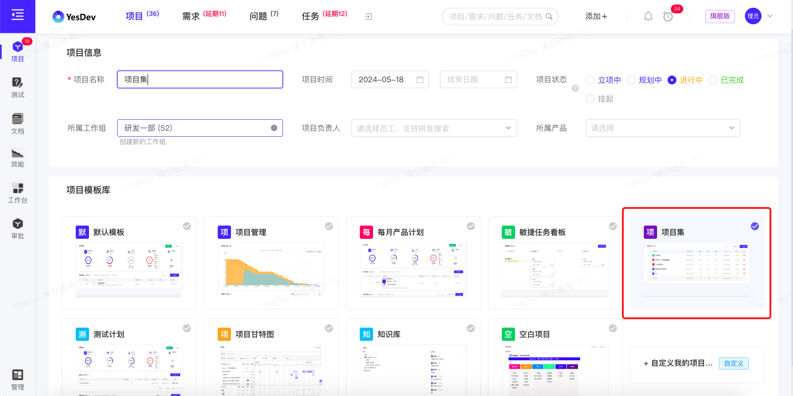
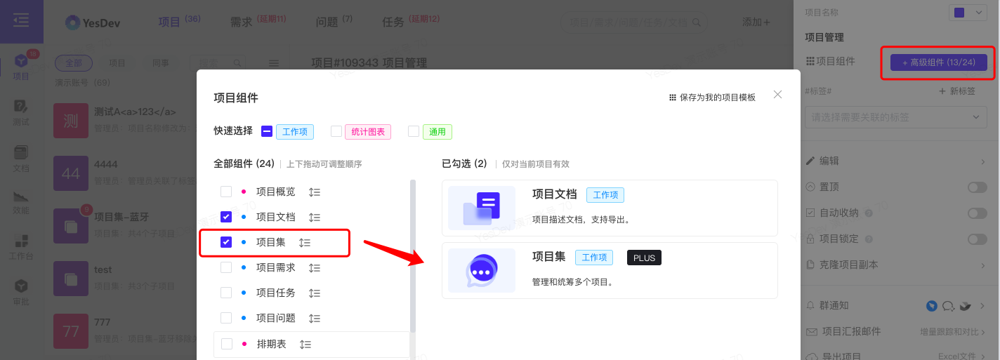
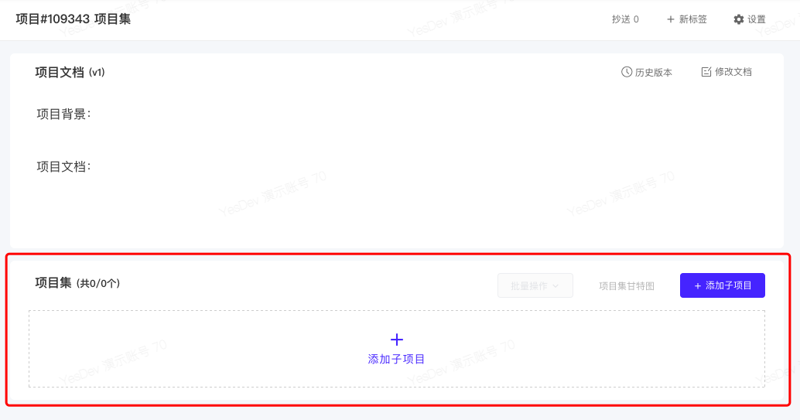
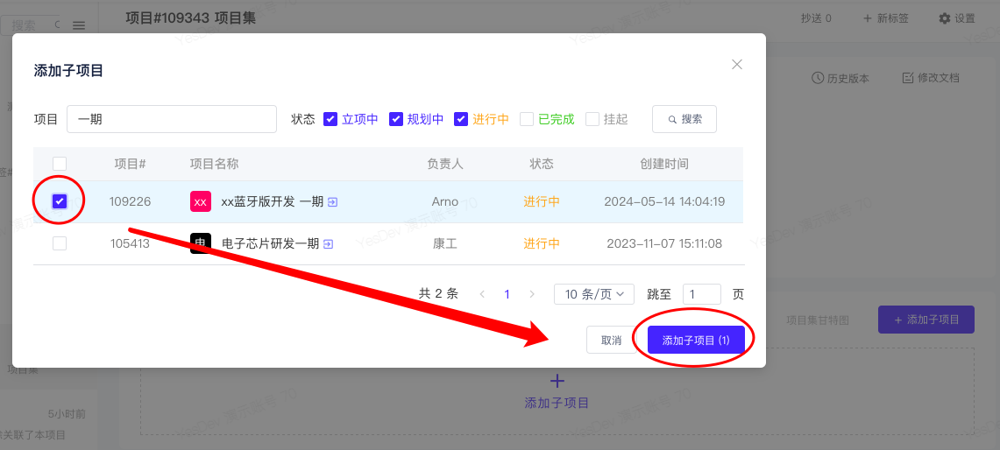
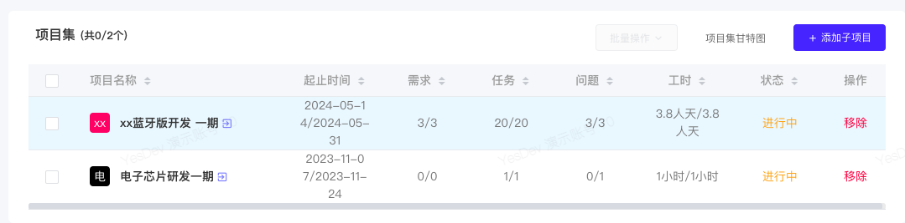
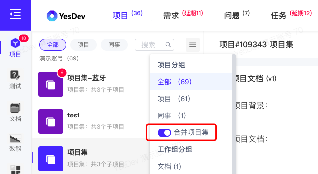
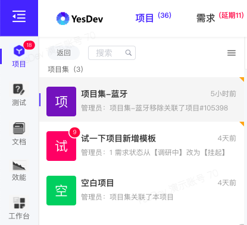
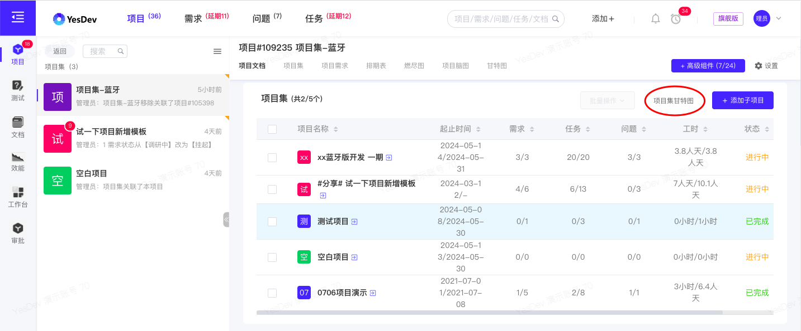
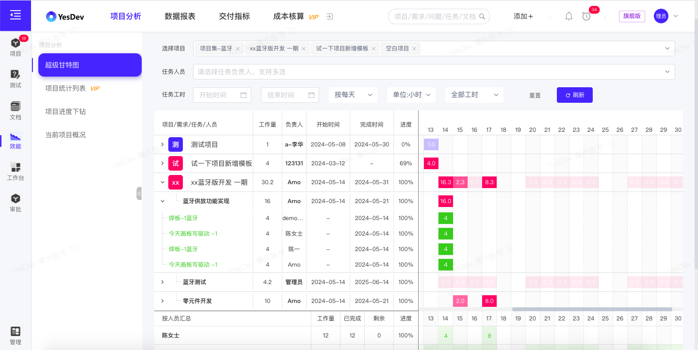
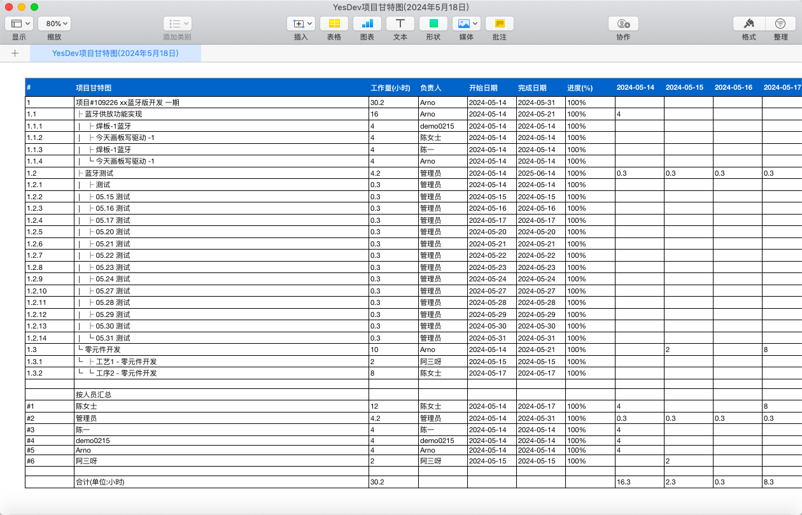

# 2.6 多项目管理

项目管理协会（PMI）把项目集定义为“经过协调管理以便获取单独管理这些项目时无法取得的收益和控制的一组相关联的项目。”协调管理是为了获得对单个项目分别管理所无法实现的利益和控制。项目集中可能包括各单个项目范围之外的相关工作。一个项目可能属于某个项目集，也可能不属于任何一个项目集，但任何一个项目集中都一定包含项目。

在YesDev，你可以实现多项目的管理，以及项目集的维护。  

# 2.6.1 创建项目集

在创建新项目时，选择【项目集】模板，然后创建新项目。  

  

或者，可以在现有的项目中，通过【设置】-【+ 高级组件】- 选中【项目集】组件，然后【确定】。   

  

即可使用【项目集】组件功能。     

# 2.6.2 关联添加子项目

在【项目集】组件，点击【添加子项目】。  

  

在【关联子项目】弹窗，搜索和批量关联所需要的子项目。  

  

> 温馨提示：一个子项目最多只有一个父项目。      
    
如果需要取消子项目，可以点击【移除】。  

  

# 2.6.3 查看项目集菜单和切换项目集

在左侧项目菜单列表，可以通过【合并项目集】开关，控制是否收纳合并项目集。关闭时取平铺展开全部子项目。      

  

点击任意 项目集 ，可以进入到对应项目集的子项目菜单列表，点击【返回】可以返回上一级菜单。  

  

> 温馨提示：项目集或子项目 完成后，将不会在项目菜单显示，而是自动进行归档到项目列表。      

# 2.6.4 项目集的超级甘特图与Excel导出

在项目集详情页，在【项目集】组件，点击【项目集甘特图】。  

  

进入到此项目集的多个子项目的甘特图，同时包含项目集本身的甘特图。  

能够直观、方便、快速查看人员交叉、项目交叉、任务交叉等情况和合并多个项目后统计。  

  

点击【导出Excel】，可以导出项目集的甘特图。例如：  

  

# 2.6.5 项目集本身的管理

项目集本身的管理，与普通项目一样，可以使用的组件，包括但不限于：项目概览、项目需求、项目文档、项目任务、项目问题等，用于管理除子项目以外的工作项。  

## 演示视频

操作演示：项目集的管理和超级甘特图    

在项目集中，添加、关联或移除子项目。查看项目集内多个项目的超级甘特图，合并查看项目、任务、人员交叉的情况，导出项目甘特图Excel，甘特图支持合并多个项目，支持多层级嵌套：项目-需求-任务，包括开始时间、完成时间、完成进度和任务工时。

[演示视频](https://yesdev.oss-cn-shenzhen.aliyuncs.com/video/yesdev-2024-07-31-170727.mp4 ':include :type=video controls width=100%')  

