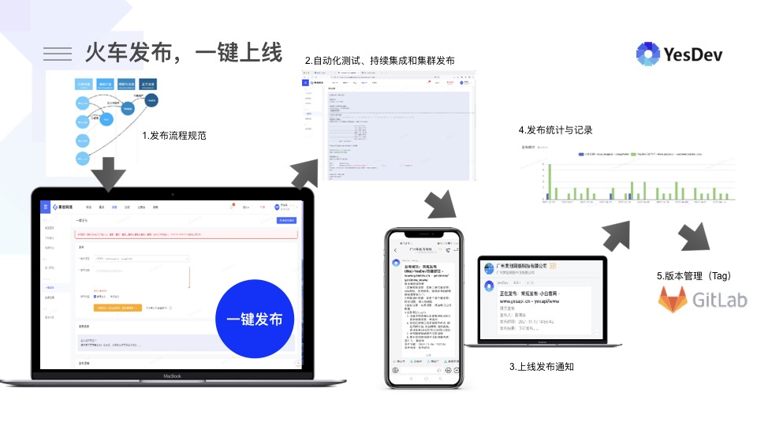

# 4.11 发布

## 一键发布接入

在完成项目的需求开发、功能测试和验收后，就可以进行代码和发布和上线。  

你可以继续使用原来的发布方式，也可以接入到YesDev实现一键发布和统一的发布流程控制。  

> 温馨提示：有关一键发布，请参考 [YesDev一键发布接入指引](./release)  

## 发布体系

结合YesDev，从发布到记录到统计，你可以构建你团队的发布闭环。  

