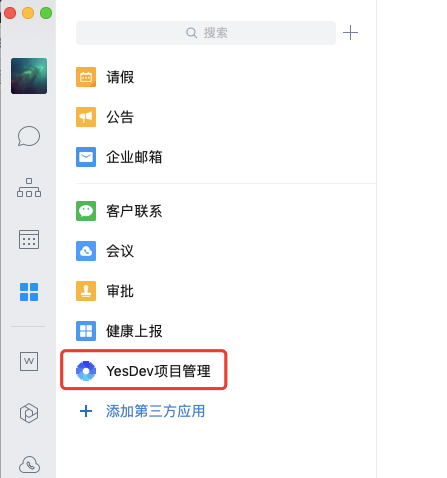
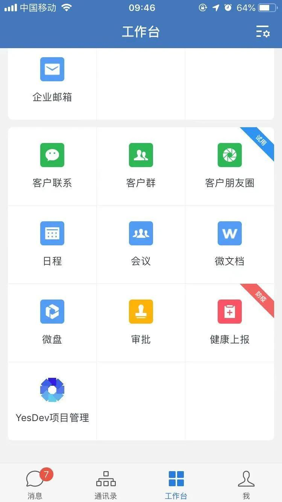
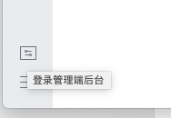
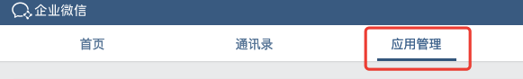
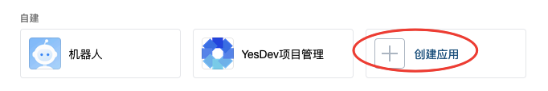
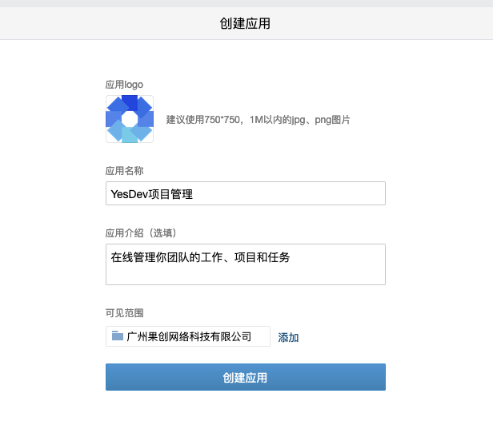
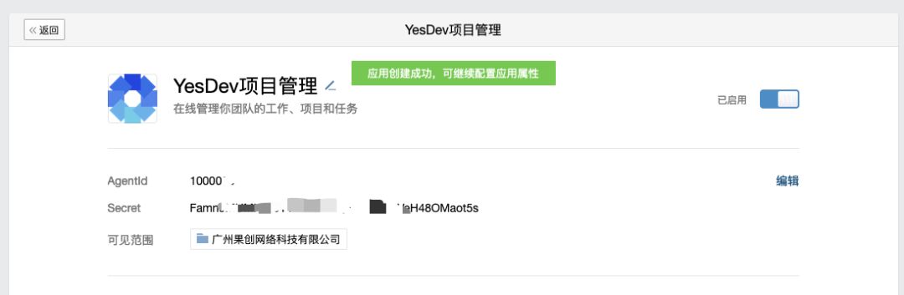
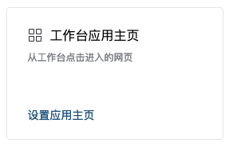
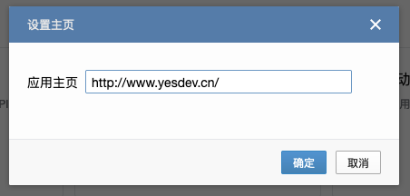

# 在企业微信中集成YesDev


根据企业微信官网显示，

> 企业微信是唯一能跟微信互相拉通的商务软件，这意味着，通过企业微信，企业能够触达并服务12亿微信用户
>
> 企业微信

并且，企业微信官网还显示，80%的中国五百强企业都在使用企业微信。


可以说，企业微信对外是沟通、联系和触达客户的有效途径，对内是有效的办公和协助工具。

在企业微信中，可以集成更高效的项目管理工具——YesDev。它可以在线管理你团队的工作、项目和任务。不仅能友好地融合到企业微信中，还可以免费注册和使用，任何行业的企业团队都适用。

以下是在企业微信配置YesDev集成入口配置的简明教程。


# 在企业微信中添加YesDev应用

为了方便在企业微信中直接使用YesDev工具，需要先添加YesDev应用。


最终效果如下：

PC版企业微信：

  

手机版企业微信：

  

首先，用电脑打开企业微信，在左下角，找到【登录管理端后台】。

> 企业微信管理后台登录：https://work.weixin.qq.com/wework_admin/loginpage_wx?from=myhome 。  


  

切换到【应用管理】，

  

在【自建】分类中，点击：【创建应用】，

  

在创建应用页面，输入：

应用logo：

  

应用名称：

YesDev项目管理

应用介绍：

在线管理你团队的工作、项目和任务

  


可见范围，选择当前自己的团队或企业即可。效果如下，然后创建应用。

  

成功创建后，

  

接下来，还有一步很重要的，在工作台应用主页，点击【设置应用主页】。

  

在弹窗中输入 **应用主页为：https://www.yesdev.cn/platform/project/projects-detail ** 。  

  

温馨提示：如果属于私有部署，请使用专门的企业独立域名，例如：  
```
https://企业独立域名/platform/project/projects-detail
```

到此，配置完毕，可以开始使用啦！

# 使用YesDev在线管理团队的工作、项目和任务

在你的企业微信中，配置好YesDev后，打开应用，成功登录后，就可以进行项目管理。

