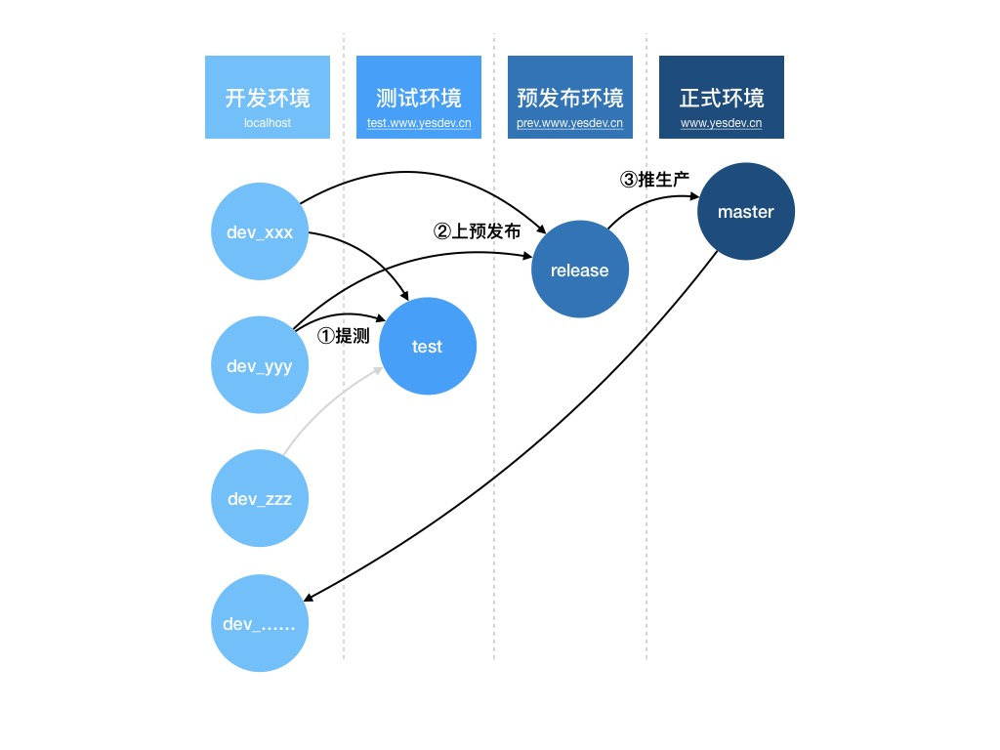
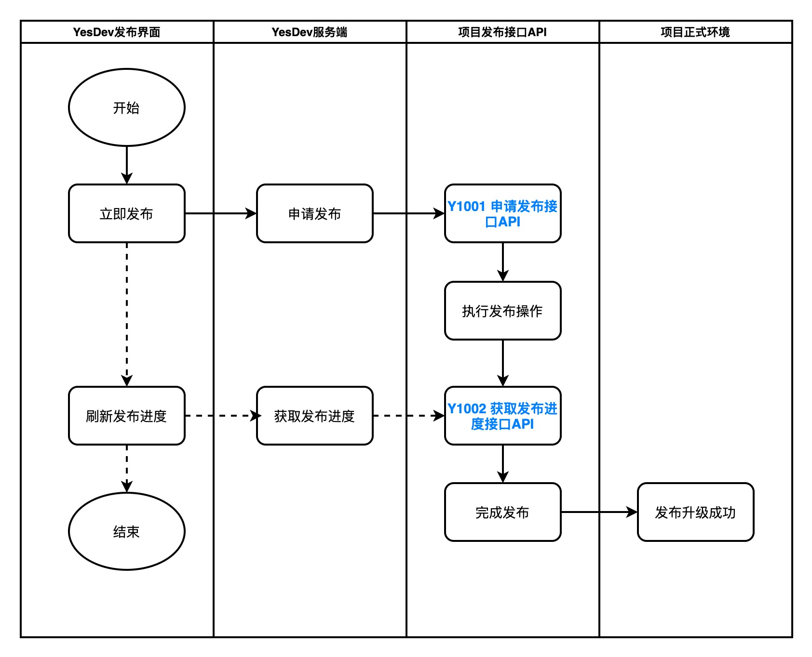

# YesDev一键发布接入指引

接入一键发布后，其好处包括但不限于：  

 + 和项目管理和迭代，进行更完整的管理和闭环  
 + 可以统一控制发布权限和发布时间窗口  
 + 可以在钉钉群等接收到上线发布的通知  
 + 发布界面化小白安全操作，特别服务器的命令行危险操作  
 + 可以深度定制和配置自己的发布脚本，实现自动化部署和上线  

## 一键发布示例效果

进入一键发布操作界面，选择需要发布的项目、发布的类型以及填写发布的更新内容，然后立即发布。  
  

确认发布（避免忽略发布须知）：  
  

发布过程中，会实时刷新发布进度：  
  

发布完成后，即发布成功或发布失败，都会有即时的群通知。例如钉钉群通知：  
  

然后，就可以进行线上验收，完成本次发布了。  


## 分支合并、环境规范和发布流程  

以下是参考的发布流程，从一个抽象的需求到最终的发布上线，中间会经历代码分支合并、环境部署和更新、以及相关的发布流程。  

   

## 发布接入配置

当确定好或设计好自己产品的发布流程和规范后，就可以进行一键自动化发布，同时接入YesDev进行界面化智能的控制。  

当需要接入发布时，你需要填写并提供以下信息：  

 + **发布项目名称**：推荐写法，项目名称-项目域名-Git仓库名称，提升项目识别度  
 + **每周发布窗口**：每周可以进行发布的日子，通常不建议周五、周六、周日 进行发布操作  
 + **每天发布时间段**：每天可以发布的时间段，支持多个，强烈推荐不要在业务高峰期间进行发布操作  
 + **发布须知**：每次发布前必读内容，提供团队的注意事项  
 + **发布类型**：由自己决定，你可以进行全量发布，也可以进行迷你发布，取决于你要如何更新  
 + **Y1001 申请发布接口API**：请参见后续详细说明  
 + **Y1002 获取发布进度接口API**：请参见后续详细说明  
 + **业务监控页面链接**：方便发布后及时查看对业务的影响  

> 温馨提示：非发布窗口时间，仅限发布管理员进行发布，普通成员将冻结发布。  


  

## 项目发布接口

在接入YesDev发布系统前，你需要为项目提供以下两个发布接口。分别是：  

 + **Y1001 申请发布接口API**  
 + **Y1002 获取发布进度接口API**  

### Y1001 申请发布接口API
成功申请返回格式：  
```
OK!
```
> 格式：最后一行必须以大写的```OK!```（注意最后有英文叹号）结束，前面可选添加提示信息。  
> 温馨提示：请允许YesDev的IP进行访问：```120.76.246.183``` 。  

失败返回格式示例：  
```
请不要重复发布
ERROR!
```
> 格式：最后一行若以大写的```ERROR!```（注意最后有英文叹号）结束，前面可选添加错误提示信息。  
> **注意：发布过程中，一旦出现 ```ERROR!```，就会被系统认定是发布失败！**  

模拟发布示例接口：  
[https://www.yesdev.cn/demo/release.php](https://www.yesdev.cn/demo/release.php)  

### Y1002 获取发布进度接口API
发布成功并结束后，返回格式示例：  
```
发布进度提示……
发布进度提示……
发布进度提示……
发布进度提示……

OK!
```
> 格式：最后一行若以大写的```OK!```（注意最后有英文叹号）结束，前面可选添加提示信息。  
> **注意：发布过程中，一旦出现 ```ERROR!```，就会被系统认定是发布失败！**  

发布失败或有错误，返回格式示例：
````
发布进度提示……
错误信息……

ERROR!
```
> 格式：最后一行若以大写的```ERROR!```（注意最后有英文叹号）结束，前面可选添加错误提示信息。  
> **注意：发布过程中，一旦出现 ```ERROR!```，就会被系统认定是发布失败！**  

发布进行中返回格式示例：  
成功或失败，都会停止更新发布进度。在此中间，正常显示发布进度即可，最后不需要带结束标志。例如：  

```
发布进度提示……
发布进度提示……
发布进度提示……
```


模拟发布中接口示例：  
https://www.yesdev.cn/demo/releaseProgress.php?type=0

模拟发布成功接口示例：  
https://www.yesdev.cn/demo/releaseProgress.php?type=1

模拟发布失败接口示例：  
https://www.yesdev.cn/demo/releaseProgress.php?type=2

（你可以使用上面这些示例，进行发布接入的测试）


## 发布接入流程图

  

## 发布脚本shell

由于发布具备私密性，不在此公开发布脚本。如有需要，可联系我们，获取发布脚本以及持续发布的解决方案。  

 
