# 2.4 任务和工时登记

任务是最小的工作项，工时是可以对研发产能进行量化。  

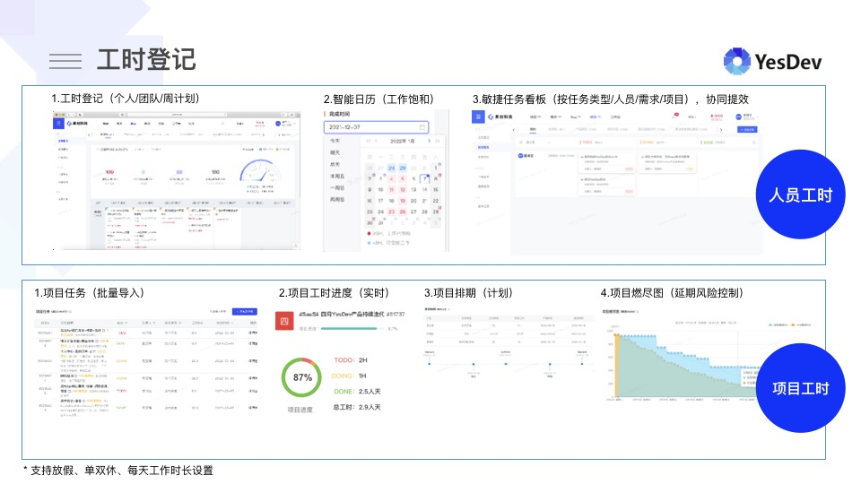  
 

# 2.4.1 员工工时

## 工作组工时登记配置

针对于工作组，你可以开启/关闭工时登记。关闭工作组的工时登记后，整个工作组将取消工时登记，重新开启后恢复。  

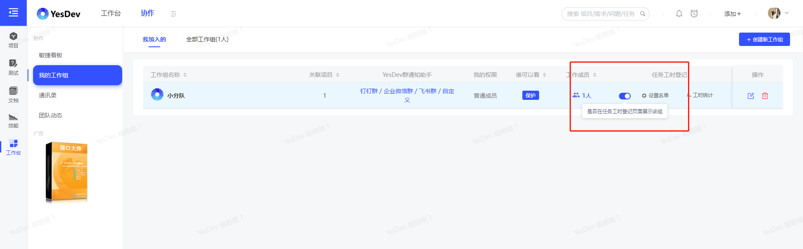  

在同一个工作组内，对于不需要登记工时的成员，可以设置为隐藏名单。即可排除该成员的工时登记。  

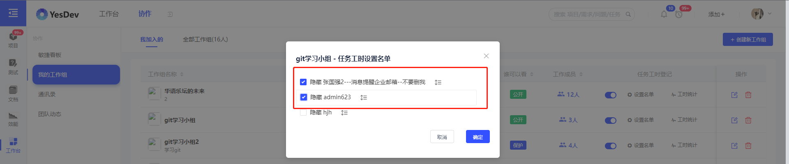  

> 温馨提示：工作组的管理员，才能权限开启/关闭工时登记，以及隐藏名单。      

## 每日/每周的工时登记 

在【工时登记】，你可以按个人、按部门、按工作组进行工时的查看、统计以及快速登记。  
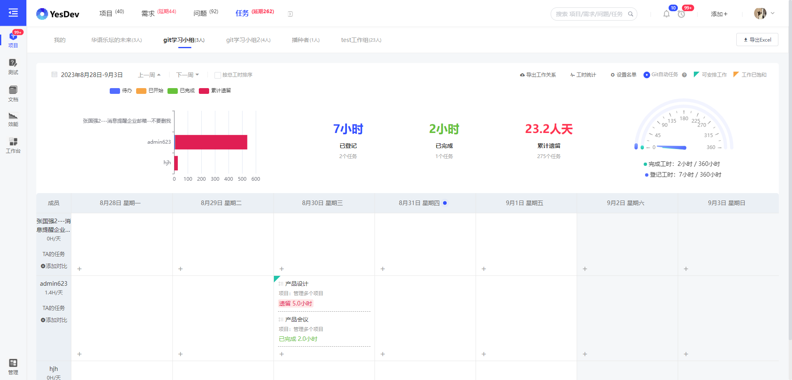  

你也可以把任务关联到项目、需求或问题。  
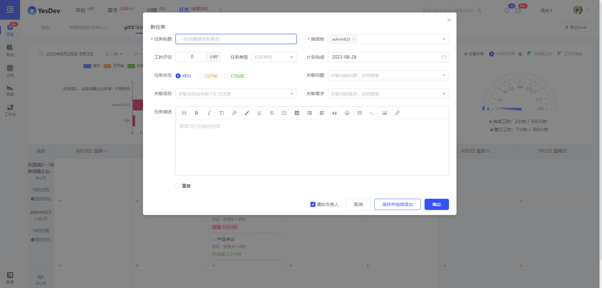  

## 实际工时登记

在任务栏，点击新建任务，弹出弹窗；点击【更多设置】，可填写实际工时；同步可以填写父任务ID，关联任务；点击确认按钮，新建任务完成，系统会自动汇总任务工时数据；  
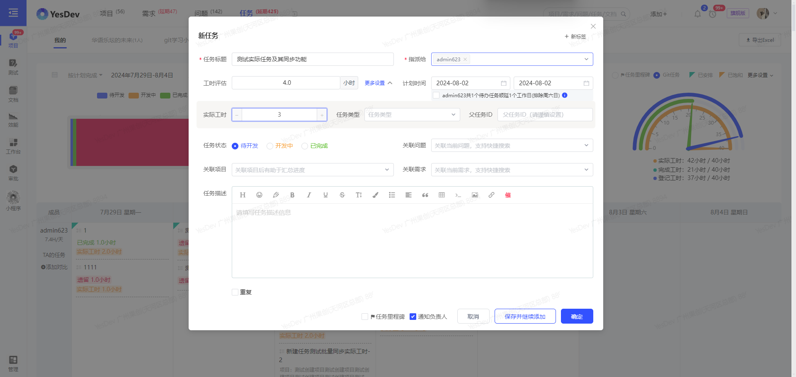  

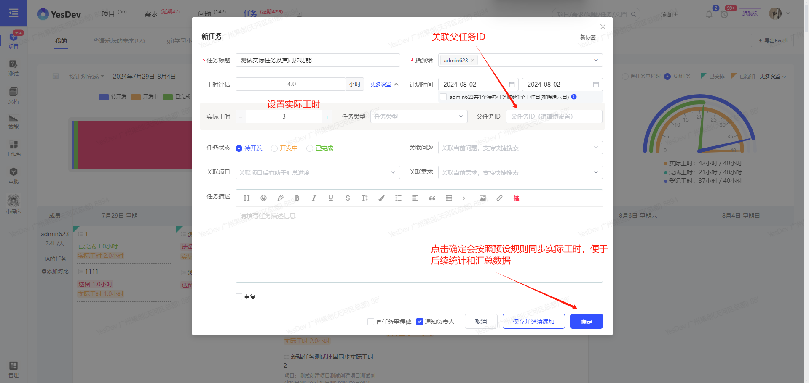  

任务面板可查看具体的实际工时，顶部工时统计汇总实际工时总工时和任务总个数；仪表盘增加的黄色圆环为实际工时的汇总统计。  

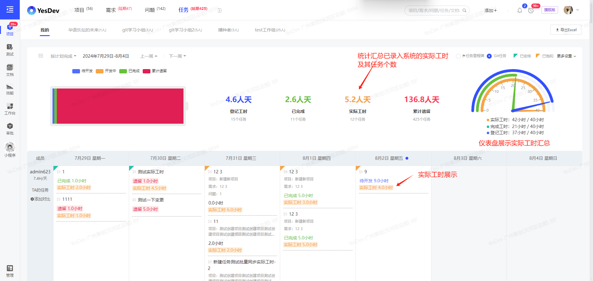  

## 工作负荷分析

在 工作台-我的任务，可以查看自己的工作负荷分析统计图表，类似如下：   

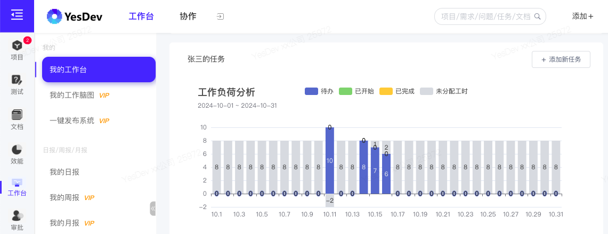  

此外，在【效能】-【数据报表 】-【工作负荷分析】，管理员可以指定成员、以及时间范围的数据查询。    

## 演示视频

操作演示：每周工时登记，以及查看我的遗留任务。切换到团队的每周任务，设置工时登记白名单。  

[演示视频](https://yesdev.oss-cn-shenzhen.aliyuncs.com/video/yesdev-2024-08-02-171916.mp4 ':include :type=video controls width=100%')

# 2.4.2 项目工时

## 评估开发任务

根据项目的背景、约束和既定的目标需求，分工并拆解评估自己的开发任务。  

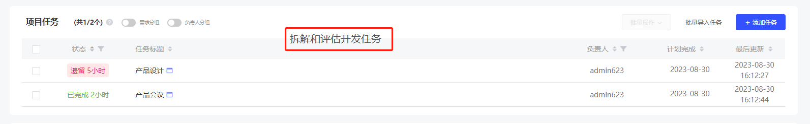  

开发人员评估任务后，就可以自动汇总得到项目的总工时以及实时的项目开发进度。  
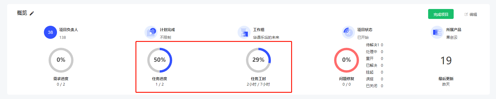  

进一步，我们还可以得到项目的排期和项目燃尽图、开发计划表等各类统计数据报等其他信息。  

例如，项目燃尽图，  
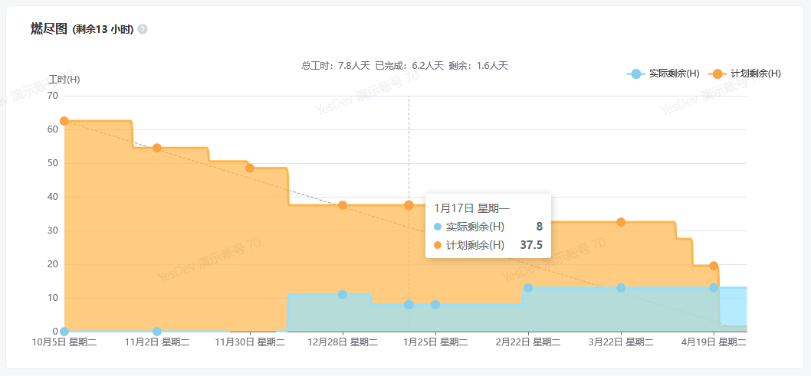  

又如，开发排期计划表， 
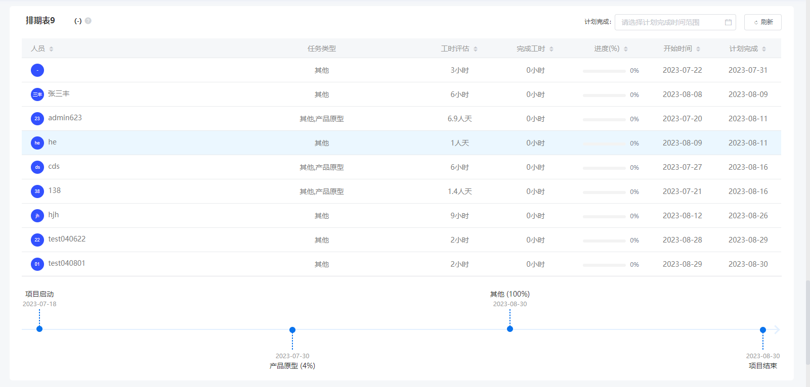  


## 敏捷看板和每日站会  

在项目推进过程中，为了保证项目进度和控制项目风险，可以通过每日10分钟左右的站会，结合敏捷看板，快速同步项目的开发进度。  

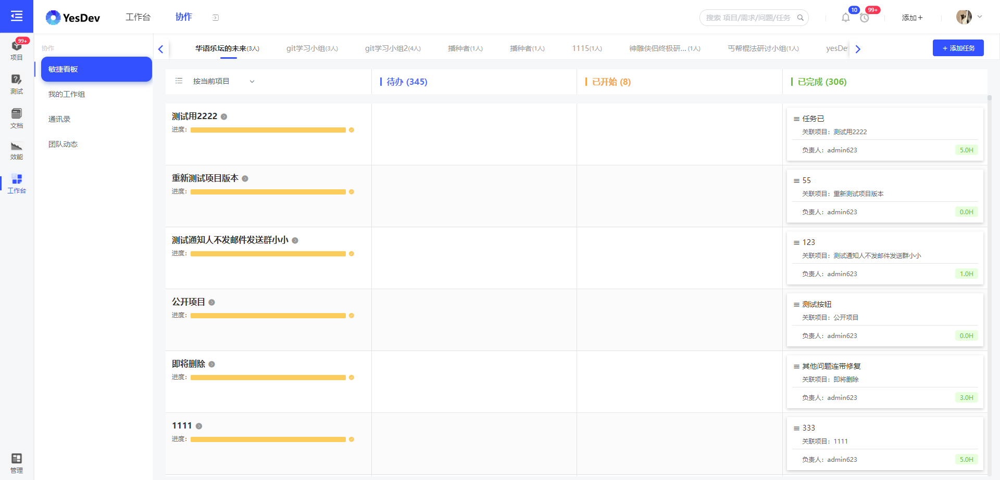  

## 项目实际工时统计  

项目研发中，针对项目概览的任务工时统计，增加了实际工时统计，用户可查看整个的剩余/完成/实际/全部工时；  

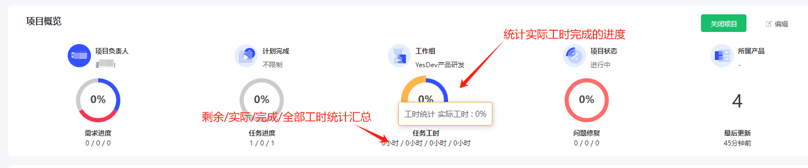  

## 演示视频

操作演示：如何添加项目任务工时？  

在项目中快速添加、拆解、或指派你的任务，并评估任务工时。自动形成：项目排期表、开发计划表、项目甘特图、项目燃尽图、项目工作拆解WBS，同时提供：敏捷任务看板、任务列表（可快速分组和筛选）。可以对重点的任务设置任务里程碑。  


[演示视频](https://yesdev.oss-cn-shenzhen.aliyuncs.com/video/yesdev-2024-07-31-142630.mp4 ':include :type=video controls width=100%')

# 2.4.3 任务常用操作

## 子任务

通过设置任务的父任务，可以维护多层级的子任务。  

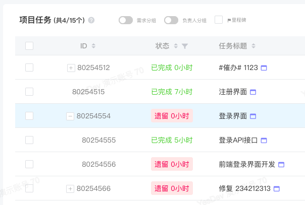    

## 任务里程碑

通过设置开启 任务里程碑，可以指定里程碑。开启任务里程碑后，将会显示【里程碑图标】。  

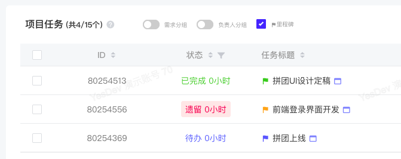  

在项目里程碑中，也会自动抓取对应的任务里程碑，进行统计和显示。  

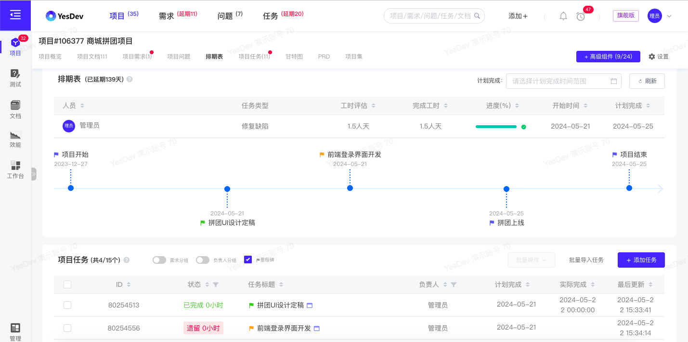  

## 同步创建任务

** 1、同步创建需求任务 **   

  

在创建新需求时，勾选：【同步创建任务】，YesDev会自动创建以下任务：

 - 新建任务（1）自动创建新任务给需求创建人；
  - 自动填充任务标题、任务计划完成时间（同步需求计划完成时间）等；
  - 自动关联需求、和需求所在的项目等；

 - 新建子任务（2）（若需求指定负责人，且不是创建人）自动创建新任务给需求负责人； 
  - 自动填充任务计划开始、计划完成时间（同步需求计划开始、计划完成时间）；
  - 任务状态为：待办，并且以上述创建人的任务为父任务；

自动创建的需求任务，类似如下：  

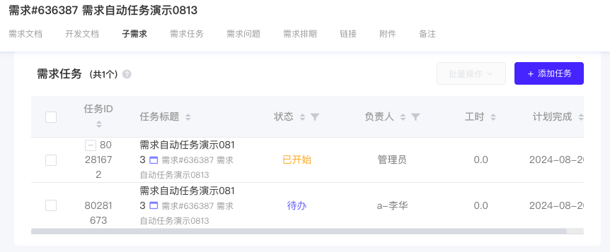  

** 2、同步创建问题任务 **   

在创建新问题时，勾选：【同步创建任务】，YesDev会自动创建以下任务：

 - 新建任务（1）自动创建新任务给问题创建人；
  - 自动填充任务标题、任务计划开始及结束时间为当天、任务描述等；
  - 自动关联问题、需求、项目等；

 - 新建子任务（2）（若需求指定负责人，且不是创建人）自动创建新任务给问题负责人；   
  - 任务状态为：待办，任务类型：修复缺陷，并且以上述创建人的任务为父任务；

问题自动任务创建效果，类似需求任务。  

## 批量操作任务

在项目任务列表、需求任务列表、问题任务列表等场景，或在任务查询列表，勾选多个任务后，可以进行批量操作。主要分为三大类批量操作：  

 + 第一类：批量快速复制
    + 仅复制标题
    + 复制标题 + 需求链接

 + 第二类：批量更新
    + 任务负责人
    + 工时评估
    + 计划完成时间
    + 任务状态
    + 任务验收状态
    + 任务类型
    + 关联项目/需求
    + 父任务ID
    + 任务里程碑
    + ……

 + 第三类：批量删除
    + 批量移除关联
    + 批量彻底删除 

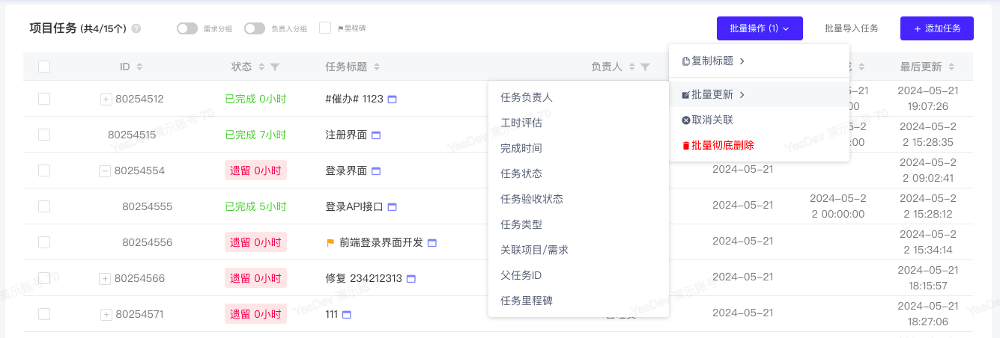  

## 导出任务    

一方面，你可以进入工时登记界面，快速导出指定工作组成员在本周或某周的任务工时。  

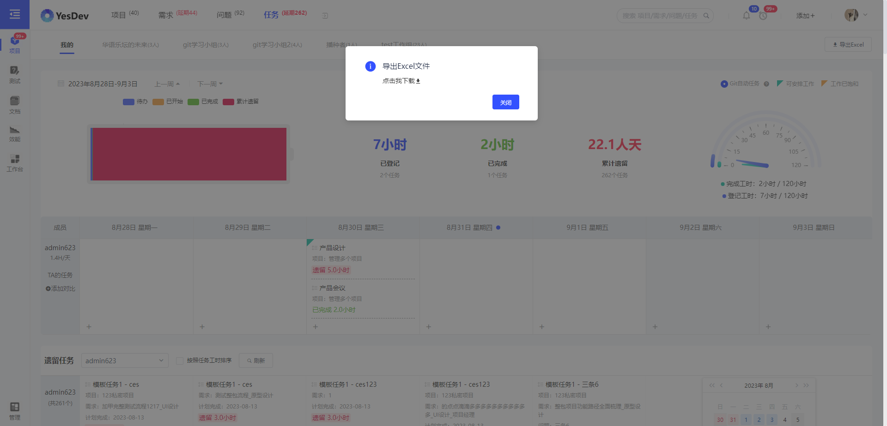  

另一方面，如果你是管理员，则可以进入【任务工时查询】导出全部成员的任务，或导出指定筛选条件的任务。 管理员还可以在【筛选器】选择【预算工时(管理员)】字段，列表可展示编辑。   

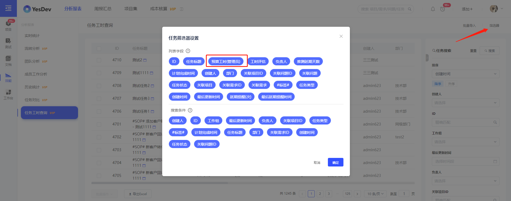  

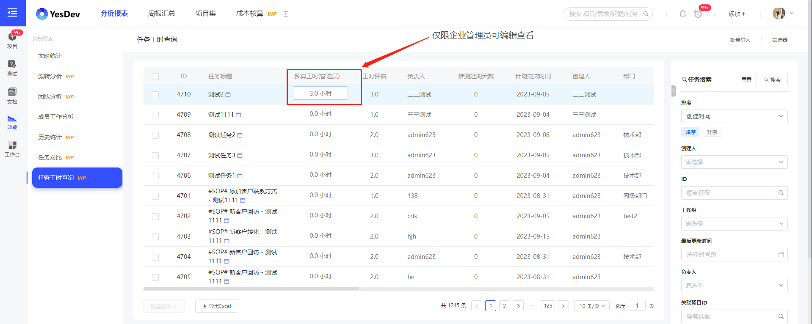 

管理员导出的任务工时Excel数据，包含有【预算工时（管理员）】的字段类似如下：  

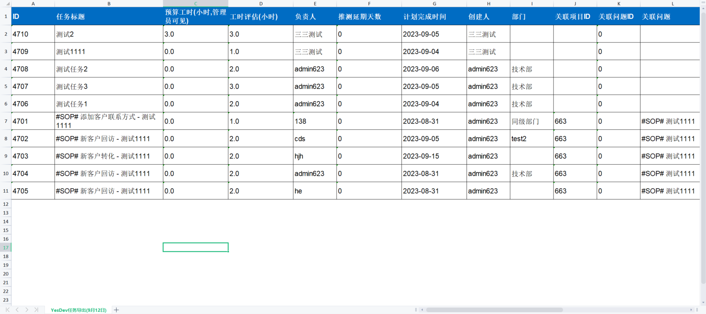  

## 演示视频

操作演示：任务常用操作有哪些？ 

设置子任务、批量操作任务、任务Excel导出、任务里程碑的设置与查看。通过设置开启 任务里程碑，可以指定里程碑。开启任务里程碑后，将会显示【里程碑图标】。 通过设置任务的父任务，可以维护多层级的子任务。  

[演示视频](https://yesdev.oss-cn-shenzhen.aliyuncs.com/video/yesdev-2024-07-31-144414.mp4 ':include :type=video controls width=100%')

# 2.4.4 任务高级配置

## 任务工时、权限和延期通知配置

使用企业管理员账号，进入：【企业管理后台】-【系统高级配置】-【任务工时配置】，可以分别设置： 

 + 任务权限设置  
   + 谁可以指派任务（任何人、仅限自己）
   + 谁可以修改任务（任何人、创建人+负责人）
   + 谁可以删除任务（任何人、创建人、禁止删除）

 + 任务工时设置
   + 每天工作时长（单位：小时）
   + 单个任务工时不能超过（单位：小时）
   + 当天任务工时不能超过（单位：小时）
   + 任务完成后多久禁止修改（单位：小时）
   + 任务完成多久后收纳（单位：小时）

 + 延期通知规则
   + 超过多久未完成则提醒
   + 提醒周期（星期一至星期日，多选）
   + 提醒时段（例如工作时段：08:30 ~ 21:00）
   + 最多提醒多少次


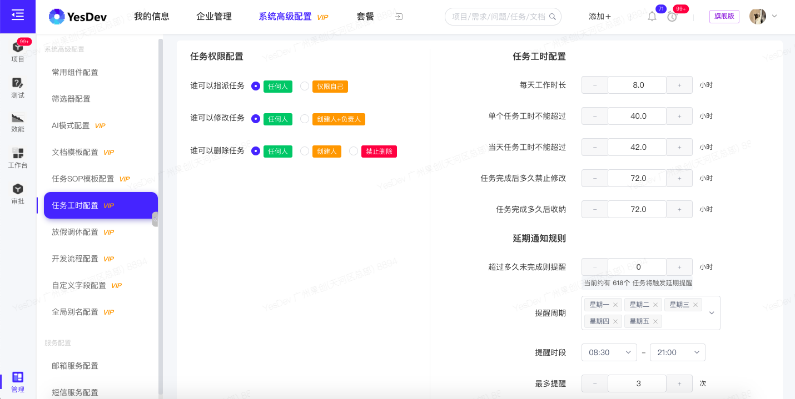  


## 任务状态扩充

YesDev默认的任务状态只有3个，分别是：待办、进行中和已完成。如果需要更多、更细致的任务状态管理，可以启用和开放更多自定义的任务状态。  

使用企业管理员账号，进入：【企业管理后台】-【系统高级配置】-【全局别名配置】，在【任务】进行自定义设置。  

假设，需要的任务状态流程是：  
```
待开发 -> 开发中 -> 开发完成 -> 待测试 -> 测试通过 -> 待上线 -> 已上线 -> 已关闭
```

那么可以按以下截图进行设置。

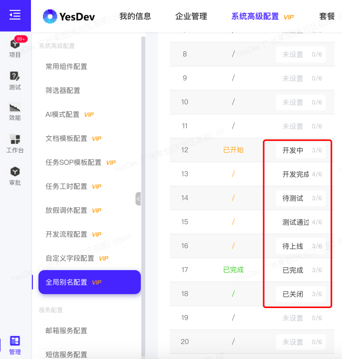  

> 温馨提示：YesDev系统默认开放3个任务状态（待办、进行中和已完成），同时预留了21个任务状态、分为三个任务阶段！  

对应的状态区间设计如下：  

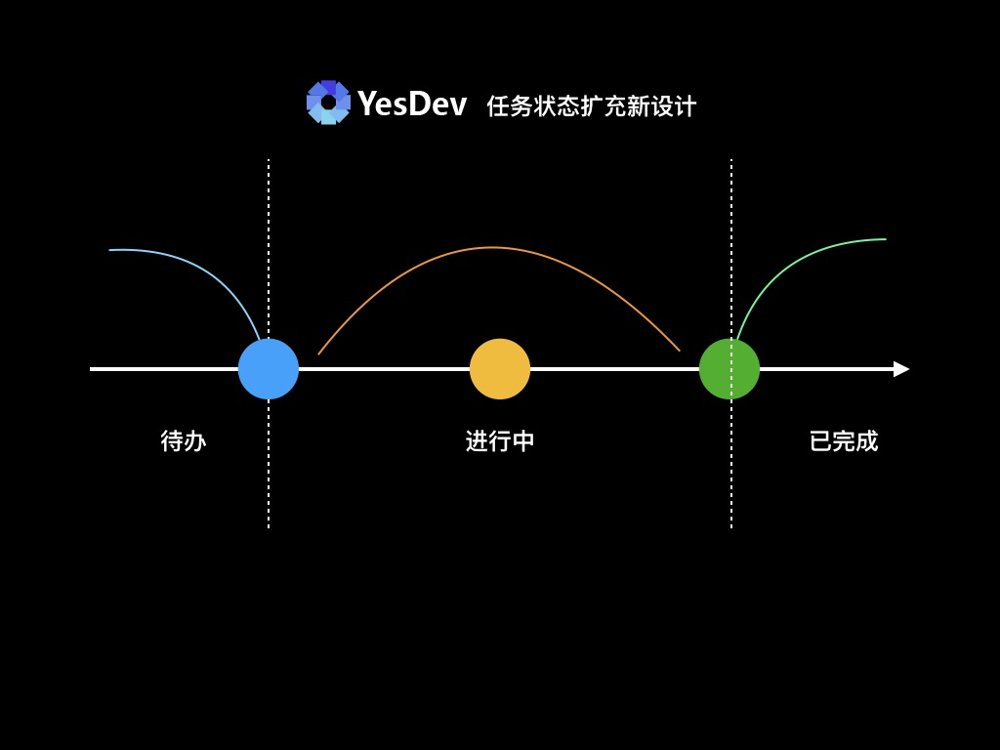  

保存配置后，在前台创建任务时，即可以使用新状态。  
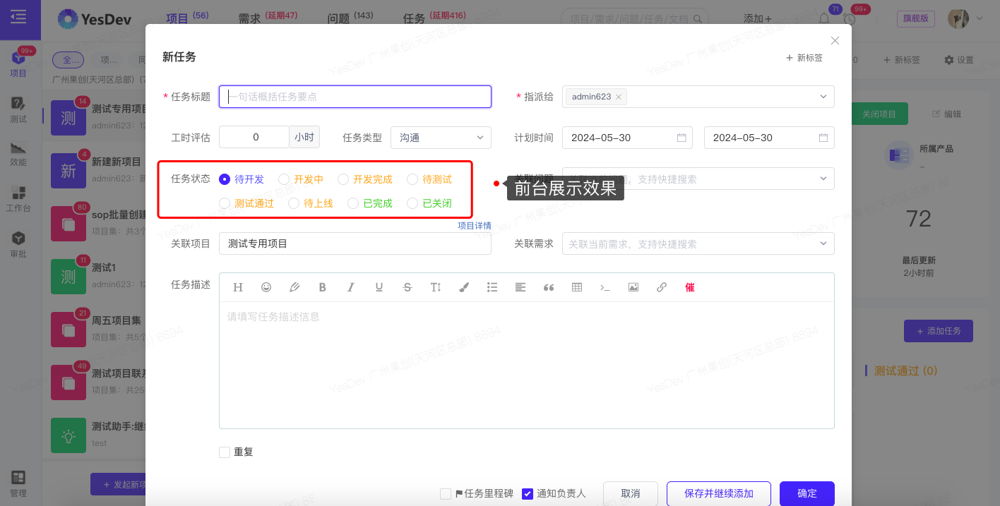  

以及敏捷任务看板、进度数据统计、任务列表等，可以同步使用多任务状态。   

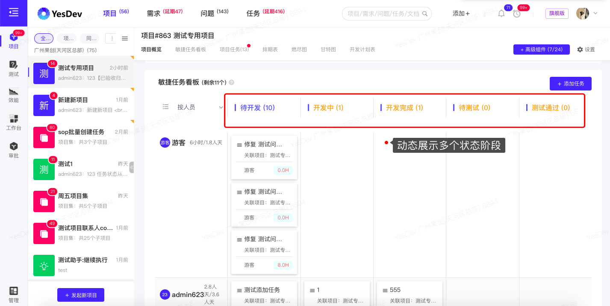  

## 演示视频

操作演示：YesDev 任务高级配置，如何定义任务协作流程？

[演示视频](https://yesdev.oss-cn-shenzhen.aliyuncs.com/video/yesdev-2024-07-31-145849.mp4 ':include :type=video controls width=100%')

