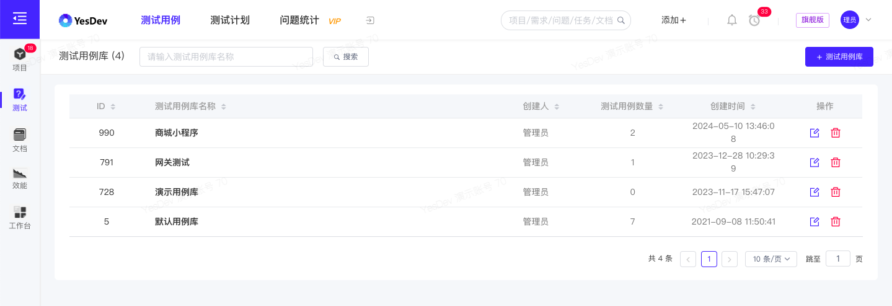
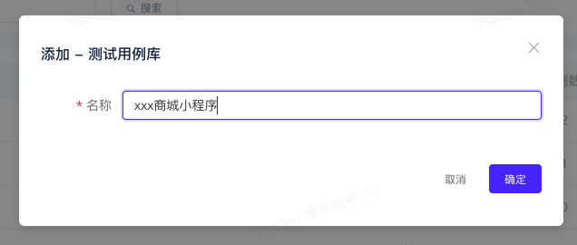
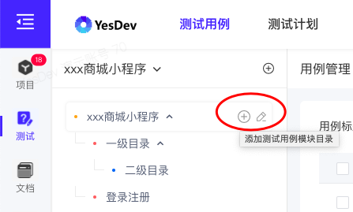
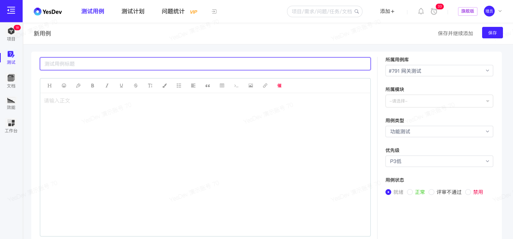
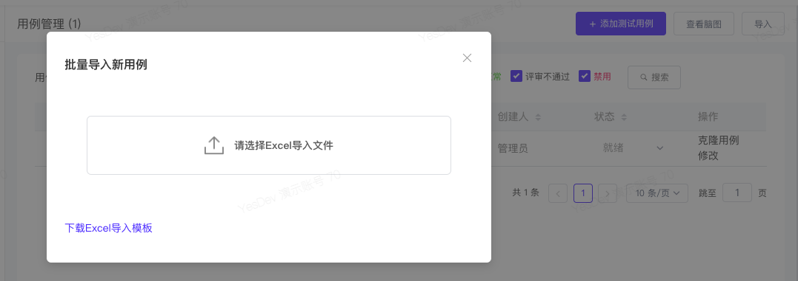
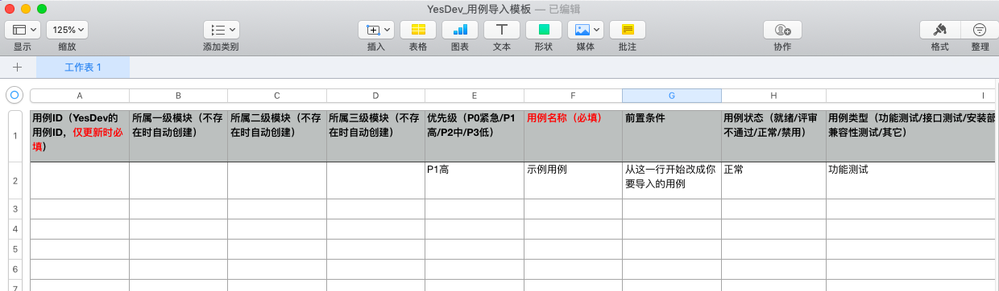
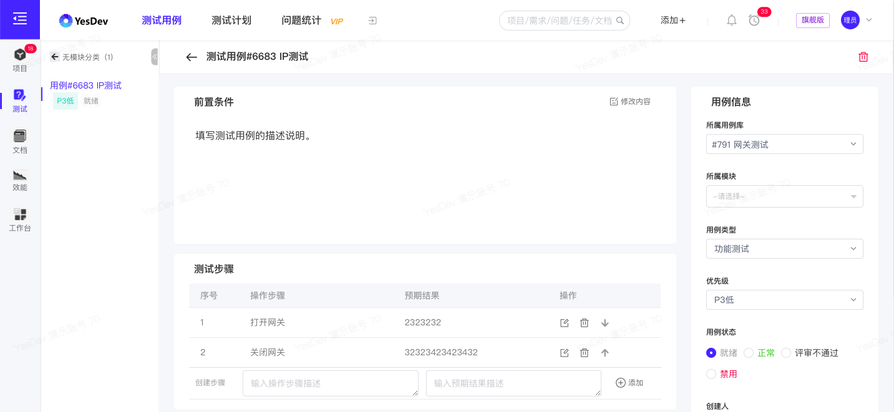
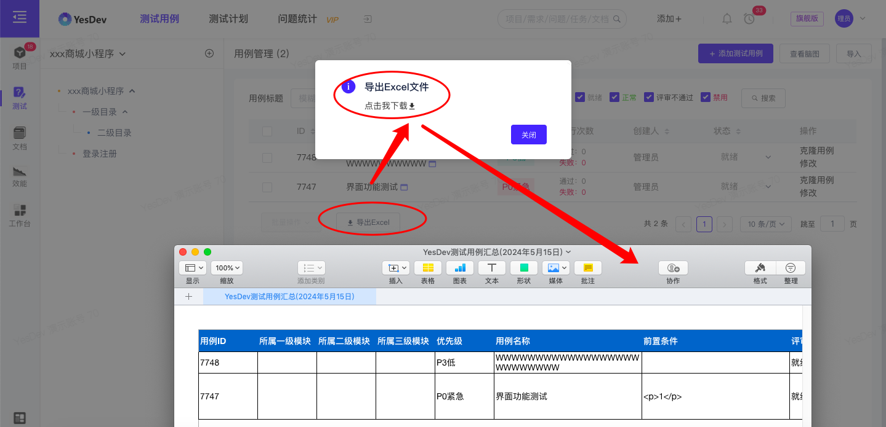
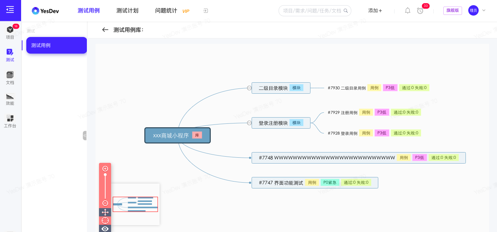
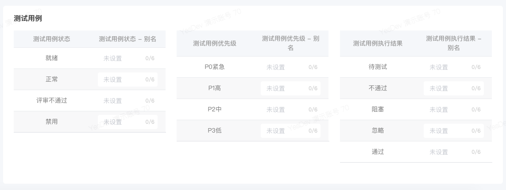

# 3.1 测试用例 - 如何管理测试用例？

测试用例(Test Case) 是指对一项特定的软件产品进行测试任务的描述，体现测试方案、方法、技术和策略。其内容包括测试目标、测试环境、输入数据、测试步骤、预期结果等。简单地认为，测试用例是为某个特殊目标而编制的一组测试输入、执行条件以及预期结果，用于核实是否满足某个特定软件需求。  

# 3.1.1 测试用例库管理

用例库是软件开发过程中重要的工具，它帮助开发人员和测试人员理解系统的需求，指导系统设计和开发，并用于测试系统的正确性和完整性。  

测试用例库，由多个测试用例构成。编写用例库时，需要注意用例的简洁明确、完整性、可读性和维护性，以提高用例库的效果和价值。用例库的规范化和规范整洁的格式对于项目的成功实施和后续维护非常重要。  

## 测试用例库列表

进入测试用例库，查看当前的测试用例库列表。  
可以搜索测试用例库，添加新测试用例库，以及对测试用例库进行重命名，或删除测试用例库。  

> 温馨提示：为避免误删，删除测试用例库时，须先清空该用例库内的全部测试用例，方可继续删除用例库。  

  

## 创建新测试用例库

点击【+ 测试用例库】，在弹窗输入 测试用例库 名称，确定后即可完成创建测试用例库。  

  

## 管理测试用例库

在测试用例库列表，点击 测试用例库 名称，进入到测试用例库的管理。      

## 演示视频

操作演示：测试用例库的维护    

查看测试用例库，切换访问测试用例库，添加新的测试用例库，添加多级目录模块，以及测试用例库的删除。

[演示视频](https://yesdev.oss-cn-shenzhen.aliyuncs.com/video/yesdev-2024-07-31-171735.mp4 ':include :type=video controls width=100%')  

# 3.1.2 测试用例

**测试用例主要包含四个内容：用例标题，前置条件，测试步骤和预期结果**。测试用例的其他信息还包括：  

 + 所属用例库
 + 所属模块
 + 用例类型（功能测试/接口测试/安装部署/配置相关/安装测试/性能测试/UI测试/兼容测试/其他）
 + 优先级（P0紧急/P1高/P2中/P3低）
 + 用例状态（就绪/正常/评审不通过/禁用）
 + 创建人
 + 创建时间
 + 执行统计（通过次数、失败次数、总执行次数）
 + 关联的测试计划

## 管理测试用例

进入到指定测试用例库后，可以对该测试用例库内的测试用例、目录模块（支持多层级目录） 进行管理和维护。  

  

## 添加用例目录层级

在左侧测试用例库的层级目录，点击用例库名称或目录后，继续点击【+号】，可以添加新的目录。  

  

添加目录后，点击【编辑图标】，可以对目录进行重命名，或删除该目录。  

  

> 温馨提示：如果需要调整用例目录顺序，可以通过重命名，在目录前面添加编号的方式，进行排序。      

## 添加测试用例

点击【添加测试用例】，进入新建测试用例页面。录入：测试用例标题、测试用例前置条件（支持富文本）、测试步骤（支持多组）、所属模块、用例类型等信息，然后 【保存】。  

  

针对，测试步骤，除了支持录入多组，也可以快速进行上移、下移、添加、删除和编辑。  

 

如果需要保存并继续添加新测试用例，可以点击【保存并继续添加】。      

## 导入测试用例

除了录入单个测试用例，还可以通过Excel批量导入测试用例。点击【导入】，调出 批量导入新用例 弹窗。  

  

下载Excel导入模板，根据Excel模板，填写测试用例信息。 

 + 用例ID（YesDev的用例ID，仅更新时必填） 
 + 所属一级模块（不存在时自动创建）  
 + 所属二级模块（不存在时自动创建） 
 + 所属三级模块（不存在时自动创建）    
 + 优先级（P0紧急/P1高/P2中/P3低）
 + 用例名称（必填）   
 + 前置条件  
 + 用例状态（就绪/评审不通过/正常/禁用）    
 + 用例类型（功能测试/接口测试/安装部署/安全测试/性能测试/UI测试/兼容性测试/其它） 
 + 测试步骤（每个步骤一行，和预期结果对应）   
 + 预期结果（每个结果一行，和测试步骤对应）

  

整理好测试用例Excel文件后，保存后，点击【选择Excel导入文件】上传导入到YesDev。      

## 克隆测试用例

如果需要快速复制拷贝某个测试用例，可以在列表上对应的测试用例，点击【克隆用例】。  

## 查看和编辑测试用例

点击用例标题，进入到测试用例详情页。可以查看和编辑测试用例的详情信息。 

  

在测试用例详情页，除了用例的信息，还可以查看执行统计，即该用例累计被手动执行的次数，包括成功和失败的次数。以及进行用例备注评论、返回用例库和快速切换同目录模块下的其他用例，还可以删除此用例。  

## 导出用例到Excel

在测试用例库，点击【导出Excel】，可以导出用例到Excel文件。  

  

## 查看用例脑图

点击【查看脑图】，可以查看该用例库的用例脑图，方便梳理测试思路。  

  

## 演示视频

操作演示：测试用例库的录入    

使用Excel模板批量快速导入测试用例，针对单个测试用例的克隆、编辑和查看，以及单个测试用例的添加，最后导出整个测试用例库到Excel文件。

[演示视频](https://yesdev.oss-cn-shenzhen.aliyuncs.com/video/yesdev-2024-07-31-173730.mp4 ':include :type=video controls width=100%')  

# 3.1.3 后台管理

在 管理后台 - 系统高级配置 - 全局别名配置 - 测试用例，可以对测试用例状态、测试用例优先级和测试用例执行结果，进行全局别名配置。  

  

测试用例维护好后，下一步，需要继续创建测试计划。  

