# 3.2 测试计划 - 如何管理测试计划？

测试计划Testing plan，描述了要进行的测试活动的范围、方法、资源和进度的文档；是对整个信息系统应用软件组装测试和确认测试。  

# 3.2.1 管理测试计划

在测试计划，可以查看、管理和维护全部测试计划。  

## 测试计划列表

点击【测试计划】，进入测试计划列表。可以对测试计划进行搜索、查看测试报告、查看测试计划脑图、编辑测试计划和快速排序等操作。  

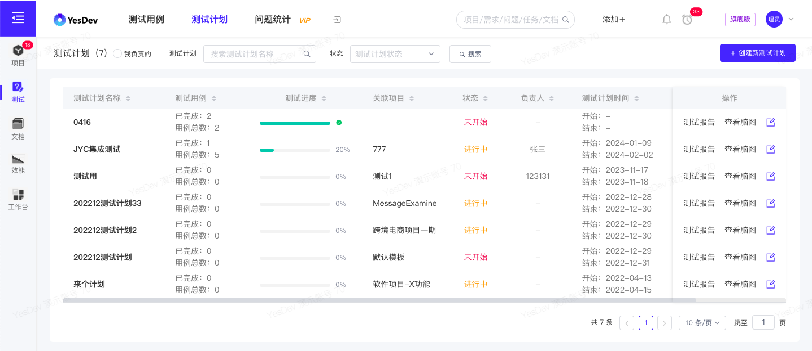  

## 创建新测试计划

点击【+ 创建新测试计划】，进入到创建新测试计划页面。  

> 温馨提示：在创建新测试计划之前，请先创建好测试用例库和维护好测试用例。  

在新建测试计划页面，填入以下测试计划基础信息：   

 + 计划名称
 + 测试时间（计划开始日期、计划结束日期）
 + 计划状态（未开始/进行中/已完成）
 + 关联项目（可以关联到当前项目）
 + 测试负责人
 + 所属用例库（必填，一次只能选择一个测试用例库）  
 + 测试计划描述

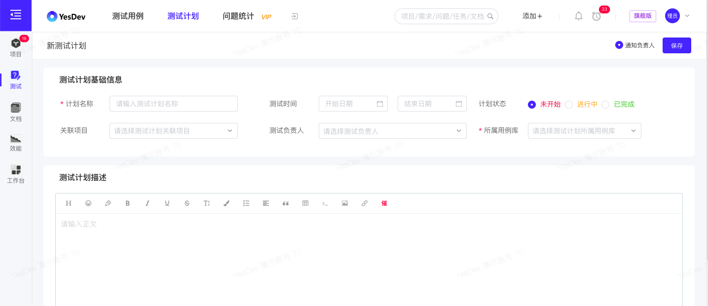   

若勾选【通知负责人】，创建新测试计划后，将会邮件通知测试计划的负责人（本人除外）。  

## 关联测试计划到项目

另一方面，在 项目详情页，可以在【高级组件】调取【测试计划】组件。  

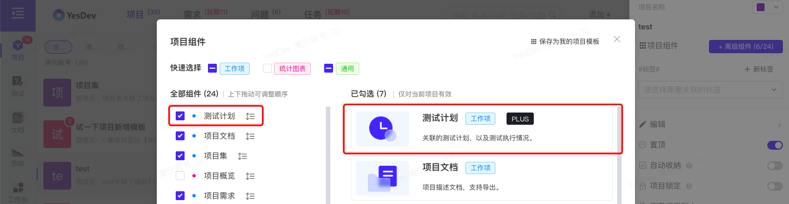  

随后，在 测试计划 组件，点击【关联测试计划到此项目】，

  

可以把新建的测试计划关联到此项目。  

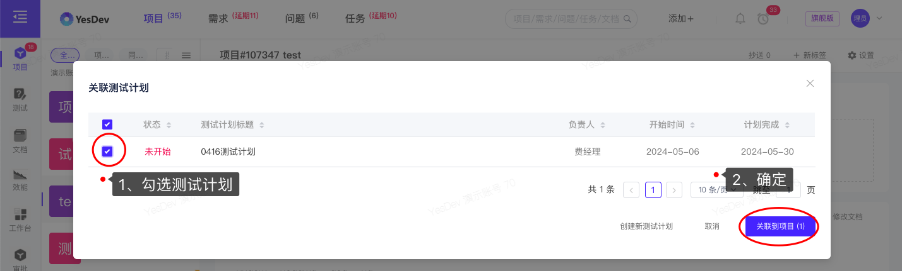  

> 温馨提示：一个测试计划，最多只能关联一个项目。  

## 测试计划编写6要素？（5W1H）

 + 1）why——为什么要进行这些测试；
 + 2) what—测试哪些方面，不同阶段的工作内容；
 + 3) when—测试不同阶段的起止时间；
 + 4) where—相应文档，缺陷的存放位置，测试环境等；
 + 5) who—项目有关人员组成，安排哪些测试人员进行测试
 + 6) how—如何去做，使用哪些测试工具以及测试方法进行测试。

## 演示视频

操作演示：测试计划的创建

创建新的测试计划，查看测试计划列表，在测试计划规划你的测试用例，查看测试计划的测试报告和脑图，把测试计划关联到你的项目。

[演示视频](https://yesdev.oss-cn-shenzhen.aliyuncs.com/video/yesdev-2024-07-31-181106.mp4 ':include :type=video controls width=100%')  

# 3.2.2 执行测试计划

测试计划编写完成后，一般要对测试计划的正确性、全面性以及可行性等进行评审，评审人员的组成包括软件开发人、营销人员、测试负责人以及其他有关项目负责人。

测试计划评审通过后，便可以进入测试计划的执行阶段。  

## 查看和执行测试用例

点击 测试计划名称，进入到测试计划的详情页面。  

在测试计划详情页，可以查看：  

 + 测试计划的概览信息（基本信息、进度统计等）
 + 测试计划描述
 + 测试用例
 + 关联问题
 + 备注评论等

 
  

## 规划测试用例

在测试计划详情页，点击【+ 规划测试用例】，在规划用例弹窗，切换选择目录后，批量勾选需要添加的用例，然后【确定】。   

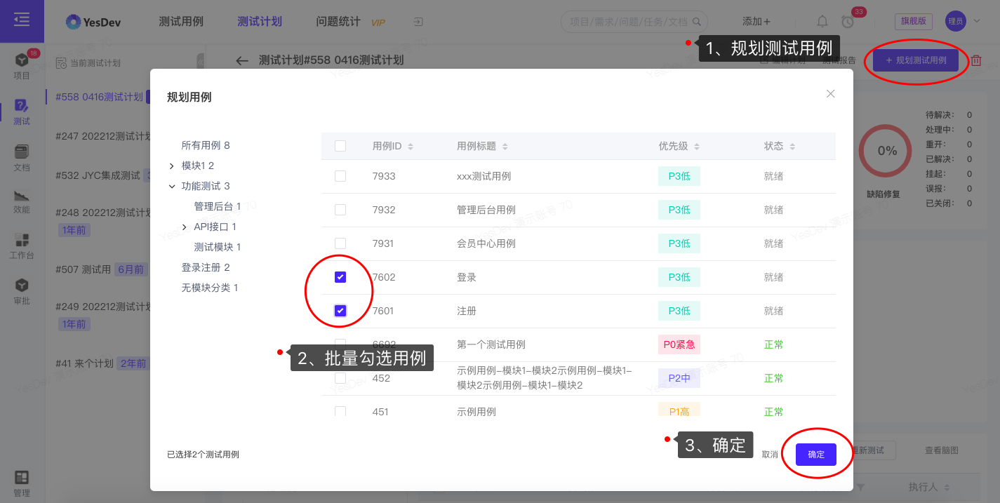  

成功添加用例后，可以在 测试用例 组件进行查看。  

> 温馨提示：测试用例只有以下两种状态才能被规划到测试计划，即：就绪、正常。评审不通过，或 禁用 的测试用例不能被规划进测试计划。  

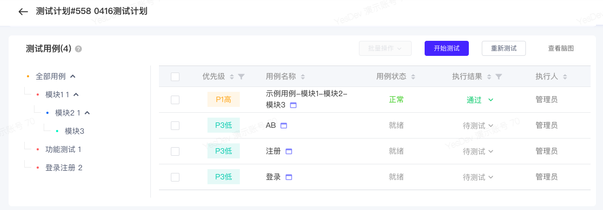  

对于需要移除的用例，可以在列表批量选中后，进行【移除】。  

  

## 开始测试，执行用例    

在 测试用例 组件，点击【开始测试】，进入用例具体的执行和测试。在执行用例弹窗，可以快速查看用例标题、运行结果、前置条件、用例步骤、剩余用例等信息。  

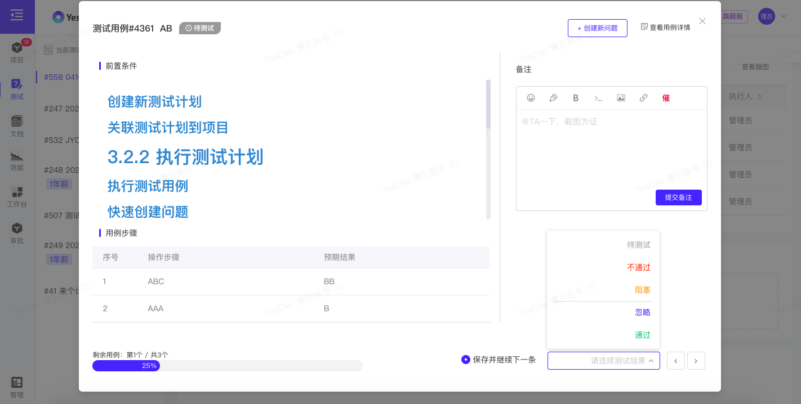  

选择测试结果，即可完成此测试用例的快速执行。  

你也可以直接点击需要执行的用例名称，直接查看和执行指定的用例。  

## 重新测试

如果需要重新进行测试，可以点击【重新测试】，并且选择需要重测的运行结果，点击【提交】，即可对用例进行重新测试。  

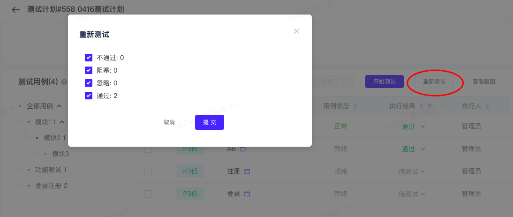  

## 快速创建问题

如果发现有缺陷或问题，可以点击【+ 创建新问题】 ，一键快速添加新问题。对于一键创建的新问题，会自动关联：测试计划、测试用例、关联的项目，并且会自动填充测试用例的前置条件、测试用例步骤、期望结果等信息，减少录入的时间成本。  

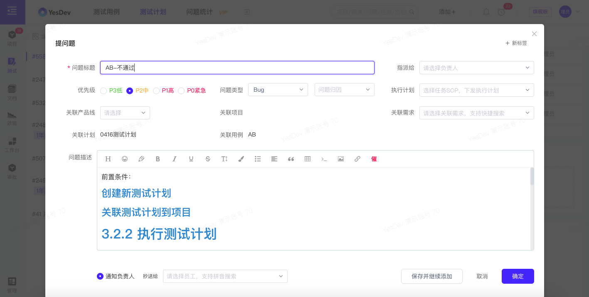  

## 查看测试计划脑图

点击【查看脑图】，可以查看当前测试计划的脑图，从 测试计划、到：测试目录模块、测试用例，最后延伸到问题缺陷，方便全链条进行汇总和查看。  

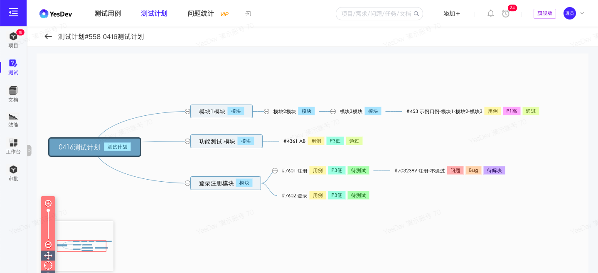  

## 生成测试报告

在测试过程中，定期进行测试进度的汇报是有必要的，有利于识别出测试活动中各种风险，并消除可能存在的风险，降低由不可能消除的风险所带来的损失。  

点击【测试报告】，可以在线生成测试报告，支持在线发送邮件，自动汇总当前测试计划的进度、用例列表、问题列表和相关负责人，同时支持Excel文件的发送和下载。  

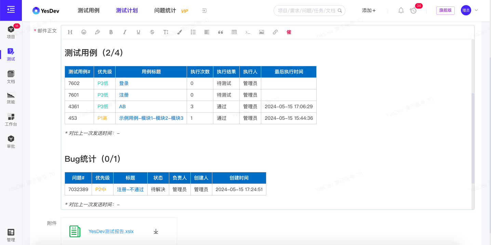  

下载后的测试计划Excel文件，类似如下：  

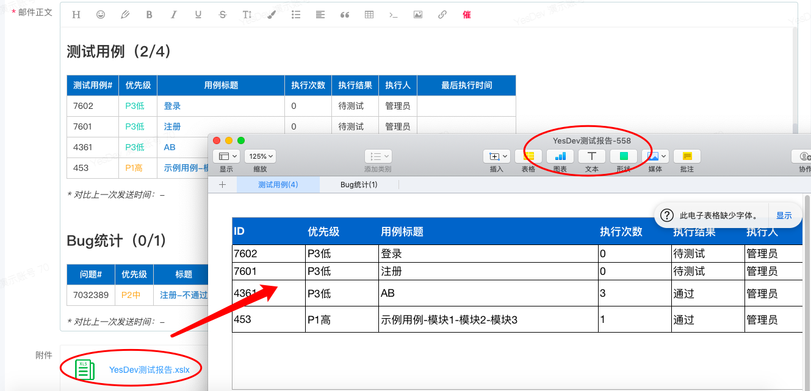  

## 演示视频

操作演示：在线执行你的测试计划

开始执行用例，用例不通过时快速创建问题，查看测试计划脑图，一键生成测试报告，重新测试。

[演示视频](https://yesdev.oss-cn-shenzhen.aliyuncs.com/video/yesdev-2024-07-31-182143.mp4 ':include :type=video controls width=100%')  

# 3.2.3 完成测试计划

点击【编辑计划】，将测试计划的状态，选中为：已完成。保存。即可完成此测试计划。   

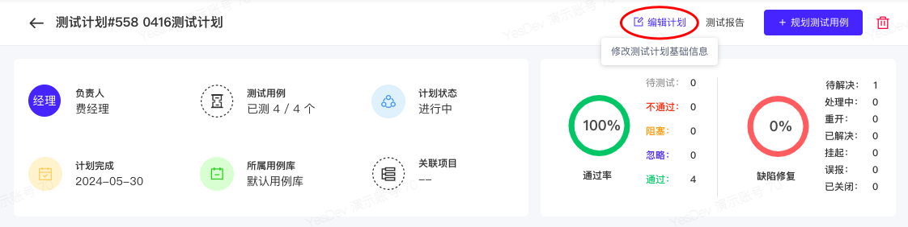  
    
测试计划完成后，将不会再显示在【当前测试计划】，但在测试计划列表依然可以查看全部的测试计划。  

