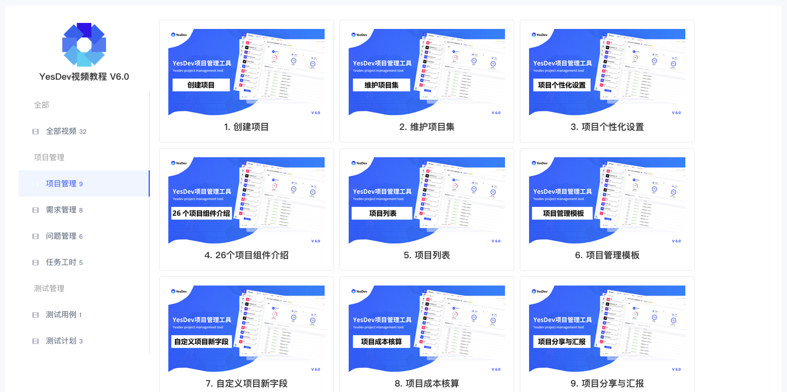
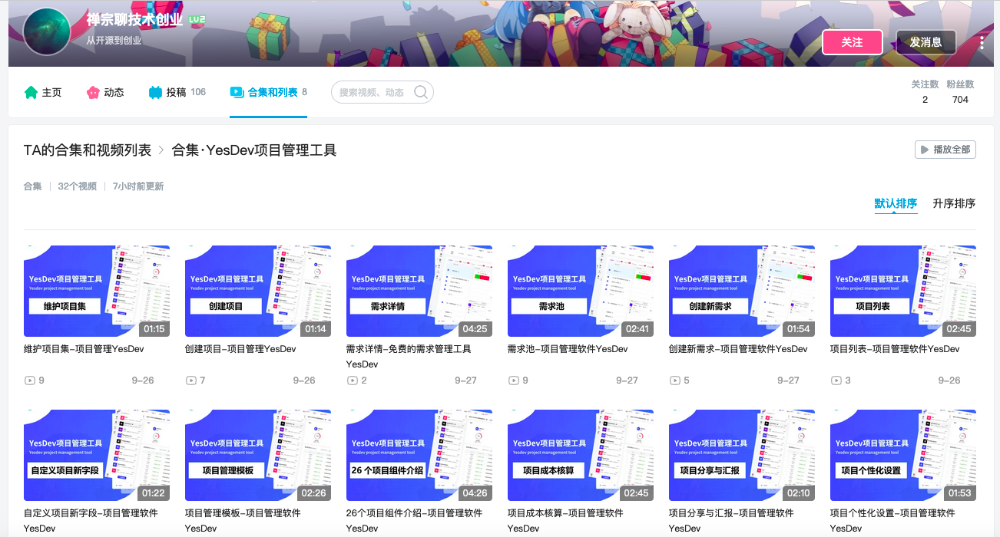

# YesDev视频教程

# 2024年

## YesDev官方视频教程 v6.0
操作视频链接：https://www.yesdev.cn/platform/video  

  

## B站
合集·YesDev项目管理工具：https://space.bilibili.com/493679947/channel/collectiondetail?sid=3980145  

  

## 小红书

视频笔记链接：https://www.xiaohongshu.com/explore/66f5053f000000001902e3b9?xsec_token=GBQ2Ru_-gaxM1RWzU4SRbh7BBBmp9XtV0GyHrPfG_6xtA%3D&xsec_source=pc_creatormng  

## 今日头条

视频链接：https://www.toutiao.com/video/7418838261688173110/?from_scene=video&log_from=ea94c2782b1ec_1728398945369  
头条最新视频：https://www.toutiao.com/c/user/token/MS4wLjABAAAAcof31nezZlCytP7lxhsvhJ94hctlV72NCojfLnO_0c8/?source=list&log_from=df76bc3e21be5_1728398476946&tab=video  

## 知乎

知乎最新视频：https://www.zhihu.com/people/dogstar-76/zvideos  

# 2021年

## 创业团队的敏捷项目管理 13min
视频教程链接：https://www.bilibili.com/video/BV1Wq4y1Z7HM/  
  

视频大纲：  
 +  01 极速体验YesDev
 +  02 YesDev敏捷开发和持续迭代
 +  03 深度融合的团队协作
 +  04 简单高效的个人工作

## 第1讲、跟我学研发管理@YesDev

频教程链接：https://www.bilibili.com/video/BV1ER4y1L7tS/  
  

视频大纲： 

+ 主要分享内容：企业研发的协作流程、项目管理和团队建设
+ 适合听众：技术负责人、技术主管、技术开发人员、企业管理员、产品经理等项目干系人员
+ 主要聚焦：企业，拥有自主研发团队，技术人员在3人-30人之间，有自主研发的产品或项目
+ 所用工具：YesDev研发协同和管理工具，如何注册？
+ 每一讲：大概15分钟内，结合经验、真实案例、工具、图表和文章进行综合分享讲解

## 第2讲、研发项目管理不失控@YesDev

频教程链接：https://www.bilibili.com/video/BV1r341177qG/
  

视频大纲：

+ 1、项目的定义：在指定时间内的有限集合（例如在2-4周内需要完成和上线的版本需求）
+ 2、一个项目的组成：基本信息+需求+任务+问题+文档+资料（一个真实的项目案例）
+ 3、项目立项和启动：需求评审后创建对应的项目（开始新项目PPT，以及操作演示）
+ 4、项目计划：评估工时+项目排期表+项目燃尽图
+ 5、项目推进：任务看板及项目进度+问题记录和Bugfixed+项目汇报
+ 6、项目交付：发布上线、完成项目

## 第3讲、需求流转和Git代码自动关联@YesDev

视频教程链接：https://www.bilibili.com/video/BV1tP4y1w7oo/
  

视频大纲：

+ 你将学会：如何创建新需求，以及Git代码提交后自动关联到需求、上线发布，实现自动流转
+ 真实小需求：修改官网首页文案
+ YesDev：创建新的需求、邮件通知+群通知
+ 开发：本地Git代码开发，以及注释规范提交
+ 测试：Bug关联，自动流转+邮件通知+群通知
+ 发布：一键发布
+ 扩展：如何自动集成Git/云效/Gitee码云/Gitlab/Githunb的代码提交？

## 第4讲、任务协作和工时登记@YesDev
视频教程链接：https://www.bilibili.com/video/BV12b4y14774/

  

视频大纲：

+ 你将学会：个人任务以及团队研发协作
+ 任务的概念和位置：项目 - 需求 - 任务，任务标题、内容、类型、工时等信息
+ 如何评估任务更合理？
+ 敏捷开发、任务看板和可视化研发产能
+ 看懂数据：项目排期表、项目燃尽图
+ 工作汇总：研发人员的日报、周报
+ 扩展：Git自动流转、实时工时饱和度、放假调休、任务顺延、每日工作时间

## 第5讲缺陷跟踪和故障处理@YesDev

视频教程链接：https://www.bilibili.com/video/BV1mT4y1Q75d/ 

  

视频大纲：

+ 你将学会：Bug流转和如何进行功能测试
+ 分类：Bug、故障、工单、改进
+ 缺陷跟踪：一个问题的流转
+ 故障处理：先止损再修复，事后做好故障复盘，以及各类模板的预设
+ 质量前移：测试用例、测试计划、测试报告
+ 扩展：压力测试、安全测试、自动化测试

