# Git注释规范和持续集成

## 持续集成的优势

通过规范Git提交的注释规范，可以统一在开发过程中对代码提交的目的、修改范围和注意事项进行约束，同时可以关联到项目、需求、问题以便进行代码审计。其优势在于：  
 + 可以统一开发提交代码的注释  
 + 可以关联项目、需求、问题，方便进行code review代码审计  
 + 进行自动化的持续集成，提升开发效率  
 + 与通知联动，及时知会产品经理、需求方、项目干系人、测试人员等  

## 【重要】Git注释规范  

目前，YesDev推荐的注释规范，主要分为三类：需求注释规范、Bug注释规范、任务注释规范。 

 + **需求注释规范**：用于实现功能类的开发所进行的提交  
 + **Bug注释规范**：用于进行bugfixed、缺陷修复、故障处理等的代码修改和提交  
 + **任务注释规范**：用于进行开发调试、和任务关联的代码修改和提交  

### 需求注释规范  

在开发和实现产品功能时，通过统一的注释规范，可以和YesDev的需求进行关联。需要遵循以下注释提交规范。  

需求注释格式是：  
```
需求#{需求ID}：开发人员填写的注释内容
```

其中，```{需求ID}```对应YesDev的需求ID，注释示例： 
```
需求#666：首页静态页面开发
```

按规范提交后，在YesDev需求管理的备注模块自动上屏的效果类似如下：  
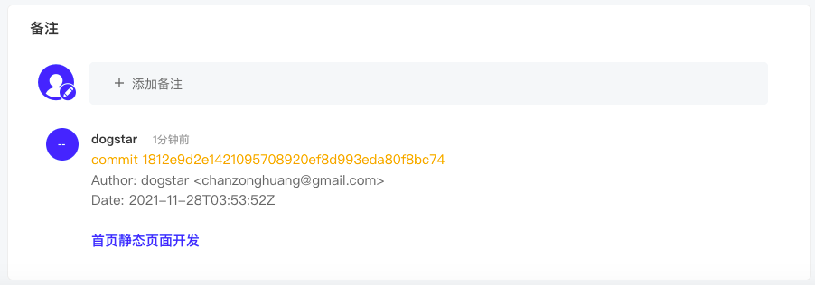   

可以在需求备注列表，查看相关的代码提交记录、人员、时间和代码修复的记录链接。  

在YesDev需求详情页的整体效果类似如下：  
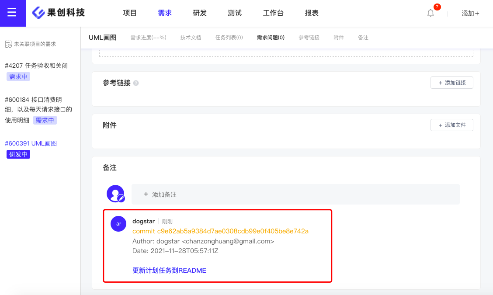  

此外，YesDev支持多种写法，注释开头可以是：   

 + 需求#666
 + feat#666
 + feature#666  
 + xuqiu#666  

随后可以用【冒号】、【中/英逗号】、【空格】进行分割，再添加更多注释内容。例如：  
```bash
$ gic commit -a -m "需求#666：演示注释使用中文冒号分割"
$ gic commit -a -m "需求#666，演示注释使用中文逗号分割"
$ gic commit -a -m "feat#666:演示注释使用英文冒号分割"
$ gic commit -a -m "feature#666,演示注释使用英文逗号分割"
```

### Bug提交注释规范

针对Bug自动化流转，主要通过Git的注释来进行解析、提交和集成。  

如果开发人员在提交Git注释时，需要同步更新Bug的状态（从待解决/进行中/重开调整为已解决）和提交对应的注释到YesDev的问题备注。需要遵循以下注释提交规范。  

格式是：  
```
bug#{问题ID}：开发人员编写的注释内容或问题原因
```

其中，```{问题ID}```需要动态对应YesDev的问题ID，示例：  
```
bug#1：修复无法登录问题，原因是密码算法错误
```

提交注释并集成后，在YesDev的问题备注，上屏效果类似如下：  
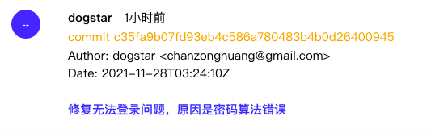  

此外，YesDev支持多种写法，但为了统一和方便记忆，推荐使用上面这种标准注释规范。  

假设问题ID是888，开头支持以下多种写法：  
 + bug#888
 + 问题#888
 + fix#888
 + fixed#888
 + bugfixed#888

随后可以用【冒号】、【中/英逗号】、【空格】进行分割，再添加更多注释内容。例如：  
```bash
$ gic commit -a -m "bug#888：演示注释使用中文冒号分割"
$ gic commit -a -m "问题#888，演示注释使用中文逗号分割"
$ gic commit -a -m "fix#888:演示注释使用英文冒号分割"
$ gic commit -a -m "fixed#888,演示注释使用英文逗号分割"
$ gic commit -a -m "bugfixed#888 演示注释使用空格分割"
```

> 温馨提示：开头和分割符号，可以任意组合使用。  

### 任务注释规范

在开发过程中，对于调试、或临时提交的代码，或需要关联到YesDev任务的，可以遵循以下注释提交规范。   

格式是：
```
dev#{任务ID}：开发人员编写的注释内容
```

其中，{任务ID}需要动态对应YesDev的任务ID，示例：  
```
dev#123：自测用户登录接口
```

此外，YesDev支持多种写法，假设问题ID是123，开头支持以下多种写法：  

 + dev#123  
 + 任务#123  
 + renwu#123  
 + task#123  
 + debug#123  

随后也可以用【冒号】、【中/英逗号】、【空格】进行分割，再添加更多注释内容。  

## Git Webhooks支持

通过Webhooks，可以让YesDev项目协作工具与你团队使用的Git版本管理平台进行集成，进行及时、自动化的对接，提升工作效率。 

目前，YesDev已经支持：  
 + Gitlab
 + Gitee码云
 + Gitee企业版
 + Codeup
 + Github 
 
等Git的WebHook配置。配置方式如下。  

### 查看并复制我的回调地址

首先，登录后，点击右上角图标-切换团队-点击团队名称，获取你团队在YesDev的WebHook回调地址。
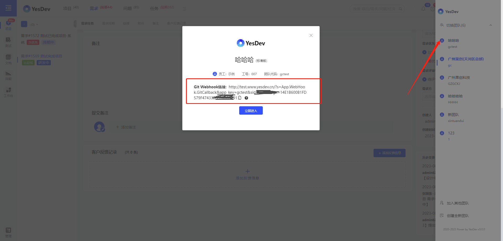  

## 如何添加Webhook？
其次，把获取到的WebHook回调地址，填写到对应的Git平台的URL输入框、勾选Push事件、最后确认添加。

在Gitlab为你的代码仓库添加Webhook，类似：
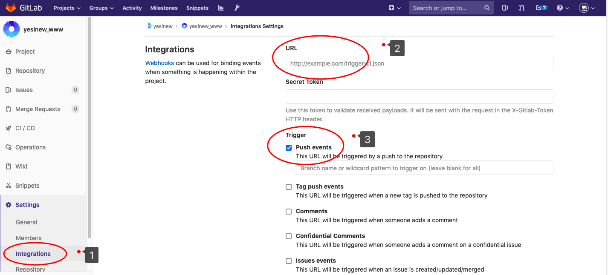  

在Github添加Webhook，类似：  
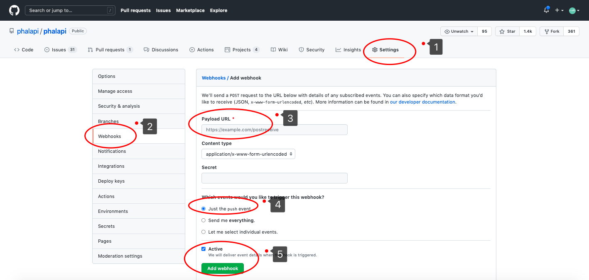  

在Gitee码云添加WebHook，可参考[Gitee 帮助中心-添加WebHook](https://gitee.com/help/articles/4184#article-header0)，或参考示例：  
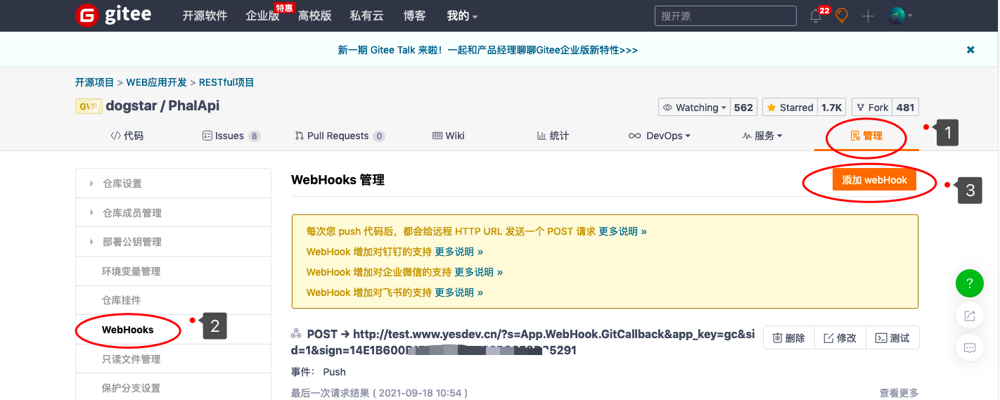  
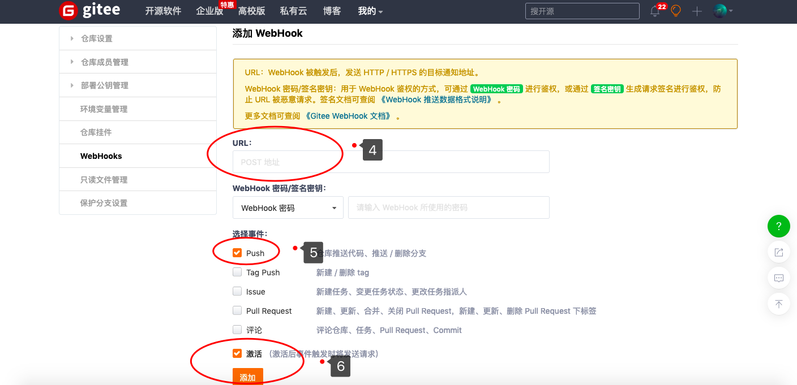  

在Gitee企业版添加WebHook，类似：  
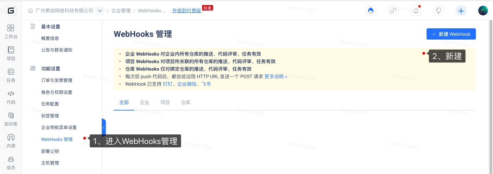  

记得，要勾选**激活**，否则无法接收推送消息。  
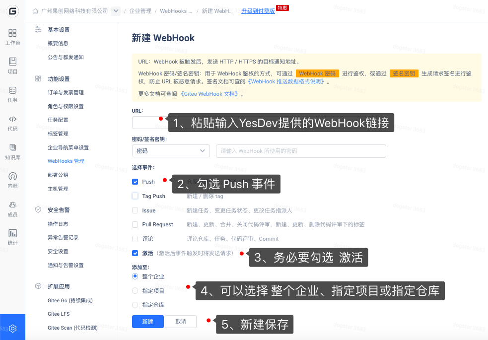  

在Codeup云效添加Webhook的方法：  
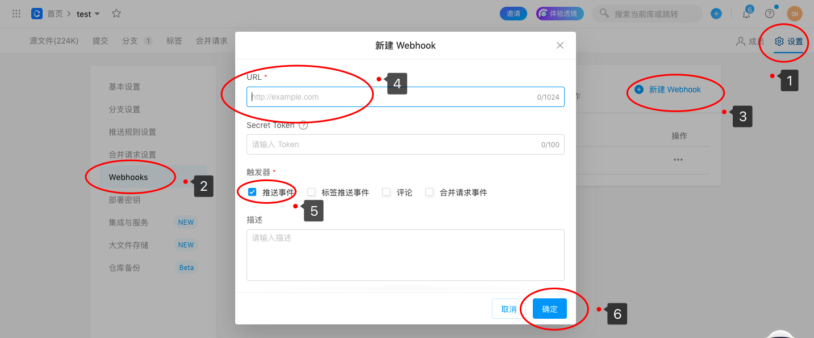  

## Bug持续集成

通过Git的Webhook配置，可以实现YesDev问题缺陷的自动流转，提升团队协作效率，尤其是开发工程师与测试工程师之间的沟通速度和反馈闭环。  

整体流程简要如下：  
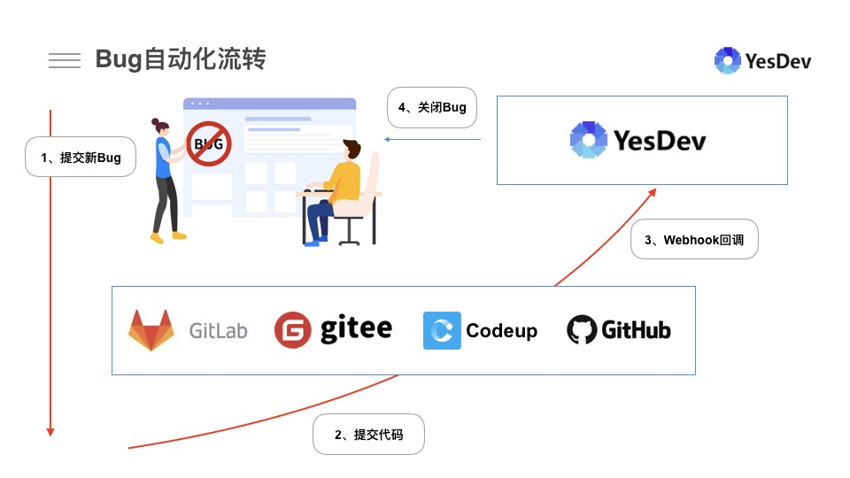  

 + 第1步：由测试人员提出新的Bug，并记录到YesDev协作工具  
 + 第2步：由开发人员进行排查修复，并提交代码到Git仓库  
 + 第3步：通过提前配置好的Webhook回调，由YesDev完成智能化的理解和更新  
 + 第4步：进行Bug缺陷自动流转，验收后关闭Bug  


## Bug自动流转示例

假设测试人员提了一个新的Bug给张三，例如：官网首页无法访问，状态最初是：待解决，Bug ID是3406，如下： 

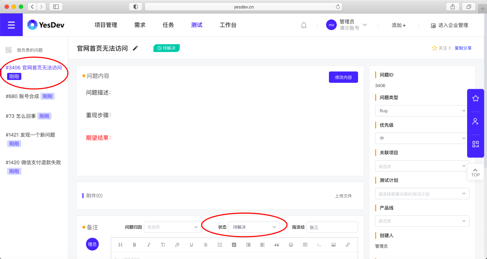  

随后，开发者张三进行了排查、改代码修复的，在提交Git代码时，需要这样编写注释内容：  

```bash
$ git commit -a -m "bug#3406，修复JS有冲突"
```

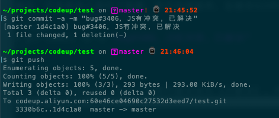  

对于YesDev上的问题，会同步更新问题状态为【已解决】，归因为【代码错误】，并自动提交相应的注释到问题备注。
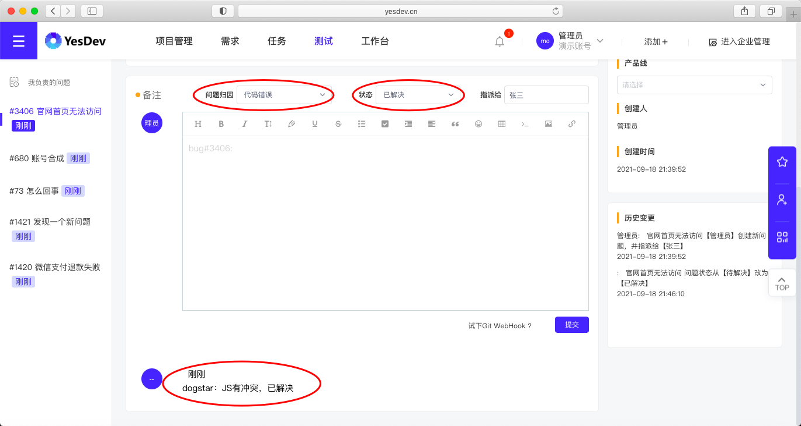  

同时，作为提Bug的测试人员也会收到对应的邮件通知，以便及时进行验收重新测试。   

## 扩展：如何匹配我的YesDev账号？ 

在进行Git注释提交时，为了能让YesDev可以准确识别是团队哪位成员提交的，可以修改本地的Git用户名（```user.name```）和邮箱（```user.email```）。  

匹配顺序： 
 + 首先，YesDev会优先同时匹配git的姓名和git邮箱
 + 其次，YesDev匹配git的邮箱（通常团队内部唯一）
 + 最后，匹配git的姓名（因为可能重名）

查看本地 Git 用户名和邮箱的命令：  
```bash
# 查看用户名
$ git config user.name

# 查看邮箱
$ git config user.email
```

修改本地 Git 用户名和邮箱的命令：  
```bash
# 全局修改
# 修改用户名，注意要对应YesDev的成员姓名
$ git config --global user.name "员工姓名"

# 修改邮箱，注意要对应YesDev的成员邮箱
$ git config --global user.email "员工邮箱地址xxx@xx.com"

# 进入项目目录后，指定单个仓库修改
$ git config user.name "xxx"
$ git config user.email "xxx@xx.com"
```

## 扩展：如何强制客户端git提交注释格式？

通过git的```prepare-commit-msg```脚本，可以实现对客户端提交的git注释进行检测和统一强制规范。  

### 下载YesDev的prepare-commit-msg脚本  
// TODO 点击下载。  

### 如何使用prepare-commit-msg脚本？  

对于Windows系统，下载脚本后，复制并放到自己代码仓库下的```.git/hooks```目录，如果没有此目录，可以新建一个。    
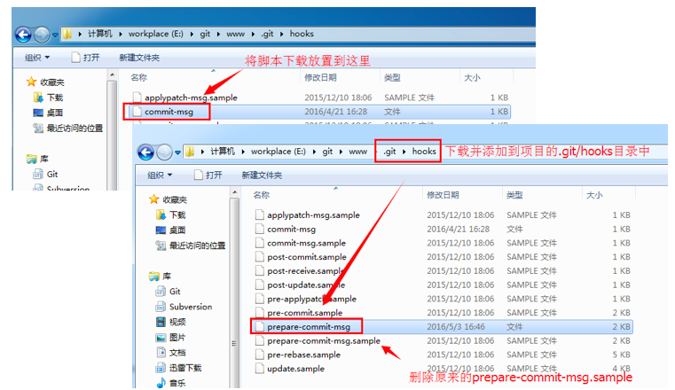  

对于Linux或Mac系统，同样复制放入本地Git仓库下的```.git/hooks```目录，如果没有此目录，可以新建一个。注意需要给予运行权限。  
```bash
$ chmod +x .git/hooks/prepare-commit-msg
```

注释规范说明：  

 + 1、注释内容中，需求注释或问题注释，至少需要有一项
 + 2、merge产生的commit不在这个规范的约束内  
 + 3、该注释规范检查只会出现在push时候进行，在本地检测不通过时，请使用```git commit --amend```修改最后一次提交的注释和rebase来修改历史提交的注释 
 + 4、git命令虽然强大，但对开发者不友好，建议结合git的GUI工具配套使用  

## 扩展：如何自动创建任务？

为了帮助繁忙的技术人员忘记登记工时，当开启了【Git自动任务】后，将git代码关联到需求或问题后，YesDev系统将会自动为你创建当天的任务。  
你只需要在下班前再补充所需要的工时即可。因为开发需求功能和修复缺陷，都会占用技术研发人员的时间。  

例如，根据关联到需求的git代码提交后，自动创建的任务效果：  
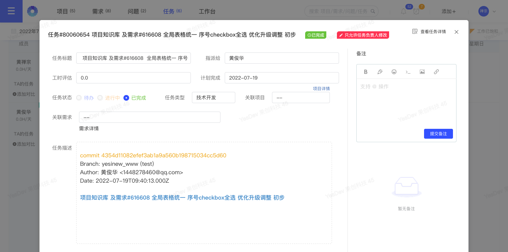  

又如，根据关联到问题的git代码提交后，自动创建的任务效果则类似：  
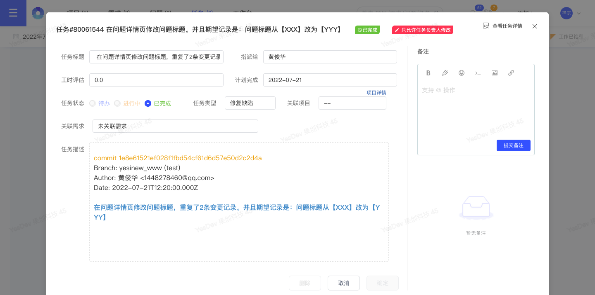  

为了区别Git自动创建的任务，YesDev会为自动创建的任务添加git标签，例如：  


如果技术人员不需要Git自动任务，可以关闭。 

## 常用问题

### Q1、推送后YesDev无法接收到事件

如果使用Gitlab自建Git服务，请确保您的服务器开放了对外访问80端口。可以指定允许的IP地址有：```120.76.246.183```。  

