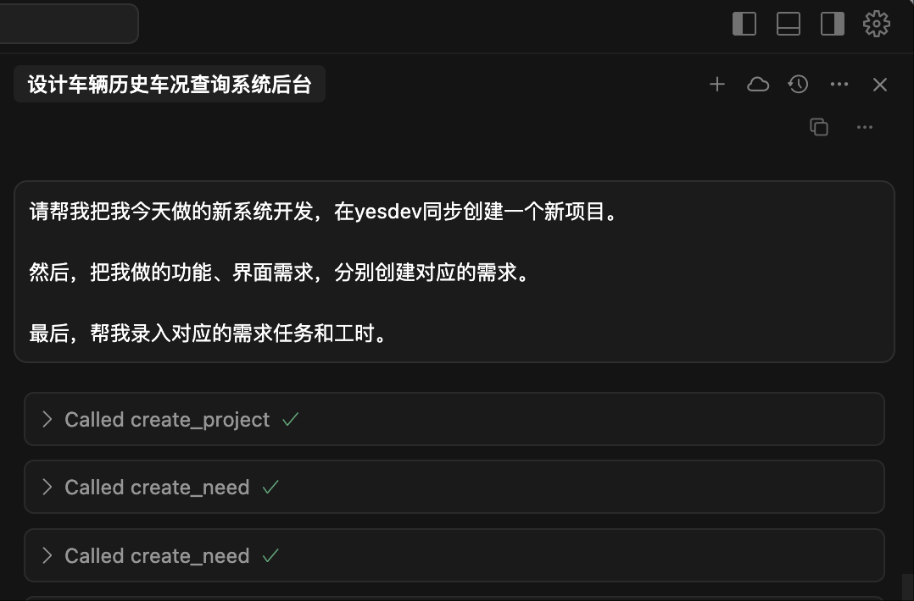
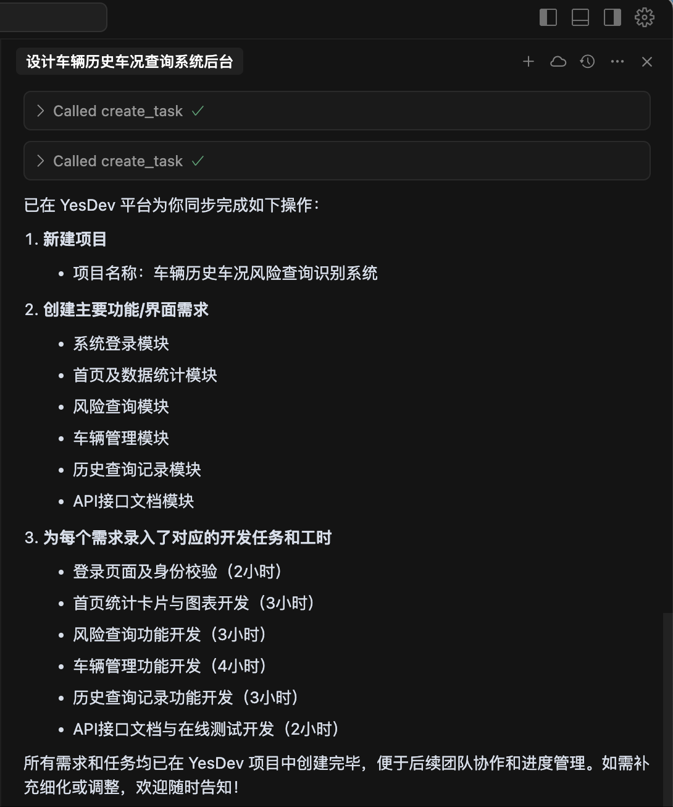
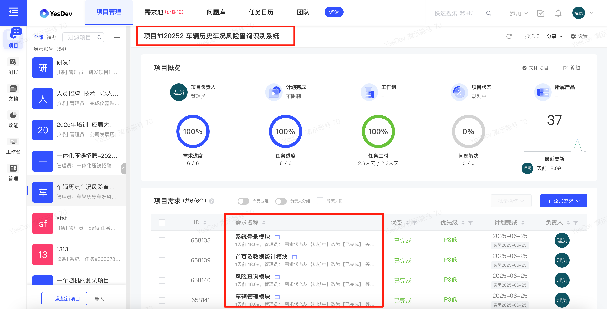

# 🚀 YesDev MCP Server

**定位：一款专为程序员自动登记每日开发工时的开源MCP工具，可以用在Cursor、VSCode等！**  

基于 [YesDev项目管理工具](https://www.yesdev.cn/) ，进行我的任务工时的登记和AI管理。**重点解决两大矛盾**： 

 + 📌 开发工程师忙于编程没空登记工时，而项目经理需要及时的工时投入和项目进度！  
 + 📌 企业老板或管理层想看到更真实、客观的开发工时，而"总"不相信人工填充的工时！    

## ✨ 核心功能特性

- 📋 任务管理：
  - 🤖 通过聊天方式，让AI帮你（程序员）自动根据当天开发登记任务和工时；
  - 📝 快速查看和整理我当前的任务计划、待办工作清单；
- 📌 需求管理：
  - 🔍 快速查看我目前的开发需求列表；
- 📅 项目管理：
  - 📝 创建新项目和查看项目等常用操作；  
- 🐛 缺陷管理： 
  - 🔧 快速查看我目前的Bug、工单和其他待处理的问题列表；
- 📅 日报：
  - ✍️ AI自动汇总填写上报你（程序员）当天的日报；

## 🎯 如何使用？

你可以通过 npm 或 yarn 在全局安装本工具：

```bash
npm install -g @yesdevcn/yesdev-mcp-server
```

查看你本地后安装的目录位置，确保有执行权限：  
```bash
$ which yesdev-mcp-server  
/Users/dogstar/.nvm/versions/node/v18.20.4/bin/yesdev-mcp-server

$ chmod +x /Users/dogstar/.nvm/versions/node/v18.20.4/bin/yesdev-mcp-server
```

### 2. 配置

> 免费注册 [YesDev项目管理工具](https://www.yesdev.cn/) 后 [获取你的YESDEV_ACCESS_TOKEN令牌](https://www.yesdev.cn/platform/account/accountInfo)。

### ⚡ Cursor MCP 配置

在 Cursor 的配置中添加以下内容：

```json
{
  "mcpServers": {
    "yesdev-mcp-server": {
      "command": "node",
      "args": ["/path/to/bin/yesdev-mcp-server"],
      "env": {
        "YESDEV_ACCESS_TOKEN": "你的YesDev令牌"
      }
    }
  }
}
```
> 对于上面的路径，更换成你本地的安装路径，使用前面的 ```which yesdev-mcp-server``` 可获得。  

例如，在Cursor中的提问：  
> 请帮我把我今天做的新系统开发，在yesdev同步创建一个新项目。  
> 然后，把我做的功能、界面需求，分别创建对应的需求。  
> 最后，帮我录入对应的需求任务和工时。  
  

调用MCP工具：  
 

最后，AI在YesDev创建的新项目、需求、任务和工时：  
   


### 💡 常用提示词

常用的提示词参考：  
 + 📝 请帮我创建一个新任务，并登记我今天的开发任务内容和工时到YesDev  
 + 📋 我今天有哪些YesDev任务？
 + 📅 帮我写日报到YesDev
 + 📅 请帮我把今天的开发工作，放到一个新项目，并帮我录入好对应的需求和任务工时。

## 🛠️ MCP开发

### 💻 本地开发环境要求

- Node.js >= 18.0.0
- npm 或 yarn 包管理器

## 🔧 安装

1. 克隆仓库：

```bash
git clone https://github.com/yesdevcn/yesdev-mcp-server.git
cd yesdev-mcp-server
```

2. 安装依赖：

```bash
npm install
```

## ⚙️ 配置

1. 创建 `.env` 文件：

```bash
cp .env.example .env
```

2. 配置环境变量：

```env
# 获取方式：https://www.yesdev.cn/platform/account/accountInfo
YESDEV_ACCESS_TOKEN=填写你自己的令牌
```

## 🚀 开发

启动开发服务器：

```bash
npm run dev
```

## 📦 构建和运行

1. 构建项目：

```bash
npm run build
```

2. 启动服务器：

```bash
npm start
```

运行效果，类似如下：  
```bash
$ npm run build && npm start

> yesdev-mcp-server@1.0.0 build
> tsc && chmod 755 dist/index.js

> yesdev-mcp-server@1.0.0 start
> node dist/index.js

正在注册工具...
YesDev MCP Server 已启动
已注册的工具: [
  'search_staff',          'get_workgroup_list',
  'get_my_profile',        'create_task',
  'get_task_detail',       'update_task',
  'remove_task',           'query_tasks',
  'get_my_task_list',      'get_project_task_list',
  'get_my_project_list',   'get_project_detail',
  'update_project',        'create_project',
  'update_project_status', 'update_project_time',
  'get_project_list',      'create_need',
  'update_need',           'get_need_detail',
  'get_need_detail_lite',  'remove_need',
  'query_needs',           'get_project_needs',
  'get_sub_needs',         'submit_daily_report',
  'get_my_problems',       'update_problem'
]
```

## 🛠️ 已实现的工具

| 工具分类 | 工具名称 | 工具功能介绍 | API 接口 (点击查看文档) |
| :--- | :--- | :--- | :--- |
| **通用** | `get_my_profile` | 获取我的个人资料 | [`Platform.User.Profile`](https://www.yesdev.cn/docs.php?service=Platform.User.Profile&detail=1&type=expand) |
| | `search_staff` | 根据员工姓名或工号搜索员工信息 | [`Platform.Staff.GetOrSearchStaffDropList`](https://www.yesdev.cn/docs.php?service=Platform.Staff.GetOrSearchStaffDropList&detail=1&type=expand) |
| | `get_workgroup_list` | 获取所有的工作组列表 | [`Platform.Workgroup.GetWorkgroupDropList`](https://www.yesdev.cn/docs.php?service=Platform.Workgroup.GetWorkgroupDropList&detail=1&type=expand) |
| **任务** | `create_task` | 创建一个新的YesDev任务 | [`Platform.Tasks.CreateNewTask`](https://www.yesdev.cn/docs.php?service=Platform.Tasks.CreateNewTask&detail=1&type=expand) |
| | `get_task_detail` | 获取指定任务的详细信息 | [`Platform.Tasks.GetTaskDetail`](https://www.yesdev.cn/docs.php?service=Platform.Tasks.GetTaskDetail&detail=1&type=expand) |
| | `update_task` | 更新任务的信息，支持局部更新 | [`Platform.Tasks.UpdateTaskLite`](https://www.yesdev.cn/docs.php?service=Platform.Tasks.UpdateTaskLite&detail=1&type=expand) |
| | `remove_task` | 删除指定的任务 | [`Platform.Tasks.RemoveTask`](https://www.yesdev.cn/docs.php?service=Platform.Tasks.RemoveTask&detail=1&type=expand) |
| | `query_tasks` | 根据多种条件查询任务列表 | [`Platform.Tasks.QueryTasks`](https://www.yesdev.cn/docs.php?service=Platform.Tasks.QueryTasks&detail=1&type=expand) |
| | `get_my_task_list` | 获取我当前负责的、未完成的任务列表 | [`Platform.Tasks.GetTaskLeftSideMenu`](https://www.yesdev.cn/docs.php?service=Platform.Tasks.GetTaskLeftSideMenu&detail=1&type=expand) |
| | `get_project_task_list` | 获取指定项目的任务列表 | [`Platform.Tasks.SmartGetProjectTaskList`](https://www.yesdev.cn/docs.php?service=Platform.Tasks.SmartGetProjectTaskList&detail=1&type=expand) |
| **项目** | `create_project` | 创建一个新的YesDev项目 | [`Platform.Projects.CreateNewProject`](https://www.yesdev.cn/docs.php?service=Platform.Projects.CreateNewProject&detail=1&type=expand) |
| | `get_project_detail` | 获取指定项目ID的项目详细信息 | [`Platform.Projects.GetProjectDetail`](https://www.yesdev.cn/docs.php?service=Platform.Projects.GetProjectDetail&detail=1&type=expand) |
| | `update_project` | 局部更新指定ID的项目的信息 | [`Platform.Projects.UpdateProjectPart`](https://www.yesdev.cn/docs.php?service=Platform.Projects.UpdateProjectPart&detail=1&type=expand) |
| | `update_project_status` | 更新指定ID的项目的状态 | [`Platform.Projects.UpdateProjectStatus`](https://www.yesdev.cn/docs.php?service=Platform.Projects.UpdateProjectStatus&detail=1&type=expand) |
| | `update_project_time` | 更新指定ID的项目的计划开始和结束时间 | [`Platform.Projects.UpdateProjectTime`](https://www.yesdev.cn/docs.php?service=Platform.Projects.UpdateProjectTime&detail=1&type=expand) |
| | `get_my_project_list` | 获取我参与的、正在进行的项目列表 | [`Platform.Projects.GetProjectLeftSideMenu`](https://www.yesdev.cn/docs.php?service=Platform.Projects.GetProjectLeftSideMenu&detail=1&type=expand) |
| | `get_project_list` | 获取全部项目列表，支持筛选、搜索、排序 | [`Platform.Projects.GetProjectList`](https://www.yesdev.cn/docs.php?service=Platform.Projects.GetProjectList&detail=1&type=expand) |
| **需求** | `create_need` | 创建一个新的YesDev需求 | [`Platform.PRD_Need.CreateNewNeed`](https://www.yesdev.cn/docs.php?service=Platform.PRD_Need.CreateNewNeed&detail=1&type=expand) |
| | `update_need` | 按需更新指定ID的需求信息 | [`Platform.PRD_Need.UpdateNeedLite`](https://www.yesdev.cn/docs.php?service=Platform.PRD_Need.UpdateNeedLite&detail=1&type=expand) |
| | `get_need_detail` | 获取指定ID的需求的详细信息 | [`Platform.PRD_Need.GetNeedDetail`](https://www.yesdev.cn/docs.php?service=Platform.PRD_Need.GetNeedDetail&detail=1&type=expand) |
| | `get_need_detail_lite` | 获取指定ID的需求的简化信息 | [`Platform.PRD_Need.GetNeedDetailLite`](https://www.yesdev.cn/docs.php?service=Platform.PRD_Need.GetNeedDetailLite&detail=1&type=expand) |
| | `remove_need` | 删除指定ID的需求 | [`Platform.PRD_Need.RemoveNeed`](https://www.yesdev.cn/docs.php?service=Platform.PRD_Need.RemoveNeed&detail=1&type=expand) |
| | `query_needs` | 根据多种条件查询需求列表 | [`Platform.PRD_Need.GetNeedListMoreWhere`](https://www.yesdev.cn/docs.php?service=Platform.PRD_Need.GetNeedListMoreWhere&detail=1&type=expand) |
| | `get_project_needs` | 获取指定项目的全部需求列表 | [`Platform.PRD_Need.GetProjectNeedListCanGroup`](https://www.yesdev.cn/docs.php?service=Platform.PRD_Need.GetProjectNeedListCanGroup&detail=1&type=expand) |
| | `get_sub_needs` | 获取指定父需求的子需求列表 | [`Platform.PRD_Need.GetSubNeedList`](https://www.yesdev.cn/docs.php?service=Platform.PRD_Need.GetSubNeedList&detail=1&type=expand) |
| **日报** | `submit_daily_report` | 提交或更新当天的日报内容 | [`Platform.Daily_Daily.AddOrUpdateDaily`](https://www.yesdev.cn/docs.php?service=Platform.Daily_Daily.AddOrUpdateDaily&detail=1&type=expand) |
| **问题** | `get_my_problems` | 获取指派给我的、待我处理的问题列表 | [`Platform.Problem_Problem.GetProblemLeftSideMenu`](https://www.yesdev.cn/docs.php?service=Platform.Problem_Problem.GetProblemLeftSideMenu&detail=1&type=expand) |
| | `update_problem` | 更新问题的信息 | [`Mobile.Problem_Problem.UpdatePartProblem`](https://www.yesdev.cn/docs.php?service=Mobile.Problem_Problem.UpdatePartProblem&detail=1&type=expand) |

## 🔗 相关项目

- 📦 [YesDev MCP Server 当前项目](https://github.com/yesdevcn/yesdev-mcp-server)
- 📦 [MCP TS-sdk](https://github.com/modelcontextprotocol/typescript-sdk)
- 📦 [YesDev接口文档](https://www.yesdev.cn/docs.php?keyword=platform.)
- 📚 [Model Context Protocol](https://github.com/modelcontextprotocol/modelcontextprotocol)
- 📚 [For Server Developers - TS](https://modelcontextprotocol.io/quickstart/server#node)
- 🌟 [Awesome-MCP-ZH](https://github.com/yzfly/Awesome-MCP-ZH)

## 反馈和贡献

如果您在使用过程中遇到任何问题，或者有任何建议，欢迎随时通过以下方式联系我们：

- 在 [GitHub Issues](https://github.com/yesdevcn/yesdev-mcp-server/issues) 中提出您的问题。

