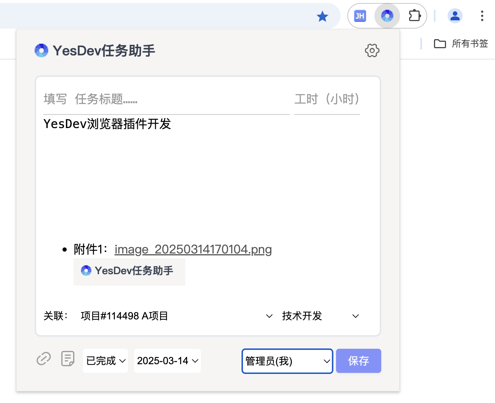
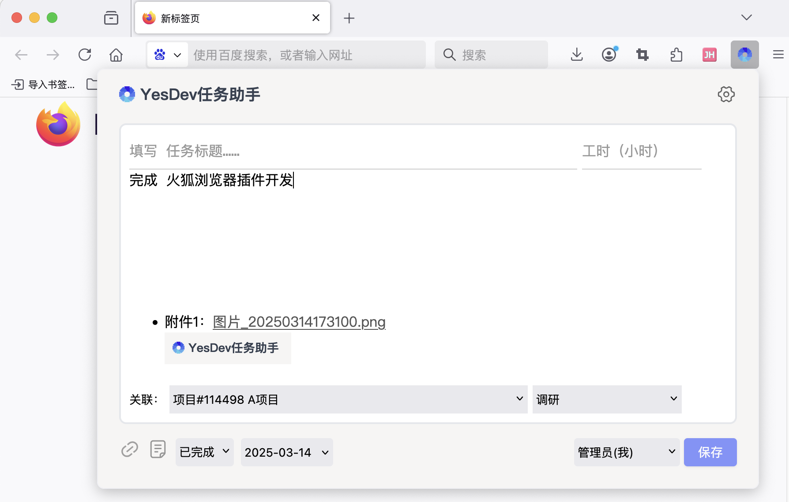
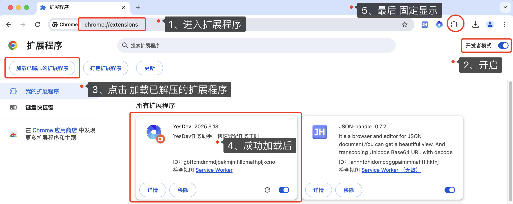
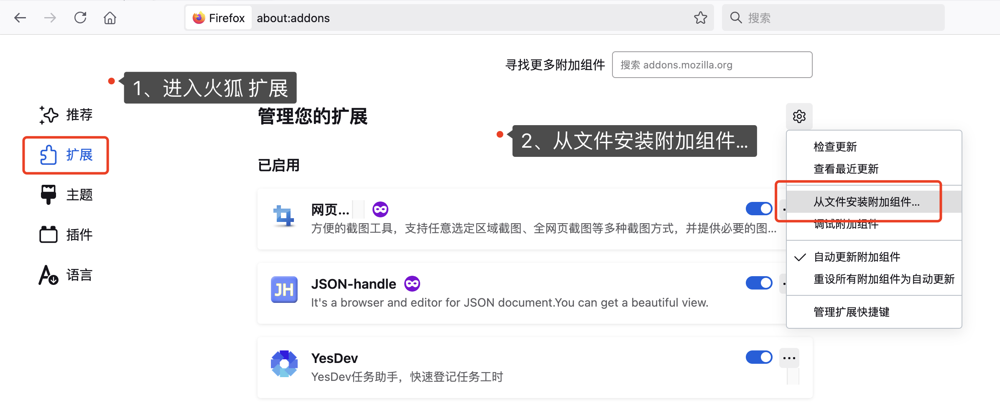
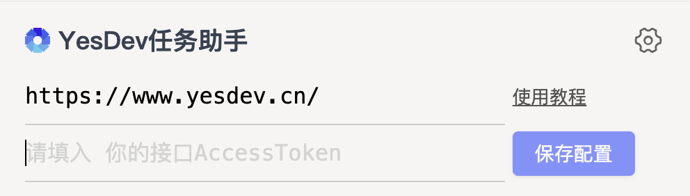
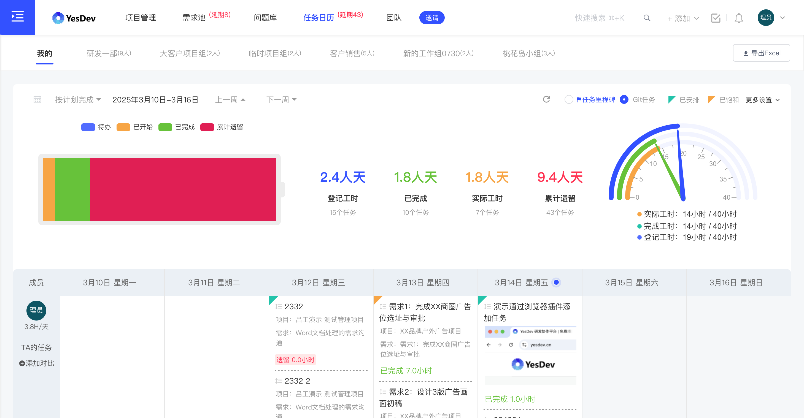

## YesDev任务助手 - 谷歌、火狐浏览器插件

YesDev任务助手，可安装在本地Chrome谷歌浏览器，绑定你的YesDev账号后，可以快速登记任务工时、分配任务给团队和提交Bug修复任务。安装简单、配置简单、使用更简单，可极大提升你的工作效率，不需要登录YesDev系统也能快速填报任务工时。  

插件截图，成功提交任务后，将会同步到YesDev项目管理平台。  

Chrome 谷歌，  
  

Firefox 火狐，  
  


## 插件安装与配置

下载与安装：

 + **Chrome 谷歌浏览器**
 	+ 插件下载地址：https://www.yesdev.cn/download/yesdev-extension-chrome-v2025.04.02.zip
 	+ 安装方式：解压插件压缩包后，在谷歌浏览器进入 [【扩展程序】chrome://extensions/](chrome://extensions/)，开启右上角 开发者模式，然后点击 加载已解压的扩展程序，完成安装。  
 	  

 + **Firefox 火狐浏览器**
 	+ 扩展下载地址：https://www.yesdev.cn/download/yesdev-extension-firefox-v2025.04.02.zip
 	+ 安装方式：下载插件安装包，在火狐浏览器进入[【扩展】about:addons](about:addons) ，点击 设置图标，然后 从文件安装附加组件… 完成安装。 
 	  

配置：

 + YesDev网址：默认填写 ```https://www.yesdev.cn/```，如果是私有部署则填写私服域名。 
 + 你的接口AccessToken：进入YesDev [我的个人资料](https://www.yesdev.cn/platform/account/accountInfo) - 接口AccessToken - 复制后粘贴填入。  
   


## 插件功能介绍

本插件，支持以下功能和优势：  

 + **核心功能**：
	 + 快速登记本人任务工时（单位：小时，保留一位小数点）
	 + 分配任务给其他同事
	 + 指派修复任务给技术开发人员（截图+链接+附件等） 

 + **图片文件链接**：	
	 + 支持粘贴多个截图
	 + 支持上传本地文件、图片、附件
	 + 快速获取当前网站的链接和标题

 + **辅助功能**：	
	 + 支持任务关联到项目，方便汇总项目工时
	 + 支持选择任务类型、任务状态（待办/进行中/已完成）
	 + 实时拉取YesDev当前的项目列表
	 + 实时拉取YesDev的团队成员列表
	 + 实时集成YesDev的任务通知推送
	 + 支持跨团队、跨企业填报项目工时（需要先加入外部项目协作）


提交任务后，可以在YesDev任务日历中汇总查看。  
  

## 开发者

如果你是开发者，可以获取此插件的源代码，进行二次开发，根据自己和团队的需求，进行个性化的定制。  

 + Github项目地址：https://github.com/yesdevcn/yesdev-extension  
 + 码云项目地址：https://gitee.com/dogstar/yesdev-extension   

> 温馨提示：Firefox火狐在 ```firefox```开发分支，主要是```manifest.json```配置文件的差异。  

本扩展使用到的YesDev项目管理 WebAPI接口有：  

 + [添加新任务接口](https://www.yesdev.cn/docs.php?service=Platform.Tasks.CreateNewTask&detail=1&type=expand) 
 + [获取项目需求列表接口](https://www.yesdev.cn/docs.php?service=Platform.PRD_Need.GetProjoctNeedList&detail=1&type=expand)
 + [base64上传图片文件接口](https://www.yesdev.cn/docs.php?service=Platform.File.UploadByBase64&detail=1&type=expand)
 + [获取成员列表接口](https://www.yesdev.cn/docs.php?service=Platform.Staff.SearchStaff&detail=1&type=expand)
 + [添加任务附件接口](https://www.yesdev.cn/docs.php?service=Platform.Projects.AddProjectFile&detail=1&type=expand)
 + [获取我的资料接口](https://www.yesdev.cn/docs.php?service=Platform.User.Profile&detail=1&type=expand)

## 说明 

本插件源代码开源，基于 [memos-bber](https://github.com/lmm214/memos-bber) 修改，原作者为 lmm214。

## 更新日志

2025.04.02 修复配置保存失败。  

2025.03.13 首个谷歌插件版本 yesdev-extension-chrome-v2025.03.13.zip，实现任务的快速添加。  


